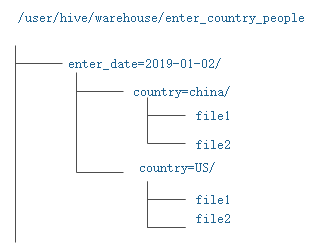

# Hive SQL之分区表与分桶表

Hive sql是Hive 用户使用Hive的主要工具。Hive SQL是类似于ANSI SQL标准的SQL语言，但是两者有不完全相同。Hive SQL和Mysql的SQL方言最为接近，但是两者之间也存在着显著的差异，比如Hive不支持行级数据的插入、更新和删除，也不支持事务操作。

　　**注: HIVE 2.\*版本之后开始支持事务功能，以及对单条数据的插入更新等操作**

## **Hive的相关概念**

### Hive数据库

Hive中的数据库从本质上来说仅仅就是一个目录或者命名空间，但是对于具有很多用户和组的集群来说，这个概念非常有用。首先，这样可以避免表命名冲突；其次，它等同于与关系型数据库中数据库的概念，是一组表或者表的逻辑组，非常容易理解

### **Hive表**

Hive中的表和关系型数据库中table概念是类似的，每个table在Hive中都有一个相应的目录存储数据。如果说，你没有指定表的数据库，那么Hive会通过{HIVE_HOME}/conf/hive_site.xml配置文件中的hive.metastore.warehouse.dir属性来使用默认值(一般是/usr/hive/warehouse，也可以根据实际情况来进行修改该配置)，所有的table都保存在这个目录中。

Hive中的表分为两类，分别为**内部表**和**外部表**

-   **内部表(managed table)**

    内部表，也即Hive管理的表，Hive内部表的管理包括逻辑以及语法上的，也包含实际物理意义上的，也就是说，创建Hive内部表后，表中的数据实际上是存储在表所在的目录内，由Hive本身来管理，什么意思呢？也就是说，如果你想删除表的话，那么，连同表的物理数据，元数据等会一并删除。举个栗子：

```sql
create table managed_table(name string,age int);
load data inpath '/hadoop/guozy/data/user.txt' into table managed_table;
```

第一条语句，创建一张简单的内部表；

第二条语句，将hdfs://hadoop/guozy/data/user.tx **移动**到Hive对应的目录hdfs://user/hive/warehouse/managed_table/这个目录中。注意，这里是**移动**，并非**复制**。

移动数据是非常快的，因为Hive不会对数据是否符合定义的Schema做校验，这个工作通常在读取的时候进行(即Schema on Read)，此时我们在执行删除操作：

```sql
drop table managed_table；
```

-   **外部表(external table)**

    相对于内部表来说，其管理仅仅是在逻辑和语法意义上的，实际的数据并非由Hive本身来管理，而是交给了HDFS。当创建一个外部表的时候，仅仅是指向一个外部目录而已。如果你想删除表，只是删除表的元数据信息，并不会对实际的物理数据进行删除。举个栗子：

```sql
create external table external_table (name string,age int) location '/hadoop/guozy/external_table';
load data inpath '/hadoop/guozy/data/user.txt' into table external_table;
```

第一条语句，创建一张简单的外部表，这里与内部表的区别是，添加了关键字external和location数据位置;

第二条语句，向表中载入数据，会将hdfs://hadoop/guozy/data/user.tx **移动**到Hive对应的目录hdfs://hadoop/guozy/external_table这个目录中

对于Hive来说，它不会校验外部表的数据目录是否存在。所以我们完全可以在创建表之后在创建数据。此时我们在来删除该表：

```sql
drop table external_table；
```

执行上面这条语句之后，Hive删除的仅仅是该表对应的元数据而已，并不会对实际的屋里数据进行删除，也就是说hdfs://hadoop/guozy/external_table这个目录下的数据不会被删除。

### **分区和分桶**

Hive将表划分为分区(partition)表和分桶(bucket)表。

**分区表**可以让数据的部分查询变得更快，也就是说，在加载数据的时候可以指定加载某一部分数据，并不是全量的数据。

**分桶表**通常是在原始数据中加入一些额外的结构，这些结构可以用于高效的查询，例如，基于ID的分桶可以使得用户的查询非常的块。

#### **分区表**	

所谓的分区表，指的就是将数据按照表中的某一个字段进行统一归类，并存储在表中的不同的位置，也就是说，一个分区就是一类，这一类的数据对应到hdfs存储上就是对应一个目录。当我们需要进行处理的时候，可以通过分区进行过滤，从而只去部分数据，而没必要取全部数据进行过滤，从而提升数据的处理效率。且分区表是可以分层级创建。

分区表又分为**静态分区表**和**动态分区**表两种：

##### 		a. 静态分区表：

​		所谓的静态分区表指的就是，我们在创建表的时候，就已经给该表中的数据定义好了数据类型，在进行加载数据的时候，我们已经知道该数据属于什么类型，并且直接加载到该分区内就可以了。来看一个简单的分区表的创建语句（这里创建的是一张内部表）：

```sql
hive> create table enter_country_people(id int,name string,cardNum string) partitioned by (enter_date string,country string);
```

​		指定分区表关键字：partitioned by 

​		这里的分区字段为：enter_date、country，也就是说，先按照enter_date进行分类，在enter_date的基础上，在按照country再次进行分类。

​		**注意，这里的分区字段不能包含在表定义字段中，因为在向表中load数据的时候，需要手动指定该字段的值。**

​		接下来向表中载入数据，并且指定分区为enter_date='2019-01-02',country='china' 

```sql
hive> load data inpath '/hadoop/guozy/data/enter__china_people' into table enter_country_people partition (enter_date='2019-01-02',country='china');
```

 		这样创建表之后的表目录结构是这样的：



​		这里还有一个问题就是，涉及到载入数据的方式

1.  使用的是load命令，也就是我上面的方式，可以看到，在load数据之前，表中是没有这个分区`(enter_date='2019-01-02',country='china')`的。当执行了load命令之后，hive会自动创建该分区。这只是其中的一种方式，还有一种方式就是，我们直接可以通过移动数据到该分区的目录下。

2.  直接通过hdfs的mv命令移动数据到该分区指定的目录下。因为前面说过，所谓的分区只是对应到hdfs存储中的一个目录而已。最终数据查询还是要到这个目录中去进行查询数据。但是这种方式有个前提就是，该分区所在的目录必须呀提前存在，注意，这里说的是对应的该目录存在。当然这个目录你可以手动mkdir，也可以通过hive添加分区的方式进行创建，这里又分为两种情况：

    a. 通过hive添加分区的方式进行创建，例如：

    ```sql
    hive> alter table enter_country_people add if not exists partition (enter_date='2019-01-03',country='US');
    ```

    通过这种方式添加分区之后，会生成这样一个目录:hdfs://user/hive/warehouse/2019-01-03/US,此时，我们就可以直接使用hdfs的mv或cp命令将数据搂到该目录下。之后使用hive命令进行查询即可.

    b. 第二种方式就是，我们先手动创建该目录：`hdfs dfs -mkdir /user/hive/warehouse/2019-01-03/US`,然后同样使用上面这种方式，将数据mv或cp到该目录下，但是，如果只是这样的话，你去使用hive命令查询数据，发现查不到，为什么，因为hive查询数据是需要先到元数据表中找到对应数据的分区索引的，然后根据找到的分区索引，再去对应的目录中查找，但是才是我们根本没有对hive的元数据进行操作，所以元数据中没有这个分区的信息，所以此时，我们需要在增加一步操作，就是将该分区的信息添加到元数据库中，我们使用hive的分区修复命令即可：

    ```sql
    hive> msck repair table enter_country_people;
    ```

    执行上述命令之后，然后在进行数据查询，就没有什么问题了。


##### 		b. 动态分区表：

​		所谓的动态分区表，其实建表方式跟静态分区表没有区别，最主要的区别是在载入数据的时候，静态分区表我们载入数据之前必须保证该分区存在，并且我么已经明确知道载入的数据的类型，知道要将数据加载到那个分区当中去，而动态分区表，在载入的时候，我们事先并不知道该条数据属于哪一类，而是需要hive自己去判断该数据属于哪一类，并将该条数据加载到对应的目录中去。建表语句跟静态分区表的建表语句相同，这里不再赘述，主要来看看数据的加载：

​		对于动态分区表数据的加载，我们需要先开启hive的非严格模式，并且通过insert的方式进行加载数据:

```sql
hive> set hive.exec.dynamic.partition.mode=nonstrict;
hive> insert into table enter_country_people(user string,age int) partition(enter_date,country) select user,age,enter_date,country from enter_country_people_bak;
```

　　**注意：**1、必须先开启动态分区模式为非严格模式；

　　　		2、这里在指定分区的时候，并没有指定具体分区的值，而只是指定的分区的字段；

　　　		3、partition中的字段其实是作为插入目标表中的一个字段，所以在从另外一张表select的时候必须查询字段中包含索要分区的这个字段。

#### 分桶表

在表或者分区中使用分桶通常有两个原因，一个是为了高效的查询，另一个则是为了高效的抽样。

桶其实是在表中加入了特殊的结构，hive在查询的时候可以利用这些结构来提高查询效率。比如，如果两个表根据相同的字段进行分桶，则在对这两个表进行关联的时候可以使用map-side关联高效实现。前提是，关联的字段在分桶字段中出现才可以。先看下hive的分桶建表语句：

```sql
hive> create table user_bucket(id int comment 'ID',name string comment '姓名',age int comment '年龄') comment '测试分桶' clustered by (id) sorted by (id) into 4 buckets row format delimited fields terminated by '\t';
```

上述语句，指定根据id字段进行分桶，并且分为4个桶，并且每个桶内按照id字段升序排序，**如果不加sorted by**，则桶内不经过排序的，具体的分桶规则是怎样的呢？Hive是根据指定的分桶字段，上述语句中为id，根据id进行hash之后在对分桶数量4进行取余来决定该数据存放在哪个桶中，因此**每个桶都是整体数据的随机抽样**。

在map-side关联操作中，两个表如果根据相同的字段进行分桶，在处理左表的bucket时，可以直接从外表对应的bucket中提取数据进行关联操作。map-side关联的两个表不一定需要完全相同的bucket数量，只要成倍数即可。同样，Hive不会对数据是否满足表定义中的分桶进行校验，只有在查询时出现异常才会报错，所以一般，**我们将分桶的工作交给Hive自己来完成(设置hive.enforce.bucketing=true)**。

**载入数据：**

在载入数据的时候，需要注意一下，如果说我们只是单纯的使用load语句进行将数据载入到表中的话，其实是没有任何的分桶效果的，因为这样hdfs文件只有一个，像这样：

```sql
hive> load data inpath '/hadoop/guozy/data/user.txt' into table user_bucket;
```

此时，我们需要借助一个中间表，先将数据load到中间表中，然后通过insert的方式来向分桶表中载入数据：

```sql
hive> create table tmp_table (id int comment 'ID',name string comment '名字',age int comment '年龄') comment '测试分桶中间表' ROW FORMAT DELIMITED FIELDS TERMINATED BY ',';
hive> load data inpath '/hadoop/guoxb/data/user.txt' into table tmp_table;
hive> insert into user_bucket select * from tmp_table;
```

这样就实现了分桶的效果，注意，分桶和分区的区别，分区体现在hdfs上的文件目录，而分桶则提现在hdfs是具体的文件，上述的语句中，最终会在hdfs上生成四个文件，而不是四个目录，如果当在次向该分桶表中insert数据后，会又增加4个文件，**而不是在原来的文件上进行追加**。

一般情况下，建表分桶表的时候，我们都需要指定一下排序字段，这样有一个好处就是，在每个桶进行连接查询时，就变成了高效的**归并排序**了。