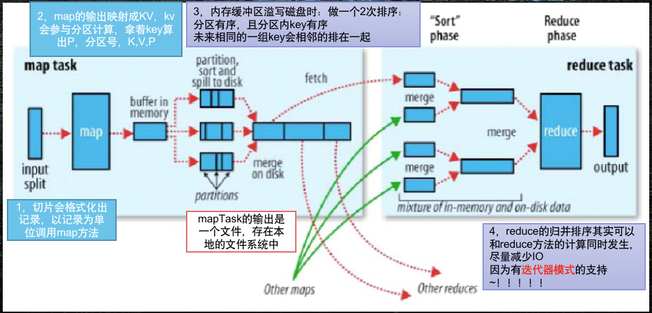
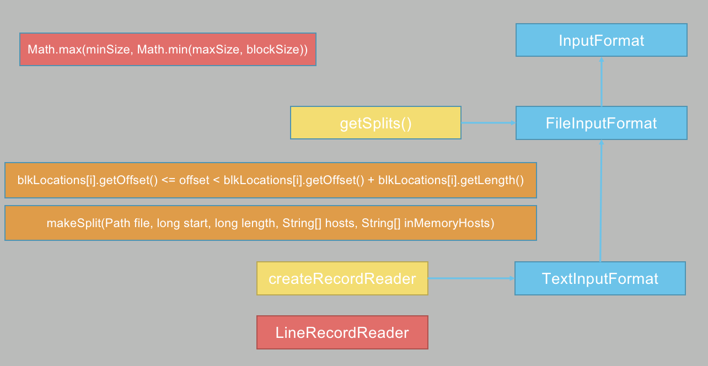

# MapReduce 基础

## 执行流程



## Client 提交 job 过程

1.  个性化配置程序
    -   加载配置文件
    -   GenericOptionsParser解析参数配置
2.  提交程序到集群执行
    -   path检查
    -   **computing splits**
    -   upload resource
    -   submit Job

## 数据格式化输入源码



输入的核心读取文件为：**LineRecoredReader**，会修正分块时，被切分的行数据。

>   TextInputFormat->LineRecordreader
>   							split: file , offset , length
>   							init():
>   								in = fs.open(file).seek(offset)
>   								除了第一个切片对应的map，之后的map都在init环节，
>   								从切片包含的数据中，让出第一行，并把切片的起始更新为切片的第二行。
>   								换言之，前一个map会多读取一行，来弥补hdfs把数据切割的问题~！
>   							nextKeyValue():
>   								1.读取数据中的一条记录对key，value赋值
>   								2.返回布尔值
>   							getCurrentKey():
>   							getCurrentValue():

## MapReduce源码分析

```
MapTask
		input ->  map  -> output
		input:(split+format)  通用的知识，未来的spark底层也是
			来自于我们的输入格式化类给我们实际返回的记录读取器对象
				TextInputFormat->LineRecordreader
							split: file , offset , length
							init():
								in = fs.open(file).seek(offset)
								除了第一个切片对应的map，之后的map都在init环节，
								从切片包含的数据中，让出第一行，并把切片的起始更新为切片的第二行。
								换言之，前一个map会多读取一行，来弥补hdfs把数据切割的问题~！
							nextKeyValue():
								1，读取数据中的一条记录对key，value赋值
								2，返回布尔值
							getCurrentKey():
							getCurrentValue():


		output：
			NewOutputCollector
				partitioner
				collector
					MapOutputBuffer:
						*：
							map输出的KV会序列化成字节数组，算出P，最中是3元组：K,V,P
							buffer是使用的环形缓冲区：
								1，本质还是线性字节数组
								2，赤道，两端方向放KV,索引
								3，索引：是固定宽度：16B：4个int
									a)P
									b)KS
									c)VS
									d)VL
								5,如果数据填充到阈值：80%，启动线程：
									快速排序80%数据，同时map输出的线程向剩余的空间写
									快速排序的过程：是比较key排序，但是移动的是索引
								6，最终，溢写时只要按照排序的索引，卸下的文件中的数据就是有序的
									注意：排序是二次排序（索引里有P，排序先比较索引的P决定顺序，然后在比较相同P中的Key的顺序）
										分区有序  ： 最后reduce拉取是按照分区的
										分区内key有序： 因为reduce计算是按分组计算，分组的语义（相同的key排在了一起）
								7，调优：combiner
									1，其实就是一个map里的reduce
										按组统计
									2，发生在哪个时间点：
										a)内存溢写数据之前排序之后
											溢写的io变少~！
										b)最终map输出结束，过程中，buffer溢写出多个小文件（内部有序）
											minSpillsForCombine = 3
											map最终会把溢写出来的小文件合并成一个大文件：
												避免小文件的碎片化对未来reduce拉取数据造成的随机读写
											也会触发combine
									3，combine注意
										必须幂等
										例子：
											1，求和计算
											1，平均数计算
												80：数值和，个数和
						init():
							spillper = 0.8
							sortmb = 100M
							sorter = QuickSort
							comparator = job.getOutputKeyComparator();
										1，优先取用户覆盖的自定义排序比较器
										2，保底，取key这个类型自身的比较器
							combiner ？reduce
								minSpillsForCombine = 3

							SpillThread
								sortAndSpill()
									if (combinerRunner == null)


	ReduceTask
		input ->  reduce  -> output
		map:run:	while (context.nextKeyValue())
					一条记录调用一次map
		reduce:run:	while (context.nextKey())
					一组数据调用一次reduce

		doc：
			1，shuffle：  洗牌（相同的key被拉取到一个分区），拉取数据
			2，sort：  整个MR框架中只有map端是无序到有序的过程，用的是快速排序
					reduce这里的所谓的sort其实
					你可以想成就是一个对着map排好序的一堆小文件做归并排序
				grouping comparator
				1970-1-22 33	bj
				1970-1-8  23	sh
					排序比较啥：年，月，温度，，且温度倒序
					分组比较器：年，月
			3，reduce：

		run：
			rIter = shuffle。。//reduce拉取回属于自己的数据，并包装成迭代器~！真@迭代器
				file(磁盘上)-> open -> readline -> hasNext() next()
				时时刻刻想：我们做的是大数据计算，数据可能撑爆内存~！
			comparator = job.getOutputValueGroupingComparator();
					1，取用户设置的分组比较器
					2，取getOutputKeyComparator();
						1，优先取用户覆盖的自定义排序比较器
						2，保底，取key这个类型自身的比较器
					#：分组比较器可不可以复用排序比较器
						什么叫做排序比较器：返回值：-1,0,1
						什么叫做分组比较器：返回值：布尔值，false/true
						排序比较器可不可以做分组比较器：可以的

					mapTask				reduceTask
									1，取用户自定义的分组比较器
					1，用户定义的排序比较器		2，用户定义的排序比较器
					2，取key自身的排序比较器	3，取key自身的排序比较器
					组合方式：
						1）不设置排序和分组比较器：
							map：取key自身的排序比较器
							reduce：取key自身的排序比较器
						2）设置了排序
							map：用户定义的排序比较器
							reduce：用户定义的排序比较器
						3）设置了分组
							map：取key自身的排序比较器
							reduce：取用户自定义的分组比较器
						4）设置了排序和分组
							map：用户定义的排序比较器
							reduce：取用户自定义的分组比较器
					做减法：结论，框架很灵活，给了我们各种加工数据排序和分组的方式
			
			ReduceContextImpl
				input = rIter  真@迭代器
				hasMore = true
				nextKeyIsSame = false
				iterable = ValueIterable
				iterator = ValueIterator

				ValueIterable
					iterator()
						return iterator;
				ValueIterator	假@迭代器  嵌套迭代器
					hasNext()
						return firstValue || nextKeyIsSame;
					next()
						nextKeyValue();

				nextKey()
					nextKeyValue()

				nextKeyValue()
					1，通过input取数据，对key和value赋值
					2，返回布尔值
					3，多取一条记录判断更新nextKeyIsSame
						窥探下一条记录是不是还是一组的！
				
				getCurrentKey()
					return key

				getValues()
					return iterable;

			**：
				reduceTask拉取回的数据被包装成一个迭代器
				reduce方法被调用的时候，并没有把一组数据真的加载到内存
					而是传递一个迭代器-values
					在reduce方法中使用这个迭代器的时候：
						hasNext方法判断nextKeyIsSame：下一条是不是还是一组
						next方法：负责调取nextKeyValue方法，从reduceTask级别的迭代器中取记录，
							并同时更新nextKeyIsSame
				以上的设计艺术：
					充分利用了迭代器模式：
						规避了内存数据OOM的问题
						且：之前不是说了框架是排序的
							所以真假迭代器他们只需要协作，一次I/O就可以线性处理完每一组数据~！
```

