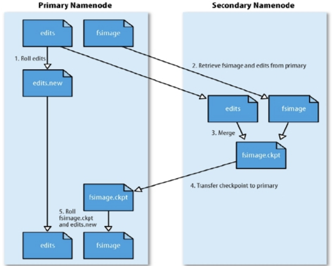
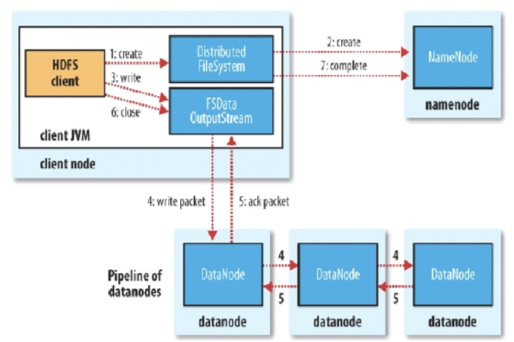
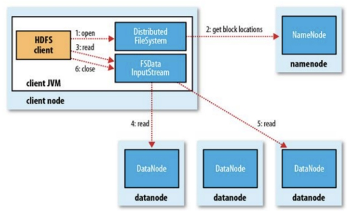
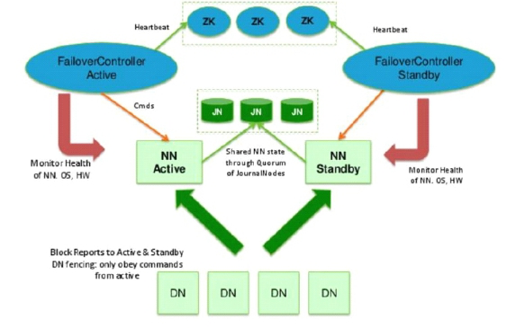
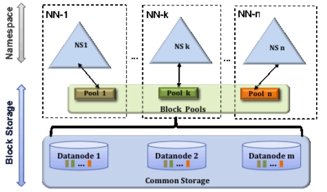

# hdfs 理论基础

## 存储模型

-   文件线性按字节切割成块(block)，具有offset，id
-   文件与文件的block大小可以不一样
-   一个文件除最后一个block，其他block大小一致
-   block的大小依据硬件的I/O特性调整
-   block被分散存放在集群的节点中，具有location
-   Block具有副本(replication)，没有主从概念，副本不能出现在同一个节点
-   副本是满足可靠性和性能的关键
-   文件上传可以指定block大小和副本数，上传后只能修改副本数
-   一次写入多次读取，不支持修改
-   支持追加数据

## 架构设计

-   HDFS是一个主从(Master/Slaves)架构
-   由一个NameNode和一些DataNode组成
-   面向文件包含：文件数据(data)和文件元数据(metadata)
-   NameNode负责存储和管理文件元数据，并维护了一个层次型的文件目录树
-   DataNode负责存储文件数据(block块)，并提供block的读写
-   DataNode与NameNode维持心跳，并汇报自己持有的block信息
-   Client和NameNode交互文件元数据和DataNode交互文件block数据

## 角色功能

**NameNode**

-   完全基于内存存储文件元数据、目录结构、文件block的映射
-   需要持久化方案保证数据可靠性
-   提供副本放置策略

**DataNode**

-   基于本地磁盘存储block(文件的形式)
-    任何对文件系统元数据产生修改的操作，Namenode都会使用一种称为EditLog的事务日志记录下来
-   与NameNode保持心跳，汇报block列表状态

## 元数据持久化

-   任何对文件系统元数据产生修改的操作，Namenode都会使用一种称为EditLog的事务日志记录下来
-   使用FsImage存储内存所有的元数据状态
-   使用本地磁盘保存EditLog和FsImage
-   EditLog具有完整性，数据丢失少，但恢复速度慢，并有体积膨胀风险
-   FsImage具有恢复速度快，体积与内存数据相当，但不能实时保存，数据丢失多
-   NameNode使用了FsImage+EditLog整合的方案：
-   滚动将增量的EditLog更新到FsImage，以保证更近时点的FsImage和更小的EditLog体积

## 安全模式

-   HDFS搭建时会格式化，格式化操作会产生一个空的FsImage
-   当Namenode启动时，它从硬盘中读取Editlog和FsImage
-   将所有Editlog中的事务作用在内存中的FsImage上
-   并将这个新版本的FsImage从内存中保存到本地磁盘上
-   然后删除旧的Editlog，因为这个旧的Editlog的事务都已经作用在FsImage上了
-   Namenode启动后会进入一个称为安全模式的特殊状态。
-   处于安全模式的Namenode是不会进行数据块的复制的。
-   Namenode从所有的 Datanode接收心跳信号和块状态报告。
-   每当Namenode检测确认某个数据块的副本数目达到这个最小值，那么该数据块就会被认为是副本安全(safely replicated)的。
-   在一定百分比（这个参数可配置）的数据块被Namenode检测确认是安全之后（加上一个额外的30秒等待时间），Namenode将退出安全模式状态。
-   接下来它会确定还有哪些数据块的副本没有达到指定数目，并将这些数据块复制到其他Datanode上。

## HDFS 中的 SNN

**SecondaryNameNode（SNN）**

-   在非Ha模式下，SNN一般是独立的节点，周期完成对NN的EditLog向FsImage合并，减少EditLog大小，减少NN启动时间
-   根据配置文件设置的时间间隔fs.checkpoint.period  默认3600秒
-   根据配置文件设置edits log大小 fs.checkpoint.size 规定edits文件的最大值默认是64MB

## Block的副本放置策略

-   第一个副本：放置在上传文件的DN；如果是集群外提交，则随机挑选一台磁盘不太满，CPU不太忙的节点。
-   第二个副本：放置在于第一个副本不同的 机架的节点上。
-   第三个副本：与第二个副本相同机架的节点。
-   更多副本：随机节点。

## HDFS写流程

1.  Client和NN连接创建文件元数据
2.  NN判定元数据是否有效
3.  NN处发副本放置策略，返回一个有序的DN列表
4.  Client和DN建立Pipeline连接
5.  Client将块切分成packet（64KB），并使用chunk（512B）+chucksum（4B）填充
6.  Client将packet放入发送队列dataqueue中，并向第一个DN发送
7.  第一个DN收到packet后本地保存并发送给第二个DN，
    第二个DN收到packet后本地保存并发送给第三个DN
8.  这一个过程中，上游节点同时发送下一个packet
9.  Hdfs使用这种传输方式，副本数对于client是透明的
10.  当block传输完成，DN们各自向NN汇报，同时client继续传输下一个block
11.  所以，client的传输和block的汇报也是并行的

## HDFS读流程

1.  为了降低整体的带宽消耗和读取延时，HDFS会尽量让读取程序读取离它最近的副本。
2.  如果在读取程序的同一个机架上有一个副本，那么就读取该副本。
    如果一个HDFS集群跨越多个数据中心，那么客户端也将首先读本地数据中心的副本。
3.  语义：下载一个文件：
    -   Client和NN交互文件元数据获取fileBlockLocation
    -   NN会按距离策略排序返回
    -   Client尝试下载block并校验数据完整性
4.  语义：下载一个文件其实是获取文件的所有的block元数据，那么子集获取某些block应该成立
    -   Hdfs支持client给出文件的offset自定义连接哪些block的DN，自定义获取数据
    -   这个是支持计算层的分治、并行计算的核心

## HDFS-HA解决方案

**HA方案:**

1.  多台NN主备模式，Active和Standby状态
    	- Active对外提供服务
2.  增加journalnode角色(>3台)，负责同步NN的editlog
    	- 最终一致性
3.  增加zkfc角色(与NN同台)，通过zookeeper集群协调NN的主从选举和切换
    	- 事件回调机制
4.  DN同时向NNs汇报block清单

## HDFS- Federation解决方案

**NN的压力过大，内存受限问题:**

-   元数据分治，复用DN存储
-   元数据访问隔离性
-   DN目录隔离block

