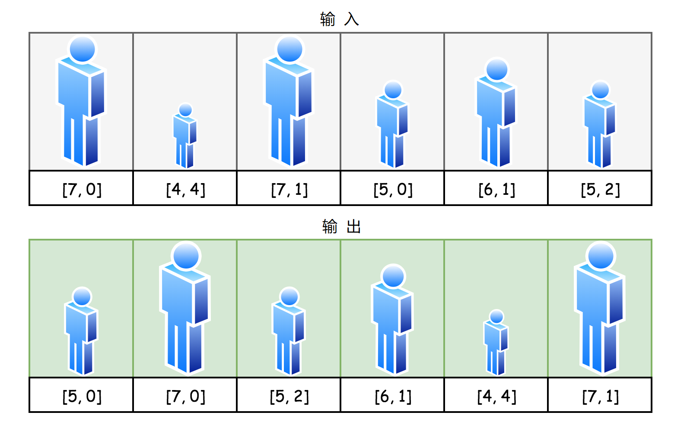
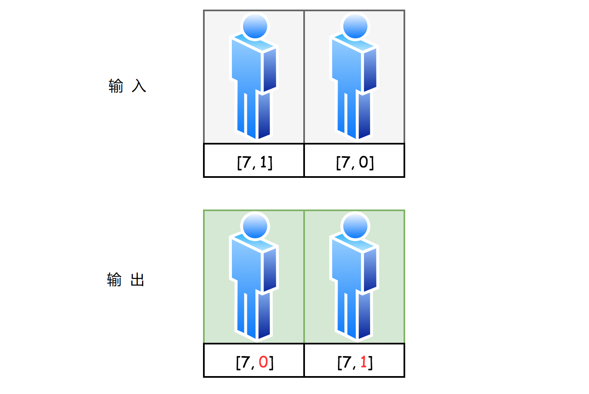
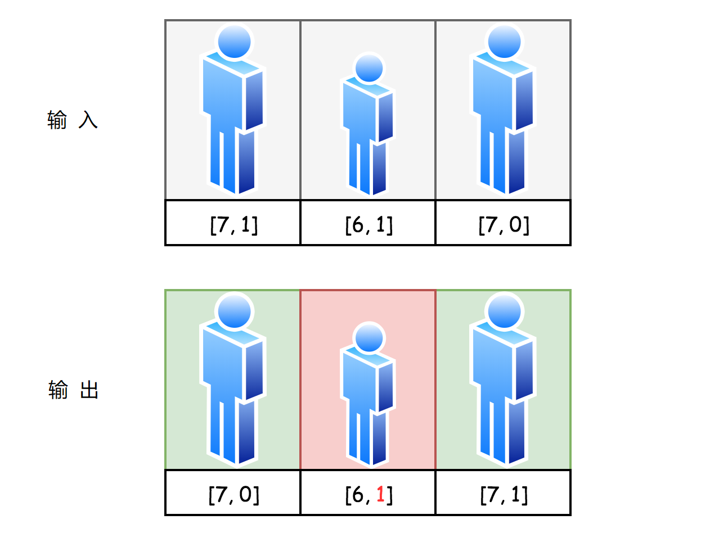

# 406. 重建高度队列

题目：假设你有一个随机的人员列表。每个人都用一对整数来描述(h, k)，其中h 是人的身高，k 是这个人前面身高大于或等于h的人数。

注：人数最大不超过1100。

**例：**

```
输入：
[[7,0]，[4,4]，[7,1]，[5,0]，[6,1]，[5,2]]

输出：
[[5,0]，[7,0]，[5,2]，[6,1]，[4,4]，[7,1]]
```

## 解：

> **贪心算法**

问题是重建队列，例题效果图如下：



我们从最简单的情况开始分析，当队列中的所有人（h，k）具有相同的高度h，并且仅相差k值（前面具有更大或相同高度的人数）。

然后解决就简单了：每个人的索引就等于他的k值，前面没有的人取0号位，前面有1人的人取第1号位，依此类推。



即使在并非所有人都具有相同高度的情况下，也可以使用该策略。较小的人对于较高的人是“看不见的”，因此人们可以先安排最高的人，好像没有其他人一样。

现在让我们考虑一个有两个不同高度的人队列：7和6，为简单起见，让我们只有一个6个身高的人。首先按照上面的策略安排身高7的男人。现在是时候为身高6的人找个地方了。因为他对7个身高的男人来说是“看不见的”，所以他可以不影响的7的k值大小。然而，对于他来说，其他人是可见的，因此他应该采取与他的k值相等的位置，以便拥有他的适当位置。



> 这个想法很容易扩展到许多高度为6的人的情况。只需按照k值进行排序，就像之前为7个高度的人做的那样，并将它们一个接一个地插入等于其k值的位置。

可以递归地继续以下策略：

- 按k值对升序中最高的人进行排序，然后将它们逐个插入到输出队列中，其索引等于其k值。
- 按降序排列下一个高度。通过k值按升序对该高度的人进行排序，然后将它们逐个插入到输出队列中，其索引等于其k值。
- …………

## 算法实现

1. 先对人排序：
    - 排序按照身高降序排列
    - 在相同身高的人中，按照k值升序排列
2. 迭代，将其放到输出数组中，其索引就是其k值。

## 代码

```java
class Solution {
    public int[][] reconstructQueue(int[][] people) {
        Arrays.sort(people, (o1, o2) -> {
            // 身高相同时，按照k进行升序排列
            return o1[0] == o2[0] ? o1[1] - o2[1] : o2[0] - o1[0];
        });

        List<int[]> output = new LinkedList<>();
        for(int[] p : people){
            //将其放入新数组中，索引即为k值
            output.add(p[1], p);
        }

        int n = people.length;
        return output.toArray(new int[n][2]);
    }
}
```

