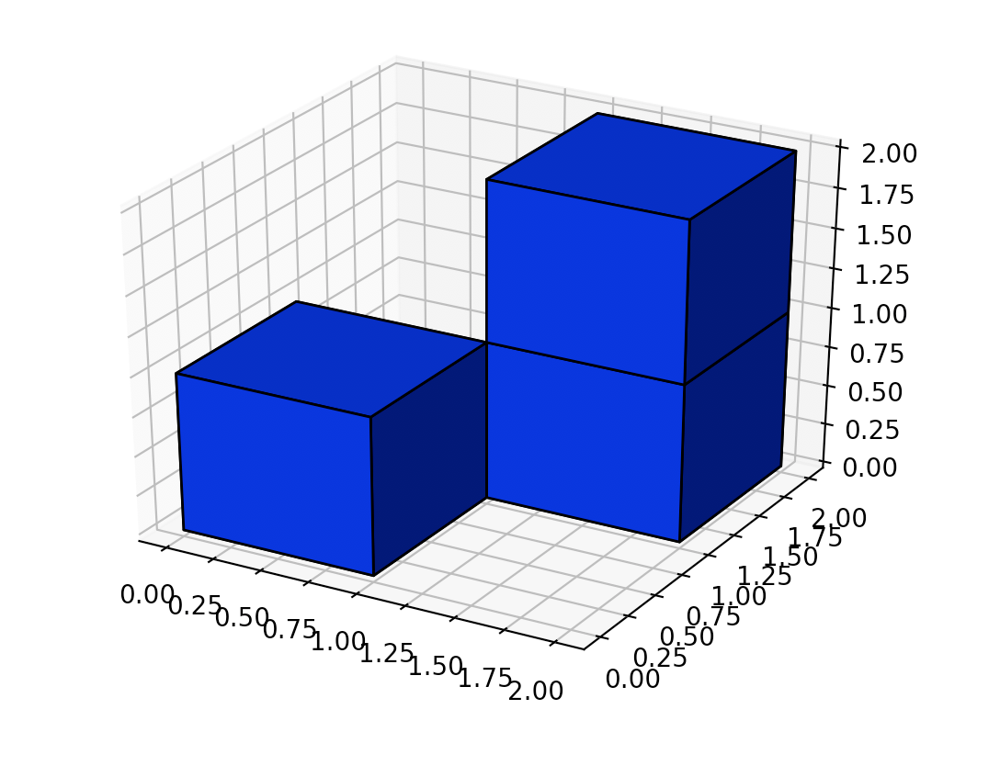
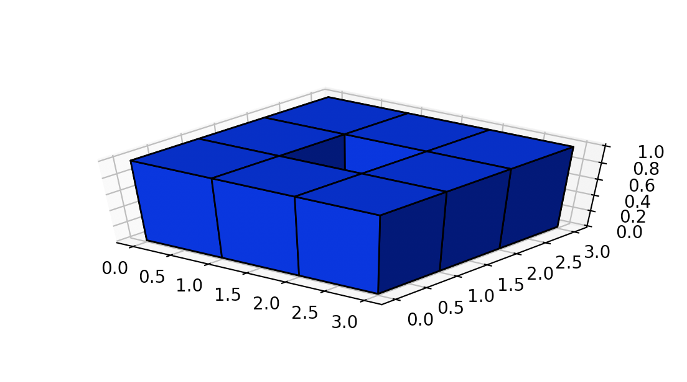

# [892. 三维形体的表面积](https://leetcode-cn.com/problems/surface-area-of-3d-shapes/)

### 题目描述

在 `N * N` 的网格上，我们放置一些 `1 * 1 * 1`  的立方体。

每个值 `v = grid[i][j] ` 表示 `v` 个正方体叠放在对应单元格 `(i, j)` 上。

请你返回最终形体的表面积。

**示例 1：**

```
输入：[[2]]
输出：10
```


**示例 2：**

```
输入：[[1,2],[3,4]]
输出：34
```


**示例 3：**

```
输入：[[1,0],[0,2]]
输出：16
```



**示例 4：**

```
输入：[[1,1,1],[1,0,1],[1,1,1]]
输出：32
```



**示例 5：**

```
输入：[[2,2,2],[2,1,2],[2,2,2]]
输出：46
```


中间看得像空心，但是中间那是有一个立方体哒！
俯视看是这个亚子：


**提示：**

-   `1 <= N <= 50`
-   `0 <= grid[i][j] <= 50`

### 解

首先，一个柱体一个柱体的看，每个柱体是由：**2个底面（上表面/下表面）+ 所有的正方体都贡献了4个侧表面积。**
然后，把柱体贴合在一起之后，我们需要把贴合的表面积给减掉，**两个柱体贴合的表面积就是 两个柱体高的最小值*2。**


```java
class Solution {
    public int surfaceArea(int[][] grid) {
        int n = grid.length, area = 0;
        for (int i = 0; i < n; i++) {
            for (int j = 0; j < n; j++) {
                // 先把grid[i][j]赋值给level，省掉了bound check，可以略微略微略微优化一下耗时...
                int level = grid[i][j];
                if (level > 0) {
                    // 一个柱体中：2个底面 + 所有的正方体都贡献了4个侧表面积 
                    area += (level << 2) + 2;
                    // 减掉 i 与 i-1 相贴的两份表面积
                    area -= i > 0? Math.min(level, grid[i - 1][j]) << 1: 0; 
                    // 减掉 j 与 j-1 相贴的两份表面积
                    area -= j > 0? Math.min(level, grid[i][j - 1]) << 1: 0;
                }  
            }
        }
        return area;
    }
}
```

