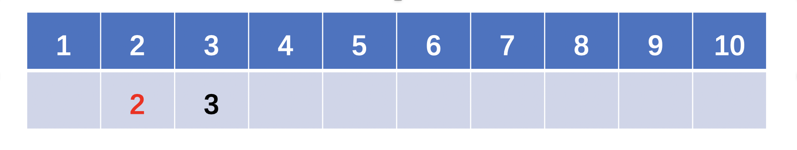
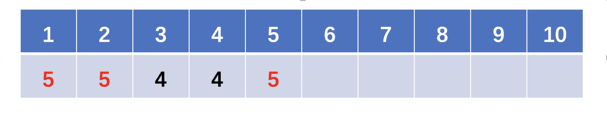

# [945. 使数组唯一的最小增量](https://leetcode-cn.com/problems/minimum-increment-to-make-array-unique/)

### 题目描述

给定整数数组 `A`，每次 move 操作将会选择任意 `A[i]`，并将其递增 `1`。

返回使 `A` 中的每个值都是唯一的最少操作次数。

**示例 1:**

```
输入：[1,2,2]
输出：1
解释：经过一次 move 操作，数组将变为 [1, 2, 3]。
```

**示例 2:**

```
输入：[3,2,1,2,1,7]
输出：6
解释：经过 6 次 move 操作，数组将变为 [3, 4, 1, 2, 5, 7]。
可以看出 5 次或 5 次以下的 move 操作是不能让数组的每个值唯一的。
```

**提示：**

1.  `0 <= A.length <= 40000`
2.  `0 <= A[i] < 40000`

### 解

#### 一、排序O(nlogn)

逻辑：先排序，再依次遍历数组元素，若当前元素小于等于它前一个元素，则将其变为前一个数+1。

```java
class Solution {
    public int minIncrementForUnique(int[] A) {
        // 先排序
        Arrays.sort(A);
        int move = 0;
        // 遍历数组，若当前元素小于等于它的前一个元素，则将其变为前一个数+1
        for (int i = 1; i < A.length; i++) {
            if (A[i] <= A[i - 1]) {
              	//存储修改数字之前的值
                int pre = A[i];
                A[i] = A[i - 1] + 1;
              	//计算改变后差值
                move += A[i] - pre;
            }
        }
        return move;
    }
}
```

#### 二、计数排序O(N)

```java
class Solution {
    public int minIncrementForUnique(int[] A) {
        // counter数组统计每个数字的个数。
        //（这里为了防止下面遍历counter的时候每次都走到40000，所以设置了一个max，这个数据量不设也行，再额外设置min也行）
        int[] counter = new int[40001];
        int max = -1;
        for (int num: A) {
            counter[num]++;
            max = Math.max(max, num);
        }
        
        // 遍历counter数组，若当前数字的个数cnt大于1个，则只留下1个，其他的cnt-1个后移
        int move = 0;
        for (int num = 0; num <= max; num++) {
            if (counter[num] > 1) {
              	//当前位置数字，只保留一位
                int d = counter[num] - 1;
                move += d;
              	//将多余的重复数字，批量向后移动一位
                counter[num + 1] += d;
            }
        }
        // 最后, counter[max+1]里可能会有从counter[max]后移过来的，
      	// counter[max+1]里只留下1个，其它的d个后移。
        // 设 max+1 = x，那么后面的d个数就是[x+1,x+2,x+3,...,x+d],
        // 因此操作次数是[1,2,3,...,d],用求和公式求和。等差数组求和即可
        int n = counter[max + 1] - 1;
        move += (1 + n) * n / 2;
        return move;
    }
}
```

**注：**等差数组前$n$项和：
$$
S_{n}=\frac{n \left( a_{1}+a_{n}\right)}{2}
$$

#### 三、线性探测法O(N) （含路径压缩）

这道题换句话说，就是需要把原数组映射到一个地址不冲突的区域，映射后的地址不小于原数组对应的元素。
比如`[3, 2, 1, 2, 1, 7]`就映射成了`[3, 2, 1, 4, 5, 7]`。

这道题目其实和**解决hash冲突的线性探测法**比较相似！
如果地址冲突了，会探测它的下一个位置，如果下一个位置还是冲突，继续向后看，直到第一个不冲突的位置为止。

**关键点：**

**因为直接线性探测可能会由于冲突导致反复探测耗时太长，因此我们可以考虑探测的过程中进行路径压缩。怎么路径压缩呢？就是经过某条路径最终探测到一个空位置x后，将这条路径上的值都变成空位置所在的下标x，那么假如下次探测的点又是这条路径上的点，则可以直接跳转到这次探测到的空位置x，从x开始继续探测。**

下面用样例2：`[3, 2, 1, 2, 1, 7]`，来模拟一遍线性探测的过程.

**step1: 插入3：**


因为3的位置是空的，所以直接放入3即可。（此时数组变成了上图，红色表示本次的更改）

**step2: 插入2：**




因为2的位置是空的，所以直接放入2即可。（此时数组变成了上图，红色表示本次的更改）

**step3: 插入1：**


因为1的位置是空的，所以直接放入1即可。（此时数组变成了上图，红色表示本次的更改）

**step4: 插入2：**


此时我们发现2的位置已经有值了，于是继续向后探测，直到找到空位4，于是2映射到了4。
并且！！我们要对刚刚走过的路径2->3->4进行压缩，即将他们的值都设置为本次探测到的空位4(那么下次探测就可以直接从4往后找了)。（此时数组变成了上图，红色表示本次的更改）

**step5: 插入1：**




此时我们发现1的位置已经有值了，于是向后探测，探测到了2，发现2的位置也有值了，但是由于2在上次的过程中存了上次的空位4，所以我们直接跳转到4+1即从5开始探测就行了（而不需要重复走一遍2->3->4这条路径喽！），此时我们发现5是个空位，因此将1映射到5，并且对与刚刚走过的路径1->2->5进行路径压缩即使其都映射到5！（此时数组变成了上图，红色表示本次的更改）

**step6: 插入7：**


因为7的位置是空的，所以直接放入7即可。（此时数组变成了上图，红色表示本次的更改）

```java
class Solution {
    int[] pos = new int [80000];
    public int minIncrementForUnique(int[] A) {
        Arrays.fill(pos, -1); // -1表示空位
        int move = 0;
        // 遍历每个数字a对其寻地址得到位置b, b比a的增量就是操作数。
        for (int a: A) {
            int b = findPos(a); 
            move += b - a;
        }
        return move;
    }
    
    // 线性探测寻址（含路径压缩）
    private int findPos(int a) {
        int b = pos[a];
        // 如果a对应的位置pos[a]是空位，直接放入即可。
        if (b == -1) { 
            pos[a] = a;
            return a;
        }
        // 否则向后寻址
        // 因为pos[a]中标记了上次寻址得到的空位，因此从pos[a]+1开始寻址就行了（不需要从a+1开始）。
        b = findPos(b + 1); 
        // 寻址后的新空位要重新赋值给pos[a]哦，路径压缩就是体现在这里。
        pos[a] = b; 
        return b;
    }
}
```


