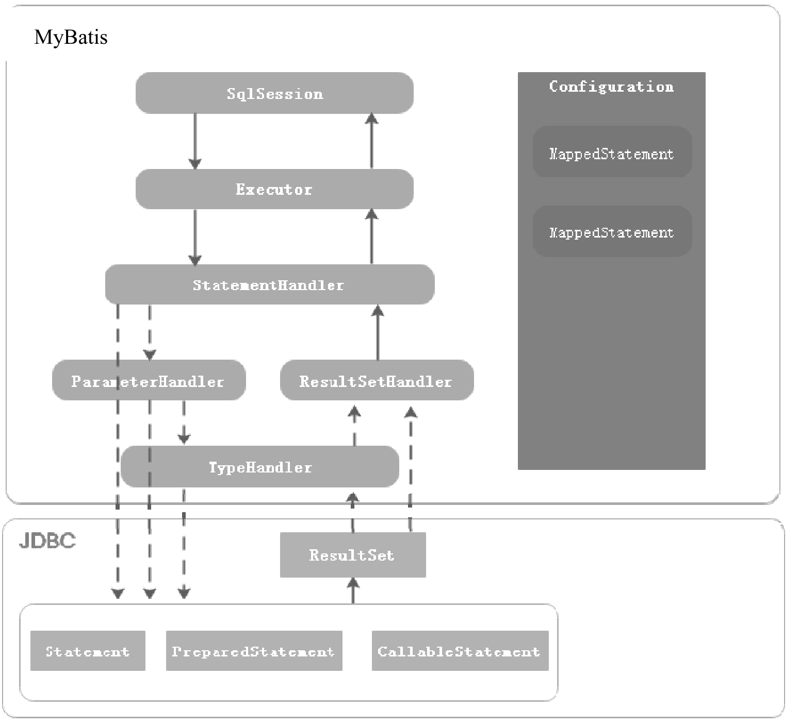
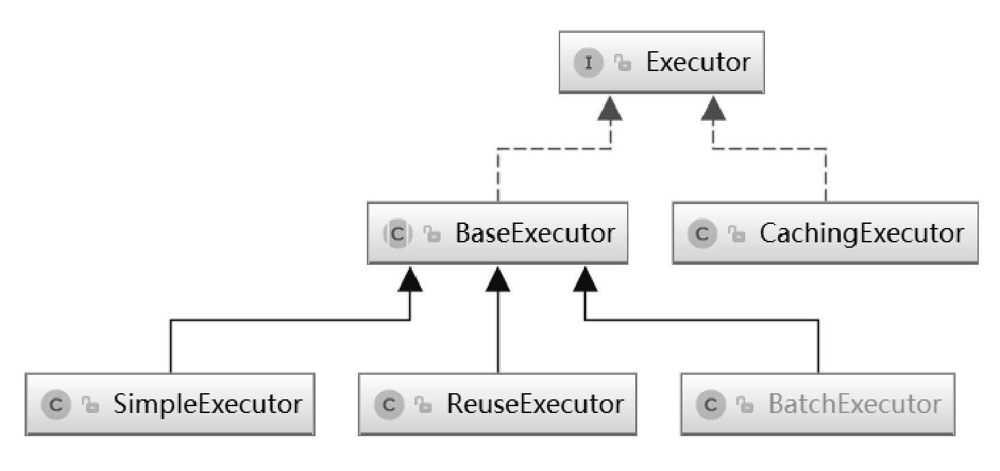
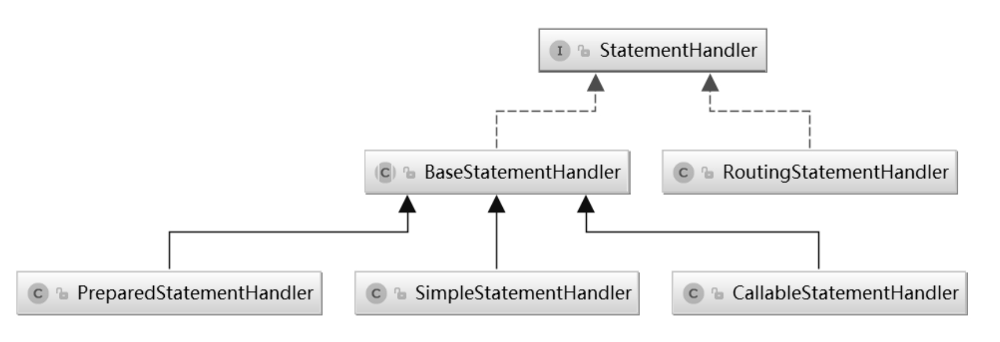
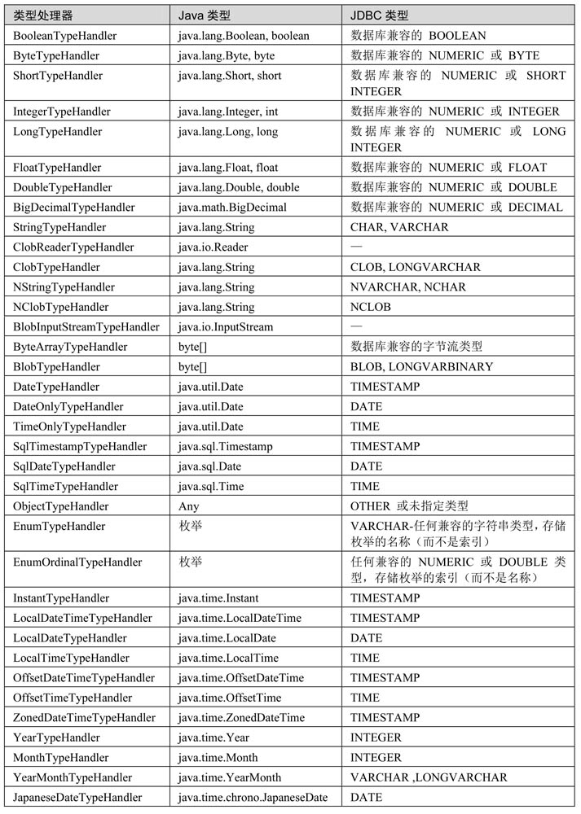

# MyBatis 核心组件

MyBatis的执行流程及核心组件如下图所示：



这些组件的作用如下：

-   Configuration：用于描述 MyBatis 的主配置信息，其他组件需要获取配置信息时，直接通过 Configuration 对象获取。除此之外，MyBatis 在应用启动时，将 Mapper 配置信息、类型别名、TypeHandler 等注册到 Configuration 组件中，其他组件需要这些信息时，也可以从 Configuration 对象中获取。
-   MappedStatement：用于描述 Mapper 中的 SQL 配置信息，是对 MapperXML 配置文件中 <select|update|delete|insert> 等标签或者 @Select/@Update 等注解配置信息的封装。
-   SqlSession：MyBatis 提供的面向用户的 API，表示和数据库交互时的会话对象，用于完成数据库的增删改查功能。SqlSession 是 Executor 组件的外观，目的是对外提供易于理解和使用的数据库操作接口。
-   Executor：MyBatis 的 SQL 执行器，MyBatis 中对数据库所有的增删改查操作都是由 Executor 组件完成的。
-   StatementHandler：封装了对 JDBC Statement 对象的操作，比如为 Statement 对象设置参数，调用 Statement 接口提供的方法与数据库交互，等等。
-   ParameterHandler：当 MyBatis 框架使用的 Statement 类型为 CallableStatement 和 PreparedStatement 时，ParameterHandler 用于为 Statement 对象参数占位符设置值。
-   ResultSetHandler：封装了对 JDBC 中的 ResultSet 对象操作，当执行 SQL 类型为 SELECT 语句时，ResultSetHandler 用于将查询结果转换成 Java 对象。
-   TypeHandler：MyBatis 中的类型处理器，用于处理 Java 类型与 JDBC 类型之间的映射。它的作用主要体现在能够根据 Java 类型调用 PreparedStatement 或 CallableStatement 对象对应的 setXXX() 方法为 Statement 对象设置值，而且能够根据 Java 类型调用 ResultSet 对象对应的 getXXX() 获取 SQL 执行结果。

## 1. Configuration

MyBatis 框架的配置信息有两种，一种是配置 MyBatis 框架属性的主配置文件；另一种是配置执行 SQL 语句的 Mapper 配置文件。Configuration 的作用是描述 MyBatis 主配置文件的信息。Configuration 类中定义了一系列的属性用来控制 MyBatis 运行时的行为，这些属性代码如下：

```java
public class Configuration {

  protected Environment environment;

  protected boolean safeRowBoundsEnabled;
  protected boolean safeResultHandlerEnabled = true;
  protected boolean mapUnderscoreToCamelCase;
  protected boolean aggressiveLazyLoading;
  protected boolean multipleResultSetsEnabled = true;
  protected boolean useGeneratedKeys;
  protected boolean useColumnLabel = true;
  protected boolean cacheEnabled = true;
  protected boolean callSettersOnNulls;
  protected boolean useActualParamName = true;
  protected boolean returnInstanceForEmptyRow;

  protected String logPrefix;
  protected Class<? extends Log> logImpl;
  protected Class<? extends VFS> vfsImpl;
  protected LocalCacheScope localCacheScope = LocalCacheScope.SESSION;
  protected JdbcType jdbcTypeForNull = JdbcType.OTHER;
  protected Set<String> lazyLoadTriggerMethods = new HashSet<String>(Arrays.asList(new String[]{"equals", "clone", "hashCode", "toString"}));
  protected Integer defaultStatementTimeout;
  protected Integer defaultFetchSize;
  protected ExecutorType defaultExecutorType = ExecutorType.SIMPLE;
  protected AutoMappingBehavior autoMappingBehavior = AutoMappingBehavior.PARTIAL;
  protected AutoMappingUnknownColumnBehavior autoMappingUnknownColumnBehavior = AutoMappingUnknownColumnBehavior.NONE;

  protected Properties variables = new Properties();
  protected ReflectorFactory reflectorFactory = new DefaultReflectorFactory();
  protected ObjectFactory objectFactory = new DefaultObjectFactory();
  protected ObjectWrapperFactory objectWrapperFactory = new DefaultObjectWrapperFactory();

  protected boolean lazyLoadingEnabled = false;
  protected ProxyFactory proxyFactory = new JavassistProxyFactory(); // #224 Using internal Javassist instead of OGNL

  protected String databaseId;

  /**
   * Configuration factory class.
   * Used to create Configuration for loading deserialized unread properties.
   *
   * @see <a href='https://code.google.com/p/mybatis/issues/detail?id=300'>Issue 300 (google code)</a>
   */
  protected Class<?> configurationFactory;
    ……
}
```

这些属性的值可以在 MyBatis 主配置文件中通过 \<setting> 标签指定，例如：

```xml
<configuration>
    <settings>
        <setting name="useGeneratedKeys" value="true"/>
        <!-- 打开延迟加载的开关 -->
        <setting name="lazyLoadingEnabled" value="true" />
        <!-- 将积极加载改为懒加载即按需加载 -->
        <setting name="aggressiveLazyLoading" value="false" />
        <!-- toString,hashCode等方法不触发懒加载 -->
        <setting name="lazyLoadTriggerMethods" value=""/>
        <setting name="logImpl" value="STDOUT_LOGGING"/>
        <!--<setting name="proxyFactory" value="CGLIB"/>-->
        <setting name="cacheEnabled" value="false" />
        <setting name="localCacheScope" value="STATEMENT" />
    </settings>
</configuration>
```

## 2. Executor

SqlSession 是 MyBatis 提供的操作数据库的 API，但是真正执行 SQL 的是 Executor 组件。Executor 接口中定义了对数据库的增删改查方法，其中 query() 和 queryCursor() 方法用于执行查询操作，update() 方法用于执行插入、删除、修改操作。Executor 接口有几种不同的实现类，如下图所示。



MyBatis 提供了 3 种不同的 Executor，分别为 **SimpleExecutor、ResueExecutor、BatchExecutor**，这些 Executor 都继承至 BaseExecutor，BaseExecutor 中定义的方法的执行流程及通用的处理逻辑，具体的方法由子类来实现，是典型的模板方法模式的应用。

-   SimpleExecutor 是基础的 Executor，能够完成基本的增删改查操作；
-   ResueExecutor 对 JDBC 中的 Statement 对象做了缓存，当执行相同的 SQL 语句时，直接从缓存中取出 Statement 对象进行复用，避免了频繁创建和销毁 Statement 对象，从而提升系统性能，这是享元思想的应用；
-   BatchExecutor 则会对调用同一个 Mapper 执行的 update、insert 和 delete 操作，调用 Statement 对象的批量操作功能。另外，MyBatis 支持一级缓存和二级缓存，当 MyBatis 开启了二级缓存功能时，会使用 CachingExecutor 对 SimpleExecutor、ResueExecutor、BatchExecutor 进行装饰，为查询操作增加二级缓存功能，这是装饰器模式的应用。

接下来以一个案例介绍如何直接使用 Executor 组件与数据库交互，代码如下：

```java
	@Test
    public void testExecutor() throws IOException, SQLException {
        // 获取配置文件输入流
        InputStream inputStream = Resources.getResourceAsStream("mybatis-config.xml");
        // 通过SqlSessionFactoryBuilder的build()方法创建SqlSessionFactory实例
        SqlSessionFactory sqlSessionFactory = new SqlSessionFactoryBuilder().build(inputStream);
        // 调用openSession()方法创建SqlSession实例
        SqlSession sqlSession = sqlSessionFactory.openSession();
        Configuration configuration = sqlSession.getConfiguration();
        // 从Configuration对象中获取描述SQL配置的MappedStatement对象
        MappedStatement listAllUserStmt = configuration.getMappedStatement("com.blog4java.mybatis.com.blog4java.mybatis.example.mapper.UserMapper.listAllUser");
        // 创建ReuseExecutor实例
        Executor reuseExecutor = configuration.newExecutor(
                new JdbcTransaction(sqlSession.getConnection()),
                ExecutorType.REUSE
        );
        // 调用query()方法执行查询操作
        List<UserEntity> userList = reuseExecutor.query(listAllUserStmt,
                null,
                RowBounds.DEFAULT,
                Executor.NO_RESULT_HANDLER);
        System.out.println(JSON.toJSON(userList));
    }
```

如上面的代码所示，Executor 与数据库交互需要 Mapper 配置信息，MyBatis 通过 MappedStatement 对象描述 Mapper 的配置信息，因此 Executor 需要一个 MappedStatement 对象作为参数。MyBatis 在应用启动时，会解析所有的 Mapper 配置信息，将 Mapper 配置解析成 MappedStatement 对象注册到 Configuration 组件中，调用 Configuration 对象的 getMappedStatement() 方法获取对应的 MappedStatement 对象，获取 MappedStatement 对象后，根据 SQL 类型调用 Executor 对象的 query() 或者 update() 方法即可。

## 3. MappedStatement

MyBatis 通过 MappedStatement 描述 \<select|update|insert|delete> 或者 @Select、@Update 等注解配置的 SQL 信息。

```java
public final class MappedStatement {

  private String id;
  private Integer fetchSize;
  private Integer timeout;
  private StatementType statementType;
  private ResultSetType resultSetType;
  private ParameterMap parameterMap;
  private List<ResultMap> resultMaps;
  private boolean flushCacheRequired;
  private boolean useCache;
  private boolean resultOrdered;
  private SqlCommandType sqlCommandType;
  private LanguageDriver lang;
  private String[] keyProperties;
  private String[] keyColumns;
  private String databaseId;
  private String[] resultSets;

  private Cache cache; // 二级缓存实例
  private SqlSource sqlSource; // 解析SQL语句生成的SqlSource实例
  private String resource; // Mapper资源路径
  private Configuration configuration; // Configuration对象的引用
  private KeyGenerator keyGenerator;  // 默认为Jdbc3KeyGenerator，即数据库自增主键，当配置了<selectKey>时，使用SelectKeyGenerator
  private boolean hasNestedResultMaps; // 是否有嵌套的ResultMap
  private Log statementLog; // 输出日志
  ……
}
```

这些属性的含义如下：

-   id：在命名空间中唯一的标识符，可以被用来引用这条配置信息。
-   fetchSize：用于设置 JDBC 中 Statement 对象的 fetchSize 属性，该属性用于指定 SQL 执行后返回的最大行数。
-   timeout：驱动程序等待数据库返回请求结果的秒数，超时将会抛出异常。
-   statementType：参数可选值为 STATEMENT、PREPARED 或 CALLABLE，这会让 MyBatis 分别使用 Statement、PreparedStatement 或 CallableStatement 与数据库交互，默认值为 PREPARED。
-   resultSetType：参数可选值为 FORWARD_ONLY、SCROLL_SENSITIVE 或 SCROLL_INSENSITIVE，用于设置 ResultSet 对象的特征。默认未设置，由 JDBC 驱动决定。
-   parameterType：用于指定这条语句的参数类的完全限定名或别名。这个属性是可选的，MyBatis 能够根据 Mapper 接口方法中的参数类型推断出传入语句的类型。
-   parameterMap：引用通过 \<parameterMap> 标签定义的参数映射，该属性已经废弃。
-   resultMap：用于引用通过 \<resultMap> 标签配置的实体属性与数据库字段之间建立的结果集的映射（注意： resultMap 和 resultType 属性不能同时使用）。
-   flushCache：用于控制是否刷新缓存。如果将其设置为 true，则任何时候只要语句被调用，都会导致本地缓存和二级缓存被清空，默认值为 false。
-   useCache：是否使用二级缓存。如果将其设置为 true，则会导致本条语句的结果被缓存在 MyBatis 的二级缓存中，对应 \<select> 标签，该属性的默认值为 true。
-   resultOrdered：这个设置仅针对嵌套结果 select 语句适用，如果为 true，就是假定嵌套结果包含在一起或分组在一起，这样的话，当返回一个主结果行的时候，就不会发生对前面结果集引用的情况。这就使得在获取嵌套结果集的时候不至于导致内存不够用，默认值为 false。
-   sqlCommandType：查询操作类型，UNKNOWN, INSERT, UPDATE, DELETE, SELECT, FLUSH。
-   lang：该属性用于指定 LanguageDriver 实现，MyBatis 中的 LanguageDriver用于解析 \<select|update|insert|delete> 标签中的 SQL 语句，生成 SqlSource 对象。
-   keyProperty：该属性仅对 \<update> 和 \<insert> 标签有用，用于将数据库自增主键或者 \<insert> 标签中 \<selectKey> 标签返回的值填充到实体的属性中，如果有多个属性，则使用逗号分隔。
-   keyColumn：该属性仅对 \<update> 和 \<insert> 标签有用，通过生成的键值设置表中的列名，这个设置仅在某些数据库（例如 PostgreSQL ）中是必需的，当主键列不是表中的第一列时需要设置，如果有多个字段，则使用逗号分隔。
-   databaseId：如果配置了 databaseIdProvider，MyBatis 会加载所有不带 databaseId 或匹配当前 databaseId 的语句。
-   resultSets：这个设置仅对多结果集的情况适用，它将列出语句执行后返回的结果集并每个结果集给一个名称，名称使用逗号分隔。
-   cache：二级缓存实例，根据 Mapper 中的 \<cache> 标签配置信息创建对应的 Cache 实现。
-   sqlSource：解析 \<select|update|insert|delete>，将 SQL 语句配置信息解析为 SqlSource 对象。
-   resource：Mapper 配置文件路径。
-   configuration：Configuration 对象的引用，方便获取 MyBatis 配置信息及 TypeHandler、TypeAlias 等信息。
-   keyGenerator：主键生成策略，默认为 Jdbc3KeyGenerator，即数据库自增主键。当配置了 \<selectKey> 时，使用 SelectKeyGenerator 生成主键。
-   hasNestedResultMaps：\<select> 标签中通过 resultMap 属性指定 ResultMap 是不是嵌套的 ResultMap。
-   statementLog：用于输出日志。

## 4. StatementHandler

StatementHandler 组件封装了对 JDBC Statement 的操作，例如设置 Statement 对象的 fetchSize 属性、设置查询超时时间、调用 JDBC Statement 与数据库交互等。

MyBatis 的 StatementHandler 接口中定义的方法如下：

```java
public interface StatementHandler {
  Statement prepare(Connection connection, Integer transactionTimeout)
      throws SQLException;
  void parameterize(Statement statement)
      throws SQLException;
  void batch(Statement statement)
      throws SQLException;
  int update(Statement statement)
      throws SQLException;
  <E> List<E> query(Statement statement, ResultHandler resultHandler)
      throws SQLException;
  <E> Cursor<E> queryCursor(Statement statement)
      throws SQLException;
  BoundSql getBoundSql();
  ParameterHandler getParameterHandler();
}
```

-   prepare：该方法用于创建 JDBC Statement 对象，并完成 Statement 对象的属性设置。
-   parameterize：该方法使用 MyBatis 中的 ParameterHandler 组件为 PreparedStatement 和 CallableStatement 参数占位符设置值。
-   batch：将 SQL 命令添加到批处量执行列表中。
-   update：调用 Statement 对象的 execute() 方法执行更新语句，例如 UPDATE、INSERT、DELETE 语句。
-   query：执行查询语句，并使用 ResultSetHandler 处理查询结果集。
-   queryCursor：带游标的查询，返回 Cursor 对象，能够通过 Iterator 动态地从数据库中加载数据，适用于查询数据量较大的情况，避免将所有数据加载到内存中。
-   getBoundSql：获取 Mapper 中配置的 SQL 信息，BoundSql 封装了动态 SQL 解析后的 SQL 文本和参数映射信息。
-   getParameterHandler：获取 ParameterHandler 实例。

StatementHandler 接口有几种不同的实现，下图是 StatementHandler 的继承关系图。



BaseStatementHandler 是一个抽象类，封装了通用的处理逻辑及方法执行流程，具体方法的实现由子类完成，这里使用到了设计模式中的模板方法模式。

-   SimpleStatementHandler 继承至 BaseStatementHandler，封装了对 JDBC Statement 对象的操作；
-   PreparedStatementHandler 封装了对 JDBC PreparedStatement 对象的操作；
-   CallableStatementHandler 封装了对 JDBC CallableStatement 对象的操作；
-   RoutingStatementHandler 会根据 Mapper 配置中的 statementType 属性（取值为 STATEMENT、PREPARED 或 CALLABLE）创建对应的 StatementHandler 实现。

## 5. TypeHandler

使用 JDBC API 开发应用程序，其中一个比较烦琐的环节是处理 JDBC 类型与 Java 类型之间的转换。涉及 Java 类型和 JDBC 类型转换的两种情况如下：

1.  PreparedStatement 对象为参数占位符设置值时，需要调用 PreparedStatement 接口中提供的一系列的 setXXX() 方法，将 Java 类型转换为对应的 JDBC 类型并为参数占位符赋值。
2.  执行 SQL 语句获取 ResultSet 对象后，需要调用 ResultSet 对象的 getXXX() 方法获取字段值，此时会将 JDBC 类型转换为 Java 类型。

MyBatis 中使用 TypeHandler 解决上面两种情况下，JDBC 类型与 Java 类型之间的转换。TypeHandler 接口定义如下：

```java
public interface TypeHandler<T> {

  void setParameter(PreparedStatement ps, int i, T parameter, JdbcType jdbcType) throws SQLException;

  T getResult(ResultSet rs, String columnName) throws SQLException;

  T getResult(ResultSet rs, int columnIndex) throws SQLException;

  T getResult(CallableStatement cs, int columnIndex) throws SQLException;

}
```

TypeHandler 接口中定义了 4 个方法，setParameter() 方法用于为 PreparedStatement 对象参数的占位符设置值，另外 3 个重载的 getResult() 方法用于从 ResultSet 对象中获取列的值，或者获取存储过程调用结果。

MyBatis 中的 BaseTypeHandler 类实现了 TypeHandler 接口，对调用 setParameter() 方法，参数为 Null 的情况做了通用的处理。对调用 getResult() 方法，从 ResultSet 对象或存储过程调用结果中获取列的值出现的异常做了处理。因此，当我们需要自定义 TypeHandler 时，只需要继承 BaseTypeHandler 类即可。

MyBatis 中内置了很多 TypeHandler，例如 StringTypeHandler 用于 java.lang.String 类型和 JDBC 中的 CHAR、VARCHAR、LONGVARCHAR、NCHAR、NVARCHAR、LONGNVARCHAR 等类型之间的转换。StringTypeHandler 中的逻辑非常简单，代码如下：

```java
public class StringTypeHandler extends BaseTypeHandler<String> {

  @Override
  public void setNonNullParameter(PreparedStatement ps, int i, String parameter, JdbcType jdbcType)
      throws SQLException {
    ps.setString(i, parameter);
  }

  @Override
  public String getNullableResult(ResultSet rs, String columnName)
      throws SQLException {
    return rs.getString(columnName);
  }

  @Override
  public String getNullableResult(ResultSet rs, int columnIndex)
      throws SQLException {
    return rs.getString(columnIndex);
  }

  @Override
  public String getNullableResult(CallableStatement cs, int columnIndex)
      throws SQLException {
    return cs.getString(columnIndex);
  }
}
```

如上面的代码所示，StringTypeHandler 类的 setNonNullParameter() 方法调用 PreparedStatement 对象的 setString() 方法将 Java 中的 java.lang.String 类型转换为 JDBC 类型，并为参数占位符赋值。getNullableResult() 方法调用 ResultSet 对象的 getString() 方法将 JDBC 中的字符串类型转为 Java 中的 java.lang.String 类型，并返回列的值。其他 TypeHandler 处理逻辑与之类似，MyBatis 提供的 TypeHandler 及与 Java 类型和 JDBC 类型之间的对应关系如下图所示。



MyBatis 通过 TypeHandlerRegistry 建立 JDBC 类型、Java 类型与 TypeHandler 之间的映射关系，代码如下：

```java
public final class TypeHandlerRegistry {

  // JDBC 类型 <=> TypeHandler
  private final Map<JdbcType, TypeHandler<?>> JDBC_TYPE_HANDLER_MAP = new EnumMap<JdbcType, TypeHandler<?>>(JdbcType.class);
  // Java 类型 <=> JDBC 类型 <=> TypeHandler
  private final Map<Type, Map<JdbcType, TypeHandler<?>>> TYPE_HANDLER_MAP = new ConcurrentHashMap<Type, Map<JdbcType, TypeHandler<?>>>();
  // TypeHandler Class 对象 <=> TypeHandler
  private final Map<Class<?>, TypeHandler<?>> ALL_TYPE_HANDLERS_MAP = new HashMap<Class<?>, TypeHandler<?>>();
    ……
}
```

如上面的代码所示，在 TypeHandlerRegistry 中，通过 Map 对象保存 JDBC 类型、Java 类型与 TypeHandler 之间的关系，在 TypeHandlerRegistry 类的构造方法中，通过 register() 方法注册所有的 TypeHandler，代码如下：

```java
public TypeHandlerRegistry() {
    register(Boolean.class, new BooleanTypeHandler());
    register(boolean.class, new BooleanTypeHandler());
    register(JdbcType.BOOLEAN, new BooleanTypeHandler());
    register(JdbcType.BIT, new BooleanTypeHandler());
	……
}
```

当我们自定义 TypeHandler 后，也可以调用 TypeHandlerRegistry 类的 register() 方法进行注册，该方法的逻辑比较简单，将 Java、JDBC 类型和 TypeHandler 的对应关系添加到 Map 对象中，可参考 MyBatis 源码中的实现。另外，TypeHandlerRegistry 提供了一系列重载的 getTypeHandler() 方法，该方法能够根据 Java 类型或者 JDBC 类型获取对应的 TypeHandler 对象。

## 6. ParameterHandler

当使用 PreparedStatement 或者 CallableStatement 对象时，如果 SQL 语句中有参数占位符，在执行 SQL 语句之前，就需要为参数占位符设置值。ParameterHandler 的作用是在 PreparedStatementHandler 和 CallableStatementHandler 操作对应的 Statement 执行数据库交互之前为参数占位符设置值。ParameterHandler 接口中只有两个方法，使用方法如下：

```java
public interface ParameterHandler {

  Object getParameterObject();

  void setParameters(PreparedStatement ps)
      throws SQLException;

}
```

-   getParameterObject：该方法用于获取执行 Mapper 时传入的参数对象。
-   setParameters：该方法用于为 JDBC PreparedStatement 或者 CallableStatement 对象设置参数值。

ParameterHandler 接口只有一个默认的实现类，即 DefaultParameterHandler，其中 setParameters() 方法，代码如下：

```java
public class DefaultParameterHandler implements ParameterHandler {
  ……  
  @Override
  public void setParameters(PreparedStatement ps) {
    ErrorContext.instance().activity("setting parameters").object(mappedStatement.getParameterMap().getId());
    // 获取所有参数映射信息
    List<ParameterMapping> parameterMappings = boundSql.getParameterMappings();
    if (parameterMappings != null) {
      for (int i = 0; i < parameterMappings.size(); i++) {
        ParameterMapping parameterMapping = parameterMappings.get(i);
        if (parameterMapping.getMode() != ParameterMode.OUT) {
          Object value;
          // 参数属性名称
          String propertyName = parameterMapping.getProperty();
          // 根据参数属性名称，获取参数值
          if (boundSql.hasAdditionalParameter(propertyName)) { // issue #448 ask first for additional params
            value = boundSql.getAdditionalParameter(propertyName);
          } else if (parameterObject == null) {
            value = null;
          } else if (typeHandlerRegistry.hasTypeHandler(parameterObject.getClass())) {
            value = parameterObject;
          } else {
            MetaObject metaObject = configuration.newMetaObject(parameterObject);
            value = metaObject.getValue(propertyName);
          }
          // 获取参数对应的TypeHandler
          TypeHandler typeHandler = parameterMapping.getTypeHandler();
          JdbcType jdbcType = parameterMapping.getJdbcType();
          if (value == null && jdbcType == null) {
            jdbcType = configuration.getJdbcTypeForNull();
          }
          try {
            // 调用TypeHandler的setParameter方法，为Statement对象参数占位符设置值
            typeHandler.setParameter(ps, i + 1, value, jdbcType);
          } catch (TypeException e) {
            throw new TypeException("Could not set parameters for mapping: " + parameterMapping + ". Cause: " + e, e);
          } catch (SQLException e) {
            throw new TypeException("Could not set parameters for mapping: " + parameterMapping + ". Cause: " + e, e);
          }
        }
      }
    }
  }

}

```

如上面的代码所示，MyBatis 通过 ParameterMapping 描述参数映射的信息。在 DefaultParameterHandler 类的 setParameters() 方法中，首先获取 Mapper 配置中的参数映射，然后对所有参数映射信息进行遍历，接着根据参数名称获取对应的参数值，调用对应的 TypeHandler 对象的 setParameter() 方法为 Statement 对象中的参数占位符设置值。

## 7. ResultSetHandler

ResultSetHandler 用于在 StatementHandler 对象执行完查询操作或存储过程后，对结果集或存储过程的执行结果进行处理。ResultSetHandler 接口定义如下：

```java
public interface ResultSetHandler {

  <E> List<E> handleResultSets(Statement stmt) throws SQLException;

  <E> Cursor<E> handleCursorResultSets(Statement stmt) throws SQLException;

  void handleOutputParameters(CallableStatement cs) throws SQLException;

}
```

-   handleResultSets：获取 Statement 对象中的 ResultSet 对象，对 ResultSet 对象进行处理，返回包含结果实体的 List 对象。
-   handleCursorResultSets：将 ResultSet 对象包装成 Cursor 对象，对 Cursor 进行遍历时，能够动态地从数据库查询数据，避免一次性将所有数据加载到内存中。
-   handleOutputParameters：处理存储过程调用结果。

ResultSetHandler 接口只有一个默认的实现，即 DefaultResultHandler。其中 DefaultResultHandler 对 handleResultSets() 方法的实现，代码如下：

```java
public class DefaultResultSetHandler implements ResultSetHandler {
  ……
  @Override
  public List<Object> handleResultSets(Statement stmt) throws SQLException {
    ErrorContext.instance().activity("handling results").object(mappedStatement.getId());
    final List<Object> multipleResults = new ArrayList<Object>();
    int resultSetCount = 0;
    // 1、获取ResultSet对象，將ResultSet对象包装为ResultSetWrapper
    ResultSetWrapper rsw = getFirstResultSet(stmt);
    // 2、获取ResultMap信息，一般只有一个ResultMap
    List<ResultMap> resultMaps = mappedStatement.getResultMaps();
    int resultMapCount = resultMaps.size();
    // 校验ResultMap,如果该ResultMap名称没有配置，则抛出异常
    validateResultMapsCount(rsw, resultMapCount);
    // 如果指定了多个ResultMap，则对每个ResultMap进行处理
    while (rsw != null && resultMapCount > resultSetCount) {
      ResultMap resultMap = resultMaps.get(resultSetCount);
      // 3、调用handleResultSet方法处理结果集
      handleResultSet(rsw, resultMap, multipleResults, null);
      // 获取下一个结果集对象，需要JDBC驱动支持多结果集
      rsw = getNextResultSet(stmt);
      cleanUpAfterHandlingResultSet();
      resultSetCount++;
    }
    // 如果JDBC驱动支持多结果集，可以通过<select>标签resultSets属性指定多个ResultMap
    // 处理<select>标签resultSets属性，该属性一般情况不会指定
    String[] resultSets = mappedStatement.getResultSets();
    if (resultSets != null) {
      while (rsw != null && resultSetCount < resultSets.length) {
        ResultMapping parentMapping = nextResultMaps.get(resultSets[resultSetCount]);
        if (parentMapping != null) {
          String nestedResultMapId = parentMapping.getNestedResultMapId();
          ResultMap resultMap = configuration.getResultMap(nestedResultMapId);
          //调用handleResultSet方法处理结果集
          handleResultSet(rsw, resultMap, null, parentMapping);
        }
        rsw = getNextResultSet(stmt);
        cleanUpAfterHandlingResultSet();
        resultSetCount++;
      }
    }
    // 对multipleResults进行处理，如果只有一个结果集，则返回结果集中的元素，否则返回多个结果集
    return collapseSingleResultList(multipleResults);
  }
  ……
}
```

DefaultResultHandler 类的 handleResultSets() 方法的逻辑如下：

1.  从 Statement 对象中获取 ResultSet 对象，然后将 ResultSet 包装为 ResultSetWrapper 对象，通过 ResultSetWrapper 对象能够更方便地获取表字段名称、字段对应的 TypeHandler 信息。
2.  获取解析 Mapper 接口及 Mapper SQL 配置生成的 ResultMap 信息，一条语句一般对应一个 ResultMap。
3.  调用 handleResultSet() 方法对 ResultSetWrapper 对象进行处理，将生成的实体对象存放在 multipleResults 列表中。

