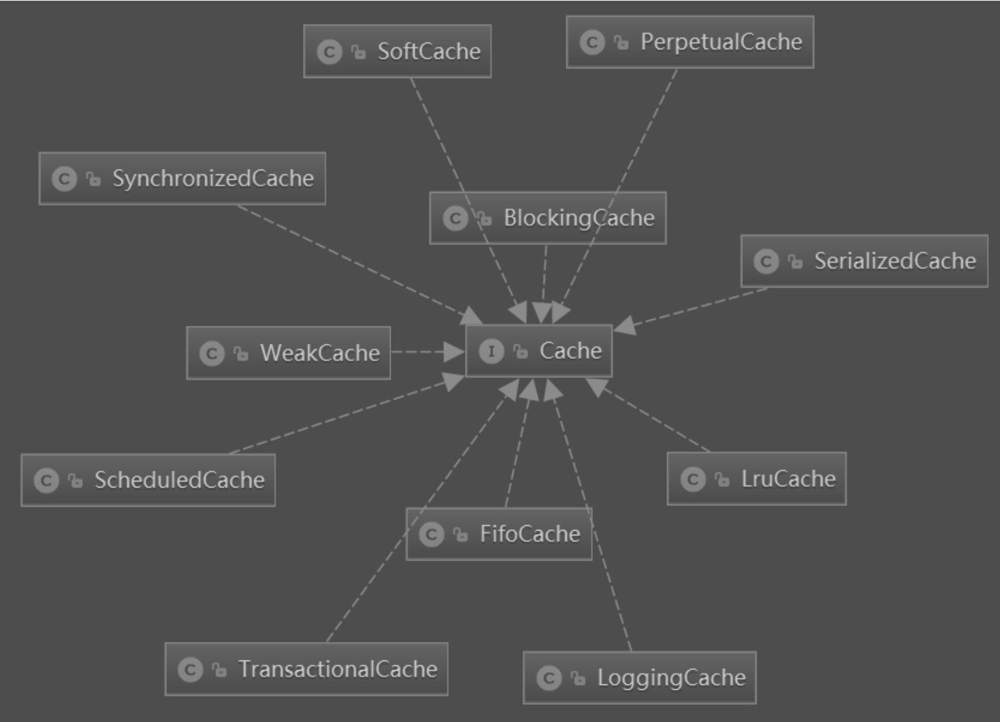

# MyBatis 缓存

## 1. MyBatis 缓存的使用

MyBatis 的缓存分为一级缓存和二级缓存，一级缓存默认是开启的，而且不能关闭。至于一级缓存为什么不能关闭，MyBatis 核心开发人员做出了解释：MyBatis 的一些关键特性（例如通过 \<association> 和 \<collection> 建立级联映射、避免循环引用（circular references）、加速重复嵌套查询等）都是基于 MyBatis 一级缓存实现的，而且 MyBatis 结果集映射相关代码重度依赖 CacheKey，所以目前 MyBatis 不支持关闭一级缓存。

MyBatis 提供了一个配置参数 localCacheScope，用于控制一级缓存的级别，该参数的取值为 SESSION、STATEMENT，当指定 localCacheScope 参数值为 SESSION 时，缓存对整个 SqlSession 有效，只有执行 DML 语句（更新语句）时，缓存才会被清除。当 localCacheScope 值为 STATEMENT 时，缓存仅对当前执行的语句有效，当语句执行完毕后，缓存就会被清空。MyBatis 的一级缓存，用户只能控制缓存的级别，并不能关闭。=

MyBatis 二级缓存的使用比较简单，只需要以下几步：

1.  在 MyBatis 主配置文件中指定 cacheEnabled 属性值为 true。

```xml
<settings>
	<setting name="cacheEnabled" value="true"/>
</settings>
```

2.  在 MyBatis Mapper 配置文件中，配置缓存策略、缓存刷新频率、缓存的容量等属性，例如：

```xml
<cache eviction="FIFO"
       flushInterval="60000"
       size="512"
       readOnly="true"/>
```

3.  在配置 Mapper 时，通过 useCache 属性指定 Mapper 执行时是否使用缓存。另外，还可以通过 flushCache 属性指定 Mapper 执行后是否刷新缓存，例如：

```xml
<select id="listAllUser"
        flushCache="false"
        useCache="true"
        resultType="com.mybatis.example.entity.UserEntity">
	select
    <include redid="userAllField"/>
    from user
</select>
```

通过上面的配置，MyBatis 的二级缓存就可以生效了。执行查询操作时，查询结果会缓存到二级缓存中，执行更新操作后，二级缓存会被清空。

## 2. MyBatis 缓存实现类

MyBatis 的缓存基于 JVM 堆内存实现，即所有的缓存数据都存放在 Java 对象中。MyBatis 通过 Cache 接口定义缓存对象的行为，Cache 接口代码如下：

```java
public interface Cache {

  String getId();

  void putObject(Object key, Object value);

  Object getObject(Object key);

  Object removeObject(Object key);

  void clear();

  int getSize();

  ReadWriteLock getReadWriteLock();

}
```

-   getId()：该方法用于获取缓存的 Id，通常情况下缓存的 Id 为 Mapper 的命名空间名称。
-   putObject()：该方法用于将一个 Java 对象添加到缓存中，该方法有两个参数，第一个参数为缓存的 Key，即 CacheKey 的实例；第二个参数为需要缓存的对象。
-   getObject()：该方法用于获取缓存 Key 对应的缓存对象。
-   removeObject()：该方法用于将一个对象从缓存中移除。
-   clear()：该方法用于清空缓存。
-   getReadWriteLock()：该方法返回一个 ReadWriteLock 对象，该方法在 3.2.6 版本后已经不再使用。

MyBatis 中的缓存类采用装饰器模式设计，Cache 接口有一个基本的实现类，即 PerpetualCache 类，该类的实现比较简单，通过一个 HashMap 实例存放缓存对象。需要注意的是，PerpetualCache 类重写了 Object 类的 equals() 方法，当两个缓存对象的 Id 相同时，即认为缓存对象相同。另外，PerpetualCache 类还重写了 Object 类的 hashCode() 方法，仅以缓存对象的 Id 作为因子生成 hashCode。

除了基础的 PerpetualCache 类之外，MyBatis 中为了对 PerpetualCache 类的功能进行增强，提供了一些缓存的装饰器类，如下图所示。



这些缓存装饰器类功能如下：

-   BlockingCache：阻塞版本的缓存装饰器，能够保证同一时间只有一个线程到缓存中查找指定的 Key 对应的数据。
-   FifoCache：先入先出缓存装饰器，FifoCache 内部有一个维护具有长度限制的 Key 键值链表（LinkedList 实例）和一个被装饰的缓存对象，Key 值链表主要是维护 Key 的 FIFO 顺序，而缓存存储和获取则交给被装饰的缓存对象来完成。
-   LoggingCache：为缓存增加日志输出功能，记录缓存的请求次数和命中次数，通过日志输出缓存命中率。
-   LruCache：最近最少使用的缓存装饰器，当缓存容量满了之后，使用 LRU 算法淘汰最近最少使用的 Key 和 Value。LruCache 中通过重写 LinkedHashMap 类的  removeEldestEntry() 方法获取最近最少使用的 Key 值，将 Key 值保存在 LruCache 类的 eldestKey 属性中，然后在缓存中添加对象时，淘汰 eldestKey 对应的 Value 值。
-   ScheduledCache：自动刷新缓存装饰器，当操作缓存对象时，如果当前时间与上次清空缓存的时间间隔大于指定的时间间隔，则清空缓存。清空缓存的动作由 getObject()、putObject()、removeObject() 等方法触发。
-   SerializedCache：序列化缓存装饰器，向缓存中添加对象时，对添加的对象进行序列化处理，从缓存中取出对象时，进行反序列化处理。
-   SoftCache：软引用缓存装饰器，SoftCache 内部维护了一个缓存对象的强引用队列和软引用队列，缓存以软引用的方式添加到缓存中，并将软引用添加到队列中，获取缓存对象时，如果对象已经被回收，则移除 Key，如果未被回收，则将对象添加到强引用队列中，避免被回收，如果强引用队列已经满了，则移除最早入队列的对象的引用。
-   SynchronizedCache：线程安全缓存装饰器，SynchronizedCache 的实现比较简单，为了保证线程安全，对操作缓存的方法使用 synchronized 关键字修饰。
-   TransactionalCache：事务缓存装饰器，该缓存与其他缓存的不同之处在于，TransactionalCache 增加了两个方法，即 commit() 和 rollback()。当写入缓存时，只有调用 commit() 方法后，缓存对象才会真正添加到 TransactionalCache 对象中，如果调用了 rollback() 方法，写入操作将被回滚。
-   WeakCache：弱引用缓存装饰器，功能和 SoftCache 类似，只是使用不同的引用类型。

下面是 PerpetualCache 类及 MyBatis 提供了缓存装饰类的使用案例：

```java
	@Test
    public void testCache() {
        final int N = 100000;
        Cache cache = new PerpetualCache("default");
        cache = new LruCache(cache);
        cache = new FifoCache(cache);
        cache = new SoftCache(cache);
        cache = new WeakCache(cache);
        cache = new ScheduledCache(cache);
        cache = new SerializedCache(cache);
        cache = new SynchronizedCache(cache);
        cache = new TransactionalCache(cache);
        for (int i = 0; i < N; i++) {
            cache.putObject(i, i);
            ((TransactionalCache) cache).commit();
        }
        System.out.println(cache.getSize());
    }
```

如上面的代码所示，我们可以使用 MyBatis 提供的缓存装饰器类对基础的 PerpetualCache 类的功能进行增强，使用不同的装饰器后，缓存对象则拥有对应的功能。

另外，MyBatis 提供了一个 CacheBuilder 类，通过生成器模式创建缓存对象。下面是使用 CacheBuilder 构造缓存对象的案例：

```java
	@Test
    public void testCacheBuilder() {
        final int N = 100000;
        Cache cache = new CacheBuilder("com.mybatis.example.mapper.UserMapper")
                .implementation( PerpetualCache.class)
                .addDecorator(LruCache.class)
                .clearInterval(10 * 60L)
                .size(1024)
                .readWrite(false)
                .blocking(false)
                .properties(null)
                .build();
        for (int i = 0; i < N; i++) {
            cache.putObject(i, i);
        }
        System.out.println(cache.getSize());
    }
```

## 3. MyBatis 一级缓存实现原理

MyBatis 的一级缓存是 SqlSession 级别的缓存，真正执行 SQL 操作的是 Executor 组件。Executor 采用模板方法设计模式，BaseExecutor 类用于处理一些通用的逻辑，其中一级缓存相关的逻辑就是在 BaseExecutor 类中完成的。

一级缓存使用 PerpetualCache 实例实现，在 BaseExecutor 类中维护了两个 PerpetualCache 属性，代码如下：

```java
public abstract class BaseExecutor implements Executor {
  ……
  // Mybatis一级缓存对象
  protected PerpetualCache localCache;
  // 存储过程输出参数缓存
  protected PerpetualCache localOutputParameterCache;
  ……
}
```

其中，localCache 属性用于缓存 MyBatis 查询结果，localOutputParameterCache 属性用于缓存存储过程调用结果。这两个属性在 BaseExecutor 构造方法中进行初始化，代码如下：

```java
protected BaseExecutor(Configuration configuration, Transaction transaction) {
    this.transaction = transaction;
    this.deferredLoads = new ConcurrentLinkedQueue<DeferredLoad>();
    this.localCache = new PerpetualCache("LocalCache");
    this.localOutputParameterCache = new PerpetualCache("LocalOutputParameterCache");
    this.closed = false;
    this.configuration = configuration;
    this.wrapper = this;
  }
```

MyBatis 通过 CacheKey 对象来描述缓存的 Key 值。在进行查询操作时，首先创建 CacheKey 对象（CacheKey 对象决定了缓存的 Key 与哪些因素有关系）。如果两次查询操作 CacheKey 对象相同，就认为这两次查询执行的是相同的 SQL 语句。CacheKey 对象通过 BaseExecutor 类的 createCacheKey() 方法创建，代码如下：

```java
  @Override
  public CacheKey createCacheKey(MappedStatement ms, Object parameterObject, RowBounds rowBounds, BoundSql boundSql) {
    if (closed) {
      throw new ExecutorException("Executor was closed.");
    }
    CacheKey cacheKey = new CacheKey();
    cacheKey.update(ms.getId()); // Mapper Id
    cacheKey.update(rowBounds.getOffset()); // 偏移量
    cacheKey.update(rowBounds.getLimit()); // 条数
    cacheKey.update(boundSql.getSql()); // SQL语句
    List<ParameterMapping> parameterMappings = boundSql.getParameterMappings();
    TypeHandlerRegistry typeHandlerRegistry = ms.getConfiguration().getTypeHandlerRegistry();
    // 所有参数值
    for (ParameterMapping parameterMapping : parameterMappings) {
      if (parameterMapping.getMode() != ParameterMode.OUT) {
        Object value;
        String propertyName = parameterMapping.getProperty();
        if (boundSql.hasAdditionalParameter(propertyName)) {
          value = boundSql.getAdditionalParameter(propertyName);
        } else if (parameterObject == null) {
          value = null;
        } else if (typeHandlerRegistry.hasTypeHandler(parameterObject.getClass())) {
          value = parameterObject;
        } else {
          MetaObject metaObject = configuration.newMetaObject(parameterObject);
          value = metaObject.getValue(propertyName);
        }
        cacheKey.update(value);
      }
    }
    // Environment Id
    if (configuration.getEnvironment() != null) {
      cacheKey.update(configuration.getEnvironment().getId());
    }
    return cacheKey;
  }
```

从上面的代码可以看出，缓存的 Key 与下面这些因素有关：

1.  Mapper 的 Id，即 Mapper 命名空间与 \<select|update|insert|delete> 标签的 Id 组成的全局限定名。
2.  查询结果的偏移量及查询的条数。
3.  具体的 SQL 语句及 SQL 语句中需要传递的所有参数。
4.  MyBatis 主配置文件中，通过 \<environment> 标签配置的环境信息对应的 Id 属性值。

执行两次查询时，只有上面的信息完全相同时，才会认为两次查询执行的是相同的 SQL 语句，缓存才会生效。

BaseExecutor 的 query() 方法相关的执行逻辑，代码如下：

```java
@Override
  public <E> List<E> query(MappedStatement ms, Object parameter, RowBounds rowBounds, ResultHandler resultHandler, CacheKey key, BoundSql boundSql) throws SQLException {
    ErrorContext.instance().resource(ms.getResource()).activity("executing a query").object(ms.getId());
    if (closed) {
      throw new ExecutorException("Executor was closed.");
    }
    if (queryStack == 0 && ms.isFlushCacheRequired()) {
      clearLocalCache();
    }
    List<E> list;
    try {
      queryStack++;
      // 从缓存中获取结果
      list = resultHandler == null ? (List<E>) localCache.getObject(key) : null;
      if (list != null) {
        handleLocallyCachedOutputParameters(ms, key, parameter, boundSql);
      } else {
        // 缓存中获取不到，则调用queryFromDatabase（）方法从数据库中查询
        list = queryFromDatabase(ms, parameter, rowBounds, resultHandler, key, boundSql);
      }
    } finally {
      queryStack--;
    }
    if (queryStack == 0) {
      for (DeferredLoad deferredLoad : deferredLoads) {
        deferredLoad.load();
      }
      // issue #601
      deferredLoads.clear();
      if (configuration.getLocalCacheScope() == LocalCacheScope.STATEMENT) {
        // issue #482
        clearLocalCache();
      }
    }
    return list;
  }
```

如上面的代码所示，在 BaseExecutor 类的 query() 方法中，首先根据缓存 Key 从 localCache 属性中查找是否有缓存对象，如果查找不到，则调用 queryFromDatabase() 方法从数据库中获取数据，然后将数据写入 localCache 对象中。如果 localCache 中缓存了本次查询的结果，则直接从缓存中获取。

注意：如果 localCacheScope 属性设置为 STATEMENT，则每次查询操作完成后，都会调用 clearLocalCache() 方法清空缓存。

除此之外，MyBatis 会在执行完任意更新语句后清空缓存，BaseExecutor 类的update()方法，代码如下：

```java
  @Override
  public int update(MappedStatement ms, Object parameter) throws SQLException {
    ErrorContext.instance().resource(ms.getResource()).activity("executing an update").object(ms.getId());
    if (closed) {
      throw new ExecutorException("Executor was closed.");
    }
    clearLocalCache();
    return doUpdate(ms, parameter);
  }
```

可以看到，MyBatis 在调用 doUpdate() 方法完成更新操作之前，首先会调用 clearLocalCache() 方法清空缓存。

>   <font color='red'>注意：</font>在分布式环境下，务必将 MyBatis 的 localCacheScope 属性设置为 STATEMENT，避免其他应用节点执行SQL更新语句后，本节点缓存得不到刷新而导致的数据一致性问题。

## 4. MyBatis 二级缓存实现原理

MyBatis 二级缓存在默认情况下是关闭的，因此需要通过设置 cacheEnabled 参数值为 true 来开启二级缓存。

SqlSession 将执行 Mapper 的逻辑委托给 Executor 组件完成，而 Executor 接口有几种不同的实现，分别为 SimpleExecutor、BatchExecutor、ReuseExecutor。另外，还有一个比较特殊的 CachingExecutor，CachingExecutor 用到了装饰器模式，在其他几种 Executor 的基础上增加了二级缓存功能。

Executor 实例采用工厂模式创建，Configuration 类提供了一个工厂方法 newExecutor()，该方法返回一个 Executor 对象，代码如下：

```java
public Executor newExecutor(Transaction transaction, ExecutorType executorType) {
    executorType = executorType == null ? defaultExecutorType : executorType;
    executorType = executorType == null ? ExecutorType.SIMPLE : executorType;
    Executor executor;
    // 根据executor类型创建对象的Executor对象
    if (ExecutorType.BATCH == executorType) {
      executor = new BatchExecutor(this, transaction);
    } else if (ExecutorType.REUSE == executorType) {
      executor = new ReuseExecutor(this, transaction);
    } else {
      executor = new SimpleExecutor(this, transaction);
    }
    // 如果cacheEnabled属性为ture，这使用CachingExecutor对上面创建的Executor进行装饰
    if (cacheEnabled) {
      executor = new CachingExecutor(executor);
    }
    // 执行拦截器链的拦截逻辑
    executor = (Executor) interceptorChain.pluginAll(executor);
    return executor;
  }
```

如上面的代码所示，Configuration 类的 newExecutor() 工厂方法的逻辑比较简单，根据 defaultExecutorType 参数指定的 Executor 类型创建对应的 Executor 实例。

如果 cacheEnabled 属性值为 true（开启了二级缓存），则使用 CachingExecutor 对普通的 Executor 对象进行装饰，CachingExecutor 在普通 Executor 的基础上增加了二级缓存功能。下面是 CachingExecutor 类的属性信息：

```java
public class CachingExecutor implements Executor {

  private final Executor delegate;
  private final TransactionalCacheManager tcm = new TransactionalCacheManager();
  ……
}
```

如上面的代码所示，CachingExecutor 类中维护了一个 TransactionalCacheManager 实例，TransactionalCacheManager 用于管理所有的二级缓存对象。TransactionalCacheManager 类的实现如下：

```java
public class TransactionalCacheManager {
  // 通过HashMap对象维护二级缓存对应的TransactionalCache实例
  private final Map<Cache, TransactionalCache> transactionalCaches = new HashMap<Cache, TransactionalCache>();

  public void clear(Cache cache) {
    getTransactionalCache(cache).clear();
  }

  public Object getObject(Cache cache, CacheKey key) {
    // 获取二级缓存对应的TransactionalCache对象，然后根据缓存Key获取缓存对象
    return getTransactionalCache(cache).getObject(key);
  }
  
  public void putObject(Cache cache, CacheKey key, Object value) {
    getTransactionalCache(cache).putObject(key, value);
  }

  public void commit() {
    for (TransactionalCache txCache : transactionalCaches.values()) {
      txCache.commit();
    }
  }

  public void rollback() {
    for (TransactionalCache txCache : transactionalCaches.values()) {
      txCache.rollback();
    }
  }

  private TransactionalCache getTransactionalCache(Cache cache) {
    // 获取二级缓存对应的TransactionalCache对象
    TransactionalCache txCache = transactionalCaches.get(cache);
    if (txCache == null) {
      // 如果获取不到则创建，然后添加到Map中
      txCache = new TransactionalCache(cache);
      transactionalCaches.put(cache, txCache);
    }
    return txCache;
  }

}
```

如上面的代码所示，在 TransactionalCacheManager 类中，通过一个 HashMap 对象维护所有二级缓存实例对应的 TransactionalCache 对象，在 TransactionalCacheManager 类的 getObject() 方法和 putObject() 方法中都会调用 getTransactionalCache() 方法获取二级缓存对象对应的 TransactionalCache 对象，然后对 TransactionalCache 对象进行操作。在 getTransactionalCache() 方法中，首先从 HashMap 对象中获取二级缓存对象对应的 TransactionalCache 对象，如果获取不到，则创建新的 TransactionalCache 对象添加到 HashMap 对象中。

下面是 CachingExecutor 的 query() 方法的实现：

```java
  @Override
  public <E> List<E> query(MappedStatement ms, Object parameterObject, RowBounds rowBounds, ResultHandler resultHandler) throws SQLException {
    BoundSql boundSql = ms.getBoundSql(parameterObject);
    // 调用createCacheKey（）方法创建缓存Key
    CacheKey key = createCacheKey(ms, parameterObject, rowBounds, boundSql);
    return query(ms, parameterObject, rowBounds, resultHandler, key, boundSql);
  }

  @Override
  public <E> List<E> query(MappedStatement ms, Object parameterObject, RowBounds rowBounds, ResultHandler resultHandler, CacheKey key, BoundSql boundSql)
      throws SQLException {
    // 获取MappedStatement对象中维护的二级缓存对象
    Cache cache = ms.getCache();
    if (cache != null) {
      // 判断是否需要刷新二级缓存
      flushCacheIfRequired(ms);
      if (ms.isUseCache() && resultHandler == null) {
        ensureNoOutParams(ms, boundSql);
        // 从MappedStatement对象对应的二级缓存中获取数据
        @SuppressWarnings("unchecked")
        List<E> list = (List<E>) tcm.getObject(cache, key);
        if (list == null) {
          // 如果缓存数据不存在，则从数据库中查询数据
          list = delegate.<E> query(ms, parameterObject, rowBounds, resultHandler, key, boundSql);
          // 將数据存放到MappedStatement对象对应的二级缓存中
          tcm.putObject(cache, key, list); // issue #578 and #116
        }
        return list;
      }
    }
    return delegate.<E> query(ms, parameterObject, rowBounds, resultHandler, key, boundSql);
  }
```

如上面的代码所示，在 CachingExecutor 的 query() 方法中，首先调用 createCacheKey() 方法创建缓存 Key 对象，然后调用 MappedStatement 对象的 getCache() 方法获取 MappedStatement 对象中维护的二级缓存对象。然后尝试从二级缓存对象中获取结果，如果获取不到，则调用目标 Executor 对象的 query() 方法从数据库获取数据，再将数据添加到二级缓存中。

当执行更新语句后，同一命名空间下的二级缓存将会被清空。下面是 CachingExecutor 的 update() 方法的实现：

```java
  @Override
  public int update(MappedStatement ms, Object parameterObject) throws SQLException {
    // 如果需要刷新，则更新缓存
    flushCacheIfRequired(ms);
    return delegate.update(ms, parameterObject);
  }
```

如上面的代码所示，CachingExecutor 的 update() 方法中会调用 flushCacheIfRequired() 方法确定是否需要刷新缓存，该方法代码如下：

```java
private void flushCacheIfRequired(MappedStatement ms) {
    Cache cache = ms.getCache();
    if (cache != null && ms.isFlushCacheRequired()) {      
      tcm.clear(cache);
    }
  }
```

在 flushCacheIfRequired() 方法中会判断 \<select|update|delete|insert> 标签的 flushCache 属性，如果属性值为 true，就清空缓存。\<select> 标签的 flushCache 属性值默认为 false，而 \<update|delete|insert> 标签的 flushCache 属性值默认为 true。

---

MappedStatement对象创建过程中二级缓存实例的创建。

XMLMapperBuilder 在解析 Mapper 配置时会调用 cacheElement() 方法解析 \<cache> 标签，cacheElement() 方法代码如下：

```java
 private void cacheElement(XNode context) throws Exception {
    if (context != null) {
      String type = context.getStringAttribute("type", "PERPETUAL");
      Class<? extends Cache> typeClass = typeAliasRegistry.resolveAlias(type);
      String eviction = context.getStringAttribute("eviction", "LRU");
      Class<? extends Cache> evictionClass = typeAliasRegistry.resolveAlias(eviction);
      Long flushInterval = context.getLongAttribute("flushInterval");
      Integer size = context.getIntAttribute("size");
      boolean readWrite = !context.getBooleanAttribute("readOnly", false);
      boolean blocking = context.getBooleanAttribute("blocking", false);
      Properties props = context.getChildrenAsProperties();
      builderAssistant.useNewCache(typeClass, evictionClass, flushInterval, size, readWrite, blocking, props);
    }
  }
```

如上面的代码所示，在获取 \<cache> 标签的所有属性信息后，调用 MapperBuilderAssistant 对象的 userNewCache() 方法创建二级缓存实例，然后通过 MapperBuilderAssistant 的 currentCache 属性保存二级缓存对象的引用。在调用 MapperBuilderAssistant 对象的 addMappedStatement() 方法创建 MappedStatement 对象时会将当前命名空间对应的二级缓存对象的引用添加到 MappedStatement 对象中。

下面是创建 MappedStatement 对象的关键代码：

```java
public MappedStatement addMappedStatement(String id, SqlSource sqlSource, StatementType statementType, SqlCommandType sqlCommandType, Integer fetchSize,Integer timeout, String parameterMap, Class<?> parameterType, String resultMap, Class<?> resultType, ResultSetType resultSetType, boolean flushCache, boolean useCache, boolean resultOrdered, KeyGenerator keyGenerator, String keyProperty, String keyColumn, String databaseId, LanguageDriver lang, String resultSets) {
    ……
        MappedStatement.Builder statementBuilder = new MappedStatement.Builder(configuration, id, sqlSource, sqlCommandType)
                .resource(resource)
                .fetchSize(fetchSize)
                .timeout(timeout)
                .statementType(statementType)
                .keyGenerator(keyGenerator)
                .keyProperty(keyProperty)
                .keyColumn(keyColumn)
                .databaseId(databaseId)
                .lang(lang)
                .resultOrdered(resultOrdered)
                .resultSets(resultSets)
                .resultMaps(getStatementResultMaps(resultMap, resultType, id))
                .resultSetType(resultSetType)
                .flushCacheRequired(valueOrDefault(flushCache, !isSelect))
                .useCache(valueOrDefault(useCache, isSelect))
                .cache(currentCache);
    ……
}
```

## 小结

MyBatis 一级缓存和二级缓存的使用：

1.  MyBatis 一级缓存是 SqlSession 级别的缓存，默认就是开启的，而且无法关闭；
2.  二级缓存需要在 MyBatis 主配置文件中通过设置 cacheEnabled 参数值来开启。

一级缓存是在 Executor 中实现的。MyBatis 的 Executor 组件有 3 种不同的实现，分别为 SimpleExecutor、ReuseExecutor 和 BatchExecutor。这些类都继承自 BaseExecutor，在 BaseExecutor 类的 query() 方法中，首先从缓存中获取查询结果，如果获取不到，则从数据库中查询结果，然后将查询结果缓存起来。

二级缓存则是通过装饰器模式实现的，当通过 cacheEnabled 参数开启了二级缓存，MyBatis 框架会使用 CachingExecutor 对 SimpleExecutor、ReuseExecutor 或者 BatchExecutor 进行装饰，当执行查询操作时，对查询结果进行缓存，执行更新操作时则更新二级缓存。


