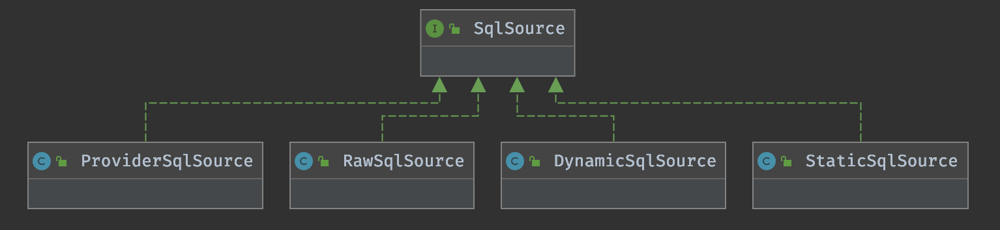

# 动态SQL实现原理

## 1. 动态SQL的使用

假设我们有一个获取用户信息查询操作，具体的查询条件是不确定的，取决于 Web 前端表单提交的数据，可能根据用户的 Id 进行查询，也可能根据用户手机号或姓名进行查询，还有可能是这几个条件的组合。这个时候就需要使用 MyBatis 的动态 SQL 特性了。下面是使用 MyBatis 动态 SQL 进行条件查询的一个案例，代码如下：

```xml
<select id="getUserByEntity"  resultType="com.mybatis.example.entity.User">
        select
        <include refid="userAllField"/>
        from user
        <where>
            <if test="id != null">
                AND id = #{id}
            </if>
            <if test="name != null">
                AND name = #{name}
            </if>
            <if test="phone != null">
                AND phone = #{phone}
            </if>
        </where>
    </select>
```

在上面的 Mapper 配置中，当我们不确定查询条件时，可以使用 \<where> 和 \<if> 标签，通过 OGNL 表达式判断参数内容是否为空，如果表达式结果为 true，则 MyBatis 框架会自动拼接 \<if> 标签内的 SQL 内容，否则会对 \<if> 标签内的 SQL 片段进行忽略。

如上面配置中的 \<where> 标签用于保证至少有一个查询条件时，才会在 SQL 语句中追加 WHERE 关键字，同时能够剔除 WHERE 关键字后相邻的 OR 和 AND 关键字。除了 \<if> 和 \<where> 标签外，MyBatis 动态 SQL 相关的标签还有下面几个。

-   <choose|when|otherwise>：这几个标签需要组合使用，类似于 Java 中的 switch 语法，使用如下：

```xml
<select id="getUserInfo"  resultType="com.mybatis.example.entity.User">
        select
        <include refid="userAllField"/>
        from user where 1 = 1
        <choose>
            <when test="id != null">
              AND  id = #{id}
            </when>
            <when test="name != null">
                AND  name = #{name}
            </when>
            <otherwise>
                AND phone is not null
            </otherwise>
        </choose>
    </select>
```

这组标签与 \<if> 标签不同的是，所有的 \<when> 标签和 \<otherwise> 标签是互斥的，当任何一个 \<when> 标签满足条件时，其他标签均视为条件不成立。

-   \<foreach>：该标签用于对集合参数进行遍历，通常用于构建 IN 条件语句或者 INSERT 批量插入语句。例如，当我们需要根据一组手机号查询用户信息时，可以使用如下配置：

```xml
<select id="getUserByPhones"  resultType="com.mybatis.example.entity.User">
        select
        <include refid="userAllField"/>
        from user
        where phone in
        <foreach item="phone" index="index" collection="phones" open="(" separator="," close=")">
            #{phone}
        </foreach>
    </select>
```

-   <trim|set>：这两个标签的作用和 \<where> 标签的作用类似，用于 WHERE 子句中因为不同的条件成立时导致 AND 或 OR 关键字多余，或者 SET 子句中出现多余的逗号问题。

## 2. SqlSource 与 BoundSql 详解

MyBatis 中的 SqlSource 用于描述 SQL 资源，MyBatis 可以通过两种方式配置 SQL 信息，一种是通过 @Selelect、@Insert、@Delete、@Update 或者 @SelectProvider、@InsertProvider、@DeleteProvider、@UpdateProvider 等注解；另一种是通过 XML 配置文件。SqlSource 就代表 Java 注解或者 XML 文件配置的 SQL 资源。下面是 SqlSource 接口的定义：

```java
public interface SqlSource {

  BoundSql getBoundSql(Object parameterObject);

}
```

如上面的代码所示，SqlSource 接口的定义非常简单，只有一个 getBoundSql() 方法，该方法返回一个 BoundSql 实例。BoundSql 是对 SQL 语句及参数信息的封装，它是 SqlSource 解析后的结果。

如下图所示，SqlSource 接口有 4 个不同的实现，分别为 StaticSqlSource、DynamicSqlSource、RawSqlSource 和 ProviderSqlSource。



这 4 种 SqlSource 实现类的作用如下。

-   ProviderSqlSource：用于描述通过 @Select、@SelectProvider 等注解配置的 SQL 资源信息。
-   DynamicSqlSource：用于描述 Mapper XML 文件中配置的 SQL 资源信息，这些 SQL 通常包含动态 SQL 配置或者 ${} 参数占位符，需要在 Mapper 调用时才能确定具体的 SQL 语句。
-   RawSqlSource：用于描述 Mapper XML 文件中配置的 SQL 资源信息，与 DynamicSqlSource 不同的是，这些 SQL 语句在解析 XML 配置的时候就能确定，即不包含动态 SQL 相关配置。
-   StaticSqlSource：用于描述 ProviderSqlSource、DynamicSqlSource 及 RawSqlSource 解析后得到的静态 SQL 资源。

无论是 Java 注解还是 XML 文件配置的 SQL 信息，在 Mapper 调用时都会根据用户传入的参数将 Mapper 配置转换为 StaticSqlSource 类。

```java
public class StaticSqlSource implements SqlSource {
  // Mapper解析后的sql内容
  private final String sql;
  // 参数映射信息
  private final List<ParameterMapping> parameterMappings;
  private final Configuration configuration;

  public StaticSqlSource(Configuration configuration, String sql) {
    this(configuration, sql, null);
  }

  public StaticSqlSource(Configuration configuration, String sql, List<ParameterMapping> parameterMappings) {
    this.sql = sql;
    this.parameterMappings = parameterMappings;
    this.configuration = configuration;
  }

  @Override
  public BoundSql getBoundSql(Object parameterObject) {
    return new BoundSql(configuration, sql, parameterMappings, parameterObject);
  }

}
```

如上面的代码所示，StaticSqlSource 类的内容比较简单，只封装了 Mapper 解析后的 SQL 内容和 Mapper 参数映射信息。我们知道 Executor 组件与数据库交互，除了需要参数映射信息外，还需要参数信息。因此，Executor组件并不是直接通过StaticSqlSource对象完成数据库操作的，而是与BoundSql交互。BoundSql是对Executor组件执行SQL信息的封装，具体实现代码如下：