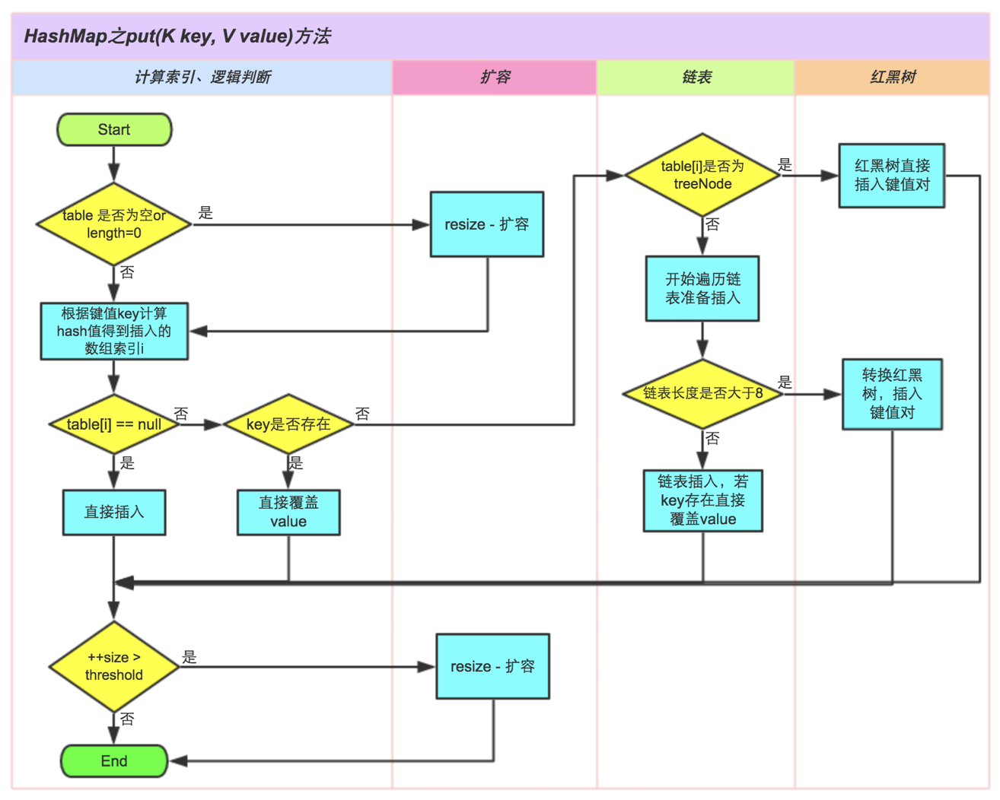
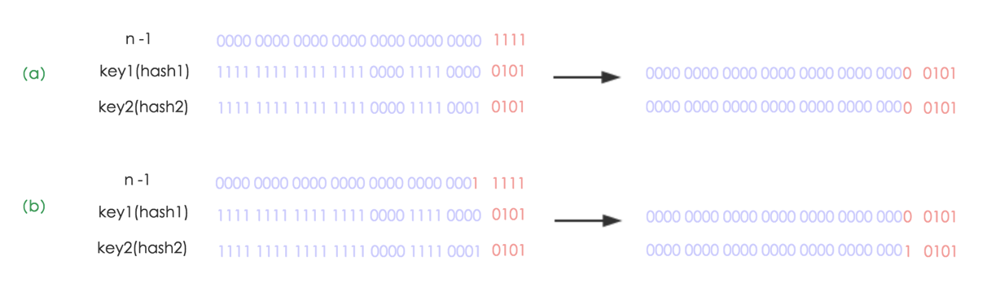

# HashMap底层实现原理

HashMap底层原理总结，几个Hash集合之间的对比。

## 底层数据结构分析

### JDK1.8之前

JDK1.8 之前 HashMap 底层是 **数组和链表** 结合在一起使用也就是 **链表散列**。**HashMap 通过 key 的 hashCode 经过扰动函数处理过后得到 hash 值，然后通过 `(n - 1) & hash` 判断当前元素存放的位置（这里的 n 指的是数组的长度），如果当前位置存在元素的话，就判断该元素与要存入的元素的 hash 值以及 key 是否相同，如果相同的话，直接覆盖，不相同就通过拉链法解决冲突。**

**所谓扰动函数指的就是 HashMap 的 hash 方法。使用 hash 方法也就是扰动函数是为了防止一些实现比较差的 hashCode() 方法 换句话说使用扰动函数之后可以减少碰撞。**

**JDK 1.8 HashMap 的 hash 方法源码:**

JDK 1.8 的 hash方法 相比于 JDK 1.7 hash 方法更加简化，但是原理不变。

```java
      static final int hash(Object key) {
        int h;
        // key.hashCode()：返回散列值也就是hashcode
        // ^ ：按位异或
        // >>>:无符号右移，忽略符号位，空位都以0补齐
        return (key == null) ? 0 : (h = key.hashCode()) ^ (h >>> 16);
    }
```

对比一下 JDK1.7的 HashMap 的 hash 方法源码.

```java
static int hash(int h) {
    // This function ensures that hashCodes that differ only by
    // constant multiples at each bit position have a bounded
    // number of collisions (approximately 8 at default load factor).

    h ^= (h >>> 20) ^ (h >>> 12);
    return h ^ (h >>> 7) ^ (h >>> 4);
}
```

相比于 JDK1.8 的 hash 方法 ，JDK 1.7 的 hash 方法的性能会稍差一点点，因为毕竟扰动了 4 次。

所谓 **“拉链法”** 就是：将链表和数组相结合。也就是说创建一个链表数组，数组中每一格就是一个链表。若遇到哈希冲突，则将冲突的值加到链表中即可。


### JDK1.8之后

相比于之前的版本，jdk1.8在解决哈希冲突时有了较大的变化，当链表长度大于阈值（默认为8）时，将链表转化为红黑树，以减少搜索时间。


**类的属性：**

```java
public class HashMap<K,V> extends AbstractMap<K,V> implements Map<K,V>, Cloneable, Serializable {
    // 序列号
    private static final long serialVersionUID = 362498820763181265L;    
    // 默认的初始容量是16
    static final int DEFAULT_INITIAL_CAPACITY = 1 << 4;   
    // 最大容量
    static final int MAXIMUM_CAPACITY = 1 << 30; 
    // 默认的填充因子
    static final float DEFAULT_LOAD_FACTOR = 0.75f;
    // 当桶(bucket)上的结点数大于这个值时会转成红黑树
    static final int TREEIFY_THRESHOLD = 8; 
    // 当桶(bucket)上的结点数小于这个值时树转链表
    static final int UNTREEIFY_THRESHOLD = 6;
    // 桶中结构转化为红黑树对应的table的最小大小
    static final int MIN_TREEIFY_CAPACITY = 64;
    // 存储元素的数组，总是2的幂次倍
    transient Node<k,v>[] table; 
    // 存放具体元素的集
    transient Set<map.entry<k,v>> entrySet;
    // 存放元素的个数，注意这个不等于数组的长度。
    transient int size;
    // 每次扩容和更改map结构的计数器
    transient int modCount;   
    // 临界值 当实际大小(容量*填充因子)超过临界值时，会进行扩容
    int threshold;
    // 加载因子
    final float loadFactor;
}
```

-   **loadFactor加载因子**

    loadFactor加载因子是控制数组存放数据的疏密程度，loadFactor越趋近于1，那么 数组中存放的数据(entry)也就越多，也就越密，也就是会让链表的长度增加，loadFactor越小，也就是趋近于0，数组中存放的数据(entry)也就越少，也就越稀疏。

    **loadFactor太大导致查找元素效率低，太小导致数组的利用率低，存放的数据会很分散。loadFactor的默认值为0.75f是官方给出的一个比较好的临界值**。

    给定的默认容量为 16，负载因子为 0.75。Map 在使用过程中不断的往里面存放数据，当数量达到了 16 * 0.75 = 12 就需要将当前 16 的容量进行扩容，而扩容这个过程涉及到 rehash、复制数据等操作，所以非常消耗性能。

-   **threshold**

    **threshold = capacity \* loadFactor**，**当Size>=threshold**的时候，那么就要考虑对数组的扩增了，也就是说，这个的意思就是 **衡量数组是否需要扩增的一个标准**。

**Node节点类源码:**

```java
// 继承自 Map.Entry<K,V>
static class Node<K,V> implements Map.Entry<K,V> {
       final int hash;// 哈希值，存放元素到hashmap中时用来与其他元素hash值比较
       final K key;//键
       V value;//值
       // 指向下一个节点
       Node<K,V> next;
       Node(int hash, K key, V value, Node<K,V> next) {
            this.hash = hash;
            this.key = key;
            this.value = value;
            this.next = next;
        }
        public final K getKey()        { return key; }
        public final V getValue()      { return value; }
        public final String toString() { return key + "=" + value; }
        // 重写hashCode()方法
        public final int hashCode() {
            return Objects.hashCode(key) ^ Objects.hashCode(value);
        }

        public final V setValue(V newValue) {
            V oldValue = value;
            value = newValue;
            return oldValue;
        }
        // 重写 equals() 方法
        public final boolean equals(Object o) {
            if (o == this)
                return true;
            if (o instanceof Map.Entry) {
                Map.Entry<?,?> e = (Map.Entry<?,?>)o;
                if (Objects.equals(key, e.getKey()) &&
                    Objects.equals(value, e.getValue()))
                    return true;
            }
            return false;
        }
}
```

**树节点类源码:**

```java
static final class TreeNode<K,V> extends LinkedHashMap.Entry<K,V> {
        TreeNode<K,V> parent;  // 父
        TreeNode<K,V> left;    // 左
        TreeNode<K,V> right;   // 右
        TreeNode<K,V> prev;    // needed to unlink next upon deletion
        boolean red;           // 判断颜色
        TreeNode(int hash, K key, V val, Node<K,V> next) {
            super(hash, key, val, next);
        }
        // 返回根节点
        final TreeNode<K,V> root() {
            for (TreeNode<K,V> r = this, p;;) {
                if ((p = r.parent) == null)
                    return r;
                r = p;
       }
```

## Put方法原理

调用`hashMap.put("str", 1)`，将会在HashMap的table数组中插入一个Key为“str”的元素，这时候需要我们用一个`hash()`函数来确定Entry的插入位置，而每种数据类型有自己的`hashCode()`函数，比如String类型的`hashCode()`函数如下所示：

```java
public static int hashCode(byte[] value) {
    int h = 0;
    for (byte v : value) { 
        h = 31 * h + (v & 0xff);    
    }    
    return h;}
```

所以，`put()`函数的执行路径是这样的：

1. 首先`put("str", 1)`会调用HashMap的`hash("str")`方法。
2. 在`hash()`内部，会调用String(Latin1)内部的`hashcode()`获取字符串”str”的hashcode。
3. “str”的hashcode被返回给`put()`，`put()`通过一定计算得到最终的插入位置index。
4. 最后将这个Entry插入到table的index位置。

这里就出现了两个问题，

- 问题1: 在`put()`里怎样得到插入位置index？
- 问题2: 为什么会调用HashMap的`hash()`函数，直接调用String的`hashcode()`不好吗？

### 问题1: 在`put()`里怎样得到插入位置index？

对于不同的hash码我们希望它被插入到不同的位置，所以我们首先会想到对数组长度的取模运算，但是由于取模运算的效率很低，所以HashMap的发明者用位运算替代了取模运算。

在`put()`里是通过如下的语句得到插入位置的：

```java
index = hash(key) & (Length - 1)
```

其中Length是table数组的长度。为了实现和取模运算相同的功能，这里要求(Length - 1)这部分的二进制表示全为1，我们用HashMap的默认初始长度16举例说明：

```java
假设"str"的hash吗为: 1001 0110 1011 1110 1101 0010 1001 0101
Length - 1 = 15 : 1111
hash("str") & (Length - 1) = 0101
```

如果(Length - 1)这部分不全为1，假如Length是10，那么`Length - 1 = 9 ：1001` 那么无论再和任何hash码做与操作，中间两位数都会是0，这样就会出现大量不同的hash码被映射到相同位置的情况。

所以，**在HashMap中table数组的默认长度是16，并且要求每次自动扩容或者手动扩容时，长度都必须是2的幂。**

### 问题2: 为什么会调用HashMap的`hash()`函数，直接调用String的`hashcode()`不好吗？

HashMap中的`hash()`函数如下所示：

```java
static final int hash(Object key) {
    int h;
    return (key == null) ? 0 : (h = key.hashCode()) ^ (h >>> 16);
}
```

HashMap中的`hash()`函数是将得到hashcode做进一步处理，它将hashcode的高16位和低16位进行异或操作，这样做的目的是：在table的长度比较小的情况下，也能保证hashcode的高位参与到地址映射的计算当中，同时不会有太大的开销。

综上所述：从hashcode计算得到table索引的计算过程如下所示：


`put()`方法的执行过程如下所示：



## HashMap的扩容机制

源码：

```java
final Node<K,V>[] resize() {
    Node<K,V>[] oldTab = table;
    int oldCap = (oldTab == null) ? 0 : oldTab.length;
    int oldThr = threshold;
    int newCap, newThr = 0;
    if (oldCap > 0) {
        // 超过最大值就不再扩充了，就只好随你碰撞去吧
        if (oldCap >= MAXIMUM_CAPACITY) {
            threshold = Integer.MAX_VALUE;
            return oldTab;
        }
        // 没超过最大值，就扩充为原来的2倍
        else if ((newCap = oldCap << 1) < MAXIMUM_CAPACITY && oldCap >= DEFAULT_INITIAL_CAPACITY)
            newThr = oldThr << 1; // double threshold
    }
    else if (oldThr > 0) // initial capacity was placed in threshold
        newCap = oldThr;
    else { 
        // signifies using defaults
        newCap = DEFAULT_INITIAL_CAPACITY;
        newThr = (int)(DEFAULT_LOAD_FACTOR * DEFAULT_INITIAL_CAPACITY);
    }
    // 计算新的resize上限
    if (newThr == 0) {
        float ft = (float)newCap * loadFactor;
        newThr = (newCap < MAXIMUM_CAPACITY && ft < (float)MAXIMUM_CAPACITY ? (int)ft : Integer.MAX_VALUE);
    }
    threshold = newThr;
    @SuppressWarnings({"rawtypes","unchecked"})
        Node<K,V>[] newTab = (Node<K,V>[])new Node[newCap];
    table = newTab;
    if (oldTab != null) {
        // 把每个bucket都移动到新的buckets中
        for (int j = 0; j < oldCap; ++j) {
            Node<K,V> e;
            if ((e = oldTab[j]) != null) {
                oldTab[j] = null;
                if (e.next == null)
                    newTab[e.hash & (newCap - 1)] = e;
                else if (e instanceof TreeNode)
                    ((TreeNode<K,V>)e).split(this, newTab, j, oldCap);
                else { 
                    Node<K,V> loHead = null, loTail = null;
                    Node<K,V> hiHead = null, hiTail = null;
                    Node<K,V> next;
                    do {
                        next = e.next;
                        // 原索引
                        if ((e.hash & oldCap) == 0) {
                            if (loTail == null)
                                loHead = e;
                            else
                                loTail.next = e;
                            loTail = e;
                        }
                        // 原索引+oldCap
                        else {
                            if (hiTail == null)
                                hiHead = e;
                            else
                                hiTail.next = e;
                            hiTail = e;
                        }
                    } while ((e = next) != null);
                    // 原索引放到bucket里
                    if (loTail != null) {
                        loTail.next = null;
                        newTab[j] = loHead;
                    }
                    // 原索引+oldCap放到bucket里
                    if (hiTail != null) {
                        hiTail.next = null;
                        newTab[j + oldCap] = hiHead;
                    }
                }
            }
        }
    }
    return newTab;
}
```

在HashMap中有一下两个属性和扩容相关：

```java
int threshold;
final float loadFactor;
```

其中**threshold = Length \* loadFactor**，Length表示table数组的长度（默认值是16），loadFactor为负载因子（默认值是0.75），阀值threshold表示当table数组中存储的元素超过这个阀值的时候，就需要扩容了。以默认长度16，和默认负载因子0.75为例，threshold = 16 * 0.75 = 12，即当table数组中存储的元素个数超过12个的时候，table数组就该扩容了。

当然Java中的数组是无法自动扩容的，方法是使用一个新的数组代替已有的容量小的数组，然后将旧数组中的元素经过重新计算放到新数组中，那么怎样对旧元素进行重新映射呢？

其实很简单，由于我们在扩容时，是使用2的幂扩展，即数组的长度扩大到原来的2倍, 4倍, 8倍…，因此在resize时(Length - 1)这部分相当于在高位新增一个或多个1bit，我们以扩大到原来的两倍为例说明：



(a)中n为16，(b)中n扩大到两倍为32，相当于(n - 1)这部分的高位多了一个1, 然后和原hash码作与操作，这样元素在数组中映射的位置要么不变，要不向后移动16个位置：


因此，我们在扩充HashMap的时候，只需要看看原来的hash值新增的那个bit是1还是0就好了，是0的话索引没变，是1的话索引变成“原索引+oldCap”，可以看看下图为16扩充为32的resize示意图：


这个设计确实非常的巧妙，既省去了重新计算hash值的时间，而且同时，由于新增的1bit是0还是1可以认为是随机的，因此resize的过程，均匀的把之前的冲突的节点分散到新的bucket了。这一块就是JDK1.8新增的优化点。有一点注意区别，JDK1.7中resize的时候，旧链表迁移新链表的时候，如果在新表的数组索引位置相同，则链表元素会倒置，但是从上图可以看出，JDK1.8不会倒置。

## HashMap死锁形成原理

HashMap非线程安全，即任一时刻可以有多个线程同时写HashMap，可能会导致数据的不一致。如果需要满足线程安全，可以用 Collections的synchronizedMap方法使HashMap具有线程安全的能力，或者使用线程安全的ConcurrentHashMap。

要理解HashMap死锁形成的原理，我们要对HashMap的resize里的transfer过程有所了解，transfer过程是将旧数组中的元素复制到新数组中，在Java 8之前，复制过程会导致链表倒置，这也是形成死锁的重要原因（Java 8中已经不会倒置），transfer的基本过程如下：

```
1. 新建节点e指向当前节点，新建节点next指向e.next
2. 将e.next指向新数组中指定位置newTable[i]
3. newTable[i] = e
4. e = next
```

举个例子：

```java
现在有链表1->2->3，要将它复制到新数组的newTable[i]位置
 Node e = 1, next = e.next;
 e.next = newTable[i];
 newTable[i] = e;
 e = next, next = e.next;
执行完后会得到这样的结果：
newTable[i]=3->2->1
```

死锁会在这种情况产生：两个线程同时往HashMap里放Entry，同时HashMap正好需要扩容，如果一个线程已经完成了transfer过程，而另一个线程不知道，并且又要进行transfer的时候，死锁就会形成。

```
现在Thread1已将完成了transfer，newTable[i]=3->2->1
在Thread2中:
Node e = 1, next = e.next;
e.next = newTable[i]    : 1 -> newTable[i]=3
newTable[i] = e         : newTable[i] = 1->3->2->1  //这时候链表换已经形成了
```

在形成链表换以后再对HashMap进行Get操作时，就会形成死循环。

在Java 8中对这里进行了优化，链表复制到新数组时并不会倒置，不会因为多个线程put导致死循环，但是还有很多弊端，比如数据丢失等，因此多线程情况下还是建议使用ConcurrentHashMap。

## HashMap和Hashtable有什么区别

Java为数据结构中的映射定义了一个接口java.util.Map，此接口主要有四个常用的实现类，分别是HashMap、Hashtable、LinkedHashMap和TreeMap，类继承关系如下图所示：


Hashtable：Hashtable是遗留类，很多映射的常用功能与HashMap类似，不同的是它承自Dictionary类，并且是线程安全的，任一时间只有一个线程能写Hashtable，并发性不如ConcurrentHashMap，因为ConcurrentHashMap引入了分段锁。Hashtable不建议在新代码中使用，不需要线程安全的场合可以用HashMap替换，需要线程安全的场合可以用ConcurrentHashMap替换。

## 总结

1. 扩容是一个特别耗性能的操作，所以当程序员在使用HashMap的时候，估算map的大小，初始化的时候给一个大致的数值，避免map进行频繁的扩容。
2. 负载因子是可以修改的，也可以大于1，但是建议不要轻易修改，除非情况非常特殊。
3. HashMap是线程不安全的，不要在并发的环境中同时操作HashMap，建议使用ConcurrentHashMap。
4. JDK1.8引入红黑树大程度优化了HashMap的性能。