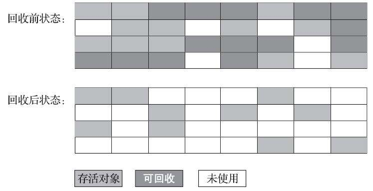
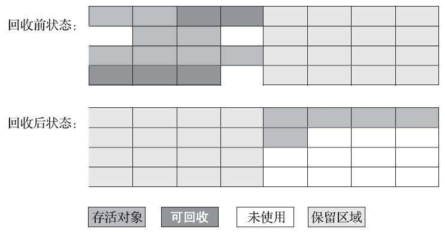
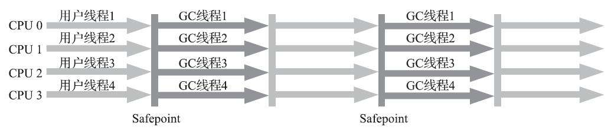
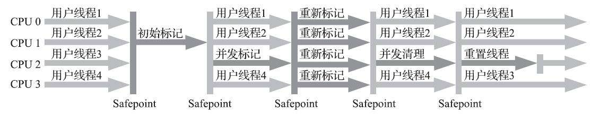

# JVM GC 基础

根据《Java 虚拟机规范》的规定，Java 虚拟机所管理的内存将会包括以下几个运行时数据区域：


垃圾收集需要完成的三件事情：

- 哪些内存需要回收
- 什么时候回收
- 如何回收

其中，程序计数器、虚拟机栈、本地方法栈 3 个区域随线程而生，随线程而灭，栈中的栈帧随着方法的进入和退出而有条不紊地执行着出栈和入栈操作。

而 Java 堆和方法区这两个区域则有着很显著的不确定性：一个接口的多个实现类需要的内存可能会不一样，一个方法所执行的不同条件分支所需要的内存也可能不一样，只有处于运行期间，我们才能知道程序究竟会创建哪些对象，创建多少个对象，这部分内存的分配和回收是动态的。

## 1. 如何判定对象已死

### 1.1 引用计数法

在对象中添加一个引用计数器，每当有一个地方引用它时，计数器值就加一；当引用失效时，计数器值就减一；任何时刻计数器为零的对象就是不可能再被使用的。

**问题：**引用计数就很难解决对象之间相互循环引用的问题。

```java
/**
 * testGC()方法执行后，objA和objB会不会被GC呢？
 * @author zzm
 */
public class ReferenceCountingGC {

    public Object instance = null;

    private static final int _1MB = 1024 * 1024;

    /**
     * 这个成员属性的唯一意义就是占点内存，以便能在GC日志中看清楚是否有回收过
     */
    private byte[] bigSize = new byte[2 * _1MB];

    public static void testGC() {
        ReferenceCountingGC objA = new ReferenceCountingGC();
        ReferenceCountingGC objB = new ReferenceCountingGC();
        objA．instance = objB;
        objB．instance = objA;

        objA = null;
        objB = null;

        // 假设在这行发生GC，objA和objB是否能被回收？
        System.gc();
    }
}
```

### 1.2 可达性分析算法

算法的基本思路就是通过一系列称为 “**GC Roots**” 的根对象作为起始节点集，从这些节点开始，根据引用关系向下搜索，搜索过程所走过的路径称为 “引用链”（Reference Chain），如果某个对象到 GC Roots 间没有任何引用链相连，或者用图论的话来说就是从 GC Roots 到这个对象不可达时，则证明此对象是不可能再被使用的。


对象 object 5、object 6、object 7 虽然互有关联，但是它们到 GCRoots 是不可达的，因此它们将会被判定为可回收的对象。

 

在Java技术体系里面，固定可作为 **GC Roots** 的对象包括以下几种：

-   在虚拟机栈（栈帧中的本地变量表）中引用的对象，譬如各个线程被调用的方法堆栈中使用到的参数、局部变量、临时变量等。
-   在方法区中类静态属性引用的对象，譬如 Java 类的引用类型静态变量。
-   在方法区中常量引用的对象，譬如字符串常量池（String Table）里的引用。
-   在本地方法栈中 JNI（即通常所说的Native方法）引用的对象。
-   Java 虚拟机内部的引用，如基本数据类型对应的 Class 对象，一些常驻的异常对象（比如NullPointExcepiton、OutOfMemoryError）等，还有系统类加载器。
-   所有被同步锁（synchronized 关键字）持有的对象。
-   反映 Java 虚拟机内部情况的 JMXBean、JVMTI 中注册的回调、本地代码缓存等。

除了这些固定的GC Roots集合以外，由于**分代收集**和**局部回收**（Partial GC），所以某个区域里的对象完全有可能被位于堆中其他区域的对象所引用，这时候就需要将这些关联区域的对象也一并加入 GC Roots 集合中去，才能保证可达性分析的正确性。

### 1.3 引用

引用分为**强引用（StronglyRe-ference）**、**软引用（Soft Reference）**、**弱引用（Weak Reference）**和**虚引用（Phantom Reference）**4种，这4种引用强度依次逐渐减弱。

-   **强引用** 是最传统的 “引用” 的定义，是指在程序代码之中普遍存在的引用赋值，即类似 `“Object obj=new Object()”` 这种引用关系。**无论任何情况下，只要强引用关系还存在，垃圾收集器就永远不会回收掉被引用的对象**。
-   **软引用 **是用来描述一些还有用，但非必须的对象。**只被软引用关联着的对象，在系统将要发生内存溢出异常前，会把这些对象列进回收范围之中进行第二次回收，如果这次回收还没有足够的内存，才会抛出内存溢出异常**。在 JDK 1.2 版之后提供了 SoftReference 类来实现软引用。
-   **弱引用** 也是用来描述那些非必须对象，但是它的强度比软引用更弱一些，**被弱引用关联的对象只能生存到下一次垃圾收集发生为止**。当垃圾收集器开始工作，无论当前内存是否足够，都会回收掉只被弱引用关联的对象。在 JDK 1.2 版之后提供了 WeakReference 类来实现弱引用。
-   **虚引用** 也称为 “幽灵引用” 或者 “幻影引用”，它是最弱的一种引用关系。一个对象是否有虚引用的存在，完全不会对其生存时间构成影响，也无法通过虚引用来取得一个对象实例。**为一个对象设置虚引用关联的唯一目的只是为了能在这个对象被收集器回收时收到一个系统通知**。在 JDK 1.2 版之后提供了PhantomReference类来实现虚引用。

### 1.4 生存还是死亡

要真正宣告一个对象死亡，至少要经历两次标记过程：如果对象在进行可达性分析后发现没有与 GC Roots 相连接的引用链，那它将会被第一次标记，随后进行一次筛选，筛选的条件是此对象是否有必要执行 finalize() 方法。假如对象没有覆盖 finalize() 方法，或者 finalize() 方法已经被虚拟机调用过，那么虚拟机将这两种情况都视为“没有必要执行”。

如果这个对象被判定为确有必要执行 finalize() 方法，那么该对象将会被放置在一个名为 **F-Queue** 的队列之中，并在稍后由一条由虚拟机自动建立的、低调度优先级的 Finalizer 线程去执行它们的 finalize() 方法。这里所说的 “执行” 是指虚拟机会触发这个方法开始运行，**但并不承诺一定会等待它运行结束**。这样做的原因是，如果某个对象的 finalize() 方法执行缓慢，或者更极端地发生了死循环，将很可能导致 F-Queue 队列中的其他对象永久处于等待，甚至导致整个内存回收子系统的崩溃。finalize() 方法是对象逃脱死亡命运的最后一次机会，稍后收集器将对 F-Queue 中的对象进行第二次小规模的标记，如果对象要在 finalize() 中成功拯救自己——只要重新与引用链上的任何一个对象建立关联即可，譬如把自己（this关键字）赋值给某个类变量或者对象的成员变量，那在第二次标记时它将被移出 “即将回收” 的集合；如果对象这时候还没有逃脱，那基本上它就真的要被回收了。

>   注：任何一个对象的 finalize() 方法都只会被系统自动调用一次，如果对象面临下一次回收，它的 finalize() 方法不会被再次执行，因此第二段代码的自救行动失败了。

### 1.5 回收方法区

方法区的垃圾收集主要回收两部分内容：**废弃的常量**和**不再使用的类型**。

-   回收废弃常量与回收Java堆中的对象非常类似。已经没有任何字符串对象引用常量池中的“java”常量，且虚拟机中也没有其他地方引用这个字面量。

-   判定一个类型是否属于 “不再被使用的类” 的条件就比较苛刻了。需要同时满足下面三个条件：

    1.  该类所有的实例都已经被回收，也就是Java堆中不存在该类及其任何派生子类的实例。
    2.  加载该类的类加载器已经被回收，这个条件除非是经过精心设计的可替换类加载器的场景，如 OSGi、JSP 的重加载等，否则通常是很难达成的。
    3.  该类对应的 `java.lang.Class` 对象没有在任何地方被引用，无法在任何地方通过反射访问该类的方法。

Java 虚拟机被允许对满足上述三个条件的无用类进行回收，**这里说的仅仅是 “被允许”**，而并不是和对象一样，没有引用了就必然会回收。

## 2. 垃圾收集算法

### 2.1 分代收集理论

“**分代收集**”（GenerationalCollection）理论，实质是一套符合大多数程序运行实际情况的经验法则，它建立在两个分代假说之上：

1.  弱分代假说（Weak Generational Hypothesis）：绝大多数对象都是朝生夕灭的。
2.  强分代假说（Strong Generational Hypothesis）：熬过越多次垃圾收集过程的对象就越难以消亡。

在 Java 堆划分出不同的区域之后，垃圾收集器才可以每次只回收其中某一个或者某些部分的区域——因而才有了 **“Minor GC” “Major GC” “Full GC”** 这样的回收类型的划分；也才能够针对不同的区域安排与里面存储对象存亡特征相匹配的垃圾收集算法——因而发展出了 **“标记-复制算法” “标记-清除算法” “标记-整理算法”** 等针对性的垃圾收集算法。

Java 堆划分为**新生代（Young Generation）**和老年代（Old Generation）两个区域。

>    困难: **对象不是孤立的，对象之间会存在跨代引用。**

为了解决这个问题，就需要对分代收集理论添加第三条经验法则：

3.  跨代引用假说（Intergenerational Reference Hypothesis）：跨代引用相对于同代引用来说仅占极少数。

依据这条假说，我们就不应再为了少量的跨代引用去扫描整个老年代，也不必浪费空间专门记录每一个对象是否存在及存在哪些跨代引用，**只需在新生代上建立一个全局的数据结构（该结构被称为“记忆集”，Remembered Set）**，这个结构把老年代划分成若干小块，标识出老年代的哪一块内存会存在跨代引用。此后当发生 Minor GC 时，只有包含了跨代引用的小块内存里的对象才会被加入到 GC Roots 进行扫描。

### 2.2 标记-清除算法

算法分为 “标记” 和 “清除” 两个阶段：首先标记出所有需要回收的对象，在标记完成后，统一回收掉所有被标记的对象，也可以反过来，标记存活的对象，统一回收所有未被标记的对象。



**它的主要缺点有两个**：

1.  第一个是执行效率不稳定，如果 Java 堆中包含大量对象，而且其中大部分是需要被回收的，这时必须进行大量标记和清除的动作，导致标记和清除两个过程的执行效率都随对象数量增长而降低；
2.  第二个是内存空间的碎片化问题，标记、清除之后会产生**大量不连续的内存碎片**，空间碎片太多可能会导致当以后在程序运行过程中需要分配较大对象时无法找到足够的连续内存而不得不提前触发另一次垃圾收集动作。

### 2.3 标记-复制算法

**标记-复制算法 ** 常被简称为复制算法。为了解决**标记-清除算法**面对大量可回收对象时执行效率低的问题，它将可用内存按容量划分为大小相等的两块，每次只使用其中的一块。当这一块的内存用完了，就将还存活着的对象复制到另外一块上面，然后再把已使用过的内存空间一次清理掉。如果内存中多数对象都是存活的，这种算法将会产生大量的内存间复制的开销，但对于多数对象都是可回收的情况，算法需要复制的就是占少数的存活对象，而且每次都是针对整个半区进行内存回收，分配内存时也就不用考虑有空间碎片的复杂情况，只要移动堆顶指针，按顺序分配即可。这样实现简单，运行高效，不过其缺陷也显而易见，**这种复制回收算法的代价是将可用内存缩小为了原来的一半，空间浪费未免太多了一点**。



把新生代分为一块较大的 **Eden** 空间和两块较小的 **Survivor** 空间，每次分配内存只使用 **Eden** 和其中一块 **Survivor**。发生垃圾搜集时，将 **Eden** 和 **Survivor** 中仍然存活的对象一次性复制到另外一块 **Survivor** 空间上，然后直接清理掉 **Eden** 和已用过的那块 **Survivor**  空间。HotSpot 虚拟机默认 **Eden** 和 **Survivor** 的大小比例是8∶1。

### 3.3 标记-整理算法

针对老年代对象的存亡特征，1974 年 Edward Lueders 提出了另外一种有针对性的 “**标记-整理**”（Mark-Compact）算法，其中的标记过程仍然与 “**标记-清除**” 算法一样，但后续步骤不是直接对可回收对象进行清理，而是让所有存活的对象都向内存空间一端移动，然后直接清理掉边界以外的内存。


如果移动存活对象，尤其是在老年代这种每次回收都有大量对象存活区域，移动存活对象并更新所有引用这些对象的地方将会是一种极为负重的操作，而且这种对象移动操作必须全程暂停用户应用程序才能进行，这就更加让使用者不得不小心翼翼地权衡其弊端了，像这样的停顿被最初的虚拟机设计者形象地描述为 “**Stop The World**”。

但如果跟标记-清除算法那样完全不考虑移动和整理存活对象的话，弥散于堆中的存活对象导致的空间碎片化问题就只能依赖更为复杂的内存分配器和内存访问器来解决。譬如通过 “分区空闲分配链表” 来解决内存分配问题（计算机硬盘存储大文件就不要求物理连续的磁盘空间，能够在碎片化的硬盘上存储和访问就是通过硬盘分区表实现的）。内存的访问是用户程序最频繁的操作，甚至都没有之一，假如在这个环节上增加了额外的负担，势必会直接影响应用程序的吞吐量。

基于以上两点，是否移动对象都存在弊端，移动则内存回收时会更复杂，不移动则内存分配时会更复杂。从垃圾收集的停顿时间来看，不移动对象停顿时间会更短，甚至可以不需要停顿，但是从整个程序的吞吐量来看，移动对象会更划算。即使不移动对象会使得收集器的效率提升一些，但因内存分配和访问相比垃圾收集频率要高得多，这部分的耗时增加，总吞吐量仍然是下降的。

## 3. HotSpot 的算法细节实现

### 3.1 根节点枚举

迄今为止，**所有收集器在根节点枚举这一步骤时都是必须暂停用户线程的**，因此毫无疑问根节点枚举与之前提及的整理内存碎片一样会面临相似的 “**Stop The World**” 的困扰。

根节点枚举始终必须在一个能保障一致性的快照中才得以进行——这里 “一致性” 的意思是整个枚举期间执行子系统看起来就像被冻结在某个时间点上，不会出现分析过程中，根节点集合的对象引用关系还在不断变化的情况，若这点不能满足的话，分析结果准确性也就无法保证。

当用户线程停顿下来之后，并不需要一个不漏地检查完所有执行上下文和全局的引用位置，虚拟机有办法直接得到哪些地方存放着对象引用的。在 HotSpot 的解决方案里，是使用一组称为 **OopMap** 的数据结构来达到这个目的。一旦类加载动作完成的时候，HotSpot 就会把对象内什么偏移量上是什么类型的数据计算出来。

这样收集器在扫描时就可以直接得知这些信息了，并不需要真正一个不漏地从方法区等 GC Roots 开始查找。

### 3.2 安全点

在 **OopMap** 的协助下，HotSpot 可以快速准确地完成 GC Roots 枚举，但一个很现实的问题随之而来：可能导致引用关系变化，或者说导致 **OopMap** 内容变化的指令非常多，如果为每一条指令都生成对应的 **OopMap**，那将会需要大量的额外存储空间，这样垃圾收集伴随而来的空间成本就会变得无法忍受的高昂。

实际上 HotSpot 也的确没有为每条指令都生成 **OopMap**，只是在 “特定的位置” 记录了这些信息，这些位置被称为**安全点（Safepoint）**。有了安全点的设定，也就决定了用户程序执行时并非在代码指令流的任意位置都能够停顿下来开始垃圾收集，而是强制要求必须执行到达安全点后才能够暂停。

因此，**安全点**的选定既不能太少以至于让收集器等待时间过长，也不能太过频繁以至于过分增大运行时的内存负荷。安全点位置的选取基本上是以 “**是否具有让程序长时间执行的特征**” 为标准进行选定的，因为每条指令执行的时间都非常短暂，程序不太可能因为指令流长度太长这样的原因而长时间执行，“长时间执行” 的最明显特征就是指令序列的复用，例如方法调用、循环跳转、异常跳转等都属于指令序列复用，所以只有具有这些功能的指令才会产生安全点。

 

对于**安全点**，另外一个需要考虑的问题是，**如何在垃圾收集发生时让所有线程都跑到最近的安全点，然后停顿下来**。这里有两种方案可供选择：**抢先式中断（Preemptive Suspension）和主动式中断（Voluntary Suspension）**

-   **抢先式中断**不需要线程的执行代码主动去配合，在垃圾收集发生时，系统首先把所有用户线程全部中断，如果发现有用户线程中断的地方不在安全点上，就恢复这条线程执行，让它一会再重新中断，直到跑到安全点上。现在几乎没有虚拟机实现采用抢先式中断来暂停线程响应GC事件。

-   **主动式中断**的思想是当垃圾收集需要中断线程的时候，不直接对线程操作，仅仅简单地设置一个标志位，各个线程执行过程时会不停地主动去轮询这个标志，一旦发现中断标志为真时就自己在最近的安全点上主动中断挂起。轮询标志的地方和安全点是重合的，另外还要加上所有创建对象和其他需要在 Java 堆上分配内存的地方，这是为了检查是否即将要发生垃圾收集，避免没有足够内存分配新对象。

由于轮询操作在代码中会频繁出现，这要求它必须足够高效。HotSpot 使用**内存保护陷阱**的方式，把轮询操作精简至只有一条汇编指令的程度。

下面代码清单中的 `test` 指令就是 HotSpot 生成的轮询指令，当需要暂停用户线程时，虚拟机把 `0x160100` 的内存页设置为不可读，那线程执行到 `test` 指令时就会产生一个自陷异常信号，然后在预先注册的异常处理器中挂起线程实现等待，这样仅通过一条汇编指令便完成安全点轮询和触发线程中断了。

```assembly
0x01b6d627: call   0x01b2b210          ; OopMap{[60]=Oop off=460}
                                       ; *invokeinterface size
                                       ; - Client1::main@113 (line 23)
                                       ;   {virtual_call}
    0x01b6d62c: nop                    ; OopMap{[60]=Oop off=461}
                                       ; *if_icmplt
                                       ; - Client1::main@118 (line 23)
    0x01b6d62d: test   %eax,0x160100   ;   {poll}
    0x01b6d633: mov    0x50(%esp),%esi
    0x01b6d637: cmp    %eax,%esi
```

### 3.3 安全区域

使用安全点的设计似乎已经完美解决如何停顿用户线程，让虚拟机进入垃圾回收状态的问题了，但实际情况却并不一定。**安全点机制保证了程序执行时，在不太长的时间内就会遇到可进入垃圾收集过程的安全点**。但是，程序 “不执行” 的时候呢？所谓的程序不执行就是没有分配处理器时间，典型的场景便是用户线程处于 Sleep 状态或者 Blocked 状态，这时候线程无法响应虚拟机的中断请求，不能再走到安全的地方去中断挂起自己，虚拟机也显然不可能持续等待线程重新被激活分配处理器时间。对于这种情况，就必须引入**安全区域（Safe Region）**来解决。

**安全区域是指能够确保在某一段代码片段之中，引用关系不会发生变化，因此，在这个区域中任意地方开始垃圾收集都是安全的。**也可以把安全区域看作被扩展拉伸了的安全点。

当用户线程执行到安全区域里面的代码时，首先会标识自己已经进入了安全区域，那样当这段时间里虚拟机要发起垃圾收集时就不必去管这些已声明自己在安全区域内的线程了。当线程要离开安全区域时，它要检查虚拟机是否已经完成了根节点枚举（或者垃圾收集过程中其他需要暂停用户线程的阶段），如果完成了，那线程就当作没事发生过，继续执行；否则它就必须一直等待，直到收到可以离开安全区域的信号为止。

### 3.4 记忆集与卡表

为解决对象跨代引用所带来的问题，垃圾收集器在新生代中建立了名为**记忆集（Remembered Set）**的数据结构，用以避免把整个老年代加进 GC Roots 扫描范围。事实上并不只是新生代、老年代之间才有跨代引用的问题，所有涉及**部分区域收集**（Partial GC）行为的垃圾收集器，典型的如 G1、ZGC 和 Shenandoah 收集器，都会面临相同的问题。

**记忆集是一种用于记录从非收集区域指向收集区域的指针集合的抽象数据结构**。如果不考虑效率和成本的话，最简单的实现可以用非收集区域中所有含跨代引用的对象数组来实现这个数据结构。

```java
Class RememberedSet {
    Object[] set[OBJECT_INTERGENERATIONAL_REFERENCE_SIZE];
}
```

这种记录全部含跨代引用对象的实现方案，无论是空间占用还是维护成本都相当高昂。而在垃圾收集的场景中，收集器只需要通过记忆集判断出**某一块非收集区域是否存在有指向了收集区域的指针就可以**，并不需要了解这些跨代指针的全部细节。可以选择更为粗犷的记录粒度来节省记忆集的存储和维护成本，例如：

-   字长精度：每个记录精确到一个机器字长（就是处理器的寻址位数，如常见的32位或64位，这个精度决定了机器访问物理内存地址的指针长度），该字包含跨代指针。
-   对象精度：每个记录精确到一个对象，该对象里有字段含有跨代指针。
-   卡精度：每个记录精确到一块内存区域，该区域内有对象含有跨代指针。

第三种 “**卡精度**” 所指的是用一种称为 **“卡表”（Card Table）**的方式去实现记忆集。那么，卡表与记忆集的关系，可按照 Java 语言中 HashMap 与 Map 的关系来类比理解。

卡表最简单的形式可以只是一个字节数组，而 HotSpot 虚拟机确实也是这样做的。

```c
CARD_TABLE [this address >> 9] = 0;
```

字节数组 **CARD_TABLE** 的每一个元素都对应着其标识的内存区域中一块特定大小的内存块，这个内存块被称作 **“卡页”（Card Page）**。一般来说，卡页大小都是以 2 的 N 次幂的字节数，通过上面代码可以看出 HotSpot 中使用的卡页是 2 的 9 次幂，即 512 字节（地址右移 9 位，相当于用地址除以 512）。那如果卡表标识内存区域的起始地址是 `0x0000` 的话，数组 **CARD_TABLE** 的第 0、1、2 号元素，分别对应了地址范围为 `0x0000～0x01FF`、`0x0200～0x03FF`、`0x0400～0x05FF` 的卡页内存块。


**一个卡页的内存中通常包含不止一个对象，只要卡页内有一个（或更多）对象的字段存在着跨代指针，那就将对应卡表的数组元素的值标识为 1，称为这个元素变脏（Dirty），没有则标识为 0。在垃圾收集发生时，只要筛选出卡表中变脏的元素，就能轻易得出哪些卡页内存块中包含跨代指针，把它们加入 GC Roots 中一并扫描。**

### 3.5 写屏障

**卡表元素何时变脏的答案是很明确的——有其他分代区域中对象引用了本区域对象时，其对应的卡表元素就应该变脏，变脏时间点原则上应该发生在引用类型字段赋值的那一刻。**

但问题是如何变脏，即如何在对象赋值的那一刻去更新维护卡表呢？假如是解释执行的字节码，那相对好处理，虚拟机负责每条字节码指令的执行，有充分的介入空间；但在编译执行的场景中呢？经过即时编译后的代码已经是纯粹的机器指令流了，这就必须找到一个在机器码层面的手段，把维护卡表的动作放到每一个赋值操作之中。

在 HotSpot 虚拟机里是通过**写屏障（Write Barrier）**技术维护卡表状态的。

写屏障可以看作在虚拟机层面对 “引用类型字段赋值” 这个动作的 AOP 切面，在引用对象赋值时会产生一个环形（Around）通知，供程序执行额外的动作，也就是说赋值的前后都在写屏障的覆盖范畴内。在赋值前的部分的写屏障叫作写前屏障（Pre-WriteBarrier），在赋值后的则叫作写后屏障（Post-Write Barrier）。HotSpot 虚拟机的许多收集器中都有使用到写屏障，但直至 G1 收集器出现之前，其他收集器都只用到了写后屏障。

```c
void oop_field_store(oop* field, oop new_value) {
    // 引用字段赋值操作
    *field = new_value;
    // 写后屏障，在这里完成卡表状态更新
    post_write_barrier(field, new_value);
}
```

应用写屏障后，虚拟机就会为所有赋值操作生成相应的指令，一旦收集器在写屏障中增加了更新卡表操作，无论更新的是不是老年代对新生代对象的引用，每次只要对引用进行更新，就会产生额外的开销，不过这个开销与 Minor GC 时扫描整个老年代的代价相比还是低得多的。

### 3.6 并发的可达性分析

可达性分析算法**理论上**要求全过程都基于一个能保障一致性的快照中才能够进行分析，这意味着必须全程冻结用户线程的运行。

**三色标记（Tri-color Marking）**作为工具来辅助推导，把遍历对象图过程中遇到的对象，按照 **“是否访问过”** 这个条件标记成以下三种颜色：

-   **白色**：表示对象尚未被垃圾收集器访问过。显然在可达性分析刚刚开始的阶段，所有的对象都是白色的，若在分析结束的阶段，仍然是白色的对象，即代表不可达。
-   **灰色**：表示对象已经被垃圾收集器访问过，但这个对象上至少存在一个引用还没有被扫描过。
-   **黑色**：表示对象已经被垃圾收集器访问过，且这个对象的所有引用都已经扫描过。黑色的对象代表已经扫描过，它是安全存活的，如果有其他对象引用指向了黑色对象，无须重新扫描一遍。**黑色对象不可能直接（不经过灰色对象）指向某个白色对象**。

如果用户线程此时是冻结的，只有收集器线程在工作，那不会有任何问题。但如果用户线程与收集器是并发工作，收集器在对象图上标记颜色，同时用户线程在修改引用关系——即修改对象图的结构，这样可能出现两种后果：

-   一种是把原本消亡的对象错误标记为存活，这不是好事，但其实是可以容忍的，只不过产生了一点逃过本次收集的浮动垃圾而已，下次收集清理掉就好。
-   另一种是把原本存活的对象错误标记为已消亡，这就是非常致命的后果了，程序肯定会因此发生错误。


当且仅当以下两个条件同时满足时，会产生 **“对象消失”** 的问题，即原本应该是黑色的对象被误标为白色：

-   赋值器插入了一条或多条从黑色对象到白色对象的新引用；
-   赋值器删除了全部从灰色对象到该白色对象的直接或间接引用。

因此，要解决并发扫描时的对象消失问题，只需破坏这两个条件的任意一个即可。由此分别产生了两种解决方案：**增量更新（Incremental Update）**和**原始快照（Snapshot At The Beginning，SATB）**。

-   **增量更新**要破坏的是第一个条件，当黑色对象插入新的指向白色对象的引用关系时，就将这个新插入的引用记录下来，等并发扫描结束之后，再将这些记录过的引用关系中的黑色对象为根，重新扫描一次。这可以简化理解为，**黑色对象一旦新插入了指向白色对象的引用之后，它就变回灰色对象了**。

-   **原始快照**要破坏的是第二个条件，当灰色对象要删除指向白色对象的引用关系时，就将这个要删除的引用记录下来，在并发扫描结束之后，再将这些记录过的引用关系中的灰色对象为根，重新扫描一次。这也可以简化理解为，**无论引用关系删除与否，都会按照刚刚开始扫描那一刻的对象图快照来进行搜索**。

>   CMS 是基于增量更新来做并发标记的，G1、Shenandoah 则是用原始快照来实现。

## 4. 垃圾收集器

衡量垃圾收集器的三项最重要的指标是：**内存占用（Footprint）**、**吞吐量（Throughput）**和**延迟（Latency）**，三者共同构成了一个 “不可能三角”。三者总体的表现会随技术进步而越来越好，但是要在这三个方面同时具有卓越表现的 “完美” 收集器是极其困难甚至是不可能的，一款优秀的收集器通常最多可以同时达成其中的两项。


如果两个收集器之间存在连线，就说明它们可以搭配使用。

>   由于维护和兼容性测试的成本，在 JDK 8 时将 Serial+CMS、ParNew+Serial Old 这两个组合声明为废弃（JEP 173），并在 JDK 9 中完全取消了这些组合的支持（JEP 214）

### 4.1 Serial 收集器

这个收集器是一个**单线程工作的收集器**，但它的 “单线程” 的意义并不仅仅是说明它只会使用一个处理器或一条收集线程去完成垃圾收集工作，更重要的是强调在它进行垃圾收集时，必须暂停其他所有工作线程，直到它收集结束。


迄今为止，它依然是 HotSpot 虚拟机运行在客户端模式下的**默认新生代收集器**，有着优于其他收集器的地方，那就是简单而高效（与其他收集器的单线程相比），对于内存资源受限的环境，它是所有收集器里额外内存消耗（Memory Footprint）最小的。

### 4.2 ParNew 收集器

ParNew 收集器实质上是 Serial 收集器的多线程并行版本，除了同时使用多条线程进行垃圾收集之外，其余的行为包括 Serial 收集器可用的所有控制参数、收集算法、Stop The World、对象分配规则、回收策略等都与 Serial 收集器完全一致，在实现上这两种收集器也共用了相当多的代码。


ParNew 收集器除了支持多线程并行收集之外，其他与 Serial 收集器相比并没有太多创新之处，但它却是不少运行在服务端模式下的 HotSpot 虚拟机，尤其是 JDK 7 之前的遗留系统中首选的新生代收集器，其中有一个与功能、性能无关但其实很重要的原因是：**除了 Serial 收集器外，目前只有它能与 CMS 收集器配合工作**。本质原因：Parallel Scavenge 收集器及后面提到的 G1 收集器等都没有使用 HotSpot 中原本设计的垃圾收集器的分代框架，而选择另外独立实现。

ParNew 默认开启的收集线程数与处理器核心数量相同，在处理器核心非常多的环境中，可以使用 -XX：ParallelGCThreads 参数来限制垃圾收集的线程数。

### 4.3 Parallel Scavenge 收集器

Parallel Scavenge 收集器也是一款新生代收集器，它同样是基于**标记-复制算法**实现的收集器。

Parallel Scavenge 收集器的特点是它的关注点与其他收集器不同，CMS 等收集器的关注点是尽可能地缩短垃圾收集时用户线程的停顿时间，而 Parallel Scavenge 收集器的目标则是达到一个可控制的**吞吐量（Throughput）**。


停顿时间越短就越适合需要与用户交互或需要保证服务响应质量的程序，良好的响应速度能提升用户体验；而高吞吐量则可以最高效率地利用处理器资源，尽快完成程序的运算任务，主要适合在后台运算而不需要太多交互的分析任务。

由于与吞吐量关系密切，Parallel Scavenge收集器也经常被称作**“吞吐量优先收集器”**。

Parallel Scavenge 收集器配合自适应调节策略，把内存管理的调优任务交给虚拟机去完成也许是一个很不错的选择。只需要把基本的内存数据设置好（如 -Xmx 设置最大堆），然后使用 -XX：MaxGCPauseMillis 参数（更关注最大停顿时间）或 -XX：GCTimeRatio（更关注吞吐量）参数给虚拟机设立一个优化目标，那具体细节参数的调节工作就由虚拟机完成了。**自适应调节策略也是 Parallel Scavenge 收集器区别于 ParNew 收集器的一个重要特性。**

### 4.4 Serial Old 收集器

Serial Old 是 Serial 收集器的老年代版本，它同样是一个单线程收集器，使用**标记-整理算法**。


### 4.5 Parallel Old 收集器

Parallel Old 是 Parallel Scavenge 收集器的老年代版本，支持多线程并发收集，基于**标记-整理算法**实现。



在注重吞吐量或者处理器资源较为稀缺的场合，都可以优先考虑 ParallelScavenge 加 Parallel Old 收集器这个组合。

### 4.6 CMS 收集器

CMS（Concurrent Mark Sweep）收集器是一种以获取最短回收停顿时间为目标的收集器。它的运作过程相对于前面几种收集器来说要更复杂一些，整个过程分为四个步骤，包括：

1.  **初始标记（CMS initial mark）** 初始标记仅仅只是标记一下 GC Roots 能直接关联到的对象，速度很快。
2.  **并发标记（CMS concurrent mark）** 并发标记阶段就是从 GCRoots 的直接关联对象开始遍历整个对象图的过程，这个过程耗时较长但是不需要停顿用户线程，可以与垃圾收集线程一起并发运行。
3.  **重新标记（CMS remark）** 重新标记阶段则是为了修正并发标记期间，因用户程序继续运作而导致标记产生变动的那一部分对象的标记记录，这个阶段的停顿时间通常会比初始标记阶段稍长一些，但也远比并发标记阶段的时间短。
4.  **并发清除（CMS concurrent sweep）**并发清除阶段，清理删除掉标记阶段判断的已经死亡的对象，由于不需要移动存活对象，所以这个阶段也是可以与用户线程同时并发的

其中**初始标记、重新标记这两个步骤仍然需要“Stop The World”**。



**缺点：**

-   **CMS 收集器对处理器资源非常敏感**。事实上，面向并发设计的程序都对处理器资源比较敏感。在并发阶段，它虽然不会导致用户线程停顿，但却会因为占用了一部分线程（或者说处理器的计算能力）而导致应用程序变慢，降低总吞吐量。CMS 默认**启动的回收线程数是（处理器核心数量+3）/ 4**，也就是说，如果处理器核心数在四个或以上，并发回收时垃圾收集线程只占用不超过 25% 的处理器运算资源，并且会随着处理器核心数量的增加而下降。但是当处理器核心数量不足四个时，CMS 对用户程序的影响就可能变得很大。如果应用本来的处理器负载就很高，还要分出一半的运算能力去执行收集器线程，就可能导致用户程序的执行速度忽然大幅降低。为了缓解这种情况，虚拟机提供了一种称为 “增量式并发收集器”（Incremental Concurrent Mark Sweep/i-CMS）的 CMS 收集器变种，所做的事情和以前单核处理器年代 PC 机操作系统靠抢占式多任务来模拟多核并行多任务的思想一样，是在并发标记、清理的时候让收集器线程、用户线程交替运行，尽量减少垃圾收集线程的独占资源的时间，这样整个垃圾收集的过程会更长，但对用户程序的影响就会显得较少一些，直观感受是速度变慢的时间更多了，但速度下降幅度就没有那么明显。实践证明增量式的 CMS 收集器效果很一般，从 JDK 7 开始，i-CMS 模式已经被声明为 “deprecated”，即已过时不再提倡用户使用，到 JDK 9 发布后 i-CMS 模式被完全废弃。

-   由于**CMS收集器无法处理“浮动垃圾”**（Floating Garbage），有可能出现 “Con-current Mode Failure” 失败进而导致另一次完全 “Stop The World” 的 FullGC 的产生。在 CMS 的并发标记和并发清理阶段，用户线程是还在继续运行的，程序在运行自然就还会伴随有新的垃圾对象不断产生，但这一部分垃圾对象是出现在标记过程结束以后，CMS 无法在当次收集中处理掉它们，只好留待下一次垃圾收集时再清理掉。这一部分垃圾就称为“浮动垃圾”。同样也是由于在垃圾收集阶段用户线程还需要持续运行，那就还需要预留足够内存空间提供给用户线程使用，因此 CMS 收集器不能像其他收集器那样等待到老年代几乎完全被填满了再进行收集，必须预留一部分空间供并发收集时的程序运作使用。在 JDK 5 的默认设置下，CMS 收集器当老年代使用了 **68%**的空间后就会被激活，这是一个偏保守的设置，如果在实际应用中老年代增长并不是太快，可以适当调高参数 -XX：CMSInitiatingOccu-pancyFraction 的值来提高 CMS 的触发百分比，降低内存回收频率，获取更好的性能。到了 JDK 6 时，CMS收集器的启动阈值就已经默认提升至 **92%**。但这又会更容易面临另一种风险：要是 CMS 运行期间预留的内存无法满足程序分配新对象的需要，就会出现一次 “并发失败”（Concurrent Mode Failure），这时候虚拟机将不得不启动后备预案：**冻结用户线程的执行，临时启用 Serial Old 收集器来重新进行老年代的垃圾收集，但这样停顿时间就很长了**。所以参数 -XX：CMSInitiatingOccupancyFraction 设置得太高将会很容易导致大量的并发失败产生，性能反而降低，用户应在生产环境中根据实际应用情况来权衡设置。
-   CMS 是一款基于“标记-清除”算法实现的收集器，这意味着收集结束时会有**大量空间碎片产生**。空间碎片过多时，将会给大对象分配带来很大麻烦，往往会出现老年代还有很多剩余空间，但就是无法找到足够大的连续空间来分配当前对象，而不得不提前触发一次 Full GC 的情况。为了解决这个问题，CMS 收集器提供了一个 -XX：+UseCMS-CompactAtFullCollection 开关参数（默认是开启的，此参数从 JDK 9 开始废弃），用于在 CMS 收集器不得不进行 Full GC 时开启内存碎片的合并整理过程，由于这个内存整理必须移动存活对象，（在Shenandoah和ZGC出现前）是无法并发的。这样空间碎片问题是解决了，但停顿时间又会变长，因此虚拟机设计者们还提供了另外一个参数 -XX：CMSFullGCsBefore-Compaction（此参数从 JDK 9 开始废弃），这个参数的作用是要求 CMS 收集器在执行过若干次（数量由参数值决定）不整理空间的 Full GC 之后，下一次进入 FullGC 前会先进行碎片整理（默认值为 0，表示每次进入 Full GC 时都进行碎片整理）。

### 4.7 Garbage First 收集器

Garbage First（简称G1）收集器是垃圾收集器技术发展历史上的里程碑式的成果，它开创了**收集器面向局部收集的设计思路和基于Region的内存布局形式**。

G1 是一款主要面向服务端应用的垃圾收集器。JDK 9 发布之日，G1 宣告取代 Parallel Scavenge 加 ParallelOld 组合，成为服务端模式下的默认垃圾收集器，而 CMS 则沦落至被声明为不推荐使用（Deprecate）的收集器。如果对 JDK 9 及以上版本的 HotSpot 虚拟机使用参数 -XX：+UseConcMarkSweepGC 来开启 CMS 收集器的话，用户会收到一个警告信息，提示 CMS 未来将会被废弃。

G1 可以面向堆内存任何部分来组成回收集（Collection Set，一般简称 CSet）进行回收，衡量标准不再是它属于哪个分代，而是哪块内存中存放的垃圾数量最多，回收收益最大，这就是 G1 收集器的 MixedGC 模式。

把连续的 Java 堆划分为多个大小相等的独立区域（Region），每一个 Region 都可以根据需要，扮演新生代的 Eden 空间、 Survivor 空间，或者老年代空间。

Region 中还有一类特殊的 Humongous 区域，专门用来存储大对象。G1 认为只要大小超过了一个 Region 容量一半的对象即可判定为大对象。每个 Region 的大小可以通过参数 -XX：G1HeapRegionSize 设定，取值范围为 1MB～32 MB，且应为 2 的 N 次幂。而对于那些超过了整个 Region 容量的超级大对象，将会被存放在 N 个连续的 Humongous Region 之中，G1 的大多数行为都把 Humongous Region 作为老年代的一部分来进行看待。


G1 还需妥善解决的问题：

-   每个 Region 都维护有自己的记忆集，在存储结构的本质上是一种哈希表，Key 是别的 Region 的起始地址， Value 是一个集合，里面存储的元素是卡表的索引号。这种**“双向”的卡表**结构（卡表是“我指向谁”，这种结构还记录了“谁指向我”）比原来的卡表实现起来更复杂，同时由于 Region 数量比传统收集器的分代数量明显要多得多，因此 G1 收集器要比其他的传统垃圾收集器有着**更高的内存占用负担**。

-   在并发标记阶段如何保证收集线程与用户线程互不干扰地运行？G1 收集器则是通过原始快照（SATB）算法来实现。此外，垃圾收集对用户线程的影响还体现在回收过程中**新创建对象的内存分配**上，程序要继续运行就肯定会持续有新对象被创建，G1 为每一个 Region 设计了两个名为 **TAMS（Top at Mark Start）**的指针，把 Region 中的一部分空间划分出来用于并发回收过程中的新对象分配，并发回收时新分配的对象地址都必须要在这两个指针位置以上。G1 收集器默认在这个地址以上的对象是被隐式标记过的，即默认它们是存活的，不纳入回收范围。如果内存回收的速度赶不上内存分配的速度，G1 收集器也要被迫冻结用户线程执行，导致 Full GC 而产生长时间 “Stop TheWorld”。

如果不去计算用户线程运行过程中的动作（如使用写屏障维护记忆集的操作），G1 收集器的运作过程大致可划分为以下四个步骤：

-   **初始标记**（Initial Marking）：仅仅只是标记一下 GC Roots 能直接关联到的对象，并且修改 TAMS 指针的值，让下一阶段用户线程并发运行时，能正确地在可用的 Region 中分配新对象。这个阶段需要停顿线程，但耗时很短，而且是借用进行 Minor GC 的时候同步完成的，所以 G1收集器在这个阶段实际并没有额外的停顿。
-   **并发标记**（Concurrent Marking）：从 GC Root 开始对堆中对象进行可达性分析，递归扫描整个堆里的对象图，找出要回收的对象，这阶段耗时较长，但可与用户程序并发执行。当对象图扫描完成以后，还要重新处理 SATB 记录下的在并发时有引用变动的对象。
-   **最终标记**（Final Marking）：对用户线程做另一个短暂的暂停，用于处理并发阶段结束后仍遗留下来的最后那少量的 SATB 记录。
-   **筛选回收**（Live Data Counting and Evacuation）：负责更新 Region 的统计数据，对各个 Region 的回收价值和成本进行排序，根据用户所期望的停顿时间来制定回收计划，可以自由选择任意多个 Region 构成回收集，然后把决定回收的那一部分 Region 的存活对象复制到空的 Region 中，再清理掉整个旧 Region 的全部空间。这里的操作涉及存活对象的移动，是必须暂停用户线程，由多条收集器线程并行完成的。

从上述阶段的描述可以看出，**G1 收集器除了并发标记外，其余阶段也是要完全暂停用户线程**的，换言之，它并非纯粹地追求低延迟，官方给它设定的目标是在延迟可控的情况下获得尽可能高的吞吐量。


### 4.8 ZGC 收集器

ZGC(Z GarbageCollector) 收集器是一款基于 Region 内存布局的，（暂时）不设分代的，使用了**读屏障**、**染色指针**和**内存多重映射**等技术来实现可并发的**标记-整理**算法的，以低延迟为首要目标的一款垃圾收集器。

ZGC 也采用基于 Region 的堆内存布局，但与它们不同的是，ZGC 的 Region（在一些官方资料中将它称为 Page或者 ZPage）具有动态性——动态创建和销毁，以及动态的区域容量大小。在 x64 硬件平台下，ZGC 的 Region 可以具有大、中、小三类容量：

-   **小型 Region**（Small Region）：容量固定为 2MB，用于放置小于 256KB 的小对象。
-   **中型 Region**（Medium Region）：容量固定为 32MB，用于放置大于等于 256KB 但小于 4MB 的对象。
-   **大型 Region**（Large Region）：容量不固定，可以动态变化，但必须为 2MB 的整数倍，用于放置 4MB 或以上的大对象。**每个大型 Region 中只会存放一个大对象**，这也预示着虽然名字叫作 “大型Region”，但它的实际容量完全有可能小于中型 Region，最小容量可低至 4MB。**大型 Region 在 ZGC 的实现中是不会被重分配的**，因为复制一个大对象的代价非常高昂。


ZGC 的核心问题——**并发整理算法的实现**：**染色指针技术**

>   在 64 位系统中，理论可以访问的内存高达 16EB（2 的 64 次幂）字节。实际上，基于需求（用不到那么多内存）、性能（地址越宽在做地址转换时需要的页表级数越多）和成本（消耗更多晶体管）的考虑，在 AMD64 架构中只支持到 52 位（4PB）的地址总线和 48 位（256TB）的虚拟地址空间，所以目前 64 位的硬件实际能够支持的最大内存只有 256TB。此外，操作系统一侧也还会施加自己的约束，64 位的 Linux 则分别支持 47 位（128TB）的进程虚拟地址空间和 46 位（64TB）的物理地址空间，64 位的 Windows 系统甚至只支持 44 位（16TB）的物理地址空间。

**染色指针**是一种直接将少量额外的信息存储在指针上的技术，将其**高 4 位**提取出来存储四个标志信息。通过这些标志位，虚拟机可以直接从指针中看到其引用对象的三色标记状态、是否进入了重分配集（即被移动过）、是否只能通过 finalize() 方法才能被访问到。当然，由于这些标志位进一步压缩了原本就只有 46 位的地址空间，也直接导致 ZGC 能够管理的内存不可以超过 4TB（2 的 42 次幂）。


**染色指针的三大优势：**

-   染色指针可以使得一旦某个 Region 的存活对象被移走之后，这个 Region 立即就能够被释放和重用掉，而不必等待整个堆中所有指向该 Region 的引用都被修正后才能清理。理论上只要还有一个空闲 Region，ZGC 就能完成收集。
-   染色指针可以大幅减少在垃圾收集过程中内存屏障的使用数量，设置内存屏障，尤其是写屏障的目的通常是为了记录对象引用的变动情况，如果将这些信息直接维护在指针中，显然就可以省去一些专门的记录操作。实际上，到目前为止 ZGC 都并未使用任何写屏障，只使用了读屏障（一部分是染色指针的功劳，一部分是 ZGC 现在还不支持分代收集，天然就没有跨代引用的问题）。
-   染色指针可以作为一种可扩展的存储结构用来记录更多与对象标记、重定位过程相关的数据，以便日后进一步提高性能。现在 Linux 下的 64 位指针还有前 18 位并未使用，它们虽然不能用来寻址，却可以通过其他手段用于信息记录。如果开发了这 18 位，既可以腾出已用的 4 个标志位，将 ZGC 可支持的最大堆内存从 4TB 拓展到 64TB，也可以利用其余位置再存储更多的标志，譬如存储一些追踪信息来让垃圾收集器在移动对象时能将低频次使用的对象移动到不常访问的内存区域。

Linux/x86-64 平台上的 ZGC 使用了多重映射（Multi-Mapping）将多个不同的虚拟内存地址映射到同一个物理内存地址上，这是一种多对一映射，意味着 ZGC 在虚拟内存中看到的地址空间要比实际的堆内存容量来得更大。把染色指针中的标志位看作是地址的分段符，那只要将这些不同的地址段都映射到同一个物理内存空间，经过多重映射转换后，就可以使用染色指针正常进行寻址了。


**ZGC 收集器是如何工作：**

-   **并发标记**（Concurrent Mark）：与 G1 一样，并发标记是遍历对象图做可达性分析的阶段，前后也要经过类似于 G1 的初始标记、最终标记（尽管 ZGC 中的名字不叫这些）的短暂停顿，而且这些停顿阶段所做的事情在目标上也是相类似的。与 G1 不同的是，ZGC 的标记是在指针上而不是在对象上进行的，标记阶段会更新染色指针中的 Marked 0、Marked 1 标志位。
-   **并发预备重分配**（Concurrent Prepare for Relocate）：这个阶段需要根据特定的查询条件统计得出本次收集过程要清理哪些 Region，将这些 Region 组成重分配集（Relocation Set）。重分配集与 G1 收集器的回收集（Collection Set）还是有区别的，ZGC 划分 Region 的目的并非为了像 G1 那样做收益优先的增量回收。相反，ZGC 每次回收都会扫描所有的 Region，用范围更大的扫描成本换取省去 G1 中记忆集的维护成本。因此，ZGC 的重分配集只是决定了里面的存活对象会被重新复制到其他的 Region 中，里面的 Region 会被释放，而并不能说回收行为就只是针对这个集合里面的 Region 进行，因为标记过程是针对全堆的。此外，在 JDK 12 的 ZGC 中开始支持的类卸载以及弱引用的处理，也是在这个阶段中完成的。
-   **并发重分配**（Concurrent Relocate）：重分配是 ZGC 执行过程中的核心阶段，这个过程要把重分配集中的存活对象复制到新的 Region 上，并为重分配集中的每个 Region 维护一个**转发表（Forward Table）**，记录从旧对象到新对象的转向关系。得益于染色指针的支持，ZGC收集器能仅从引用上就明确得知一个对象是否处于重分配集之中，如果用户线程此时并发访问了位于重分配集中的对象，这次访问将会被预置的内存屏障所截获，然后立即根据 Region 上的转发表记录将访问转发到新复制的对象上，并同时修正更新该引用的值，使其直接指向新对象，ZGC 将这种行为称为指针的 **“自愈”（Self-Healing）**能力。这样做的好处是只有第一次访问旧对象会陷入转发，也就是只慢一次。还有另外一个直接的好处是由于染色指针的存在，一旦重分配集中某个 Region 的存活对象都复制完毕后，这个 Region 就可以立即释放用于新对象的分配（但是转发表还得留着不能释放掉），哪怕堆中还有很多指向这个对象的未更新指针也没有关系，这些旧指针一旦被使用，它们都是可以自愈的。

-   **并发重映射**（Concurrent Remap）：重映射所做的就是修正整个堆中指向重分配集中旧对象的所有引用。重映射清理这些旧引用的主要目的是为了不变慢（还有清理结束后可以释放转发表这样的附带收益）。因此，ZGC 很巧妙地把并发重映射阶段要做的工作，合并到了下一次垃圾收集循环中的并发标记阶段里去完成，反正它们都是要遍历所有对象的，这样合并就节省了一次遍历对象图的开销。一旦所有指针都被修正之后，原来记录新旧对象关系的转发表就可以释放掉了。

**全部四个阶段都是可以并发执行的**，仅是两个阶段中间会存在短暂的停顿小阶段，短暂停顿也只与 GC Roots 大小相关而与堆内存大小无关，因而实现了任何堆上停顿都**小于十毫秒**的目标。


ZGC 还有一个常在技术资料上被提及的优点是支持 **“NUMA-Aware”** 的内存分配。NUMA（Non-Uniform Memory Access，非统一内存访问架构）是一种为多处理器或者多核处理器的计算机所设计的内存架构。由于摩尔定律逐渐失效，现代处理器因频率发展受限转而向多核方向发展，以前原本在北桥芯片中的内存控制器也被集成到了处理器内核中，这样每个处理器核心所在的**裸晶（DIE）**都有属于自己内存管理器所管理的内存，如果要访问被其他处理器核心管理的内存，就必须通过 Inter-Connect 通道来完成，这要比访问处理器的本地内存慢得多。在 NUMA 架构下，ZGC 收集器会优先尝试在请求线程当前所处的处理器的本地内存上分配对象，以保证高效内存访问。在 ZGC 之前的收集器就只有针对吞吐量设计的 ParallelScavenge 支持 NUMA 内存分配，如今 ZGC 也成为另外一个选择。

