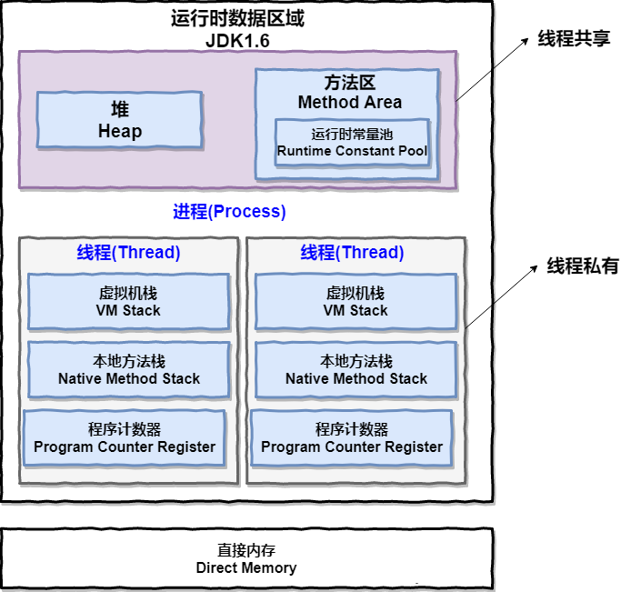
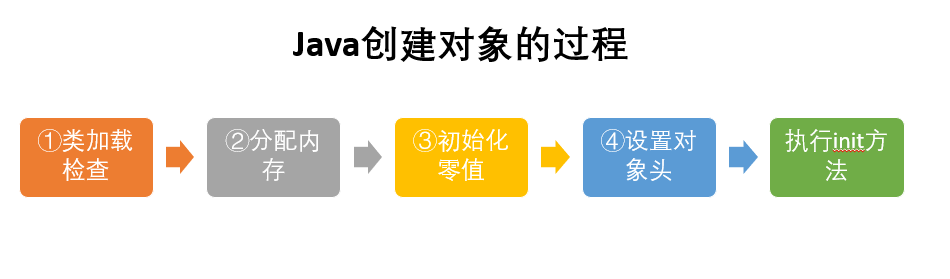

# JVM学习总结

### JVM

Java虚拟机（JVM）是运行 Java 字节码的虚拟机。JVM有针对不同系统的特定实现（Windows，Linux，macOS），目的是使用相同的字节码，它们都会给出相同的结果。

**什么是字节码?采用字节码的好处是什么?**

>   在 Java 中，JVM可以理解的代码就叫做`字节码`（即扩展名为 `.class` 的文件），它不面向任何特定的处理器，只面向虚拟机。Java 语言通过字节码的方式，在一定程度上解决了传统解释型语言执行效率低的问题，同时又保留了解释型语言可移植的特点。所以 Java 程序运行时比较高效，而且，由于字节码并不针对一种特定的机器，因此，Java程序无须重新编译便可在多种不同操作系统的计算机上运行。

**Java 程序从源代码到运行一般有下面3步：**

我们需要格外注意的是 .class->机器码 这一步。在这一步 JVM 类加载器首先加载字节码文件，然后通过解释器逐行解释执行，这种方式的执行速度会相对比较慢。而且，有些方法和代码块是经常需要被调用的(也就是所谓的热点代码)，所以后面引进了 JIT 编译器，而JIT 属于运行时编译。当 JIT 编译器完成第一次编译后，其会将字节码对应的机器码保存下来，下次可以直接使用。而我们知道，机器码的运行效率肯定是高于 Java 解释器的。这也解释了我们为什么经常会说 Java 是编译与解释共存的语言。

>   HotSpot采用了惰性评估(Lazy Evaluation)的做法，根据二八定律，消耗大部分系统资源的只有那一小部分的代码（热点代码），而这也就是JIT所需要编译的部分。JVM会根据代码每次被执行的情况收集信息并相应地做出一些优化，因此执行的次数越多，它的速度就越快。JDK 9引入了一种新的编译模式AOT(Ahead of Time Compilation)，它是直接将字节码编译成机器码，这样就避免了JIT预热等各方面的开销。JDK支持分层编译和AOT协作使用。但是 ，AOT 编译器的编译质量是肯定比不上 JIT 编译器的。

**总结：**

Java虚拟机（JVM）是运行 Java 字节码的虚拟机。JVM有针对不同系统的特定实现（Windows，Linux，macOS），目的是使用相同的字节码，它们都会给出相同的结果。字节码和不同系统的 JVM 实现是 Java 语言“一次编译，随处可以运行”的关键所在。

### 1. JDK 和 JRE

JDK是Java Development Kit，它是功能齐全的Java SDK。它拥有JRE所拥有的一切，还有编译器（javac）和工具（如javadoc和jdb）。它能够创建和编译程序。

JRE 是 Java运行时环境。它是运行已编译 Java 程序所需的所有内容的集合，包括 Java虚拟机（JVM），Java类库，java命令和其他的一些基础构件。但是，它不能用于创建新程序。

如果你只是为了运行一下 Java 程序的话，那么你只需要安装 JRE 就可以了。如果你需要进行一些 Java 编程方面的工作，那么你就需要安装JDK了。但是，这不是绝对的。有时，即使您不打算在计算机上进行任何Java开发，仍然需要安装JDK。例如，如果要使用JSP部署Web应用程序，那么从技术上讲，您只是在应用程序服务器中运行Java程序。那你为什么需要JDK呢？因为应用程序服务器会将 JSP 转换为 Java servlet，并且需要使用 JDK 来编译 servlet。

## 2. 运行时数据区域

Java 虚拟机在执行 Java 程序的过程中会把它管理的内存划分成若干个不同的数据区域。

这些组成部分一些是线程私有的，其他的则是线程共享的。

**线程私有的：**

-   程序计数器
-   虚拟机栈
-   本地方法栈

**线程共享的：**

-   堆
-   方法区
-   直接内存

### 2.1 程序计数器

程序计数器是一块较小的内存空间，可以看作是当前线程所执行的字节码的行号指示器。**字节码解释器工作时通过改变这个计数器的值来选取下一条需要执行的字节码指令，分支、循环、跳转、异常处理、线程恢复等功能都需要依赖这个计数器来完。**

另外，**为了线程切换后能恢复到正确的执行位置，每条线程都需要有一个独立的程序计数器，各线程之间计数器互不影响，独立存储，我们称这类内存区域为“线程私有”的内存。**

**从上面的介绍中我们知道程序计数器主要有两个作用：**

1.  字节码解释器通过改变程序计数器来依次读取指令，从而实现代码的流程控制，如：顺序执行、选择、循环、异常处理。
2.  在多线程的情况下，程序计数器用于记录当前线程执行的位置，从而当线程被切换回来的时候能够知道该线程上次运行到哪儿了。

**注意：程序计数器是唯一一个不会出现OutOfMemoryError的内存区域，它的生命周期随着线程的创建而创建，随着线程的结束而死亡。**

### 2.2 Java 虚拟机栈

**与程序计数器一样，Java虚拟机栈也是线程私有的，它的生命周期和线程相同，描述的是 Java 方法执行的内存模型。**

**Java 内存可以粗糙的区分为堆内存（Heap）和栈内存(Stack),其中栈就是现在说的虚拟机栈，或者说是虚拟机栈中局部变量表部分。** （实际上，Java虚拟机栈是由一个个栈帧组成，而每个栈帧中都拥有：局部变量表、操作数栈、动态链接、方法出口信息。）

**局部变量表主要存放了编译器可知的各种数据类型**（boolean、byte、char、short、int、float、long、double）、**对象引用**（reference类型，它不同于对象本身，可能是一个指向对象起始地址的引用指针，也可能是指向一个代表对象的句柄或其他与此对象相关的位置）。

**Java 虚拟机栈会出现两种异常：StackOverFlowError 和 OutOfMemoryError。**

-   **StackOverFlowError：** 若Java虚拟机栈的内存大小不允许动态扩展，那么当线程请求栈的深度超过当前Java虚拟机栈的最大深度的时候，就抛出StackOverFlowError异常。
-   **OutOfMemoryError：** 若 Java 虚拟机栈的内存大小允许动态扩展，且当线程请求栈时内存用完了，无法再动态扩展了，此时抛出OutOfMemoryError异常。

Java 虚拟机栈也是线程私有的，每个线程都有各自的Java虚拟机栈，而且随着线程的创建而创建，随着线程的死亡而死亡。

### 2.3 本地方法栈

和虚拟机栈所发挥的作用非常相似，区别是： **虚拟机栈为虚拟机执行 Java 方法 （也就是字节码）服务，而本地方法栈则为虚拟机使用到的 Native 方法服务。** 在 HotSpot 虚拟机中和 Java 虚拟机栈合二为一。

本地方法被执行的时候，在本地方法栈也会创建一个栈帧，用于存放该本地方法的局部变量表、操作数栈、动态链接、出口信息。

方法执行完毕后相应的栈帧也会出栈并释放内存空间，也会出现 StackOverFlowError 和 OutOfMemoryError 两种异常。

### 2.4 堆

Java 虚拟机所管理的内存中最大的一块，Java 堆是所有线程共享的一块内存区域，在虚拟机启动时创建。**此内存区域的唯一目的就是存放对象实例，几乎所有的对象实例以及数组都在这里分配内存。**

Java 堆是垃圾收集器管理的主要区域，因此也被称作**GC堆（Garbage Collected Heap）**.从垃圾回收的角度，由于现在收集器基本都采用分代垃圾收集算法，所以Java堆还可以细分为：新生代和老年代：再细致一点有：Eden空间、From Survivor、To Survivor空间等。**进一步划分的目的是更好地回收内存，或者更快地分配内存。**

**在 JDK 1.8中移除整个永久代，取而代之的是一个叫元空间（Metaspace）的区域（永久代使用的是JVM的堆内存空间，而元空间使用的是物理内存，直接受到本机的物理内存限制）。**

### 2.5 方法区

**方法区与 Java 堆一样，是各个线程共享的内存区域，它用于存储已被虚拟机加载的类信息、常量、静态变量、即时编译器编译后的代码等数据。虽然Java虚拟机规范把方法区描述为堆的一个逻辑部分，但是它却有一个别名叫做 Non-Heap（非堆），目的应该是与 Java 堆区分开来。**

HotSpot 虚拟机中方法区也常被称为 **“永久代”**，本质上两者并不等价。仅仅是因为 HotSpot 虚拟机设计团队用永久代来实现方法区而已，这样 HotSpot 虚拟机的垃圾收集器就可以像管理 Java 堆一样管理这部分内存了。但是这并不是一个好主意，因为这样更容易遇到内存溢出问题。

**相对而言，垃圾收集行为在这个区域是比较少出现的，但并非数据进入方法区后就“永久存在”了。**

### 2.6 运行时常量池

运行时常量池是方法区的一部分。Class 文件中除了有类的版本、字段、方法、接口等描述信息外，还有常量池信息（用于存放编译期生成的各种字面量和符号引用）

既然运行时常量池时方法区的一部分，自然受到方法区内存的限制，当常量池无法再申请到内存时会抛出 OutOfMemoryError 异常。

**JDK1.7及之后版本的 JVM 已经将运行时常量池从方法区中移了出来，在 Java 堆（Heap）中开辟了一块区域存放运行时常量池。**

### 2.7 直接内存

直接内存并不是虚拟机运行时数据区的一部分，也不是虚拟机规范中定义的内存区域，但是这部分内存也被频繁地使用。而且也可能导致 OutOfMemoryError 异常出现。

JDK1.4中新加入的 **NIO(New Input/Output) 类**，引入了一种基于**通道（Channel）** 与**缓存区（Buffer）** 的 I/O 方式，它可以直接使用Native函数库直接分配堆外内存，然后通过一个存储在 Java 堆中的 DirectByteBuffer 对象作为这块内存的引用进行操作。这样就能在一些场景中显著提高性能，因为**避免了在 Java 堆和 Native 堆之间来回复制数据**。

本机直接内存的分配不会收到 Java 堆的限制，但是，既然是内存就会受到本机总内存大小以及处理器寻址空间的限制。

## 3 HotSpot 虚拟机对象探秘

通过上面的介绍我们大概知道了虚拟机的内存情况，下面我们来详细的了解一下 HotSpot 虚拟机在 Java 堆中对象分配、布局和访问的全过程。

### 3.1 对象的创建

下图便是 Java 对象的创建过程，我建议最好是能默写出来，并且要掌握每一步在做什么。 

**①类加载检查：** 虚拟机遇到一条 new 指令时，首先将去检查这个指令的参数是否能在常量池中定位到这个类的符号引用，并且检查这个符号引用代表的类是否已被加载过、解析和初始化过。如果没有，那必须先执行相应的类加载过程。

**②分配内存：** 在**类加载检查**通过后，接下来虚拟机将为新生对象**分配内存**。对象所需的内存大小在类加载完成后便可确定，为对象分配空间的任务等同于把一块确定大小的内存从 Java 堆中划分出来。**分配方式**有 **“指针碰撞”** 和 **“空闲列表”** 两种，**选择那种分配方式由 Java 堆是否规整决定，而Java堆是否规整又由所采用的垃圾收集器是否带有压缩整理功能决定**。

**内存分配的两种方式：（补充内容，需要掌握）**

选择以上两种方式中的哪一种，取决于 Java 堆内存是否规整。而 Java 堆内存是否规整，取决于 GC 收集器的算法是"标记-清除"，还是"标记-整理"（也称作"标记-压缩"），值得注意的是，复制算法内存也是规整的

**内存分配并发问题（补充内容，需要掌握）**

在创建对象的时候有一个很重要的问题，就是线程安全，因为在实际开发过程中，创建对象是很频繁的事情，作为虚拟机来说，必须要保证线程是安全的，通常来讲，虚拟机采用两种方式来保证线程安全：

-   **CAS+失败重试：** CAS 是乐观锁的一种实现方式。所谓乐观锁就是，每次不加锁而是假设没有冲突而去完成某项操作，如果因为冲突失败就重试，直到成功为止。**虚拟机采用 CAS 配上失败重试的方式保证更新操作的原子性。**
-   **TLAB：** 为每一个线程预先在Eden区分配一块儿内存，JVM在给线程中的对象分配内存时，首先在TLAB分配，当对象大于TLAB中的剩余内存或TLAB的内存已用尽时，再采用上述的CAS进行内存分配

**③初始化零值：** 内存分配完成后，虚拟机需要将分配到的内存空间都初始化为零值（不包括对象头），这一步操作保证了对象的实例字段在 Java 代码中可以不赋初始值就直接使用，程序能访问到这些字段的数据类型所对应的零值。

**④设置对象头：** 初始化零值完成之后，**虚拟机要对对象进行必要的设置**，例如这个对象是那个类的实例、如何才能找到类的元数据信息、对象的哈希吗、对象的 GC 分代年龄等信息。 **这些信息存放在对象头中。** 另外，根据虚拟机当前运行状态的不同，如是否启用偏向锁等，对象头会有不同的设置方式。

**⑤执行 init 方法：** 在上面工作都完成之后，从虚拟机的视角来看，一个新的对象已经产生了，但从 Java 程序的视角来看，对象创建才刚开始，`` 方法还没有执行，所有的字段都还为零。所以一般来说，执行 new 指令之后会接着执行 `` 方法，把对象按照程序员的意愿进行初始化，这样一个真正可用的对象才算完全产生出来。

### 3.2 对象的内存布局

在 Hotspot 虚拟机中，对象在内存中的布局可以分为3块区域：**对象头**、**实例数据**和**对齐填充**。

**Hotspot虚拟机的对象头包括两部分信息**，**第一部分用于存储对象自身的自身运行时数据**（哈希码、GC分代年龄、锁状态标志等等），**另一部分是类型指针**，即对象指向它的类元数据的指针，虚拟机通过这个指针来确定这个对象是那个类的实例。

**实例数据部分是对象真正存储的有效信息**，也是在程序中所定义的各种类型的字段内容。

**对齐填充部分不是必然存在的，也没有什么特别的含义，仅仅起占位作用。** 因为Hotspot虚拟机的自动内存管理系统要求对象起始地址必须是8字节的整数倍，换句话说就是对象的大小必须是8字节的整数倍。而对象头部分正好是8字节的倍数（1倍或2倍），因此，当对象实例数据部分没有对齐时，就需要通过对齐填充来补全。

### 3.3 对象的访问定位

建立对象就是为了使用对象，我们的Java程序通过栈上的 reference 数据来操作堆上的具体对象。对象的访问方式有虚拟机实现而定，目前主流的访问方式有**①使用句柄**和**②直接指针**两种：

1.  **句柄：** 如果使用句柄的话，那么Java堆中将会划分出一块内存来作为句柄池，reference 中存储的就是对象的句柄地址，而句柄中包含了对象实例数据与类型数据各自的具体地址信息；

     

2.  **直接指针：** 如果使用直接指针访问，那么 Java 堆对象的布局中就必须考虑如何放置访问类型数据的相关信息，而reference 中存储的直接就是对象的地址。

    

**这两种对象访问方式各有优势。使用句柄来访问的最大好处是 reference 中存储的是稳定的句柄地址，在对象被移动时只会改变句柄中的实例数据指针，而 reference 本身不需要修改。使用直接指针访问方式最大的好处就是速度快，它节省了一次指针定位的时间开销。**