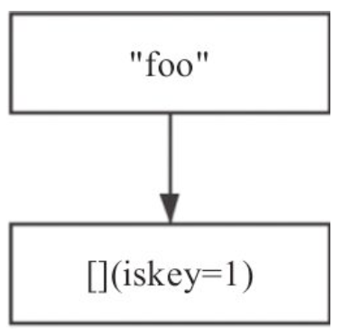

## Stream

Redis 在最新的 5.0.0 版本中加入了消息队列的功能，这就是Stream。

### 1. Stream 简介


Redis 中的消息，通过如下指令可以创建一个消息流并向其中加入一条消息：

```c
127.0.0.1:6379> xadd mystream1 * name hb age 20
"1594025716264-0"
```

-   mystream1 为Stream 的名称；
-   \* 代表由 Redis 自行生成消息ID；
-   name、age 为该消息的 field；
-   hb、20 则为对应的field的值。

 每个消息都由以下两部分组成。

1.  每个消息有唯一的消息 ID，消息 ID 严格递增。
2.  消息内容由多个 field-value 对组成。

生产者负责向消息队列中生产消息，消费者消费某个消息流。消费者可以归属某个消费组，也可以不归属任何消费组。当消费者不归属于任何消费组时，该消费者可以消费消息队列中的任何消息。

消费组是 Stream 的一个重要概念，具有以下特点。

1.  每个消费组通过组名称唯一标识，每个消费组都可以消费该消息队列的全部消息，多个消费组之间相互独立。
2.  每个消费组可以有多个消费者，消费者通过名称唯一标识，消费者之间的关系是竞争关系，也就是说一个消息只能由该组的一个成员消费。
3.  组内成员消费消息后需要确认，每个消息组都有一个待确认消息队列 (pending entry list，pel)，用以维护该消费组已经消费但没有确认的消息。
4.  消费组中的每个成员也有一个待确认消息队列，维护着该消费者已经消费尚未确认的消息。

 

Redis Stream 的底层实现主要使用了 listpack 以及 Rax 树。

#### 1.1 Stream底层结构listpack

Redis 源码对于 listpack 的解释为 A lists of strings serialization format，一个字符串列表的序列化格式，也就是将一个字符串列表进行序列化存储。Redis listpack 可用于存储字符串或者整型。下图为 listpack 的整体结构图。


listpack 由 4 部分组成：Total Bytes、Num Elem、Entry以及End。

1.  Total Bytes 为整个 listpack 的空间大小，占用 4 个字节，每个 listpack 最多占用 4294967295 Bytes。

2.  Num Elem 为 listpack 中的元素个数，即 Entry 的个数，占用 2 个字节，但是，这并不意味着 listpack 最多只能存放 65535 个 Entry，当 Entry 个数大于等于 65535 时，Num Elem 被设置为 65535，此时如果需要获取元素个数，需要遍历整个 listpack。

3.  End 为 listpack 结束标志，占用 1 个字节，内容为 0xFF。

4.  Entry 为每个具体的元素。

     

Entry 为 listpack 中的具体元素，其内容可以为字符串或者整型， 每个 Entry 由 3 部分组成，每部分的具体含义如下。

1.  Encode 为该元素的编码方式，占用 1 个字节，之后是内容字段 content，二者紧密相连。下图详细介绍了Encode字段。


2.  backlen 记录了这个 Entry 的长度 (Encode+content)，但并不包括 backlen自身的长度，占用的字节数小于等于 5。backlen 所占用的每个字节的第一个 bit 用于标识：0 代表结束，1 代表尚未结束， 每个字节只有 7 bit有效。值得一提的是，backlen 主要用于从后向前遍历，当我们需要找到当前元素的上一个元素时，我们可以从后向前依次查找每个字节，找到上一个 Entry 的 backlen 字段的结束标识，进而可以计算出上一个元素的长度。例如 backlen 为 0000000110001000，代表该元素的长度为 00000010001000， 即 136 字节。通过计算即可算出上一个元素的首地址 (entry 的首地址)。

<font color='red'>**注意：**</font>在整型存储中，并不实际存储负数，而是将负数转换为正数进行存储。例如，在 13 位整型存储中，存储范围为 [0,8191]，其中 [0,4095] 对应非负的 \[0,4095] (当然，[0,127] 将会采用 7 位无符号整型存储)，而 [4096,8191] 则对应 [-4096,-1]。

### 1.2 Stream 底层结构 Rax 简介

**1. 概要**

前缀树是字符串查找时，经常使用的一种数据结构，能够在一个字符串集合中快速查找到某个字符串。由于树中每个节点只存储字符串中的一个字符，故而有时会造成空间的浪费。Rax 的出现就是为了解决这一问题。Redis 对于Rax 的解释为 A radix tree implement，基数树的一种实现。Rax 中不仅可以存储字符串，同时还可以为这个字符串设置一个值，也就是 key- value。

Rax 树通过节点压缩节省空间，只有一个 key(foo) 的 Rax 树如下图所示，其中中括号代表非压缩节点，双引号代表压缩节点 (压缩节点，非压缩节点下文将详细介绍)，(iskey=1) 代表该节点存储了一个 key，如无特别说明，后续部分的图，也是如此。



在上述节点的基础上插入 key(foobar) 后，Rax 树结构如下图所示。


含有两个 key(foobar,footer) 的 Rax 树结构图如下图所示。


