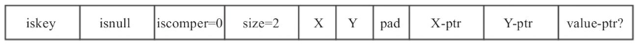

## Stream

Redis 在最新的 5.0.0 版本中加入了消息队列的功能，这就是Stream。

### 1. Stream 简介


Redis 中的消息，通过如下指令可以创建一个消息流并向其中加入一条消息：

```c
127.0.0.1:6379> xadd mystream1 * name hb age 20
"1594025716264-0"
```

-   mystream1 为Stream 的名称；
-   \* 代表由 Redis 自行生成消息ID；
-   name、age 为该消息的 field；
-   hb、20 则为对应的field的值。

 每个消息都由以下两部分组成。

1.  每个消息有唯一的消息 ID，消息 ID 严格递增。
2.  消息内容由多个 field-value 对组成。

生产者负责向消息队列中生产消息，消费者消费某个消息流。消费者可以归属某个消费组，也可以不归属任何消费组。当消费者不归属于任何消费组时，该消费者可以消费消息队列中的任何消息。

消费组是 Stream 的一个重要概念，具有以下特点。

1.  每个消费组通过组名称唯一标识，每个消费组都可以消费该消息队列的全部消息，多个消费组之间相互独立。
2.  每个消费组可以有多个消费者，消费者通过名称唯一标识，消费者之间的关系是竞争关系，也就是说一个消息只能由该组的一个成员消费。
3.  组内成员消费消息后需要确认，每个消息组都有一个待确认消息队列 (pending entry list，pel)，用以维护该消费组已经消费但没有确认的消息。
4.  消费组中的每个成员也有一个待确认消息队列，维护着该消费者已经消费尚未确认的消息。

 

Redis Stream 的底层实现主要使用了 listpack 以及 Rax 树。

#### 1.1 Stream底层结构listpack

Redis 源码对于 listpack 的解释为 A lists of strings serialization format，一个字符串列表的序列化格式，也就是将一个字符串列表进行序列化存储。Redis listpack 可用于存储字符串或者整型。下图为 listpack 的整体结构图。


listpack 由 4 部分组成：Total Bytes、Num Elem、Entry以及End。

1.  Total Bytes 为整个 listpack 的空间大小，占用 4 个字节，每个 listpack 最多占用 4294967295 Bytes。

2.  Num Elem 为 listpack 中的元素个数，即 Entry 的个数，占用 2 个字节，但是，这并不意味着 listpack 最多只能存放 65535 个 Entry，当 Entry 个数大于等于 65535 时，Num Elem 被设置为 65535，此时如果需要获取元素个数，需要遍历整个 listpack。

3.  End 为 listpack 结束标志，占用 1 个字节，内容为 0xFF。

4.  Entry 为每个具体的元素。

     

Entry 为 listpack 中的具体元素，其内容可以为字符串或者整型， 每个 Entry 由 3 部分组成，每部分的具体含义如下。

1.  Encode 为该元素的编码方式，占用 1 个字节，之后是内容字段 content，二者紧密相连。下图详细介绍了Encode字段。


2.  backlen 记录了这个 Entry 的长度 (Encode+content)，但并不包括 backlen自身的长度，占用的字节数小于等于 5。backlen 所占用的每个字节的第一个 bit 用于标识：0 代表结束，1 代表尚未结束， 每个字节只有 7 bit有效。值得一提的是，backlen 主要用于从后向前遍历，当我们需要找到当前元素的上一个元素时，我们可以从后向前依次查找每个字节，找到上一个 Entry 的 backlen 字段的结束标识，进而可以计算出上一个元素的长度。例如 backlen 为 0000000110001000，代表该元素的长度为 00000010001000， 即 136 字节。通过计算即可算出上一个元素的首地址 (entry 的首地址)。

<font color='red'>**注意：**</font>在整型存储中，并不实际存储负数，而是将负数转换为正数进行存储。例如，在 13 位整型存储中，存储范围为 [0,8191]，其中 [0,4095] 对应非负的 \[0,4095] (当然，[0,127] 将会采用 7 位无符号整型存储)，而 [4096,8191] 则对应 [-4096,-1]。

#### 1.2 Stream 底层结构 Rax 简介

**1. 概要**

前缀树是字符串查找时，经常使用的一种数据结构，能够在一个字符串集合中快速查找到某个字符串。由于树中每个节点只存储字符串中的一个字符，故而有时会造成空间的浪费。Rax 的出现就是为了解决这一问题。Redis 对于Rax 的解释为 A radix tree implement，基数树的一种实现。Rax 中不仅可以存储字符串，同时还可以为这个字符串设置一个值，也就是 key- value。

Rax 树通过节点压缩节省空间，只有一个 key(foo) 的 Rax 树如下图所示，其中中括号代表非压缩节点，双引号代表压缩节点 (压缩节点，非压缩节点下文将详细介绍)，(iskey=1) 代表该节点存储了一个 key，如无特别说明，后续部分的图，也是如此。


在上述节点的基础上插入 key(foobar) 后，Rax 树结构如下图所示。


含有两个 key(foobar,footer) 的 Rax 树结构图如下图所示。


<font color='red'>注意：</font>对于非压缩节点，其内部字符是按照字典序排序的，例如上述第二个节点，含有 2 个字符 b、t，二者是按照字典序排列的。

**2. 关键结构体介绍**

1.  rax 结构代表一个 Rax 树，它包含 3 个字段，指向头节点的指针，元素个数 (即 key 的个数) 以及节点个数。

```c
typedef struct rax {
    raxNode *head;
    uint64_t numele;
    uint64_t numnodes;
} rax;
```

2.  raxNode 代表 Rax 树中的一个节点，它的定义如下:

```c
typedef struct raxNode {
    uint32_t iskey:1;     /* Does this node contain a key? */
    uint32_t isnull:1;    /* Associated value is NULL (don't store it). */
    uint32_t iscompr:1;   /* Node is compressed. */
    uint32_t size:29;     /* Number of children, or compressed string len. */
    /* Data layout is as follows:
     *
     * If node is not compressed we have 'size' bytes, one for each children
     * character, and 'size' raxNode pointers, point to each child node.
     * Note how the character is not stored in the children but in the
     * edge of the parents:
     *
     * [header iscompr=0][abc][a-ptr][b-ptr][c-ptr](value-ptr?)
     *
     * if node is compressed (iscompr bit is 1) the node has 1 children.
     * In that case the 'size' bytes of the string stored immediately at
     * the start of the data section, represent a sequence of successive
     * nodes linked one after the other, for which only the last one in
     * the sequence is actually represented as a node, and pointed to by
     * the current compressed node.
     *
     * [header iscompr=1][xyz][z-ptr](value-ptr?)
     *
     * Both compressed and not compressed nodes can represent a key
     * with associated data in the radix tree at any level (not just terminal
     * nodes).
     *
     * If the node has an associated key (iskey=1) and is not NULL
     * (isnull=0), then after the raxNode pointers poiting to the
     * children, an additional value pointer is present (as you can see
     * in the representation above as "value-ptr" field).
     */
    unsigned char data[];
} raxNode;
```

-   iskey 表明当前节点是否包含一个 key，占用 1bit；
-   isnull 表明当前 key 对应的 value 是否为空，占用 1bit；
-   iscompr 表明当前节点是否为压缩节点，占用 1bit；
-   size 为压缩节点压缩的字符串长度或者非压缩节点的子节点个数，占用 29bit；
-   data 中包含填充字段，同时存储了当前节点包含的字符串以及子节点的指针、key 对应的 value 指针。

 

raxNode 分为 2 类，压缩节点和非压缩节点，下面分别进行介绍。

**1. 压缩节点**

假设该节点存储的内容为字符串 ABC，其结构下图所示。


-   iskey 为 1 且 isnull 为 0 时，value-ptr 存在，否则 value-ptr 不存在；
-   iscompr 为 1 代表当前节点是压缩节点，size 为 3 代表存储了 3 个字符；
-   紧随 size 的是该节点存储的字符串，根据字符串的长度确定是否需要填充字段 (填充必要的字节，使得后面的指针地址放到合适的位置上)；
-   由于是压缩字段，故而只有最后一个字符有子节点。

**2. 非压缩节点**

假设其内容为 XY，结构如下图所示。



与压缩节点的不同点在于，每个字符都有一个子节点，值得一提的是，字符个数小于 2 时，都是非压缩节点。为了实现 Rax 树的遍历， Redis 提供了 raxStack 及 raxIterator 两种结构。

1.  raxStack 结构用于存储从根节点到当前节点的路径，具体定义如下:

```c
/* Stack data structure used by raxLowWalk() in order to, optionally, return
 * a list of parent nodes to the caller. The nodes do not have a "parent"
 * field for space concerns, so we use the auxiliary stack when needed. */
#define RAX_STACK_STATIC_ITEMS 32
typedef struct raxStack {
    void **stack; /* Points to static_items or an heap allocated array. */
    size_t items, maxitems; /* Number of items contained and total space. */
    /* Up to RAXSTACK_STACK_ITEMS items we avoid to allocate on the heap
     * and use this static array of pointers instead. */
    void *static_items[RAX_STACK_STATIC_ITEMS];
    int oom; /* True if pushing into this stack failed for OOM at some point. */
} raxStack;
```

-   stack 用于记录路径，该指针可能指向 static_items (路径较短时) 或者堆空间内存；
-   items, maxitems 代表 stack 指向的空间的已用空间以及最大空间；
-   static_items 是一个数组，数组中的每个元素都是指针，用于存储路径；
-   oom 代表当前栈是否出现过内存溢出。

2.  raxIterator 用于遍历 Rax 树中所有的 key，该结构的定义如下: 

```c
typedef struct raxIterator {
    int flags;
    rax *rt;                /* Radix tree we are iterating. */
    unsigned char *key;     /* The current string. */
    void *data;             /* Data associated to this key. */
    size_t key_len;         /* Current key length. */
    size_t key_max;         /* Max key len the current key buffer can hold. */
    unsigned char key_static_string[RAX_ITER_STATIC_LEN];
    raxNode *node;          /* Current node. Only for unsafe iteration. */
    raxStack stack;         /* Stack used for unsafe iteration. */
    raxNodeCallback node_cb; /* Optional node callback. Normally set to NULL. */
} raxIterator;
```

-   flags 为当前迭代器标志位，目前有 3 种：
    -   RAX_ITER_JUST_SEEKED 代表当前迭代器指向的元素是刚刚搜索过的，当需要从迭代器中获取元素时，直接返回当前元素并清空该标志位即可；
    -   RAX_ITER_EOF 代表当前迭代器已经遍历到 rax 树的最后一个节点；
    -   RAX_ITER_SAFE 代表当前迭代器为安全迭代器，可以进行写操作。
-   rt 为当前迭代器对应的 rax；
-   key 存储了当前迭代器遍历到的 key，该指针指向 key_static_string 或者从堆中申请的内存；
-   data 指向当前 key 关联的 value 值；
-   key_len, key_max 为 key 指向的空间的已用空间以及最大空间；
-   key_static_string 为 key 的默认存储空间，当 key 比较大时，会使用堆空间内存；
-   node 为当前 key 所在的 raxNode；
-   stack 记录了从根节点到当前节点的路径，用于 raxNode 的向上遍历；
-   node_cb 为节点的回调函数，通常为空。

#### 1.3 Stream 结构

如下图所示，Redis Stream 的实现依赖于 Rax 结构以及 listpack 结构。从图中可以看出，每个消息流都包含一个 Rax 结构。以消息 ID 为 key、listpack 结构为 value 存储在 Rax 结构中。每个消息的具体信息存储在这个 listpack 中。

<font color='red'>注意：</font>

1.  每个 listpack 都有一个 master entry，该结构中存储了创建这个 listpack 时待插入消息的所有 field，这主要是考虑同一个消息流，消息内容通常具有相似性，如果后续消息的 field 与 master entry 内容相同，则不需要再存储其 field。

2.  每个 listpack 中可能存储多条消息。


**1. 消息存储**

1.  消息 ID

    streamID 定义如下，以每个消息创建时的时间 (1970年1月1号 至今的毫秒数) 以及序号组成，共 128 位。

```c
/* Stream item ID: a 128 bit number composed of a milliseconds time and
 * a sequence counter. IDs generated in the same millisecond (or in a past
 * millisecond if the clock jumped backward) will use the millisecond time
 * of the latest generated ID and an incremented sequence. */
typedef struct streamID {
    uint64_t ms;        /* Unix time in milliseconds. */
    uint64_t seq;       /* Sequence number. */
} streamID;
```

2.  消息存储格式

    Stream 的消息内容存储在 listpack 中，listpack 用于存储字符串或者整型数据，listpack 中的单个元素称为 entry，之后介绍的消息存储格式的每个字段都是一个 entry，并不是将整个消息作为字符串储存的。值得注意的是，每个 listpack 会存储多个消息，具体存储的消息个数是由 stream-node-max-bytes (listpack 节点最大占用的内存数，默认 4096) 和 stream-node-max-entries( 每个 listpack 最大存储的元素个数，默认100 )决定的。

    -   每个消息会占用多个 listpack entry。
    -   每个 listpack 会存储多个消息。
    -   每个 listpack 在创建时，会构造该节点的 master entry (根据第 一个插入的消息构建)，其结构如下图所示。


*   count 为当前 listpack 中的所有未删除的消息个数。
*   deleted 为当前 listpack 中所有已经删除的消息个数。
*   num-fields 为下面的 field 的个数。
*   field-1, …, filed-N 为当前 listpack 中第一个插入的消息的所有 field 域。
*   0 为标识位，在从后向前遍历该 listpack 的所有消息时使用。

上面的字段(count、deleted 等)都是 listpack 的一个元素，此处省略了 listpack 每个元素存储时的 encoding 以及 backlen 字段。存储一个消息时，如果该消息的 field 域与 master entry 的域完全相同，则不需要再次存储 field 域，此时其消息存储如下图所示。


-   flags 字段为消息标志位，STREAM_ITEM_FLAG_NONE 代表无特殊标识，STREAM_ITEM_FLAG_DELETED 代表该消息已经被删除，STREAM_ITEM_FLAG_SAMEFIELDS 代表该消息的 field 域与 master entry 完全相同。
-   streamID.ms 以及 streamID.seq 为该消息 ID 减去 master entry id 之后的值；
-   value 域存储了该消息的每个 field 域对应的内容；
-   lp-count 为该消息占用 listpack 的元素个数，也就是 3+N。

如果该消息的 field 域与 master entry 不完全相同，此时消息的存储如下图所示。


-   flags 为消息标志位，与上面一致；
-   streamID.ms，streamID.seq 为该消息 ID 减去 master entry id 之后的值；
-   num-fields 为该消息 field 域的个数；
-   field-value 存储了消息的域值对，也就是消息的具体内容；
-   lp-count 为该消息占用的 listpack 的元素个数，也就是 4+2N。

**2. 关键结构介绍**

1.  stream。stream 的结构如下所示:

```c
typedef struct stream {
    rax *rax;               /* The radix tree holding the stream. */
    uint64_t length;        /* Number of elements inside this stream. */
    streamID last_id;       /* Zero if there are yet no items. */
    rax *cgroups;           /* Consumer groups dictionary: name -> streamCG */
} stream;
```

-   rax 存储消息生产者生产的具体消息，每个消息有唯一的 ID。以消息 ID 为键，消息内容为值存储在 rax 中，rax中的一个节点可能存储多个消息；
-   length 代表当前 stream 中的消息个数 (不包括已经删除的消息)；
-   last_id 为当前 stream 中最后插入的消息的 ID，stream 为空时， 设置为 0；
-   cgroups 存储了当前 stream 相关的消费组，以消费组的组名为键，streamCG 为值存储在 rax 中，该结构下面会详细介绍。

2.  消费组。消费组是 Stream 中的一个重要概念，每个 Stream 会有多个消费组，每个消费组通过组名称进行唯一标识，同时关联一个 streamCG 结构，该结构定义如下：

```c
/* Consumer group. */
typedef struct streamCG {
    streamID last_id;       /* Last delivered (not acknowledged) ID for this
                               group. Consumers that will just ask for more
                               messages will served with IDs > than this. */
    rax *pel;               /* Pending entries list. This is a radix tree that
                               has every message delivered to consumers (without
                               the NOACK option) that was yet not acknowledged
                               as processed. The key of the radix tree is the
                               ID as a 64 bit big endian number, while the
                               associated value is a streamNACK structure.*/
    rax *consumers;         /* A radix tree representing the consumers by name
                               and their associated representation in the form
                               of streamConsumer structures. */
} streamCG;
```

-   last_id 为该消费组已经确认的最后一个消息的 ID；
-   pel 为该消费组尚未确认的消息，并以消息 ID 为键， streamNACK (代表一个尚未确认的消息)为值；
-   consumers 为该消费组中所有的消费者，并以消费者的名称为键，streamConsumer (代表一个消费者)为值。

3.  消费者。每个消费者通过 streamConsumer 唯一标识，该结构如下：

```c
/* A specific consumer in a consumer group.  */
typedef struct streamConsumer {
    mstime_t seen_time;         /* Last time this consumer was active. */
    sds name;                   /* Consumer name. This is how the consumer
                                   will be identified in the consumer group
                                   protocol. Case sensitive. */
    rax *pel;                   /* Consumer specific pending entries list: all
                                   the pending messages delivered to this
                                   consumer not yet acknowledged. Keys are
                                   big endian message IDs, while values are
                                   the same streamNACK structure referenced
                                   in the "pel" of the conumser group structure
                                   itself, so the value is shared. */
} streamConsumer;
```

-   seen_time 为该消费者最后一次活跃的时间；
-   name 为消费者的名称；
-   pel 为该消费者尚未确认的消息，以消息 ID 为键，streamNACK 为值。

4.  未确认消息。未确认消息 (streamNACK) 维护了消费组或者消费者尚未确认的消息，值得注意的是，消费组中的 pel 的元素与每个消费者的 pel 中的元素是共享的，即该消费组消费了某个消息，这个消息会同时放到消费组以及该消费者的 pel 队列中，并且二者是同一个 streamNACK 结构。

```c
/* Pending (yet not acknowledged) message in a consumer group. */
typedef struct streamNACK {
    mstime_t delivery_time;     /* Last time this message was delivered. */
    uint64_t delivery_count;    /* Number of times this message was delivered.*/
    streamConsumer *consumer;   /* The consumer this message was delivered to
                                   in the last delivery. */
} streamNACK;
```

-   delivery_time 为该消息最后发送给消费方的时间；
-   delivery_count 为该消息已经发送的次数 (组内的成员可以通过 xclaim 命令获取某个消息的处理权，该消息已经分给组内另一个消费者但其并没有确认该消息)；
-   consumer 为该消息当前归属的消费者。

5.  迭代器。为了遍历 stream 中的消息，Redis 提供了 streamIterator 结构：

```c
/* We define an iterator to iterate stream items in an abstract way, without
 * caring about the radix tree + listpack representation. Technically speaking
 * the iterator is only used inside streamReplyWithRange(), so could just
 * be implemented inside the function, but practically there is the AOF
 * rewriting code that also needs to iterate the stream to emit the XADD
 * commands. */
typedef struct streamIterator {
    stream *stream;         /* The stream we are iterating. */
    streamID master_id;     /* ID of the master entry at listpack head. */
    uint64_t master_fields_count;       /* Master entries # of fields. */
    unsigned char *master_fields_start; /* Master entries start in listpack. */
    unsigned char *master_fields_ptr;   /* Master field to emit next. */
    int entry_flags;                    /* Flags of entry we are emitting. */
    int rev;                /* True if iterating end to start (reverse). */
    uint64_t start_key[2];  /* Start key as 128 bit big endian. */
    uint64_t end_key[2];    /* End key as 128 bit big endian. */
    raxIterator ri;         /* Rax iterator. */
    unsigned char *lp;      /* Current listpack. */
    unsigned char *lp_ele;  /* Current listpack cursor. */
    unsigned char *lp_flags; /* Current entry flags pointer. */
    /* Buffers used to hold the string of lpGet() when the element is
     * integer encoded, so that there is no string representation of the
     * element inside the listpack itself. */
    unsigned char field_buf[LP_INTBUF_SIZE];
    unsigned char value_buf[LP_INTBUF_SIZE];
} streamIterator;
```

-   stream 为当前迭代器正在遍历的消息流；
-   消息内容实际存储在 listpack 中，每个 listpack 都有一个 master entry (也就是第一个插入的消息)， master_id 为该消息 id；
-   master_fields_count 为 master entry 中 field 域的个数；
-   master_fields_start 为 master entry field 域存储的首地址；
-   当 listpack 中消息的 field 域与 master entry 的 field 域完全相同时，该消息会复用 master entry 的 field 域，在我们遍历该消息时，需要记录当前所在的 field 域的具体位置，master_fields_ptr 就是实现这个功能的；
-   entry_flags 为当前遍历的消息的标志位；
-   rev 代表当前迭代器的方向；
-   start_key, end_key 为该迭代器处理的消息 ID 的范围；
-   ri 为 rax 迭代器，用于遍历 rax 中所有的 key；
-   lp 为当前 listpack 指针；
-   lp_ele 为当前正在遍历的 listpack 中的元；
-   lp_flags 指向当前消息的 flag 域；
-   field_buf, value_buf 用于从 listpack 读取数据时的缓存。

### 2. Stream底层结构listpack的实现

listpack 是 Stream 用于存储消息内容的结构。

#### 2.1 初始化

listpack 的初始化较为简单，如下图所示：


listpack 的初始化函数如下：

```c
/* Create a new, empty listpack.
 * On success the new listpack is returned, otherwise an error is returned. */
unsigned char *lpNew(void) {
    unsigned char *lp = lp_malloc(LP_HDR_SIZE+1);
    if (lp == NULL) return NULL;
    lpSetTotalBytes(lp,LP_HDR_SIZE+1);
    lpSetNumElements(lp,0);
    lp[LP_HDR_SIZE] = LP_EOF;
    return lp;
}
```

#### 2.2 增删改操作

listpack 提供了 2 种添加元素的方式：一种是在任意位置插入元素，一种是在末尾插入元素。在末尾插入元素的底层实现通过调用任意位置插入元素进行，具体实现为 lpInsert 函数。

listpack 的删除操作被转换为用空元素替换的操作。 listpack 的替换操作 (即改操作) 的底层实现也是通过 lpInsrt 函数实现的。 该函数的定义如下：

```c
/* Insert, delete or replace the specified element 'ele' of length 'len' at
 * the specified position 'p', with 'p' being a listpack element pointer
 * obtained with lpFirst(), lpLast(), lpIndex(), lpNext(), lpPrev() or
 * lpSeek().
 *
 * The element is inserted before, after, or replaces the element pointed
 * by 'p' depending on the 'where' argument, that can be LP_BEFORE, LP_AFTER
 * or LP_REPLACE.
 *
 * If 'ele' is set to NULL, the function removes the element pointed by 'p'
 * instead of inserting one.
 *
 * Returns NULL on out of memory or when the listpack total length would exceed
 * the max allowed size of 2^32-1, otherwise the new pointer to the listpack
 * holding the new element is returned (and the old pointer passed is no longer
 * considered valid)
 *
 * If 'newp' is not NULL, at the end of a successful call '*newp' will be set
 * to the address of the element just added, so that it will be possible to
 * continue an interation with lpNext() and lpPrev().
 *
 * For deletion operations ('ele' set to NULL) 'newp' is set to the next
 * element, on the right of the deleted one, or to NULL if the deleted element
 * was the last one. */
unsigned char *lpInsert(unsigned char *lp, unsigned char *ele, uint32_t size, unsigned char *p, int where, unsigned char **newp) {
    unsigned char intenc[LP_MAX_INT_ENCODING_LEN];
    unsigned char backlen[LP_MAX_BACKLEN_SIZE];

    uint64_t enclen; /* The length of the encoded element. */

    /* An element pointer set to NULL means deletion, which is conceptually
     * replacing the element with a zero-length element. So whatever we
     * get passed as 'where', set it to LP_REPLACE. */
    if (ele == NULL) where = LP_REPLACE;

    /* If we need to insert after the current element, we just jump to the
     * next element (that could be the EOF one) and handle the case of
     * inserting before. So the function will actually deal with just two
     * cases: LP_BEFORE and LP_REPLACE. */
    if (where == LP_AFTER) {
        p = lpSkip(p);
        where = LP_BEFORE;
    }

    /* Store the offset of the element 'p', so that we can obtain its
     * address again after a reallocation. */
    unsigned long poff = p-lp;

    /* Calling lpEncodeGetType() results into the encoded version of the
     * element to be stored into 'intenc' in case it is representable as
     * an integer: in that case, the function returns LP_ENCODING_INT.
     * Otherwise if LP_ENCODING_STR is returned, we'll have to call
     * lpEncodeString() to actually write the encoded string on place later.
     *
     * Whatever the returned encoding is, 'enclen' is populated with the
     * length of the encoded element. */
    int enctype;
    if (ele) {
        enctype = lpEncodeGetType(ele,size,intenc,&enclen);
    } else {
        enctype = -1;
        enclen = 0;
    }

    /* We need to also encode the backward-parsable length of the element
     * and append it to the end: this allows to traverse the listpack from
     * the end to the start. */
    unsigned long backlen_size = ele ? lpEncodeBacklen(backlen,enclen) : 0;
    uint64_t old_listpack_bytes = lpGetTotalBytes(lp);
    uint32_t replaced_len  = 0;
    if (where == LP_REPLACE) {
        replaced_len = lpCurrentEncodedSize(p);
        replaced_len += lpEncodeBacklen(NULL,replaced_len);
    }

    uint64_t new_listpack_bytes = old_listpack_bytes + enclen + backlen_size
                                  - replaced_len;
    if (new_listpack_bytes > UINT32_MAX) return NULL;

    /* We now need to reallocate in order to make space or shrink the
     * allocation (in case 'when' value is LP_REPLACE and the new element is
     * smaller). However we do that before memmoving the memory to
     * make room for the new element if the final allocation will get
     * larger, or we do it after if the final allocation will get smaller. */

    unsigned char *dst = lp + poff; /* May be updated after reallocation. */

    /* Realloc before: we need more room. */
    if (new_listpack_bytes > old_listpack_bytes) {
        if ((lp = lp_realloc(lp,new_listpack_bytes)) == NULL) return NULL;
        dst = lp + poff;
    }

    /* Setup the listpack relocating the elements to make the exact room
     * we need to store the new one. */
    if (where == LP_BEFORE) {
        memmove(dst+enclen+backlen_size,dst,old_listpack_bytes-poff);
    } else { /* LP_REPLACE. */
        long lendiff = (enclen+backlen_size)-replaced_len;
        memmove(dst+replaced_len+lendiff,
                dst+replaced_len,
                old_listpack_bytes-poff-replaced_len);
    }

    /* Realloc after: we need to free space. */
    if (new_listpack_bytes < old_listpack_bytes) {
        if ((lp = lp_realloc(lp,new_listpack_bytes)) == NULL) return NULL;
        dst = lp + poff;
    }

    /* Store the entry. */
    if (newp) {
        *newp = dst;
        /* In case of deletion, set 'newp' to NULL if the next element is
         * the EOF element. */
        if (!ele && dst[0] == LP_EOF) *newp = NULL;
    }
    if (ele) {
        if (enctype == LP_ENCODING_INT) {
            memcpy(dst,intenc,enclen);
        } else {
            lpEncodeString(dst,ele,size);
        }
        dst += enclen;
        memcpy(dst,backlen,backlen_size);
        dst += backlen_size;
    }

    /* Update header. */
    if (where != LP_REPLACE || ele == NULL) {
        uint32_t num_elements = lpGetNumElements(lp);
        if (num_elements != LP_HDR_NUMELE_UNKNOWN) {
            if (ele)
                lpSetNumElements(lp,num_elements+1);
            else
                lpSetNumElements(lp,num_elements-1);
        }
    }
    lpSetTotalBytes(lp,new_listpack_bytes);

    return lp;
}
```

-   lp 为当前待操作的 listpack；
-   ele 为待插入的新元素或者待替换的新元素，ele 为空时，也就是删除操作；
-   size 为 ele 的长度;
-   p 为待插入的位置或者带替换的元素位置；
-   where 有 LP_BEFORE (前插)、LP_AFTER (后插)、 LP_REPLACE (替换)；
-   *newp 用于返回插入的元素、替换的元素、删除元素的下一个元素。

该函数返回 null 或者插入的元素，替换的元素，删除元素的下一个元素。删除或者替换的主要过程如下：

1.  计算需要插入的新元素或者替换旧元素的新元素需要的空间；
2.  计算进行插入或者替换后整个 listpack 所需的空间，通过 realloc 申请空间；
3.  调整新的 listpack 中的老的元素的位置，为待操作元素预留空间；
4.  释放旧的 listpack；
5.  在新的 listpack 中进行插入或替换的操作；
6.  更新新的 listpack 结构头部的统计信息。

 

### 3. Stream底层结构 Rax 的实现

#### 3.1 初始化

Rax 的初始化过程如下：

```c
/* Allocate a new rax and return its pointer. On out of memory the function
 * returns NULL. */
rax *raxNew(void) {
    rax *rax = rax_malloc(sizeof(*rax));
    if (rax == NULL) return NULL;
    rax->numele = 0;
    rax->numnodes = 1;
    rax->head = raxNewNode(0,0);
    if (rax->head == NULL) {
        rax_free(rax);
        return NULL;
    } else {
        return rax;
    }
}
```

初始化完成后，Rax 结构如下图所示。


#### 3.2 查找元素

rax 提供了查找 key 的接口 raxFind，该接口用于获取 key 对应的 value 值，其定义如下所示：

```c
/* Find a key in the rax, returns raxNotFound special void pointer value
 * if the item was not found, otherwise the value associated with the
 * item is returned. */
void *raxFind(rax *rax, unsigned char *s, size_t len) {
    raxNode *h;

    debugf("### Lookup: %.*s\n", (int)len, s);
    int splitpos = 0;
    size_t i = raxLowWalk(rax,s,len,&h,NULL,&splitpos,NULL);
    if (i != len || (h->iscompr && splitpos != 0) || !h->iskey)
        return raxNotFound;
    return raxGetData(h);
}
```

可以看出，raxLowWalk 为查找 key 的核心函数，其代码实现如下：

```c
/* Low level function that walks the tree looking for the string
 * 's' of 'len' bytes. The function returns the number of characters
 * of the key that was possible to process: if the returned integer
 * is the same as 'len', then it means that the node corresponding to the
 * string was found (however it may not be a key in case the node->iskey is
 * zero or if simply we stopped in the middle of a compressed node, so that
 * 'splitpos' is non zero).
 *
 * Otherwise if the returned integer is not the same as 'len', there was an
 * early stop during the tree walk because of a character mismatch.
 *
 * The node where the search ended (because the full string was processed
 * or because there was an early stop) is returned by reference as
 * '*stopnode' if the passed pointer is not NULL. This node link in the
 * parent's node is returned as '*plink' if not NULL. Finally, if the
 * search stopped in a compressed node, '*splitpos' returns the index
 * inside the compressed node where the search ended. This is useful to
 * know where to split the node for insertion.
 *
 * Note that when we stop in the middle of a compressed node with
 * a perfect match, this function will return a length equal to the
 * 'len' argument (all the key matched), and will return a *splitpos which is
 * always positive (that will represent the index of the character immediately
 * *after* the last match in the current compressed node).
 *
 * When instead we stop at a compressed node and *splitpos is zero, it
 * means that the current node represents the key (that is, none of the
 * compressed node characters are needed to represent the key, just all
 * its parents nodes). */
static inline size_t raxLowWalk(rax *rax, unsigned char *s, size_t len, raxNode **stopnode, raxNode ***plink, int *splitpos, raxStack *ts) {
    raxNode *h = rax->head;
    raxNode **parentlink = &rax->head;

    size_t i = 0; /* Position in the string. */
    size_t j = 0; /* Position in the node children (or bytes if compressed).*/
    while(h->size && i < len) {
        debugnode("Lookup current node",h);
        unsigned char *v = h->data;

        if (h->iscompr) {
            for (j = 0; j < h->size && i < len; j++, i++) {
                if (v[j] != s[i]) break;
            }
            if (j != h->size) break;
        } else {
            /* Even when h->size is large, linear scan provides good
             * performances compared to other approaches that are in theory
             * more sounding, like performing a binary search. */
            for (j = 0; j < h->size; j++) {
                if (v[j] == s[i]) break;
            }
            if (j == h->size) break;
            i++;
        }

        if (ts) raxStackPush(ts,h); /* Save stack of parent nodes. */
        raxNode **children = raxNodeFirstChildPtr(h);
        if (h->iscompr) j = 0; /* Compressed node only child is at index 0. */
        memcpy(&h,children+j,sizeof(h));
        parentlink = children+j;
        j = 0; /* If the new node is compressed and we do not
                  iterate again (since i == l) set the split
                  position to 0 to signal this node represents
                  the searched key. */
    }
    debugnode("Lookup stop node is",h);
    if (stopnode) *stopnode = h;
    if (plink) *plink = parentlink;
    if (splitpos && h->iscompr) *splitpos = j;
    return i;
}
```

-   rax 为待查找的 Rax；

-   s 为待查找的 key；

-   len 为 s 的长度；

-   *stopnode 为查找过程中的终止节点，也就意味着，当 rax 查找到该节点时，待查找的 key 已经匹配完成，或者当前节点无法与带查找的 key 匹配；

    

-   \*plink 用于记录父节点中指向 \*stopnode 的指针的位置，当 \*stopnode 变化时，也需要修改父节点指向该节点的指针；

-   \*splitpos 用于记录压缩节点的匹配位置；

-   当 ts 不为空时，会将查找该 key 的路径写入该变量。

该函数返回 s 的匹配长度，当 s!=len 时，表示未查找到该 key； 当 s==len 时，需要检验 \*stopnode 是否为 key，并且当 \*stopnode 为压缩节点时，还需要检查 splitpos 是否为 0(可能匹配到某个压缩节点中间的某个元素)。该函数的执行过程可以分为如下几步：

1.  初始化变量；
2.  从 rax 根节点开始查找，知道当前待查找节点无子节点或者 s 查找完毕。对于每个节点来说，如果为压缩节点，则需要与 s 中的字符完全匹配。如果为非压缩节点，则查找与当前待匹配字符相同的字符；
3.  如果当前待匹配节点能够与 s 匹配，则移动位置到其子节点，继续匹配。

#### 3.3 添加元素

用户可以向 rax 中插入 key-value 对，对于已存在的 key，rax 提供了 2 种方案，覆盖或者不覆盖原有的 value，对应的接口分别为 raxInsert、raxTryInsert，两个接口的定义如下:

```c
/* Overwriting insert. Just a wrapper for raxGenericInsert() that will
 * update the element if there is already one for the same key. */
int raxInsert(rax *rax, unsigned char *s, size_t len, void *data, void **old) {
    return raxGenericInsert(rax,s,len,data,old,1);
}

/* Non overwriting insert function: this if an element with the same key
 * exists, the value is not updated and the function returns 0.
 * This is a just a wrapper for raxGenericInsert(). */
int raxTryInsert(rax *rax, unsigned char *s, size_t len, void *data, void **old) {
    return raxGenericInsert(rax,s,len,data,old,0);
}
```

真正实现函数 raxGenericInsert，该函数定义如下：

```c

```

