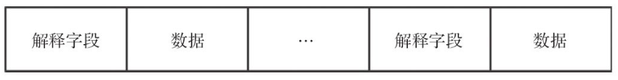
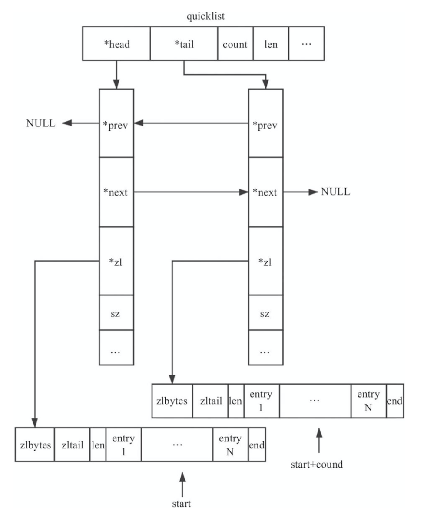

## quicklist

### 1. 简介

Redis 中对 quciklist 的注释为 A doubly linked list of ziplists。顾名思义，quicklist 是一个双向链表，链表中的每个节点是一个 ziplist 结构。quicklist 可以看成是用双向链表将若干小型的 ziplist 连接到一起组成的一种数据结构。当 ziplist 节点个数 过多，quicklist 退化为双向链表，一个极端的情况就是每个 ziplist 节点只包含一个 entry，即只有一个元素。当 ziplist 元素个数过少时， quicklist 可退化为 ziplist，一种极端的情况就是 quicklist 中只有一个 ziplist 节点。

### 2. 数据存储

quicklist 是一个由 ziplist 充当节点的双向链表。结构代码如下：

```c
/* quicklist is a 40 byte struct (on 64-bit systems) describing a quicklist.
 * 'count' is the number of total entries.
 * 'len' is the number of quicklist nodes.
 * 'compress' is: -1 if compression disabled, otherwise it's the number
 *                of quicklistNodes to leave uncompressed at ends of quicklist.
 * 'fill' is the user-requested (or default) fill factor. */
typedef struct quicklist {
    quicklistNode *head;
    quicklistNode *tail;
    unsigned long count;        /* total count of all entries in all ziplists */
    unsigned long len;          /* number of quicklistNodes */
    int fill : 16;              /* fill factor for individual nodes */
    unsigned int compress : 16; /* depth of end nodes not to compress;0=off */
} quicklist;
```

quicklist 的存储结构如下图所示：


-   其中 head、tail 指向 quicklist 的首尾节点；
-   count 为 quicklist 中元素总数；
-   len 为 quicklistNode(节点)个数;
-   fill 用来指明每个 quicklistNode 中 ziplist 长度，当 fill 为正数时，表明每个 ziplist 最多含有的数据项数，当fill 为负数时，含义如下图所示。


fill 取负数时，必须大于等于 -5。我们可以通过 Redis 修改参数 list-max-ziplist-size 配置节点所占内存大小。实际 上每个 ziplist 节点所占的内存会在该值下浮动；考虑 quicklistNode 节点个数较多时，我们经常访问的是两端的数据，为了进一步节省空间，Redis允许对中间的 quicklistNode 节点进行压缩，通过修改参数 list-compress-depth 进行配置，即设置 compress 参数，该项的具体含义是两端各有 compress 个节点不压缩，当 compress 为 1 时， quicklistNode 个数为 3 时，其结构图如下图所示。


quicklistNode 是 quicklist 中的一个节点，其结构如下：

```c
/* quicklistNode is a 32 byte struct describing a ziplist for a quicklist.
 * We use bit fields keep the quicklistNode at 32 bytes.
 * count: 16 bits, max 65536 (max zl bytes is 65k, so max count actually < 32k).
 * encoding: 2 bits, RAW=1, LZF=2.
 * container: 2 bits, NONE=1, ZIPLIST=2.
 * recompress: 1 bit, bool, true if node is temporarry decompressed for usage.
 * attempted_compress: 1 bit, boolean, used for verifying during testing.
 * extra: 10 bits, free for future use; pads out the remainder of 32 bits */
typedef struct quicklistNode {
    struct quicklistNode *prev;
    struct quicklistNode *next;
    unsigned char *zl;
    unsigned int sz;             /* ziplist size in bytes */
    unsigned int count : 16;     /* count of items in ziplist */
    unsigned int encoding : 2;   /* RAW==1 or LZF==2 */
    unsigned int container : 2;  /* NONE==1 or ZIPLIST==2 */
    unsigned int recompress : 1; /* was this node previous compressed? */
    unsigned int attempted_compress : 1; /* node can't compress; too small */
    unsigned int extra : 10; /* more bits to steal for future usage */
} quicklistNode;
```

-   prev、next 指向该节点的前后节点；
-   zl 指向该节点对应的 ziplist 结构；
-   sz 代表整个 ziplist 结构的大小；
-   encoding 代表采用的编码方式：1 代表是原生的，2 代表使用 LZF 进行压缩；
-   container 为 quicklistNode 节点 zl 指向的容器类型：1 代表 none，2 代表使用 ziplist 存储数据；
-   recompress 代表这个节点之前是否是压缩节点，若是，则在使用压缩节点前先进行解压缩，使用后需要重新压缩，此外为 1，代表是压缩节点；
-   attempted_compress 测试时使用；
-   extra 为预留。

当我们对 ziplist 利用 LZF 算法进行压缩时，quicklistNode 节点指向的结构为 quicklistLZF。quicklistLZF 结构下所示，其中 sz 表示 compressed 所占字节大小。

```c
/* quicklistLZF is a 4+N byte struct holding 'sz' followed by 'compressed'.
 * 'sz' is byte length of 'compressed' field.
 * 'compressed' is LZF data with total (compressed) length 'sz'
 * NOTE: uncompressed length is stored in quicklistNode->sz.
 * When quicklistNode->zl is compressed, node->zl points to a quicklistLZF */
typedef struct quicklistLZF {
    unsigned int sz; /* LZF size in bytes*/
    char compressed[];
} quicklistLZF;
```

当我们使用 quicklistNode 中 ziplist 中的一个节点时，Redis 提供了 quicklistEntry 结构以便于使用，该结构如下:

```c
typedef struct quicklistEntry {
    const quicklist *quicklist;
    quicklistNode *node;
    unsigned char *zi;
    unsigned char *value;
    long long longval;
    unsigned int sz;
    int offset;
} quicklistEntry;
```

-   quicklist 指向当前元素所在的 quicklist；
-   node 指向当前元素所在的 quicklistNode 结构；
-   zi 指向当前元素所在的 ziplist；
-   value 指向该节点的字符串内容；
-   longval 为该节点的整型值；
-   sz 代表该节点的大小，与 value 配合使用；
-   offset 表明该节点相对于整个 ziplist 的偏移量，即该节点是 ziplist 第多少个 entry。

quicklistIter 是 quicklist 中用于遍历的迭代器，结构如下:

```c
typedef struct quicklistIter {
    const quicklist *quicklist;
    quicklistNode *current;
    unsigned char *zi;
    long offset; /* offset in current ziplist */
    int direction;
} quicklistIter;
```

-   quicklist 指向当前元素所处的 quicklist；
-   current 指向元素所在 quicklistNode；
-   zi 指向元素所在的 ziplist；
-   offset 表明节点在所在的 ziplist 中的偏移量；
-   direction 表明迭代器的方向。

### 3. 数据压缩

quicklist 每个节点的实际数据存储结构为 ziplist，这种结构的主要优势在于节省存储空间。为了进一步降低 ziplist 所占用的空间， Redis 允许对 ziplist 进一步压缩，Redis 采用的压缩算法是 LZF，压缩过后的数据可以分成多个片段，每个片段有 2 部分：一部分是解释字段，另一部分是存放具体的数据字段。解释字段可以占用 1~3 个字节，数据字段可能不存在。结构如下图所示。



具体而言，LZF 压缩的数据格式有 3 种，即解释字段有 3 种。

1.  字面型，解释字段占用 1 个字节，数据字段长度由解释字段后 5 位决定。示例如下图所示，图中 L 是数据长度字段，数据长度是长度字段组成的字面值加 1。

    

2.  简短重复型，解释字段占用 2 个字节，没有数据字段，数据内容与前面数据内容重复，重复长度小于 8，示例如下图所示，图中 L 是长度字段，数据长度为长度字段的字面值加 2，o 是偏移量字段，位置偏移量是偏移字段组成的字面值加 1。

    

3.  批量重复型，解释字段占 3 个字节，没有数据字段，数据内容与前面内容重复。示例如下图所示，图中 L 是长度字段，数据长度为长度字段的字面值加 9，o 是偏移量字段，位置偏移量是偏移字段组成的字面值加 1。

    

#### 3.1 压缩

LZF 数据压缩的基本思想是：数据与前面重复的，记录重复位置以及重复长度，否则直接记录原始数据内容。

压缩算法的流程如下：遍历输入字符串，对当前字符及其后面 2 个字符进行散列运算，如果在 Hash 表中找到曾经出现的记录，则计算重复字节的长度以及位置，反之直接输出数据。下面给出了 LZF 源码的核心部分。

```c
	#define IDX(h) (((h >> 8) - h＊5) & ((1 << 16) -1))
    //in_data, in_len待压缩数据以及长度；out_data, out_len压缩后数据及长度
    unsigned int lzf_compress (const void ＊const in_data, unsigned int in_len,
            void ＊out_data, unsigned int out_len)
    {
        //htab用于散列运算，进而获取上次重复点的位置
        int htab[1 << 16] = {0};
        unsigned int hval = ((ip[0] << 8) | ip[1]);

       while (ip < in_end -2)
        {
            //计算该元素以及其后面2个元素的Hash值，计算在Hash表中的位置
            hval = ((hval << 8) | ip[2]);
            unsigned int ＊hslot = htab + IDX (hval);
            ref = ＊hslot;
            if (...){ //之前出现过
                //统计重复长度，ip为输入数据当前处理位置指针，ref为数据之前出现的位置
                do
                    len++;
                while (len < maxlen && ref[len] == ip[len]);

               //将重复长度，重复位置的偏移量写入，op为当前输出位置指针，off为偏移位置，len为重复长度
                if (len < 7) ＊op++ = (off >> 8) + (len << 5);
                else{
                    ＊op++ = (off >> 8) + (7 << 5);
                    ＊op++ = len -7;
                }
            //更新Hash表
            }else{
            //直接输出当前字符
            }
          }
        //将剩余数据写入输出数组，返回压缩后的数据长度
    }
```

#### 3.2 解压缩

根据 LZF 压缩后的数据格式，我们可以较为容易地实现 LZF 的解压缩。值得注意的是，可能存在重复数据与当前位置重叠的情况，例如在当前位置前的 15 个字节处，重复了 20 个字节，此时需要按位逐个复制。源码实现的核心部分如下:

```c
	unsigned int
    lzf_decompress (const void ＊const in_data,   unsigned int in_len,
                    void ＊out_data, unsigned int out_len)
    {
        do{//ip指向当前待处理的输入数据
            unsigned int ctrl = ＊ip++;
            if (ctrl < (1 << 5)){
                ctrl++;
                //直接读取后面的数据
            }else {
                //计算重复的位置和长度，len为重复长度，ref为重复位置，op指向当前的输出位置
                ...
                switch (len)
                {
                    default:
                        len += 2;
                        if (op >= ref + len){
                              //直接复制重复的数据
                              memcpy (op, ref, len);
                              op += len;
                        }
                        else{
                              //重复数据与当前位置产生重叠，按字节顺序复制
                              do
                                  ＊op++ = ＊ref++;
                              while (--len);
                        }
                    break;
                    case 9: ＊op++=＊ref++;
                    ...
                }
            }
        }while (ip < in_end);
    }
```

### 4. 基本操作

#### 4.1 初始化

初始化是构建 quicklist 结构的第一步，由 quicklistCreate 函数完成，该函数的主要功能就是初始化 quicklist 结构。默认初始化的 quicklist 结构如下图所示。


quicklist 的初始化代码如下:

```c
/* Create a new quicklist.
 * Free with quicklistRelease(). */
quicklist *quicklistCreate(void) {
    struct quicklist *quicklist;

    quicklist = zmalloc(sizeof(*quicklist));
    quicklist->head = quicklist->tail = NULL;
    quicklist->len = 0;
    quicklist->count = 0;
    quicklist->compress = 0;
    quicklist->fill = -2;
    return quicklist;
}
```

从初始化部分可以看出，Redis 默认 quicklistNode 每个 ziplist 的大小限制是 8KB，并且不对节点进行压缩。在初始化完成后，也可以设置其属性，接口有:

```c
void quicklistSetCompressDepth(quicklist *quicklist, int depth); 
void quicklistSetFill(quicklist *quicklist, int fill);
void quicklistSetOptions(quicklist *quicklist, int fill, int depth);
```

除了上述的默认初始化方法外，还可以在初始化时设置 quicklist 的属性。相关接口的定义如下:

```c
quicklist *quicklistNew(int fill, int compress);
// 根据fill, compress 先构造新的 quicklist, 之后将 zl 添加进去
quicklist *quicklistCreateFromZiplist(int fill, int compress, unsigned char *zl);
```

#### 4.2 添加元素

quicklist 提供了 push 操作， 对外接口为 quicklistPush，可以在头部或者尾部进行插入，具体的操作函数为quicklistPushHead 与 quicklistPushTail。两者的思路基本一致，下面针对 quicklistPushHead 进行分析。

quicklistPushHead 的基本思路是：查看 quicklist 原有的 head 节点是否可以插入，如果可以就直接利用 ziplist 的接口进行插入，否则新建 quicklistNode 节点进行插入。函数的入参为待插入的 quicklist，需要插入的数据 value 及其大小 sz；函数返回值代表是否新建了 head 节点，0 代表没有新建，1 代表新建了 head。

```c
/* Add new entry to head node of quicklist.
 *
 * Returns 0 if used existing head.
 * Returns 1 if new head created. */
int quicklistPushHead(quicklist *quicklist, void *value, size_t sz) {
    quicklistNode *orig_head = quicklist->head;
    if (likely(
            _quicklistNodeAllowInsert(quicklist->head, quicklist->fill, sz))) {
        quicklist->head->zl =
            ziplistPush(quicklist->head->zl, value, sz, ZIPLIST_HEAD);
        quicklistNodeUpdateSz(quicklist->head);
    } else {
        quicklistNode *node = quicklistCreateNode();
        node->zl = ziplistPush(ziplistNew(), value, sz, ZIPLIST_HEAD);

        quicklistNodeUpdateSz(node);
        _quicklistInsertNodeBefore(quicklist, quicklist->head, node);
    }
    quicklist->count++;
    quicklist->head->count++;
    return (orig_head != quicklist->head);
}
```

\_\_quicklistNodeAllowInsert 用来判断 quicklist 的某个 quicklistNode 节点是否允许继续插入。\_\_quicklistInsertNodeBefore 用于在 quicklist 的某个节点之前插入新的 quicklistNode 节点。值得注意的是，当 ziplist 已经包含节点时，在 ziplist 头部插入数据可能导致 ziplist 的连锁更新。

除了 push 操作外，quicklist 还提供了在任意位置插入的方法。对外接口为 quicklistInsertBefore 与 quicklistInsertAfter，二者的底层实现都是 \__quicklistInsert。quicklist 的一般插入操作如下图所示。


对于 quicklist 的一般插入可以分为可以继续插入和不能继续插入。

1.  当前插入位置所在的 quicklistNode 仍然可以继续插入，此时可以直接插入。
2.  当前插入位置所在的 quicklistNode 不能继续插入，此时可以分为如下几种情况。
    1.  需要向当前 quicklistNode 第一个元素 (entry1) 前面插入元素，当前 ziplist 所在的 quicklistNode 的前一个 quicklistNode 可以插入，则将数据插入到前一个 quicklistNode。如果前一个 quicklistNode 不能插入 (不包含前一个节点为空的情况)，则新建一个 quicklistNode 插入到当前 quicklistNode 前面。
    2.  需要向当前 quicklistNode 的最后一个元素 (entryN) 后面插入元素，当前 ziplist 所在的 quicklistNode 的后一个 quicklistNode 可以插入，则直接将数据插入到后一个 quicklistNode。如果后一个 quicklistNode 不能插入 (不包含为后一个节点为空的情况)，则新建一个 quicklistNode 插入到当前 quicklistNode 的后面。
    3.  不满足前面 2 个条件的所有其他种情况，将当前所在的 quicklistNode 以当前待插入位置为基准，拆分成左右两个 quicklistNode，之后将需要插入的数据插入到其中一个拆分出来的 quicklistNode 中。

#### 4.3 删除元素

quicklist 对于元素删除提供了删除单一元素以及删除区间元素 2 种方案。对于删除单一元素，我们可以使用 quicklist 对外的接口 quicklistDelEntry 实现，也可以通过 quicklistPop 将头部或者尾部元 素弹出。quicklistDelEntry 函数调用底层 quicklistDelIndex 函数，该函数可以删除 quicklistNode 指向的 ziplist 中的某个元素，其中 p 指向 ziplist 中某个 entry 的起始位置。quicklistPop 可以弹出头部或者尾部元素，具体实现是通过 ziplist 的接口获取元素值，再通过上述的 quicklistDelIndex 将数据删除。两个函数的标签如下:

```c
/* Delete one entry from list given the node for the entry and a pointer
 * to the entry in the node.
 *
 * Note: quicklistDelIndex() *requires* uncompressed nodes because you
 *       already had to get *p from an uncompressed node somewhere.
 *
 * Returns 1 if the entire node was deleted, 0 if node still exists.
 * Also updates in/out param 'p' with the next offset in the ziplist. */
REDIS_STATIC int quicklistDelIndex(quicklist *quicklist, quicklistNode *node,
                                   unsigned char **p)
    

/* Default pop function
 *
 * Returns malloc'd value from quicklist */
int quicklistPop(quicklist *quicklist, int where, unsigned char **data,
                 unsigned int *sz, long long *slong)
```

对于删除区间元素，quicklist 提供了 quicklistDelRange 接口， 该函数可以从指定位置删除指定数量的元素。函数原型如下:

```c
/* Delete a range of elements from the quicklist.
 *
 * elements may span across multiple quicklistNodes, so we
 * have to be careful about tracking where we start and end.
 *
 * Returns 1 if entries were deleted, 0 if nothing was deleted. */
int quicklistDelRange(quicklist *quicklist, const long start,
                      const long count) 
```

其中，quicklist 为需要操作的快速链表，start 为需要删除的元素的起始位置，count 为需要删除的元素个数。返回 0 代表没有删除任何 元素，返回 1 并不代表删除了 count 个元素，因为 count 可能大于 quicklist 所有元素个数，故而只能代表操作成功。 



如上图所示，在进行区间删除时，先找到 start 所在位置对应的 quicklistNode，计算当前 quicklistNode 需要删除的元素个数，如果仍有元素待删除，则移动至下一个 quicklistNode 继续删除。之后，依次循环下去，直到删除了所需的元素个数或者后续数据已空，核心部分代码如下：

```c
/* Delete a range of elements from the quicklist.
 *
 * elements may span across multiple quicklistNodes, so we
 * have to be careful about tracking where we start and end.
 *
 * Returns 1 if entries were deleted, 0 if nothing was deleted. */
int quicklistDelRange(quicklist *quicklist, const long start,
                      const long count) {
    if (count <= 0)
        return 0;

    unsigned long extent = count; /* range is inclusive of start position */

    if (start >= 0 && extent > (quicklist->count - start)) {
        /* if requesting delete more elements than exist, limit to list size. */
        extent = quicklist->count - start;
    } else if (start < 0 && extent > (unsigned long)(-start)) {
        /* else, if at negative offset, limit max size to rest of list. */
        extent = -start; /* c.f. LREM -29 29; just delete until end. */
    }

    quicklistEntry entry;
    if (!quicklistIndex(quicklist, start, &entry))
        return 0;

    D("Quicklist delete request for start %ld, count %ld, extent: %ld", start,
      count, extent);
    quicklistNode *node = entry.node;
    
    // extent为剩余需要删除的元素个数, entry.offset是当前需要删除的起始位置, del表示本节点需要删除的元素个数
    /* iterate over next nodes until everything is deleted. */
    while (extent) {
        quicklistNode *next = node->next;

        unsigned long del;
        int delete_entire_node = 0;
        if (entry.offset == 0 && extent >= node->count) {
            /* If we are deleting more than the count of this node, we
             * can just delete the entire node without ziplist math. */
            // 需要删除整个quicklistNode
            delete_entire_node = 1;
            del = node->count;
        } else if (entry.offset >= 0 && extent >= node->count) {
            /* If deleting more nodes after this one, calculate delete based
             * on size of current node. */
            // 删除本节点剩余所有元素
            del = node->count - entry.offset;
        } else if (entry.offset < 0) {
            /* If offset is negative, we are in the first run of this loop
             * and we are deleting the entire range
             * from this start offset to end of list.  Since the Negative
             * offset is the number of elements until the tail of the list,
             * just use it directly as the deletion count. */
            del = -entry.offset;

            /* If the positive offset is greater than the remaining extent,
             * we only delete the remaining extent, not the entire offset.
             */
            if (del > extent)
                del = extent;
        } else {
            /* else, we are deleting less than the extent of this node, so
             * use extent directly. */
            // 删除本节点部分元素
            del = extent;
        }

        D("[%ld]: asking to del: %ld because offset: %d; (ENTIRE NODE: %d), "
          "node count: %u",
          extent, del, entry.offset, delete_entire_node, node->count);

        if (delete_entire_node) {
            __quicklistDelNode(quicklist, node);
        } else {
            quicklistDecompressNodeForUse(node);
            node->zl = ziplistDeleteRange(node->zl, entry.offset, del);
            quicklistNodeUpdateSz(node);
            node->count -= del;
            quicklist->count -= del;
            quicklistDeleteIfEmpty(quicklist, node);
            if (node)
                quicklistRecompressOnly(quicklist, node);
        }
		// 剩余待删除元素个数
        extent -= del;
		// 下个quicklistNode
        node = next;
		// 从下个quicklistNode起始位置开始删
        entry.offset = 0;
    }
    return 1;
}
```

#### 4.4 更改元素

quicklist 更改元素是基于 index，主要的处理函数为 quicklistReplaceAtIndex。其基本思路是先删除原有元素，之后插入新的元素。quicklist 不适合直接改变原有元素，主要由于其内部是 ziplist 结构，ziplist 在内存中是连续存储的，当改变其中一个元素时，可能会影响后续元素。故而，quicklist 采用先删除后插入的方案。实现源码如下:

```c
/* Replace quicklist entry at offset 'index' by 'data' with length 'sz'.
 *
 * Returns 1 if replace happened.
 * Returns 0 if replace failed and no changes happened. */
int quicklistReplaceAtIndex(quicklist *quicklist, long index, void *data,
                            int sz) {
    quicklistEntry entry;
    if (likely(quicklistIndex(quicklist, index, &entry))) {
        /* quicklistIndex provides an uncompressed node */
        entry.node->zl = ziplistDelete(entry.node->zl, &entry.zi);
        entry.node->zl = ziplistInsert(entry.node->zl, entry.zi, data, sz);
        quicklistNodeUpdateSz(entry.node);
        quicklistCompress(quicklist, entry.node);
        return 1;
    } else {
        return 0;
    }
}
```

#### 4.5 查找元素

quicklist 查找元素主要是针对 index，即通过元素在链表中的下标查找对应元素。基本思路是，首先找到 index 对应的数据所在的 quicklistNode 节点，之后调用 ziplist 的接口函数 ziplistGet 得到 index 对应的数据，源码中的处理函数为 quicklistIndex。

```c
/* Populate 'entry' with the element at the specified zero-based index
 * where 0 is the head, 1 is the element next to head
 * and so on. Negative integers are used in order to count
 * from the tail, -1 is the last element, -2 the penultimate
 * and so on. If the index is out of range 0 is returned.
 *
 * Returns 1 if element found
 * Returns 0 if element not found */
int quicklistIndex(const quicklist *quicklist, const long long idx,
                   quicklistEntry *entry) {
    quicklistNode *n;
    unsigned long long accum = 0;
    unsigned long long index;
    int forward = idx < 0 ? 0 : 1; /* < 0 -> reverse, 0+ -> forward */

    initEntry(entry);
    entry->quicklist = quicklist;

    if (!forward) {
        index = (-idx) - 1;
        n = quicklist->tail;
    } else {
        index = idx;
        n = quicklist->head;
    }

    if (index >= quicklist->count)
        return 0;

    while (likely(n)) {
        if ((accum + n->count) > index) {
            break;
        } else {
            D("Skipping over (%p) %u at accum %lld", (void *)n, n->count,
              accum);
            accum += n->count;
            n = forward ? n->next : n->prev;
        }
    }

    if (!n)
        return 0;

    D("Found node: %p at accum %llu, idx %llu, sub+ %llu, sub- %llu", (void *)n,
      accum, index, index - accum, (-index) - 1 + accum);

    entry->node = n;
    if (forward) {
        /* forward = normal head-to-tail offset. */
        entry->offset = index - accum;
    } else {
        /* reverse = need negative offset for tail-to-head, so undo
         * the result of the original if (index < 0) above. */
        entry->offset = (-index) - 1 + accum;
    }

    quicklistDecompressNodeForUse(entry->node);
    entry->zi = ziplistIndex(entry->node->zl, entry->offset);
    ziplistGet(entry->zi, &entry->value, &entry->sz, &entry->longval);
    /* The caller will use our result, so we don't re-compress here.
     * The caller can recompress or delete the node as needed. */
    return 1;
}
```

对于迭代器遍历的情况，源码实现较为简单，主要是通过 quicklistIter 记录当前元素的位置信息以及迭代器的前进方向。

```c
/* Returns a quicklist iterator 'iter'. After the initialization every
 * call to quicklistNext() will return the next element of the quicklist. */
// 获取指向头部，依次向后的迭代器;或者指向尾部，依次向前的迭代器
quicklistIter *quicklistGetIterator(const quicklist *quicklist, int direction) {
    quicklistIter *iter;

    iter = zmalloc(sizeof(*iter));

    if (direction == AL_START_HEAD) {
        iter->current = quicklist->head;
        iter->offset = 0;
    } else if (direction == AL_START_TAIL) {
        iter->current = quicklist->tail;
        iter->offset = -1;
    }

    iter->direction = direction;
    iter->quicklist = quicklist;

    iter->zi = NULL;

    return iter;
}

/* Initialize an iterator at a specific offset 'idx' and make the iterator
 * return nodes in 'direction' direction. */
// 获取idx位置的迭代器，可以向后或者向前遍历
quicklistIter *quicklistGetIteratorAtIdx(const quicklist *quicklist,
                                         const int direction,
                                         const long long idx) {
    quicklistEntry entry;

    if (quicklistIndex(quicklist, idx, &entry)) {
        quicklistIter *base = quicklistGetIterator(quicklist, direction);
        base->zi = NULL;
        base->current = entry.node;
        base->offset = entry.offset;
        return base;
    } else {
        return NULL;
    }
}

/* Get next element in iterator.
 *
 * Note: You must NOT insert into the list while iterating over it.
 * You *may* delete from the list while iterating using the
 * quicklistDelEntry() function.
 * If you insert into the quicklist while iterating, you should
 * re-create the iterator after your addition.
 *
 * iter = quicklistGetIterator(quicklist,<direction>);
 * quicklistEntry entry;
 * while (quicklistNext(iter, &entry)) {
 *     if (entry.value)
 *          [[ use entry.value with entry.sz ]]
 *     else
 *          [[ use entry.longval ]]
 * }
 *
 * Populates 'entry' with values for this iteration.
 * Returns 0 when iteration is complete or if iteration not possible.
 * If return value is 0, the contents of 'entry' are not valid.
 */
// 获取迭代器指向的下一个元素
int quicklistNext(quicklistIter *iter, quicklistEntry *entry) {
    initEntry(entry);

    if (!iter) {
        D("Returning because no iter!");
        return 0;
    }

    entry->quicklist = iter->quicklist;
    entry->node = iter->current;

    if (!iter->current) {
        D("Returning because current node is NULL")
        return 0;
    }

    unsigned char *(*nextFn)(unsigned char *, unsigned char *) = NULL;
    int offset_update = 0;

    if (!iter->zi) {
        /* If !zi, use current index. */
        quicklistDecompressNodeForUse(iter->current);
        iter->zi = ziplistIndex(iter->current->zl, iter->offset);
    } else {
        /* else, use existing iterator offset and get prev/next as necessary. */
        if (iter->direction == AL_START_HEAD) {
            nextFn = ziplistNext;
            offset_update = 1;
        } else if (iter->direction == AL_START_TAIL) {
            nextFn = ziplistPrev;
            offset_update = -1;
        }
        iter->zi = nextFn(iter->current->zl, iter->zi);
        iter->offset += offset_update;
    }

    entry->zi = iter->zi;
    entry->offset = iter->offset;

    if (iter->zi) {
        /* Populate value from existing ziplist position */
        ziplistGet(entry->zi, &entry->value, &entry->sz, &entry->longval);
        return 1;
    } else {
        /* We ran out of ziplist entries.
         * Pick next node, update offset, then re-run retrieval. */
        quicklistCompress(iter->quicklist, iter->current);
        if (iter->direction == AL_START_HEAD) {
            /* Forward traversal */
            D("Jumping to start of next node");
            iter->current = iter->current->next;
            iter->offset = 0;
        } else if (iter->direction == AL_START_TAIL) {
            /* Reverse traversal */
            D("Jumping to end of previous node");
            iter->current = iter->current->prev;
            iter->offset = -1;
        }
        iter->zi = NULL;
        return quicklistNext(iter, entry);
    }
}
```

#### 4.6 常用 API

我们假设 quicklist 的节点个数为 n，即 quicklistNode 的个数为 n；每个 quicklistNode 指向的 ziplist 的元素个数为 m；区间操作中区间长度为 l，则其操作的时间复杂度如下图所示：


