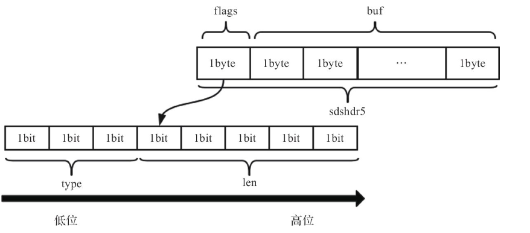
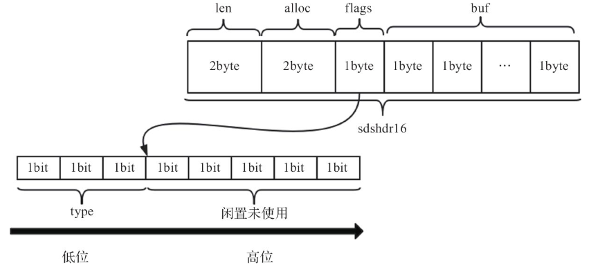
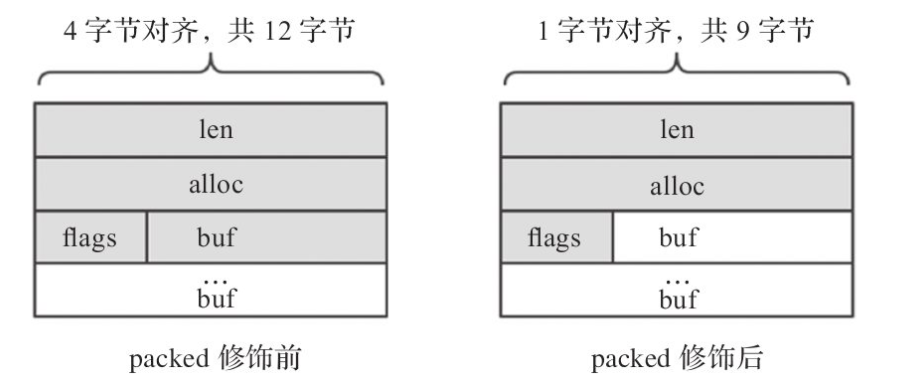
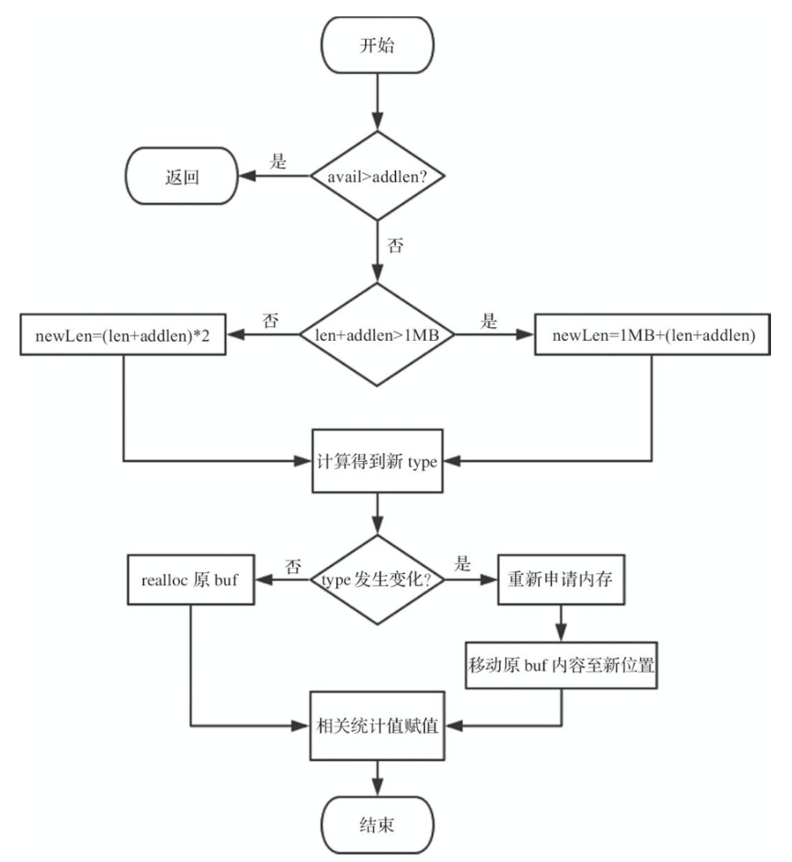

## 简单动态字符串 SDS

### 1. 数据结构

简单动态字符串 (Simple Dynamic Strings，SDS) 是 Redis 的基本数据结构之一，用于存储字符串和整型数据。SDS 兼容 C 语言标准字符串处理函数，且在此基础上保证了二进制安全。

5种类型(长度1字节、2字节、4字节、8字节、小于1字节)的SDS至少要用3位来存储类型(23 =8)，1个字节 8 位，剩余的5位存储长度，可以满足长度小于32的短字符串。在 Redis 5.0 中，我们用如下结构来存储长度小于32的短字符串:

```c
/* Note: sdshdr5 is never used, we just access the flags byte directly.
 * However is here to document the layout of type 5 SDS strings. */
struct __attribute__ ((__packed__)) sdshdr5 {
    unsigned char flags; /* 3 lsb of type, and 5 msb of string length */
    char buf[];
};
```

sdshdr5结构中，flags占1个字节，其低3位(bit)表示type，高5位(bit)表示长度，能表示的长度区间为0~31(25-1)，flags后面就是字符串的内容。



而长度大于31的字符串，1个字节依然存不下。我们按之前的思路，将len和free单独存放。sdshdr8、sdshdr16、sdshdr32和 sdshdr64的结构相同，sdshdr16结构下图所示。其中“表头”共占用了S[2(len)+2(alloc)+1(flags)]个字节。 flags的内容与sdshdr5类似，依然采用3位存储类型，但剩余5位不存 储长度。



在Redis的源代码中，对类型的宏定义如下:

```c
#define SDS_TYPE_5  0
#define SDS_TYPE_8  1
#define SDS_TYPE_16 2
#define SDS_TYPE_32 3
#define SDS_TYPE_64 4
```

在Redis 5.0中，sdshdr8、sdshdr16、sdshdr32和sdshdr64 的数据结构如下:

```c
struct __attribute__ ((__packed__)) sdshdr8 {
    uint8_t len; /* used */
    uint8_t alloc; /* excluding the header and null terminator */
    unsigned char flags; /* 3 lsb of type, 5 unused bits */
    char buf[];
};
struct __attribute__ ((__packed__)) sdshdr16 {
    uint16_t len; /* used */
    uint16_t alloc; /* excluding the header and null terminator */
    unsigned char flags; /* 3 lsb of type, 5 unused bits */
    char buf[];
};
struct __attribute__ ((__packed__)) sdshdr32 {
    uint32_t len; /* used */
    uint32_t alloc; /* excluding the header and null terminator */
    unsigned char flags; /* 3 lsb of type, 5 unused bits */
    char buf[];
};
struct __attribute__ ((__packed__)) sdshdr64 {
    uint64_t len; /* used */
    uint64_t alloc; /* excluding the header and null terminator */
    unsigned char flags; /* 3 lsb of type, 5 unused bits */
    char buf[];
};
```

可以看到，这4种结构的成员变量类似，唯一的区别是 len 和 alloc 的类型不同。结构体中4个字段的具体含义分别如下。

1.  len :表示buf中已占用字节数。
2.  alloc :表示buf中已分配字节数，记录的是为 buf分配的总长度。
3.  flags :标识当前结构体的类型，低3位用作标识位，高5位预留。
4.  buf :柔性数组，真正存储字符串的数据空间。

源码中的 \_\_attribute\_\_\((\__packed__)) 需要重点关注。一般情况下，结构体会按其所有变量大小的最小公倍数做字节对齐，而用 packed 修饰后，结构体则变为按1字节对齐。以 sdshdr32 为例，修饰前按4字节对齐大小为12(4×3) 字节;修饰后按1字节对齐，注意 buf 是个 char 类型的柔性数组，地址连续，始终在 flags 之后。



这样做有以下两个好处。

-   节省内存，例如sdshdr32可节省3个字节 (12-9)。
-   SDS返回给上层的，不是结构体首地址，而是指向内容的buf指针。因为此时按1字节对齐，故SDS创建成功后，无论是sdshdr8、 sdshdr16还是sdshdr32，都能通过 (char*)sh+hdrlen 得到 buf 指针地址(其中 hdrlen是结构体长度，通过 sizeof 计算得到)。修饰后，无论是sdshdr8、sdshdr16还是sdshdr32，都能通过 buf[-1] 找到 flags，因为此时按1字节对齐。若没有 packed 的修饰，还需要对不同结构进行处理，实现更复杂。

### 2. 基本操作

数据结构的基本操作不外乎增、删、改、查，SDS 也不例外。由于 SDS 涉及多种类型，修改字符串内容带来的长度变化可能会影响 SDS 的类型而引发扩容。

#### 2.1 创建字符串

Redis 通过 sdsnewlen 函数创建 SDS。在函数中会根据字符串长度选择合适的类型，初始化完相应的统计值后，返回指向字符串内容的指针，根据字符串长度选择不同的类型:

```c
/* Create a new sds string with the content specified by the 'init' pointer
 * and 'initlen'.
 * If NULL is used for 'init' the string is initialized with zero bytes.
 * If SDS_NOINIT is used, the buffer is left uninitialized;
 *
 * The string is always null-termined (all the sds strings are, always) so
 * even if you create an sds string with:
 *
 * mystring = sdsnewlen("abc",3);
 *
 * You can print the string with printf() as there is an implicit \0 at the
 * end of the string. However the string is binary safe and can contain
 * \0 characters in the middle, as the length is stored in the sds header. */
sds sdsnewlen(const void *init, size_t initlen) {
    void *sh;
    sds s;
    char type = sdsReqType(initlen);
    /* Empty strings are usually created in order to append. Use type 8
     * since type 5 is not good at this. */
    if (type == SDS_TYPE_5 && initlen == 0) type = SDS_TYPE_8;
    int hdrlen = sdsHdrSize(type);
    unsigned char *fp; /* flags pointer. */

    sh = s_malloc(hdrlen+initlen+1);
    if (init==SDS_NOINIT)
        init = NULL;
    else if (!init)
        memset(sh, 0, hdrlen+initlen+1);
    if (sh == NULL) return NULL;
    s = (char*)sh+hdrlen;
    fp = ((unsigned char*)s)-1;
    switch(type) {
        case SDS_TYPE_5: {
            *fp = type | (initlen << SDS_TYPE_BITS);
            break;
        }
        case SDS_TYPE_8: {
            SDS_HDR_VAR(8,s);
            sh->len = initlen;
            sh->alloc = initlen;
            *fp = type;
            break;
        }
        case SDS_TYPE_16: {
            SDS_HDR_VAR(16,s);
            sh->len = initlen;
            sh->alloc = initlen;
            *fp = type;
            break;
        }
        case SDS_TYPE_32: {
            SDS_HDR_VAR(32,s);
            sh->len = initlen;
            sh->alloc = initlen;
            *fp = type;
            break;
        }
        case SDS_TYPE_64: {
            SDS_HDR_VAR(64,s);
            sh->len = initlen;
            sh->alloc = initlen;
            *fp = type;
            break;
        }
    }
    if (initlen && init)
        memcpy(s, init, initlen);
    s[initlen] = '\0';
    return s;
}
```

创建SDS的大致流程：首先计算好不同类型的头部和初始长度， 然后动态分配内存。需要注意以下3点。

1.  创建空字符串时，SDS_TYPE_5被强制转换为 SDS_TYPE_8。
2.  长度计算时有“+1”操作，是为了算上结束符“\0”。
3.  返回值是指向 sds 结构 buf 字段的指针。

#### 2.2 释放字符串

SDS提供了直接释放内存的方法——sdsfree，该方法通过对s的偏移，可定位到SDS结构体的首部，然后调用s_free释放内存:

```c
/* Free an sds string. No operation is performed if 's' is NULL. */
void sdsfree(sds s) {
    if (s == NULL) return;
    s_free((char*)s-sdsHdrSize(s[-1]));
}
```

为了优化性能(减少申请内存的开销)，SDS提供了不直接释放内存，而是通过重置统计值达到清空目的的方法——sdsclear。该方法仅将SDS的len归零，此处已存在的buf并没有真正被清除，新的数据可以覆盖写，而不用重新申请内存。

```c
/* Modify an sds string in-place to make it empty (zero length).
 * However all the existing buffer is not discarded but set as free space
 * so that next append operations will not require allocations up to the
 * number of bytes previously available. */
void sdsclear(sds s) {
    sdssetlen(s, 0);
    s[0] = '\0';
}
```

#### 2.3 拼接字符串

拼接字符串操作本身不复杂，可用 sdscatsds 来实现，代码如下:

```c
/* Append the specified sds 't' to the existing sds 's'.
 *
 * After the call, the modified sds string is no longer valid and all the
 * references must be substituted with the new pointer returned by the call. */
sds sdscatsds(sds s, const sds t) {
    return sdscatlen(s, t, sdslen(t));
}
```

sdscatsds 是暴露给上层的方法，其最终调用的是 sdscatlen。由于其中可能涉及SDS的扩容，sdscatlen 中调用sdsMakeRoomFor 对带拼接的字符串 s 容量做检查，若无须扩容则直接返回 s；若需要扩容，则返回扩容好的新字符串 s。函数中的 len、curlen 等长度值是不含结束符的，而拼接时用 memcpy 将两个字符串拼接在一起，指定了相关长度，故该过程保证了二进制安全。最后需要加上结束符。



```c
/* Append the specified binary-safe string pointed by 't' of 'len' bytes to the
 * end of the specified sds string 's'.
 *
 * After the call, the passed sds string is no longer valid and all the
 * references must be substituted with the new pointer returned by the call. */
sds sdscatlen(sds s, const void *t, size_t len) {
    size_t curlen = sdslen(s);

    s = sdsMakeRoomFor(s,len);
    if (s == NULL) return NULL;
    memcpy(s+curlen, t, len);
    sdssetlen(s, curlen+len);
    s[curlen+len] = '\0';
    return s;
}
```

Redis的sds中有如下扩容策略。 

1.  若sds中剩余空闲长度 avail 大于新增内容的长度 addlen，直接在柔性数组 buf 末尾追加即可，无须扩容。代码如下:

    ```c
    sds sdsMakeRoomFor(sds s, size_t addlen) {
        void *sh, *newsh;
        size_t avail = sdsavail(s);
        size_t len, newlen;
        char type, oldtype = s[-1] & SDS_TYPE_MASK;
        int hdrlen;
    
        /* Return ASAP if there is enough space left. */
        if (avail >= addlen) return s;
        ……
    }
    ```

2.  若 sds 中剩余空闲长度 avail 小于或等于新增内容的长度 addlen，则分情况讨论：新增后总长度len + addlen <1MB 的，按新长度的2倍扩容；新增后总长度 len+addlen>1MB 的，按新长度加上 1MB 扩容。代码如下:

    ```c
    #define SDS_MAX_PREALLOC (1024*1024)
    sds sdsMakeRoomFor(sds s, size_t addlen) {
        ……
        len = sdslen(s);
        sh = (char*)s-sdsHdrSize(oldtype);
        newlen = (len+addlen);
        if (newlen < SDS_MAX_PREALLOC)
            newlen *= 2;
        else
            newlen += SDS_MAX_PREALLOC;
        ……
    }
    ```

3.  最后根据新长度重新选取存储类型，并分配空间。此处若无须更改类型，通过 realloc 扩大柔性数组即可；否则需要重新开辟内存， 并将原字符串的buf内容移动到新位置。具体代码如下:

    ```c
    sds sdsMakeRoomFor(sds s, size_t addlen) {
        ……
        type = sdsReqType(newlen);
    
        /* Don't use type 5: the user is appending to the string and type 5 is
         * not able to remember empty space, so sdsMakeRoomFor() must be called
         * at every appending operation. */
        if (type == SDS_TYPE_5) type = SDS_TYPE_8;
    
        hdrlen = sdsHdrSize(type);
        if (oldtype==type) {
            newsh = s_realloc(sh, hdrlen+newlen+1);
            if (newsh == NULL) return NULL;
            s = (char*)newsh+hdrlen;
        } else {
            /* Since the header size changes, need to move the string forward,
             * and can't use realloc */
            newsh = s_malloc(hdrlen+newlen+1);
            if (newsh == NULL) return NULL;
            memcpy((char*)newsh+hdrlen, s, len+1);
            s_free(sh);
            s = (char*)newsh+hdrlen;
            s[-1] = type;
            sdssetlen(s, len);
        }
        sdssetalloc(s, newlen);
        return s;
    }
    ```

### 3. 总结

1.  SDS如何兼容C语言字符串？如何保证二进制安全？

    SDS对象中的 buf 是一个柔性数组，上层调用时，SDS直接返回了 buf。由于 buf 是直接指向内容的指针，故兼容C语言函数。而当真正读取内容时，SDS会通过len来限制读取长度，而非“\0”，保证了二进制安全。

2.  sdshdr5 的特殊之处是什么？

    Sdshdr5 只负责存储小于32字节的字符串。一般情况下，小字符串的存储更普遍，故 Redis 进一步压缩了 sdshdr5 的数据结构，将 sdshdr5 的类型和长度放入了同一个属性中，用 flags 的低3位存储类型，高5位存储长度。创建空字符串时，sdshdr5 会被 sdshdr8 替代。

3.  SDS是如何扩容的？

    SDS 在涉及字符串修改处会调用 sdsMakeroomFor 函数进行检查，根据不同情况动态扩容，该操作对上层透明。


