## 跳跃表

### 1. 简介

首先，有序链表的插入和删除操作都需要先找到合适的位置再修改next指针，修改操作基本不消耗时间，所以插入、删除、修改有序链表的耗时主要在查找元素上。

如果我们将有序链表中的部分节点分层，每一层都是一个有序链表。在查找时优先从最高层开始向后查找，当到达某节点时，如果 next 节点值大于要查找的值或 next 指针指向 NULL，则从当前节点下降一层继续向后查找，这样是否可以提升查找效率呢？

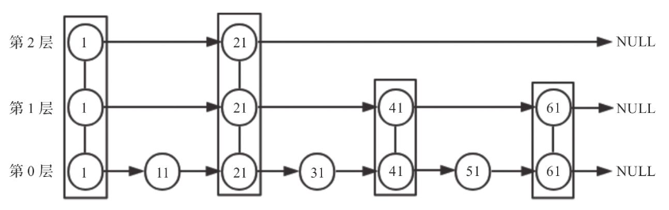

分层有序链表上图所示，我们再次查找值为 51 的节点，查找步骤如下。

1.  从第2层开始，1节点比51节点小，向后比较。
2.  21节点比51节点小，继续向后比较。第2层21节点的 next 指针指向 NULL，所以从21节点开始需要下降一层到第1层继续向后比较。
3.  第1层中，21节点的 next 节点为41节点，41节点比51节点小，继续向后比较。第1层41节点的 next 节点为61节点，比要查找的51节点大，所以从41节点开始下降一层到第0层继续向后比较。
4.  在第0层，51节点为要查询的节点，节点被找到。 

采用上图所示的数据结构后，总共查找4次就可以找到51节点，比有序链表少2次。当数据量大时，优势会更明显。

综上所述，通过将有序集合的部分节点分层，由最上层开始依次 向后查找，如果本层的 next 节点大于要查找的值或 next 节点为 NULL，则从本节点开始，降低一层继续向后查找，依次类推，如果找到则返回节点;否则返回NULL。采用该原理查找节点，在节点数量比较多时，可以跳过一些节点，查询效率大大提升，这就是跳跃表的基 本思想。

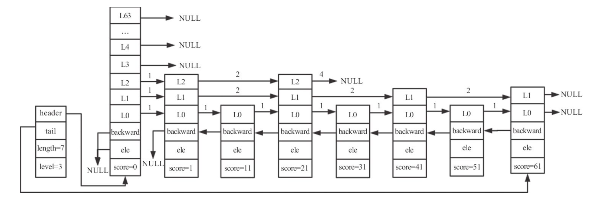

从上图中我们可以看出跳跃表有如下性质。

1.  跳跃表由很多层构成。
2.  跳跃表有一个头 (header) 节点，头节点中有一个64层的结构，每层的结构包含指向本层的下个节点的指针，指向本层下个节点中间所跨越的节点个数为本层的跨度 (span)。
3.  除头节点外，层数最多的节点的层高为跳跃表的高度 (level)，上图中跳跃表的高度为3。
4.  每层都是一个有序链表，数据递增。 
5.  除 header 节点外，一个元素在上层有序链表中出现，则它一定会在下层有序链表中出现。
6.  跳跃表每层最后一个节点指向 NULL，表示本层有序链表的结束。
7.  跳跃表拥有一个 tail 指针，指向跳跃表最后一个节点。
8.  最底层的有序链表包含所有节点，最底层的节点个数为跳跃表的长度 (length)(不包括头节点)，上图中跳跃表的长度为7。
9.  每个节点包含一个后退指针，头节点和第一个节点指向 NULL；其他节点指向最底层的前一个节点。

跳跃表每个节点维护了多个指向其他节点的指针，所以在跳跃表进行查找、插入、删除操作时可以跳过一些节点，快速找到操作需要的节点。归根结底，跳跃表是以牺牲空间的形式来达到快速查找的目的。跳跃表与平衡树相比，实现方式更简单，只要熟悉有序链表，就可以轻松地掌握跳跃表。

### 2. 跳跃表节点和结构

#### 2.1 跳跃表节点

下面我们来看跳跃表节点的 zskiplistNode 结构体。

```c
/* ZSETs use a specialized version of Skiplists */
typedef struct zskiplistNode {
    sds ele;
    double score;
    struct zskiplistNode *backward;
    struct zskiplistLevel {
        struct zskiplistNode *forward;
        unsigned long span;
    } level[];
} zskiplistNode;
```

该结构体包含如下属性。

1.  ele：用于存储字符串类型的数据，即 member 值。 
2.  score：用于存储排序的分值。
3.  backward：后退指针，只能指向当前节点最底层的前一个节点，头节点和第一个节点 backward 指向 NULL，从后向前遍历跳跃表时使用。
4.  level：为柔性数组。每个节点的数组长度不一样，在生成跳跃表节点时，随机生成一个 1~64 的值，值越大出现的概率越低。
5.  level 数组的每项包含以下两个元素。
    -   forward：指向本层下一个节点，尾节点的 forward 指向 NULL。
    -   span：forward 指向的节点与本节点之间的元素个数。span 值越大，跳过的节点个数越多。

跳跃表是 Redis 有序集合的底层实现方式之一，所以每个节点的 ele 存储有序集合的成员 member 值，score 存储成员 score 值。所有节点的分值是按从小到大的方式排序的，当有序集合的成员分值相同时，节点会按member 的字典序进行排序。

#### 2.2 跳跃表结构

除了跳跃表节点外，还需要一个跳跃表结构来管理节点，Redis 使用 zskiplist 结构体，定义如下:

```c
typedef struct zskiplist {
    struct zskiplistNode *header, *tail;
    unsigned long length;
    int level;
} zskiplist;
```

该结构体包含如下属性。

1.  header：指向跳跃表头节点。头节点是跳跃表的一个特殊节点，它的 level 数组元素个数为64。头节点在有序集合中不存储任何 member 和 score 值，ele 值为 NULL，score 值为 0；也不计入跳跃表的总长度。头节点在初始化时，64 个元素的 forward 都指向 NULL， span 值都为 0。
2.  tail：指向跳跃表尾节点。 
3.  length：跳跃表长度，表示除头节点之外的节点总数。 
4.  level：跳跃表的高度。

通过跳跃表结构体的属性我们可以看到，程序可以在 $O(1)$ 的时间复杂度下,快速获取到跳跃表的头节点、尾节点、长度和高度。

### 3. 基本操作

#### 3.1 创建跳跃表

**1. 节点层高**

节点层高的最小值为1，最大值是 ZSKIPLIST_MAXLEVEL， Redis5 中节点层高的值为64。

```c
#define ZSKIPLIST_MAXLEVEL 64
```

Redis 通过 zslRandomLevel 函数随机生成一个1~64 的值，作为新建节点的高度，值越大出现的概率越低。节点层高确定之后便不会 再修改。生成随机层高的代码如下。

```c
#define ZSKIPLIST_P 0.25  
/* Returns a random level for the new skiplist node we are going to create.
 * The return value of this function is between 1 and ZSKIPLIST_MAXLEVEL
 * (both inclusive), with a powerlaw-alike distribution where higher
 * levels are less likely to be returned. */
int zslRandomLevel(void) {
    int level = 1;
    while ((random()&0xFFFF) < (ZSKIPLIST_P * 0xFFFF))
        level += 1;
    return (level<ZSKIPLIST_MAXLEVEL) ? level : ZSKIPLIST_MAXLEVEL;
}
```

上述代码中，level 的初始值为 1，通过 while 循环，每次生成一个随机值，取这个值的低 16 位作为 x，当 x 小于0.25 倍的 0xFFFF 时， level 的值加 1；否则退出 while 循环。最终返回 level 和 ZSKIPLIST_MAXLEVEL 两者中的最小值。所以节点的期望层高为 $1/(1-0.25)≈1.33$。

**2. 创建跳跃表节点**

跳跃表的每个节点都是有序集合的一个元素，在创建跳跃表节点时，待创建节点的层高、分值、member等都已确定。对于跳跃表的每个节点，我们需要申请内存来存。zskiplistNode 结构体的最后一个元素为柔性数组，申请内存时需要指定柔性数组的大小，一个节点占用的内存大小为 zskiplistNode 的内存大小与 level 个 zskiplistLevel的内存大小之和。分配好空间之后，进行节点变量初始化。代码如下。

```c
/* Create a skiplist node with the specified number of levels.
 * The SDS string 'ele' is referenced by the node after the call. */
zskiplistNode *zslCreateNode(int level, double score, sds ele) {
    zskiplistNode *zn =
        zmalloc(sizeof(*zn)+level*sizeof(struct zskiplistLevel));
    zn->score = score;
    zn->ele = ele;
    return zn;
}
```

**3. 头节点**

头节点是一个特殊的节点，不存储有序集合的 member 信息。头节点是跳跃表中第一个插入的节点，其 level 数组的每项 forward 都为 NULL，span 值都为0。

```c
    zsl->header = zslCreateNode(ZSKIPLIST_MAXLEVEL,0,NULL);
    for (j = 0; j < ZSKIPLIST_MAXLEVEL; j++) { 
        zsl->header->level[j].forward = NULL;
        zsl->header->level[j].span = 0;
    }
```

**4. 创建跳跃表的步骤**

创建完头节点后，就可以创建跳跃表。创建跳跃表的步骤如下。 

1.  创建跳跃表结构体对象 zsl。 
2.  将 zsl 的头节点指针指向新创建的头节点。
3.  跳跃表层高初始化为 1，长度初始化为 0，尾节点指向 NULL。 

相关代码如下。

```c
/* Create a new skiplist. */
zskiplist *zslCreate(void) {
    int j;
    zskiplist *zsl;

    zsl = zmalloc(sizeof(*zsl));
    zsl->level = 1;
    zsl->length = 0;
    zsl->header = zslCreateNode(ZSKIPLIST_MAXLEVEL,0,NULL);
    for (j = 0; j < ZSKIPLIST_MAXLEVEL; j++) { 
        zsl->header->level[j].forward = NULL;
        zsl->header->level[j].span = 0;
    }
    zsl->header->backward = NULL;
    zsl->tail = NULL;
    return zsl;
}
```

#### 3.2 插入节点

插入节点的步骤：1. 查找要插入的位置；2. 调整跳跃表高度；3. 插入节点；4. 调整 backward。

```c
/* Insert a new node in the skiplist. Assumes the element does not already
 * exist (up to the caller to enforce that). The skiplist takes ownership
 * of the passed SDS string 'ele'. */
zskiplistNode *zslInsert(zskiplist *zsl, double score, sds ele) {
    zskiplistNode *update[ZSKIPLIST_MAXLEVEL], *x;
    unsigned int rank[ZSKIPLIST_MAXLEVEL];
    int i, level;

    serverAssert(!isnan(score));
    x = zsl->header;
    for (i = zsl->level-1; i >= 0; i--) {
        /* store rank that is crossed to reach the insert position */
        rank[i] = i == (zsl->level-1) ? 0 : rank[i+1];
        while (x->level[i].forward &&
                (x->level[i].forward->score < score ||
                    (x->level[i].forward->score == score &&
                    sdscmp(x->level[i].forward->ele,ele) < 0)))
        {
            rank[i] += x->level[i].span;
            x = x->level[i].forward;
        }
        update[i] = x;
    }
    /* we assume the element is not already inside, since we allow duplicated
     * scores, reinserting the same element should never happen since the
     * caller of zslInsert() should test in the hash table if the element is
     * already inside or not. */
    level = zslRandomLevel();
    if (level > zsl->level) {
        for (i = zsl->level; i < level; i++) {
            rank[i] = 0;
            update[i] = zsl->header;
            update[i]->level[i].span = zsl->length;
        }
        zsl->level = level;
    }
    x = zslCreateNode(level,score,ele);
    for (i = 0; i < level; i++) {
        x->level[i].forward = update[i]->level[i].forward;
        update[i]->level[i].forward = x;

        /* update span covered by update[i] as x is inserted here */
        x->level[i].span = update[i]->level[i].span - (rank[0] - rank[i]);
        update[i]->level[i].span = (rank[0] - rank[i]) + 1;
    }

    /* increment span for untouched levels */
    for (i = level; i < zsl->level; i++) {
        update[i]->level[i].span++;
    }

    x->backward = (update[0] == zsl->header) ? NULL : update[0];
    if (x->level[0].forward)
        x->level[0].forward->backward = x;
    else
        zsl->tail = x;
    zsl->length++;
    return x;
}
```

**1. 查找要插入的位置**

查找是跳跃表操作中使用最多的操作，无论是获取、插入还是删除，都需要查找到指定的节点位置。借助跳跃表的插入节点的过程深入了解跳跃表的查找过程。

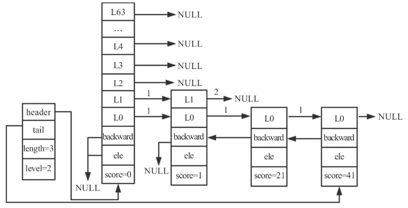

如上图所示的跳跃表，长度为 3，高度为 2。若要插入一个节点，分值为 31，层高为 3，则插入节点时查找被更新节点的代码如下。

```c
zskiplistNode *zslInsert(zskiplist *zsl, double score, sds ele) {
    zskiplistNode *update[ZSKIPLIST_MAXLEVEL], *x;
    unsigned int rank[ZSKIPLIST_MAXLEVEL];
    int i, level;

    serverAssert(!isnan(score));    
    x = zsl->header;
    for (i = zsl->level-1; i >= 0; i--) {
        /* store rank that is crossed to reach the insert position */
        rank[i] = i == (zsl->level-1) ? 0 : rank[i+1];
        while (x->level[i].forward &&
                (x->level[i].forward->score < score ||
                    (x->level[i].forward->score == score &&
                    sdscmp(x->level[i].forward->ele,ele) < 0)))
        {
            rank[i] += x->level[i].span;
            x = x->level[i].forward;
        }
        update[i] = x;
    }
    ……
}
```

为了找到要更新的节点，我们需要以下两个长度为 64 的数组来辅助操作。

-   update[]：插入节点时，需要更新被插入节点每层的前一个节点。由于每层更新的节点不一样，所以将每层需要更新的节点记录在 update[i] 中。
-   rank[]：记录当前层从 header 节点到 update[i] 节点所经历的步长，在更新 update[i] 的 span 和设置新插入节点的 span 时用到。

查找节点 (score=31，level=3) 的插入位置，逻辑如下。

1.  第一次 for 循环，i=1。x 为跳跃表的头节点。
2.  此时 i 的值与 zsl->level-1 相等，所以 rank[1] 的值为0。
3.  header->level[1].forward 存在，并且 header- >level[1].forward->score==1 小于要插入的 score，所以可以进入 while 循环，rank[1]=1，x 为第一个节点。
4.  第一个节点的第 1 层的 forward 指向 NULL，所以不会再进入 while 循环。经过第一次 for 循环，rank[1]=1。x 和 update[1] 都为第一个节点 (score=1)。
5.  经过第二次 for 循环，i=0。x 为跳跃表的第一个节点 (score=1)。
6.  此时 i 的值与 zsl->level-1 不相等，所以 rank[0] 等于 rank[1] 的值，值为 1。
7.  x->level[0]->forward 存在，并且 x->level[0].foreard- >score==21小于要插入的 score，所以可以进入 while循环， rank[0]=2。x 为第二个节点 (score=21)。
8.  x->level[0]->forward 存在，并且 x->level[0].foreard- >score==41 大于要插入的 score，所以不会再进入while，经过第二 次 for 循环，rank[0]=2。x 和 update[0] 都为第二个节点 (score=21)。

update和rank赋值后的跳跃表下图所示。

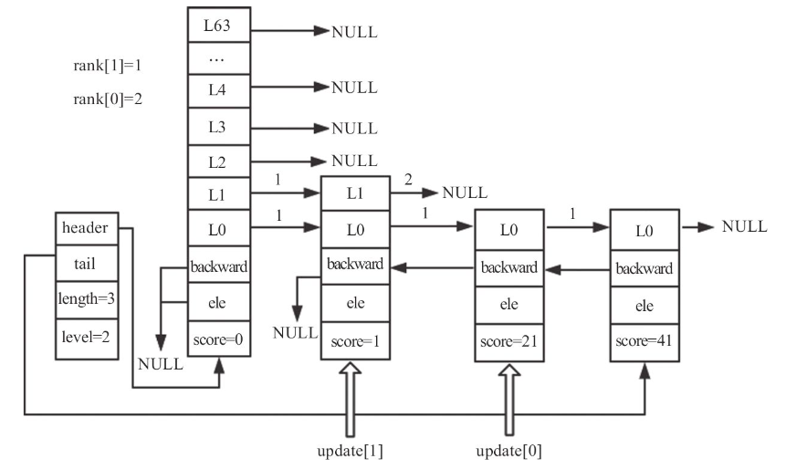

**2. 调整跳跃表高度**

由上文可知，插入节点的高度是随机的，假设要插入节点的高度为 3，大于跳跃表的高度 2，所以我们需要调整跳跃表的高度。代码如下。

```c
    /* we assume the element is not already inside, since we allow duplicated
     * scores, reinserting the same element should never happen since the
     * caller of zslInsert() should test in the hash table if the element is
     * already inside or not. */
    level = zslRandomLevel();
    if (level > zsl->level) {
        for (i = zsl->level; i < level; i++) {
            rank[i] = 0;
            update[i] = zsl->header;
            update[i]->level[i].span = zsl->length;
        }
        zsl->level = level;
    }
```

此时，i 的值为 2，level 的值为 3，所以只能进入一次 for 循环。由于 header 的第 0 层到第 1 层的 forward 都已经指向了相应的节点，而新添加的节点的高度大于跳跃表的原高度，所以第 2 层只需要更新 header 节点即可。前面我们介绍过，rank 是用来更新 span 的变量， 其值是头节点到 update[i] 所经过的节点数，而此次修改的是头节点， 所以 rank[2] 为 0，update[2] 一定为头节点。update[2] -> level[2].span 的值先赋值为跳跃表的总长度，后续在计算新插入节点 level[2] 的 span 时会用到此值。在更新完新插入节点 level[2] 的 span 之后会对update[2]->level[2].span 的值进行重新计算赋值。

调整高度后的跳跃表下图所示。

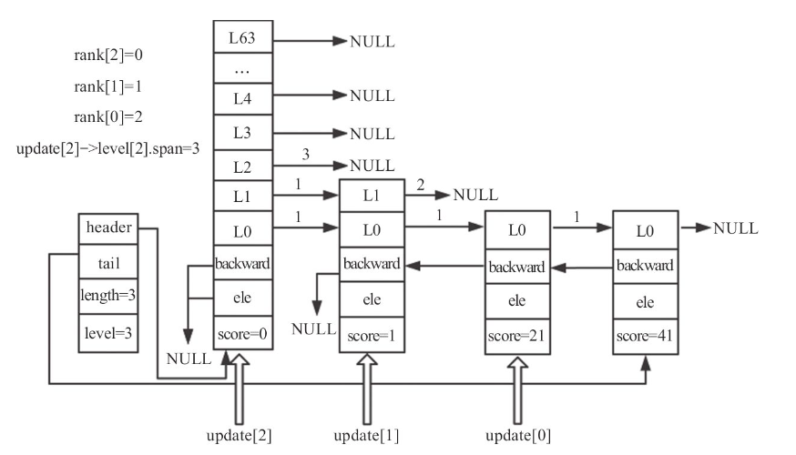

**3. 插入节点**

当 update 和 rank 都赋值且节点已创建好后，便可以插入节点了。 代码如下。

```c
    x = zslCreateNode(level,score,ele);
    for (i = 0; i < level; i++) {
        x->level[i].forward = update[i]->level[i].forward;
        update[i]->level[i].forward = x;

        /* update span covered by update[i] as x is inserted here */
        x->level[i].span = update[i]->level[i].span - (rank[0] - rank[i]);
        update[i]->level[i].span = (rank[0] - rank[i]) + 1;
    }
```

level的值为3，所以可以执行三次for循环，插入过程如下。

**1> 第一次for循环**

1.  x 的 level[0] 的 forward 为 update[0] 的 level[0] 的 forward 节 点，即 x->level[0].forward 为 score=41的节点。
2.  update[0] 的 level[0] 的下一个节点为新插入的节点。 
3.  rank[0]-rank[0]=0，update[0]->level[0].span=1，所以 x->level[0].span=1。
4.  update[0]->level[0].span=0+1=1。

 插入节点并更新第0层后的跳跃表下图所示。

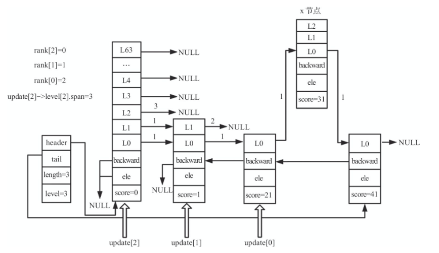

**2> 第2次for循环**

1.  x 的 level[1] 的 forward 为 update[1] 的 level[1] 的 forward 节点，即 x->level[1].forward 为 NULL。
2.  update[1] 的 level[1] 的下一个节点为新插入的节点。
3.  rank[0]-rank[1]=1，update[1]->level[1].span=2，所以x->level[1].span=1。
4.  update[1]->level[1].span=1+1=2。

插入节点并更新第1层后的跳跃表下图所示。

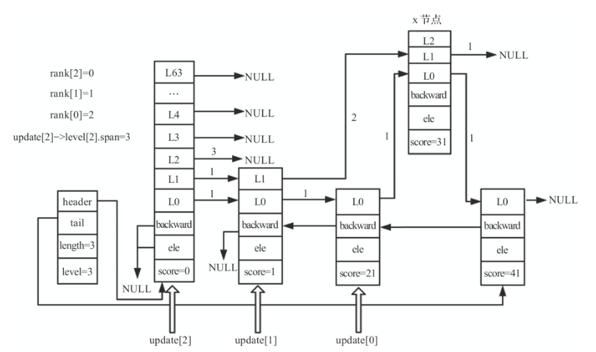

**3> 第3次for循环**

1.  x 的 level[2] 的 forward 为 update[2] 的 level[2] 的forward节点，即 x->level[2].forward 为 NULL。
2.  update[2] 的 level[2] 的下一个节点为新插入的节点。
3.  rank[0]-rank[2]=2，因为 update[2]->level[2].span=3，所以 x->level[2].span=1。
4.  update[2]->level[2].span=2+1=3。 

插入节点并更新第2层后的跳跃表下图所示。

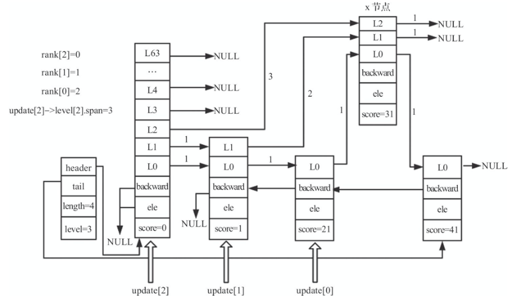

新插入节点的高度大于原跳跃表高度，所以下面代码不会运行。 

```c
/* increment span for untouched levels */
    for (i = level; i < zsl->level; i++) {
        update[i]->level[i].span++;
    }
```

但如果新插入节点的高度小于原跳跃表高度，则从 level 到 zsl->level- 1 层的 update[i] 节点 forward 不会指向新插入的节点，所以不用更新 update[i] 的 forward 指针，只将这些 level 层的 span 加1即可。

**4. 调整 backward**

根据 update 的赋值过程，新插入节点的前一个节点一定是 update[0]，由于每个节点的后退指针只有一个，与此节点的层数无关，所以当插入节点不是最后一个节点时，需要更新被插入节点的 backward 指向 update[0]。如果新插入节点是最后一个节点，则需要更新跳跃表的尾节点为新插入节点。插入节点后，更新跳跃表的长度加1。代码如下。

```c
	x->backward = (update[0] == zsl->header) ? NULL : update[0];
    if (x->level[0].forward)
        x->level[0].forward->backward = x;
    else
        zsl->tail = x;
    zsl->length++;
    return x;
```

插入新节点后的跳跃表下图所示。

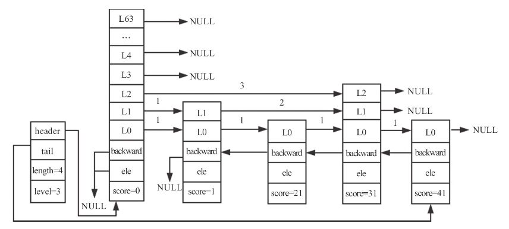

#### 3.3 删除节点

删除节点的步骤：1. 查找需要更新的节点；2. 设置 span 和 forward。

插入操作后的跳跃表的长度为 3，高度为 3，此时删除 score=31 的节点，将此节点记录为 x。

**1. 查找需要更新的节点**

查找需要更新的节点要借助 update 数组，数组的赋值方式与插入操作时 update 的赋值方式相同，不再赘述。查找完毕之后， update[2]=header，update[1] 为 score=1 的节点，update[0] 为 score=21 的节点。

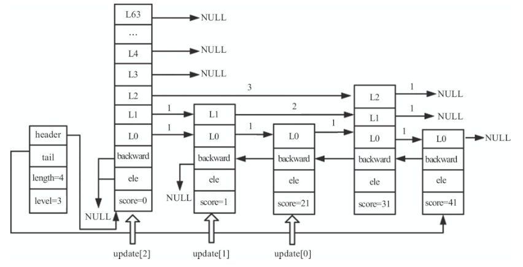

**2. 设置 span 和 forward**

删除节点需要设置 update 数组中每个节点的 span 和 forward。

假设 x 的第 i 层的 span 值为 a，update[i] 第 i 层的 span 值为 b，由于 删除了一个节点，所以 a+b-1 的值就是update[i] 第 i 层的 span 新值。 update[i] 的第 i 的新 forward 就是 x 节点第 i 层的 forward，这个类似链表删除元素的操作。

如果 update[i] 第 i 层的 forward 不为 x，说明 update[i] 的层高大于 x 的层高，即 update[i] 第 i 层指向了指向了x 的后续节点或指向 NULL。 由于删除了一个节点，所以 update[i] 的 level[i] 的 span 需要减 1。

如果 update[i] 的 forward 不为 x，在要删除的节点的高度小于跳跃表高度的情况下出现，i 大于 x 高度的节点的 forward 与 x 无关，所以这些节点只需更新其 span 减 1 即可。

设置 span 和 forward 的代码如下。

```c
/* Internal function used by zslDelete, zslDeleteByScore and zslDeleteByRank */
void zslDeleteNode(zskiplist *zsl, zskiplistNode *x, zskiplistNode **update) {
    int i;
    for (i = 0; i < zsl->level; i++) {
        if (update[i]->level[i].forward == x) {
            update[i]->level[i].span += x->level[i].span - 1;
            update[i]->level[i].forward = x->level[i].forward;
        } else {
            update[i]->level[i].span -= 1;
        }
    }
    ……
}
```

设置 span 和 forward 后的跳跃表如下图所示。

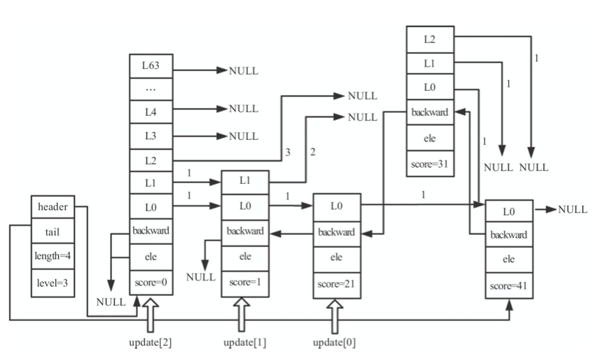

update 节点更新完毕之后，需要更新 backward 指针、跳跃表高度和长度。如果 x 不为最后一个节点，直接将第 0 层后一个节点的 backward 赋值为 x 的 backward 即可；否则，将跳跃表的尾指针指向 x 的 backward 节点即可。代码如下。

```c
	if (x->level[0].forward) {
        x->level[0].forward->backward = x->backward;
    } else {
        zsl->tail = x->backward;
    }
    while(zsl->level > 1 && zsl->header->level[zsl->level-1].forward == NULL)
        zsl->level--;
    zsl->length--;
```

当删除的 x 节点是跳跃表的最高节点，并且没有其他节点与 x 节点的高度相同时，需要将跳跃表的高度减 1。

由于删除了一个节点，跳跃表的长度需要减 1。 

删除节点后的跳跃表如下图所示。

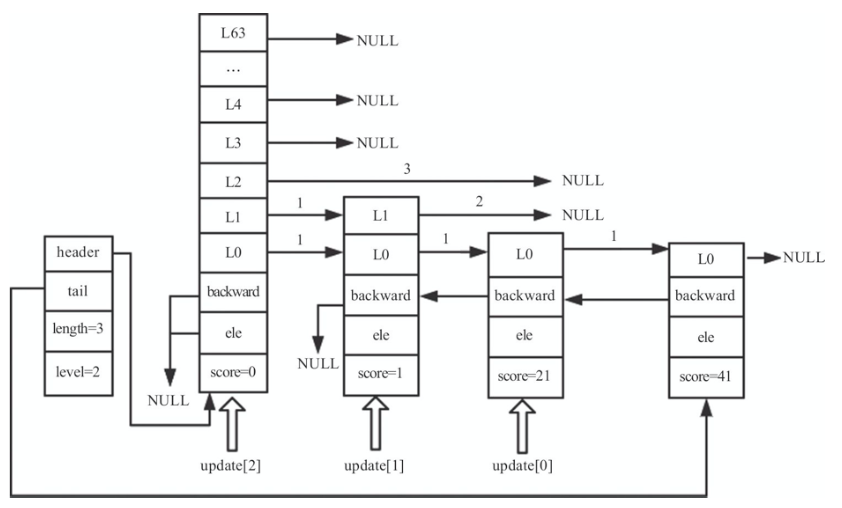

#### 3.4 删除跳跃表

获取到跳跃表对象之后，从头节点的第 0 层开始，通过 forward 指针逐步向后遍历，每遇到一个节点便将释放其内存。当所有节点的内存都被释放之后，释放跳跃表对象，即完成了跳跃表的删除操作。代码如下。

```c
/* Free a whole skiplist. */
void zslFree(zskiplist *zsl) {
    zskiplistNode *node = zsl->header->level[0].forward, *next;

    zfree(zsl->header);
    while(node) {
        next = node->level[0].forward;
        zslFreeNode(node);
        node = next;
    }
    zfree(zsl);
}
```

### 4. 跳跃表的应用

在 Redis 中，跳跃表主要应用于有序集合的底层实现(有序集合的另一种实现方式为压缩列表)。

Redis 的配置文件中关于有序集合底层实现的两个配置。

1.  zset-max-ziplist-entries 128：zset 采用压缩列表时，元素个数最大值。默认值为 128。
2.  zset-max-ziplist-value 64：zset 采用压缩列表时，每个元素的字符串长度最大值。默认值为 64。

zset 添加元素的主要逻辑位于 t_zset.c 的 zaddGenericCommand 函数中。zset 插入第一个元素时，会判断下面两种条件:

-   zset-max-ziplist-entries 的值是否等于 0;
-   zset-max-ziplist-value 小于要插入元素的字符串长度。

满足任一条件 Redis 就会采用跳跃表作为底层实现，否则采用压缩列表作为底层实现方式。

```c
/*-----------------------------------------------------------------------------
 * Sorted set commands
 *----------------------------------------------------------------------------*/
/* This generic command implements both ZADD and ZINCRBY. */
void zaddGenericCommand(client *c, int flags) {
    ……
	/* Lookup the key and create the sorted set if does not exist. */
    zobj = lookupKeyWrite(c->db,key);
    if (zobj == NULL) {
        if (xx) goto reply_to_client; /* No key + XX option: nothing to do. */
        if (server.zset_max_ziplist_entries == 0 ||
            server.zset_max_ziplist_value < sdslen(c->argv[scoreidx+1]->ptr))
        {
            // 创建跳跃表结构
            zobj = createZsetObject();
        } else {
            // 创建压缩列表结构
            zobj = createZsetZiplistObject();
        }
        dbAdd(c->db,key,zobj);
    } else {
        if (zobj->type != OBJ_ZSET) {
            addReply(c,shared.wrongtypeerr);
            goto cleanup;
        }
    }
    ……
}
```

一般情况下，不会将 zset-max-ziplist-entries 配置成 0，元素的字符串长度也不会太长，所以在创建有序集合时，默认使用压缩列表的底层实现。zset 新插入元素时，会判断以下两种条件:

-   zset 中元素个数大于 zset_max_ziplist_entries；
-   插入元素的字符串长度大于 zset_max_ziplist_value。

当满足任一条件时，Redis 便会将 zset 的底层实现由压缩列表转为跳跃表。代码如下。

```c
int zsetAdd(robj *zobj, double score, sds ele, int *flags, double *newscore) {
    ……
			/* Optimize: check if the element is too large or the list
             * becomes too long *before* executing zzlInsert. */
            zobj->ptr = zzlInsert(zobj->ptr,ele,score);
            if (zzlLength(zobj->ptr) > server.zset_max_ziplist_entries ||
                sdslen(ele) > server.zset_max_ziplist_value)
                zsetConvert(zobj,OBJ_ENCODING_SKIPLIST);
    ……
}
```

值得注意的是，zset 在转为跳跃表之后，即使元素被逐渐删除， 也不会重新转为压缩列表。

### 5. 总结

跳跃表的原理简单， 其查询、插入、删除的平均复杂度都为 $O(logN)$。跳跃表主要应用于 有序集合的底层实现。

