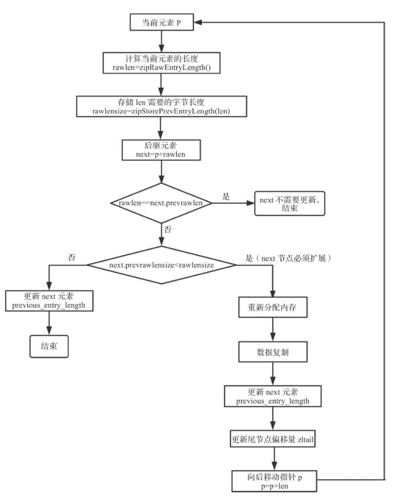

## 压缩列表

压缩列表 ziplist 本质上就是一个字节数组，是 Redis 为了节约内存而设计的一种线性数据结构，可以包含多个元素，每个元素可以是一个字节数组或一个整数。

Redis 的有序集合、散列和列表都直接或者间接使用了压缩列表。当有序集合或散列表的元素个数比较少，且元素都是短字符串时，Redis 便使用压缩列表作为其底层数据存储结构。列表使用快速链表 (quicklist) 数据结构存储，而快速链表就是双向链表与压缩列表的组合。

例如，使用如下命令创建一个散列键并查看其编码。

```shell
127.0.0.1:6379> hmset person name zhangsan gender 1 age 22
OK
127.0.0.1:6379> OBJECT encoding person
"ziplist"
```

### 1. 压缩列表的数据结构

Redis使用字节数组表示一个压缩列表，压缩列表结构示意如下图所示。


上图中各字段的含义：

1.  zlbytes： 压缩列表的字节长度，占 4 个字节，因此压缩列表最多有 2^32^ - 1 个字节。
2.  zltail：压缩列表尾元素相对于压缩列表起始地址的偏移量， 占 4 个字节。
3.  zllen：压缩列表的元素个数，占 2 个字节。zllen 无法存储元素个数超过 65535(2^16^ -1) 的压缩列表，必须遍历整个压缩列表才能获取到元素个数。
4.  entryX：压缩列表存储的元素，可以是字节数组或者整数， 长度不限。
5.  zlend：压缩列表的结尾，占 1 个字节，恒为 0xFF。

假设 char *zl 指向压缩列表首地址，Redis 可通过以下宏定义实现压缩列表各个字段的存取操作。

```c
/* Return total bytes a ziplist is composed of. */
// zl 指向 zlbytes 字段
#define ZIPLIST_BYTES(zl)       (*((uint32_t*)(zl)))

/* Return the offset of the last item inside the ziplist. */
// zl+4 指向 zltail 字段
#define ZIPLIST_TAIL_OFFSET(zl) (*((uint32_t*)((zl)+sizeof(uint32_t))))

/* Return the length of a ziplist, or UINT16_MAX if the length cannot be
 * determined without scanning the whole ziplist. */
// zl+8 指向 zllen 字段
#define ZIPLIST_LENGTH(zl)      (*((uint16_t*)((zl)+sizeof(uint32_t)*2)))

/* Return the pointer to the last entry of a ziplist, using the
 * last entry offset inside the ziplist header. */
// zl+zltail 指向尾元素首地址；intrev32ifbe使得数据存取统一采用小端法
#define ZIPLIST_ENTRY_TAIL(zl)  ((zl)+intrev32ifbe(ZIPLIST_TAIL_OFFSET(zl)))

/* Return the pointer to the last byte of a ziplist, which is, the
 * end of ziplist FF entry. */
// 压缩列表最后一个字节即为 zlend 字段
#define ZIPLIST_ENTRY_END(zl)   ((zl)+intrev32ifbe(ZIPLIST_BYTES(zl))-1)

```

了解了压缩列表的基本结构，我们可以很容易地获得压缩列表的字节长度、元素个数等，那么如何遍历压缩列表呢？对于任意一个元素，我们如何判断其存储的是什么类型呢？我们又如何获取字节数组的长度呢？

回答这些问题之前，需要先了解压缩列表元素的编码结构，如下图所示。


-   previous_entry_length 字段表示前一个元素的字节长度，占 1 个或者 5 个字节，当前一个元素的长度小于 254 字节时，用 1 个字节表示；当前一个元素的长度大于或等于 254 字节时，用 5 个字节来表示。 而此时previous_entry_length 字段的第 1 个字节是固定的 0xFE，后面 4 个字节才真正表示前一个元素的长度。假设已知当前元素的首地址为 p，那么 p-previous_entry_length 就是前一个元素的首地址，从而实现压缩列表从尾到头的遍历。

-   encoding 字段表示当前元素的编码，即 content 字段存储的数据类型(整数或者字节数组)，数据内容存储在 content 字段。为了节约内存，encoding 字段同样长度可变。压缩列表元素的编码下图所示。


可以看出，根据 encoding 字段第 1 个字节的前 2 位，可以判断 content 字段存储的是整数或者字节数组(及其最大长度)。当 content 存储的是字节数组时，后续字节标识字节数组的实际长度；当 content 存储的是整数时，可根据第 3、4 位判断整数的具体类型。 而当 encoding 字段标识当前元素存储的是 0~12 的立即数时，数据直接存储在 encoding 字段的最后 4 位，此时没有 content 字段。参照 encoding 字段的编码表格，Redis 预定义了以下常量对应 encoding 字段的各编码类型:

```c
 /*|00pppppp| - 1 byte
 *      String value with length less than or equal to 63 bytes (6 bits).
 *      "pppppp" represents the unsigned 6 bit length.
 * |01pppppp|qqqqqqqq| - 2 bytes
 *      String value with length less than or equal to 16383 bytes (14 bits).
 *      IMPORTANT: The 14 bit number is stored in big endian.
 * |10000000|qqqqqqqq|rrrrrrrr|ssssssss|tttttttt| - 5 bytes
 *      String value with length greater than or equal to 16384 bytes.
 *      Only the 4 bytes following the first byte represents the length
 *      up to 32^2-1. The 6 lower bits of the first byte are not used and
 *      are set to zero.
 *      IMPORTANT: The 32 bit number is stored in big endian.
 * |11000000| - 3 bytes
 *      Integer encoded as int16_t (2 bytes).
 * |11010000| - 5 bytes
 *      Integer encoded as int32_t (4 bytes).
 * |11100000| - 9 bytes
 *      Integer encoded as int64_t (8 bytes).
 * |11110000| - 4 bytes
 *      Integer encoded as 24 bit signed (3 bytes).
 * |11111110| - 2 bytes
 *      Integer encoded as 8 bit signed (1 byte).
 * |1111xxxx| - (with xxxx between 0000 and 1101) immediate 4 bit integer.
 *      Unsigned integer from 0 to 12. The encoded value is actually from
 *      1 to 13 because 0000 and 1111 can not be used, so 1 should be
 *      subtracted from the encoded 4 bit value to obtain the right value.
 * |11111111| - End of ziplist special entry.
 *
 * Different encoding/length possibilities */
#define ZIP_STR_MASK 0xc0
#define ZIP_INT_MASK 0x30
#define ZIP_STR_06B (0 << 6)
#define ZIP_STR_14B (1 << 6)
#define ZIP_STR_32B (2 << 6)
#define ZIP_INT_16B (0xc0 | 0<<4)
#define ZIP_INT_32B (0xc0 | 1<<4)
#define ZIP_INT_64B (0xc0 | 2<<4)
#define ZIP_INT_24B (0xc0 | 3<<4)
#define ZIP_INT_8B 0xfe
```

### 2. 结构体

介绍了压缩列表的存储结构，我们发现对于压缩列表的任意元素，获取前一个元素的长度、判断存储的数据类型、获取数据内容都需要经过复杂的解码运算。解码后的结果应该被缓存起来，为此定义了结构体 zlentry，用于表示解码后的压缩列表元素。

```c
/* We use this function to receive information about a ziplist entry.
 * Note that this is not how the data is actually encoded, is just what we
 * get filled by a function in order to operate more easily. */
typedef struct zlentry {
    unsigned int prevrawlensize; /* Bytes used to encode the previous entry len*/
    unsigned int prevrawlen;     /* Previous entry len. */
    unsigned int lensize;        /* Bytes used to encode this entry type/len.
                                    For example strings have a 1, 2 or 5 bytes
                                    header. Integers always use a single byte.*/
    unsigned int len;            /* Bytes used to represent the actual entry.
                                    For strings this is just the string length
                                    while for integers it is 1, 2, 3, 4, 8 or
                                    0 (for 4 bit immediate) depending on the
                                    number range. */
    unsigned int headersize;     /* prevrawlensize + lensize. */
    unsigned char encoding;      /* Set to ZIP_STR_* or ZIP_INT_* depending on
                                    the entry encoding. However for 4 bits
                                    immediate integers this can assume a range
                                    of values and must be range-checked. */
    unsigned char *p;            /* Pointer to the very start of the entry, that
                                    is, this points to prev-entry-len field. */
} zlentry;
```

结构体 zlentry 定义了 7 个字段，而之前显示每个元素只包含 3 个字段。

回顾压缩列表元素的编码结构，可变因素实际上不止 3 个：

1.  previous_entry_length 字段的长度 (prevrawlensize)
2.  previous_entry_length 字段存储的内容 (prevrawlen)
3.  encoding 字段的长度 (lensize)
4.  encoding 字段的内容 (len表示 元素数据内容的长度，encoding表示数据类型)
5.  当前元素首地址 (*p)
6.  headersize则表示当前元素的首部长度，即 previous_entry_length字段长度与encoding字段长度之和。

函数 zipEntry 用来解码压缩列表的元素，存储于 zlentry 结构体。

```c
/* Return a struct with all information about an entry. */
void zipEntry(unsigned char *p, zlentry *e) {

    ZIP_DECODE_PREVLEN(p, e->prevrawlensize, e->prevrawlen);
    ZIP_DECODE_LENGTH(p + e->prevrawlensize, e->encoding, e->lensize, e->len);
    e->headersize = e->prevrawlensize + e->lensize;
    e->p = p;
}
```

解码主要可以分为以下两个步骤。

1.  解码 previous_entry_length 字段，此时入参 ptr 指向元素首地址。

```c
#define ZIP_BIG_PREVLEN 254 /* Max number of bytes of the previous entry, for
                               the "prevlen" field prefixing each entry, to be
                               represented with just a single byte. Otherwise
                               it is represented as FF AA BB CC DD, where
                               AA BB CC DD are a 4 bytes unsigned integer
                               representing the previous entry len. */

/* Return the length of the previous element, and the number of bytes that
 * are used in order to encode the previous element length.
 * 'ptr' must point to the prevlen prefix of an entry (that encodes the
 * length of the previous entry in order to navigate the elements backward).
 * The length of the previous entry is stored in 'prevlen', the number of
 * bytes needed to encode the previous entry length are stored in
 * 'prevlensize'. */
#define ZIP_DECODE_PREVLEN(ptr, prevlensize, prevlen) do {                     \ 
    ZIP_DECODE_PREVLENSIZE(ptr, prevlensize);                                  \
    if ((prevlensize) == 1) {                                                  \
        (prevlen) = (ptr)[0];                                                  \
    } else if ((prevlensize) == 5) {                                           \
        assert(sizeof((prevlen)) == 4);                                        \
        memcpy(&(prevlen), ((char*)(ptr)) + 1, 4);                             \   
        memrev32ifbe(&prevlen);                                                \  
    }                                                                          \ 
} while(0);
```

2.  解码 encoding 字段逻辑，此时入参 ptr 指向元素首地址偏移 previous_entry_length 字段长度的位置。

```c
#define ZIP_STR_MASK 0xc0

/* Extract the encoding from the byte pointed by 'ptr' and set it into
 * 'encoding' field of the zlentry structure. */
#define ZIP_ENTRY_ENCODING(ptr, encoding) do {  \
    (encoding) = (ptr[0]); \
    if ((encoding) < ZIP_STR_MASK) (encoding) &= ZIP_STR_MASK; \
} while(0)

/* Decode the entry encoding type and data length (string length for strings,
 * number of bytes used for the integer for integer entries) encoded in 'ptr'.
 * The 'encoding' variable will hold the entry encoding, the 'lensize'
 * variable will hold the number of bytes required to encode the entry
 * length, and the 'len' variable will hold the entry length. */
#define ZIP_DECODE_LENGTH(ptr, encoding, lensize, len) do {                    \
    ZIP_ENTRY_ENCODING((ptr), (encoding));                                     \
    if ((encoding) < ZIP_STR_MASK) {                                           \
        if ((encoding) == ZIP_STR_06B) {                                       \
            (lensize) = 1;                                                     \
            (len) = (ptr)[0] & 0x3f;                                           \
        } else if ((encoding) == ZIP_STR_14B) {                                \
            (lensize) = 2;                                                     \
            (len) = (((ptr)[0] & 0x3f) << 8) | (ptr)[1];                       \
        } else if ((encoding) == ZIP_STR_32B) {                                \
            (lensize) = 5;                                                     \
            (len) = ((ptr)[1] << 24) |                                         \
                    ((ptr)[2] << 16) |                                         \
                    ((ptr)[3] <<  8) |                                         \
                    ((ptr)[4]);                                                \
        } else {                                                               \
            panic("Invalid string encoding 0x%02X", (encoding));               \
        }                                                                      \
    } else {                                                                   \
        (lensize) = 1;                                                         \
        (len) = zipIntSize(encoding);                                          \
    }                                                                          \
} while(0);
```

字节数组只根据 ptr[0] 的前 2 个比特即可判断类型，而判断整数类型需要 ptr[0] 的前 4 个比特，代码如下。

```c
/* Different encoding/length possibilities */
#define ZIP_INT_16B (0xc0 | 0<<4)
#define ZIP_INT_32B (0xc0 | 1<<4)
#define ZIP_INT_64B (0xc0 | 2<<4)
#define ZIP_INT_24B (0xc0 | 3<<4)
#define ZIP_INT_8B 0xfe

/* 4 bit integer immediate encoding |1111xxxx| with xxxx between
 * 0001 and 1101. */
#define ZIP_INT_IMM_MIN 0xf1    /* 11110001 */
#define ZIP_INT_IMM_MAX 0xfd    /* 11111101 */

/* Return bytes needed to store integer encoded by 'encoding'. */
unsigned int zipIntSize(unsigned char encoding) {
    switch(encoding) {
    case ZIP_INT_8B:  return 1;
    case ZIP_INT_16B: return 2;
    case ZIP_INT_24B: return 3;
    case ZIP_INT_32B: return 4;
    case ZIP_INT_64B: return 8;
    }
    if (encoding >= ZIP_INT_IMM_MIN && encoding <= ZIP_INT_IMM_MAX)
        return 0; /* 4 bit immediate */
    panic("Invalid integer encoding 0x%02X", encoding);
    return 0;
}
```

### 3. 基本操作

#### 3.1 创建压缩列表

创建压缩列表的API定义如下，函数无输入参数，返回参数为压缩列表首地址。创建空的压缩列表，只需要分配初始存储空间 11(4+4+2+1) 个字节，并对 zlbytes、zltail、zllen 和 zlend 字段初始化即可。

```c
/* The size of a ziplist header: two 32 bit integers for the total
 * bytes count and last item offset. One 16 bit integer for the number
 * of items field. */
#define ZIPLIST_HEADER_SIZE     (sizeof(uint32_t)*2+sizeof(uint16_t))
/* Size of the "end of ziplist" entry. Just one byte. */
#define ZIPLIST_END_SIZE        (sizeof(uint8_t))
/* Create a new empty ziplist. */
unsigned char *ziplistNew(void) {
    // ZIPLIST_HEADER_SIZE = zlbytes + zltail + zllen;
    unsigned int bytes = ZIPLIST_HEADER_SIZE+ZIPLIST_END_SIZE;
    unsigned char *zl = zmalloc(bytes);
    ZIPLIST_BYTES(zl) = intrev32ifbe(bytes);
    ZIPLIST_TAIL_OFFSET(zl) = intrev32ifbe(ZIPLIST_HEADER_SIZE);
    ZIPLIST_LENGTH(zl) = 0;
    zl[bytes-1] = ZIP_END;
    return zl;
}
```

#### 3.2 插入元素

压缩列表插入元素的API定义如下，函数输入参数 zl 表示压缩列表首地址，p 指向元素插入位置，s 表示数据内容，slen 表示数据长度， 返回参数为压缩列表首地址。

```c
/* Insert an entry at "p". */
unsigned char *ziplistInsert(unsigned char *zl, unsigned char *p, unsigned char *s, unsigned int slen) {
    return __ziplistInsert(zl,p,s,slen);
}
```

插入元素可以简要分为 3 个步骤：1. 将元素内容编码；2. 重新分配空间；3. 复制数据。

**1. 编码**

编码即计算 previous_entry_length、encoding 和 content 的内容。那么如何获取前一个元素的长度呢？此时就需要根据元素的插入位置分情况讨论。插入元素位置示意如下图所示。


1.  当压缩列表为空、插入位置为 P0 时，不存在前一个元素，即前一个元素的长度为 0。
2.  当插入位置为 P1 时，需要获取 entryX 元素的长度，而 entryX+1 元素的 previous_entry_length 字段存储的就是 entryX 元素的长度，比较容易获取。
3.  当插入位置为 P2 时，需要获取 entryN 元素的长度，entryN 是压缩列表的尾元素，计算元素长度时需要将其 3 个字段长度相加，函数实现如下。

```c
/* Return the total number of bytes used by the entry pointed to by 'p'. */
unsigned int zipRawEntryLength(unsigned char *p) {
    unsigned int prevlensize, encoding, lensize, len;
    ZIP_DECODE_PREVLENSIZE(p, prevlensize);
    ZIP_DECODE_LENGTH(p + prevlensize, encoding, lensize, len);
    return prevlensize + lensize + len;
}

/* Return the number of bytes used to encode the length of the previous
 * entry. The length is returned by setting the var 'prevlensize'. */
#define ZIP_DECODE_PREVLENSIZE(ptr, prevlensize) do {                          \
    if ((ptr)[0] < ZIP_BIG_PREVLEN) {                                          \
        (prevlensize) = 1;                                                     \
    } else {                                                                   \
        (prevlensize) = 5;                                                     \
    }                                                                          \
} while(0);

/* Decode the entry encoding type and data length (string length for strings,
 * number of bytes used for the integer for integer entries) encoded in 'ptr'.
 * The 'encoding' variable will hold the entry encoding, the 'lensize'
 * variable will hold the number of bytes required to encode the entry
 * length, and the 'len' variable will hold the entry length. */
#define ZIP_DECODE_LENGTH(ptr, encoding, lensize, len) do {                    \
    ZIP_ENTRY_ENCODING((ptr), (encoding));                                     \
    if ((encoding) < ZIP_STR_MASK) {                                           \
        if ((encoding) == ZIP_STR_06B) {                                       \
            (lensize) = 1;                                                     \
            (len) = (ptr)[0] & 0x3f;                                           \
        } else if ((encoding) == ZIP_STR_14B) {                                \
            (lensize) = 2;                                                     \
            (len) = (((ptr)[0] & 0x3f) << 8) | (ptr)[1];                       \
        } else if ((encoding) == ZIP_STR_32B) {                                \
            (lensize) = 5;                                                     \
            (len) = ((ptr)[1] << 24) |                                         \
                    ((ptr)[2] << 16) |                                         \
                    ((ptr)[3] <<  8) |                                         \
                    ((ptr)[4]);                                                \
        } else {                                                               \
            panic("Invalid string encoding 0x%02X", (encoding));               \
        }                                                                      \
    } else {                                                                   \
        (lensize) = 1;                                                         \
        (len) = zipIntSize(encoding);                                          \
    }                                                                          \
} while(0);
```

encoding 字段标识的是当前元素存储的数据类型和数据长度。编码时首先尝试将数据内容解析为整数，如果解析成功，则按照压缩列表整数类型编码存储；如果解析失败，则按照压缩列表字节数组类型编码存储。

```c
	/* See if the entry can be encoded */
    if (zipTryEncoding(s,slen,&value,&encoding)) {
        /* 'encoding' is set to the appropriate integer encoding */
        reqlen = zipIntSize(encoding);
    } else {
        /* 'encoding' is untouched, however zipStoreEntryEncoding will use the
         * string length to figure out how to encode it. */
        reqlen = slen;
    }
    /* We need space for both the length of the previous entry and
     * the length of the payload. */
    reqlen += zipStorePrevEntryLength(NULL,prevlen);
    reqlen += zipStoreEntryEncoding(NULL,encoding,slen);
```

上述程序尝试按照整数解析新添加元素的数据内容，数值存储在变量 value 中，编码存储在变量 encoding 中。如果解析成功，还需要计算整数所占字节数。

变量 reqlen 最终存储的是当前元素所需空间大小，初始赋值为元素 content 字段所需空间大小，再累加 previous_entry_length 和 encoding 字段所需空间大小。

**2. 重新分配空间**

由于新插入了元素，压缩列表所需空间增大，因此需要重新分配存储空间。那么空间大小是不是添加元素前的压缩列表长度与新添加元素长度之和呢？并不完全是。压缩列表长度变化示意如下图所示。


插入元素前，entryX 元素的长度为 128 字节，entryX+1 元素的 previous_entry_length 字段占 1 个字节；添加元素 entryNEW，元素长度为 1024 字节，此时 entryX+1 元素的 previous_entry_length 字段需要占 5 个字节，即压缩列表的长度不仅增加了 1024 个字节，还要加上 entryX+1 元素扩展的 4 个字节。而 entryX+1 元素的长度可能增加4个字节、减少4个字节或不变。

由于重新分配了空间，新元素插入的位置指针 P 会失效，可以预先计算好指针 P 相对于压缩列表首地址的偏移量，待分配空间之后再偏移即可。

```c
	size_t curlen = intrev32ifbe(ZIPLIST_BYTES(zl)), reqlen;

	/* When the insert position is not equal to the tail, we need to
     * make sure that the next entry can hold this entry's length in
     * its prevlen field. */
    int forcelarge = 0;
    nextdiff = (p[0] != ZIP_END) ? zipPrevLenByteDiff(p,reqlen) : 0;
    if (nextdiff == -4 && reqlen < 4) {
        nextdiff = 0;
        forcelarge = 1;
    }

    /* Store offset because a realloc may change the address of zl. */
    offset = p-zl;
    zl = ziplistResize(zl,curlen+reqlen+nextdiff);
    p = zl+offset;
```

nextdiff 与 forcelarge 在这里有什么用呢？分析 ziplistResize 函数的第二个参数，curlen 表示插入元素前压缩列表的长度；reqlen 表示新插入元素的长度；而 nextdiff 表示 entryX+1 元素长度的变化，取值可能为0 (长度不变)、4(长度增加4) 或 -4(长度减少4)。

当 nextdiff=4 而 reqlen<4 时会发生什么呢？插入元素导致压缩列表所需空间减小了，即函数 ziplistResize 内部调用 realloc 重新分配的空间小于指针 zl 指向的空间。我们知道 realloc 重新分配空间时，返回的地址可能不变(当前位置有足够的内存空间可供分配)，当重新分配的空间减小时，realloc 可能会将多余的空间回收，导致数据丢失。因此需要避免这种情况的发生，即重新赋值 nextdiff=0，同时使用 forcelarge 标记这种情况。

那么，nextdiff=-4 时，reqlen 会小于 4 吗？nextdiff=-4 说明插 入元素之前 entryX+1 元素的 previous_entry_length 字段的长度是 5 字节，即 entryX 元素的总长度大于或等于 254 字节，所以 entryNEW 元素的 previous_entry_length 字段同样需要 5 个字节，即 entryNEW 元素的总长度肯定是大于 5 个字节的，reqlen 又怎么会小于 4 呢？正常情况下是不会出现这种情况的，但是由于存在连锁更新，可能会出现 nextdiff=-4 但 entryX 元素的总长度小于 254 字节的情况，此时 reqlen 可能会小于 4。

**3. 数据复制**

重新分配空间之后，需要将位置 P 后的元素移动到指定位置，将新元素插入到位置 P。我们假设 entryX+1 元素的长度增加 4 (即 nextdiff=4 )，此时压缩列表数据复制示意下图所示。


从上图中可以看到，位置 P 后的所有元素都需要移动，移动的偏移量是待插入元素 entryNEW 的长度，移动的数据块长度是位置 P 后所有元素的长度之和加上 nextdiff 的值，数据移动之后还需要更新 entryX+1 元素的 previous_entry_length 字段。

```c
		/* Subtract one because of the ZIP_END bytes */
        memmove(p+reqlen,p-nextdiff,curlen-offset-1+nextdiff);

        /* Encode this entry's raw length in the next entry. */
        if (forcelarge)
            zipStorePrevEntryLengthLarge(p+reqlen,reqlen);
        else
            zipStorePrevEntryLength(p+reqlen,reqlen);

        /* Update offset for tail */
        ZIPLIST_TAIL_OFFSET(zl) =
            intrev32ifbe(intrev32ifbe(ZIPLIST_TAIL_OFFSET(zl))+reqlen);

        /* When the tail contains more than one entry, we need to take
         * "nextdiff" in account as well. Otherwise, a change in the
         * size of prevlen doesn't have an effect on the *tail* offset. */
        zipEntry(p+reqlen, &tail);
        if (p[reqlen+tail.headersize+tail.len] != ZIP_END) {
            ZIPLIST_TAIL_OFFSET(zl) =
                intrev32ifbe(intrev32ifbe(ZIPLIST_TAIL_OFFSET(zl))+nextdiff);
        }
```

#### 3.3 删除元素

压缩列表删除元素的API定义如下，函数输入参数 zl 指向压缩列表首地址；*p 指向待删除元素的首地址(参数p同时可以作为输出参数)；返回参数为压缩列表首地址。

ziplistDelete 函数只是简单调用底层 \_\_ziplistDelete 函数实现删除功能。\_\_ziplistDelete 函数可以同时删除多个元素，输入参数 p 指向的是首个待删除元素的地址；num 表示待删除元素数目。

```c
/* Delete a single entry from the ziplist, pointed to by *p.
 * Also update *p in place, to be able to iterate over the
 * ziplist, while deleting entries. */
unsigned char *ziplistDelete(unsigned char *zl, unsigned char **p) {
    size_t offset = *p-zl;
    zl = __ziplistDelete(zl,*p,1);

    /* Store pointer to current element in p, because ziplistDelete will
     * do a realloc which might result in a different "zl"-pointer.
     * When the delete direction is back to front, we might delete the last
     * entry and end up with "p" pointing to ZIP_END, so check this. */
    *p = zl+offset;
    return zl;
}
```

删除元素同样可以简要分为三个步骤：

1.  计算待删除元素的总长度；
2.  数据复制；
3.  重新分配空间。

**1. 计算待删除元素的总长度**

删除操作和插入操作时一样，使用 zipRawEntryLength 函数计算待删除元素长度。

```c
/* Delete "num" entries, starting at "p". Returns pointer to the ziplist. */
unsigned char *__ziplistDelete(unsigned char *zl, unsigned char *p, unsigned int num) {	
	unsigned int i, totlen, deleted = 0;
    size_t offset;
    int nextdiff = 0;
    zlentry first, tail;

    zipEntry(p, &first);
    for (i = 0; p[0] != ZIP_END && i < num; i++) {
        p += zipRawEntryLength(p);
        deleted++;
    }

    totlen = p-first.p; /* Bytes taken by the element(s) to delete. */
    ……
}
```

**2. 数据复制**

第 1 步完成之后，指针 first 与指针 p 之间的元素都是待删除的。当指针 p 恰好指向 zlend 字段时，不再需要复制数据，只需要更新尾节点的偏移量即可。下面分析另一种情况，即指针 p 指向的是某一个元素，而不是 zlend 字段。

删除元素时，压缩列表所需空间减小，减小的量是否仅为待删除元素的总长度呢？显然同样是否定的。举个简单的例子，下图是经过第 1 步之后的压缩列表示意。


删除元素 entryX+1 到元素 entryN-1 之间的 N-X-1 个元素，元素 entryN-1 的长度为 12 字节，因此元素 entryN  的 previous_entry_length 字段占 1 个字节；删除这些元素之后， entryX 成为了 entryN 的前一个元素，元素 entryX 的长度为 512 字 节，因此元素 entryN 的 previous_entry_length 字段需要占 5 个字 节，即删除元素之后的压缩列表的总长度还与元素 entryN 长度的变化量有关。

```c
		if (p[0] != ZIP_END) {
            /* Storing `prevrawlen` in this entry may increase or decrease the
             * number of bytes required compare to the current `prevrawlen`.
             * There always is room to store this, because it was previously
             * stored by an entry that is now being deleted. */
            nextdiff = zipPrevLenByteDiff(p,first.prevrawlen);

            /* Note that there is always space when p jumps backward: if
             * the new previous entry is large, one of the deleted elements
             * had a 5 bytes prevlen header, so there is for sure at least
             * 5 bytes free and we need just 4. */
            p -= nextdiff;
            zipStorePrevEntryLength(p,first.prevrawlen);

            /* Update offset for tail */
            ZIPLIST_TAIL_OFFSET(zl) =
                intrev32ifbe(intrev32ifbe(ZIPLIST_TAIL_OFFSET(zl))-totlen);

            /* When the tail contains more than one entry, we need to take
             * "nextdiff" in account as well. Otherwise, a change in the
             * size of prevlen doesn't have an effect on the *tail* offset. */
            zipEntry(p, &tail);
            if (p[tail.headersize+tail.len] != ZIP_END) {
                ZIPLIST_TAIL_OFFSET(zl) =
                   intrev32ifbe(intrev32ifbe(ZIPLIST_TAIL_OFFSET(zl))+nextdiff);
            }

            /* Move tail to the front of the ziplist */
            memmove(first.p,p,
                intrev32ifbe(ZIPLIST_BYTES(zl))-(p-zl)-1);
        }
```

**3. 重新分配空间**

此处与插入时一样，代码如下

```c
		/* Resize and update length */
        offset = first.p-zl;
        zl = ziplistResize(zl, intrev32ifbe(ZIPLIST_BYTES(zl))-totlen+nextdiff);
        ZIPLIST_INCR_LENGTH(zl,-deleted);
        p = zl+offset;
```

#### 3.4 遍历压缩列表

遍历就是从头到尾（后向遍历）或者从尾到头（前向遍历）访问压缩列表中的每个元素。压缩列表的遍历API定义如下，函数输入参数 zl 指向压缩列表首地址，p 指向当前访问元素的首地址；ziplistNext 函数返回后一个元素的首地址，ziplistPrev 返回前一个元素的首地址。

压缩列表每个元素的 previous_entry_length 字段存储的是前一个元素的长度，因此压缩列表的前向遍历相对简单，表达式 p - previous_entry_length 即可获取前一个元素的首地址。ziplistPrev 函数实现如下。

```c
/* Return pointer to previous entry in ziplist. */
unsigned char *ziplistPrev(unsigned char *zl, unsigned char *p) {
    unsigned int prevlensize, prevlen = 0;

    /* Iterating backwards from ZIP_END should return the tail. When "p" is
     * equal to the first element of the list, we're already at the head,
     * and should return NULL. */
    if (p[0] == ZIP_END) {
        p = ZIPLIST_ENTRY_TAIL(zl);
        return (p[0] == ZIP_END) ? NULL : p;
    } else if (p == ZIPLIST_ENTRY_HEAD(zl)) {
        return NULL;
    } else {
        ZIP_DECODE_PREVLEN(p, prevlensize, prevlen);
        assert(prevlen > 0);
        return p-prevlen;
    }
}
```

后向遍历时，需要解码当前元素，计算当前元素的长度，才能获取后一个元素首地址；ziplistNext 函数实现如下。

```c
/* Return pointer to next entry in ziplist.
 *
 * zl is the pointer to the ziplist
 * p is the pointer to the current element
 *
 * The element after 'p' is returned, otherwise NULL if we are at the end. */
unsigned char *ziplistNext(unsigned char *zl, unsigned char *p) {
    ((void) zl);

    /* "p" could be equal to ZIP_END, caused by ziplistDelete,
     * and we should return NULL. Otherwise, we should return NULL
     * when the *next* element is ZIP_END (there is no next entry). */
    if (p[0] == ZIP_END) {
        return NULL;
    }

    p += zipRawEntryLength(p);
    if (p[0] == ZIP_END) {
        return NULL;
    }

    return p;
}

/* Return the total number of bytes used by the entry pointed to by 'p'. */
unsigned int zipRawEntryLength(unsigned char *p) {
    unsigned int prevlensize, encoding, lensize, len;
    ZIP_DECODE_PREVLENSIZE(p, prevlensize);
    ZIP_DECODE_LENGTH(p + prevlensize, encoding, lensize, len);
    return prevlensize + lensize + len;
}
```

### 4. 连锁更新

压缩列表连锁更新示意如下图所示，删除压缩列表 zl1 位置 P1 的元素 entryX，或者在压缩列表 zl2 位置 P2 插入元素 entryY 时，会出现什么情况呢？


压缩列表 zl1 中，元素 entryX 之后的所有元素 (entryX+1、 entryX+2 等) 的长度都是 253 字节，显然这些元素  previous_entry_length 字段的长度都是 1 字节。当删除元素 entryX 时，元素 entryX+1 的前驱节点改为元素 entryX-1，长度为 512 字 节，元素 entryX+1 的 previous_entry_length 字段需要 5 字节才能存储元素 entryX-1 的长度，则元素 entryX+1 的长度需要扩展至 257 字节；而由于元素 entryX+1 长度的增大，元素 entryX+2 的  previous_entry_length 字段同样需要改变。依此类推，由于删除了元素entryX，之后的所有元素 (entryX+1、entryX+2 等) 的长度都必须扩展，而每次扩展都将重新分配内存，导致效率很低。

压缩列表 zl2 中，插入元素 entryY 时同样会出现这种情况，称为连锁更新。从以上分析可以看出，连锁更新会导致多次重新分配内存及数据复制，效率很低。但是出现这种情况的概率是很低的，因此对于删除元素和插入元素操作，Redis并没有为了避免连锁更新而采取措施。Redis只是在删除元素和插入元素操作的末尾，检查是否需要更新后续元素的 previous_entry_length 字段，其实现函数为 \_\_ziplistCascadeUpdate，连锁更新实现逻辑下图所示。




