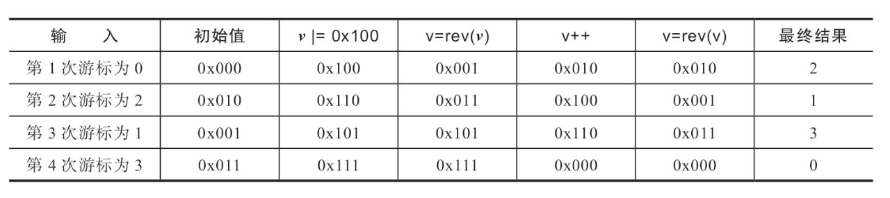
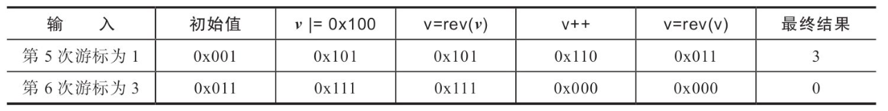

## 字典

### 1. 基本概念

字典又称散列表，是用来存储键值 (key-value) 对的一种数据结构，在很多高级语言中都有实现。但是C语言没有 这种数据结构，Redis 是 K-V 型数据库，整个数据库是用字典来存储的，对 Redis 数据库进行任何增、删、改、查操作，实际就是对字典中的数据进行增、删、改、查操作。

根据Redis数据库的特点，便可知字典有如下特征。 

1.  可以存储海量数据，键值对是映射关系，可以根据键以 $O(1)$ 的时间复杂度取出或插入关联值。
2.  键值对中键的类型可以是字符串、整型、浮点型等，且键是唯一的。例如：执行 set test "hello world"命令，此时的键 test 类型为字符串，如 test 这个键存在数据库中，则为修改操作，否则为插入操作。
3.  键值对中值的类型可为 String、Hash、List、Set、 SortedSet。

### 2. Redis 字典的实现

Redis 字典实现依赖的数据结构主要包含了三部分：字典、Hash 表、Hash 表节点。字典中嵌入了两个 Hash 表，Hash 表中的 table 字段存放着 Hash 表节点，Hash 表节点对应存储的是键值对。

**1. Hash 表**

在 Redis 源码中取名为 Hash 表，其数据结构如下:

```c
/* This is our hash table structure. Every dictionary has two of this as we
 * implement incremental rehashing, for the old to the new table. */
typedef struct dictht {
    dictEntry **table; 			/*指针数组，用于存储键值对*/
    unsigned long size;			/*table数组的大小*/
    unsigned long sizemask;		/*掩码 = size - 1 */
    unsigned long used;			/*table数组已存元素个数，包含next单链表的数据*/
} dictht;
```

Hash 表的结构体整体占用 32 字节，其中 table 字段是数组，作用是存储键值对，该数组中的元素指向的是 dictEntry 的结构体，每个 dictEntry 里面存有键值对。size 表示 table 数组的总大小。used 字段记录着 table 数组已存键值对个数。sizemask 字段用来计算键的索引值，sizemask 的值恒等于 size– 1。

**2. Hash 表节点**

Hash 表中的元素是用 dictEntry 结构体来封装的，主要作用是存储键值对，具体结构体如下：

```c
typedef struct dictEntry {
    void *key;
    union {
        void *val;
        uint64_t u64;
        int64_t s64;
        double d;
    } v;
    struct dictEntry *next;
} dictEntry;
```

Hash 表中元素结构体和我们前面自定义的元素结构体类似，整体占用 24 字节，key 字段存储的是键值对中的键。v 字段是个联合体，存储的是键值对中的值，在不同场景下使用不同字段。例如，用字典存储整个 Redis 数据库所有的键值对时，用的是 *val 字段，可以指向不同类型的值；再比如，字典被用作记录键的过期时间时，用的是 s64 字段存储；当出现了 Hash 冲突时，next 字段用来指向冲突的元素，通过头插法，形成单链表。

**示例：** 有 3 个键值对，分别依次添加 k2=>v2、k1=>v1、k3=>v3，假设 k1 与 k2 Hash 出现冲突，那么这是 3 个键值对在字典中存储结构示意图如下图所示。

.png)

**3. 字典**

Redis 字典实现除了包含前面介绍的两个结构体 Hash 表及 Hash 表节点外，还在最外面层封装了一个叫字典的数据结构，其主要作用是对散列表再进行一层封装，当字典需要进行一些特殊操作时要用到里面的辅助字段。具体结构体如下:

```c
typedef struct dict {
    dictType *type;		/*该字典对应的特定操作函数*/
    void *privdata;		/*该字典依赖的数据*/
    dictht ht[2];		/*Hash表，键值对存储在此*/
    long rehashidx; 	/* rehashing not in progress if rehashidx == -1 */
    unsigned long iterators; /* number of iterators currently running */
} dict;
```

字典这个结构体整体占用 96 字节，其中 type 字段，指向 dictType 结构体，里面包含了对该字典操作的函数指针，具体如下:

```c
typedef struct dictType {
    uint64_t (*hashFunction)(const void *key);			/*该字典对应的Hash函数*/
    void *(*keyDup)(void *privdata, const void *key);	/*键对应的复制函数*/
    void *(*valDup)(void *privdata, const void *obj);	/*值对应的复制函数*/
    int (*keyCompare)(void *privdata, const void *key1, const void *key2);/*键的比对函数*/
    void (*keyDestructor)(void *privdata, void *key);	/*键的销毁函数*/
    void (*valDestructor)(void *privdata, void *obj);	/*值的销毁函数*/
} dictType;
```

Redis 字典这个数据结构，除了主数据库的 K-V 数据存储外，还有很多其他地方会用到。例如，Redis的哨兵模式，就用字典存储管理所有的 Master 节点及 Slave 节点；再如，数据库中键值对的值为 Hash 类型时，存储这个 Hash 类型的值也是用的字典。在不同的应用中，字典中的键值对形态都可能不同，而 dictType 结构体，则是为了实现各种形态的字典而抽象出来的一组操作函数。

-   privdata字段，私有数据，配合 type 字段指向的函数一起使用。
-   ht 字段，是个大小为 2 的数组，该数组存储的元素类型为 dictht， 虽然有两个元素，但一般情况下只会使用 ht[0] ，只有当该字典扩容、 缩容需要进行 rehash 时，才会用到 ht[1]。
-   rehashidx 字段，用来标记该字典是否在进行 rehash，没进行 rehash 时，值为 -1，否则，该值用来表示 Hash 表 ht[0] 执行 rehash 到了哪个元素，并记录该元素的数组下标值。
-   iterators 字段，用来记录当前运行的安全迭代器数，当有安全迭代器绑定到该字典时，会暂停 rehash 操作。Redis 很多场景下都会用到迭代器，例如：执行keys命令会创建一个安全迭代器，此时 iterators 会加 1，命令执行完毕则减 1，而执行 sort 命令时会创建普通迭代器，该字段不会改变。

一个完整的Redis字典的数据结构如下图所示。


### 3. 基本操作

#### 3.1 字典初始化

在 redis-server 启动中，整个数据库会先初始化一个空的字典用于存储整个数据库的键值对。初始化一个空字典，调用的是 dict.h 文件中的 dictCreate 函数，对应源码为:

```c
/* Create a new hash table */
dict *dictCreate(dictType *type,
        void *privDataPtr)
{
    dict *d = zmalloc(sizeof(*d));

    _dictInit(d,type,privDataPtr);
    return d;
}

/* Initialize the hash table */
int _dictInit(dict *d, dictType *type,
        void *privDataPtr)
{
    _dictReset(&d->ht[0]);
    _dictReset(&d->ht[1]);
    d->type = type;
    d->privdata = privDataPtr;
    d->rehashidx = -1;
    d->iterators = 0;
    return DICT_OK;
}
```

dictCreate 函数初始化一个空字典的主要步骤为：申请空间、调用 \_\_dictInit 函数，给字典的各个字段赋予初始值。初始化后，一个字典内存占用情况如下图所示。


### 3.2 添加元素

redis-server 启动完后，再启动 redis-cli 连上 Server，执行命令 "set k1 v1”：

```shell
➜  ~ redis-cli                
127.0.0.1:6379> set k1 v1
OK
127.0.0.1:6379> 

```

上述命令是给 Server 的空数据库添加第一对键值对，Server 端收到命令后，最终会执行到 setKey(redisDb \*db, robj \*key, robj \*val) 函 数，添加需要经过这么几步来完成：先查找该键是否存在，存在则执行修改，否则添加键值对。而 setKey 函数的主要逻辑也是如此，其主要流程如下。

**第1步:** 调用 dictFind 函数，查询键是否存在，是则调用 dbOverwrite 函数修改键值对，否则调用 dbAdd 函数添加元素。

**第2步:** dbAdd 最终调用 dict.h 文件中的 dictAdd 函数插入键值对。

 

继续查看 dictAdd 函数是如何插入键值对的，其源码如下:

```c
/* Add an element to the target hash table */
int dictAdd(dict *d, void *key, void *val)
{
    dictEntry *entry = dictAddRaw(d,key,NULL);

    if (!entry) return DICT_ERR;
    dictSetVal(d, entry, val);
    return DICT_OK;
}
```

1.  调用 dictAddRaw 函数，添加键，字典中键已存在则返回 NULL，否则添加键至 Hash 表中，并返回新加的 Hash 节点。
2.  给返回的新节点设置值，即更新其 val 字段。

dictAddRaw 函数如何做到添加键与查找键，其源码如下:

```c
/* Low level add or find:
 * This function adds the entry but instead of setting a value returns the
 * dictEntry structure to the user, that will make sure to fill the value
 * field as he wishes.
 *
 * This function is also directly exposed to the user API to be called
 * mainly in order to store non-pointers inside the hash value, example:
 *
 * entry = dictAddRaw(dict,mykey,NULL);
 * if (entry != NULL) dictSetSignedIntegerVal(entry,1000);
 *
 * Return values:
 *
 * If key already exists NULL is returned, and "*existing" is populated
 * with the existing entry if existing is not NULL.
 *
 * If key was added, the hash entry is returned to be manipulated by the caller.
 */
dictEntry *dictAddRaw(dict *d, void *key, dictEntry **existing)
{
    long index;
    dictEntry *entry;
    dictht *ht;

    if (dictIsRehashing(d)) _dictRehashStep(d);

    /* Get the index of the new element, or -1 if
     * the element already exists. */
    if ((index = _dictKeyIndex(d, key, dictHashKey(d,key), existing)) == -1)
        return NULL;

    /* Allocate the memory and store the new entry.
     * Insert the element in top, with the assumption that in a database
     * system it is more likely that recently added entries are accessed
     * more frequently. */
    ht = dictIsRehashing(d) ? &d->ht[1] : &d->ht[0];
    entry = zmalloc(sizeof(*entry));
    entry->next = ht->table[index];
    ht->table[index] = entry;
    ht->used++;

    /* Set the hash entry fields. */
    dictSetKey(d, entry, key);
    return entry;
}
```

dictAddRaw 函数主要作用是添加或查找键，添加成功返回新节点，查找成功返回 NULL 并把老节点存入 existing 字段。该函数中比较核心的是调用 \__dictKeyIndex 函数，作用是得到键的索引值，索引值获取与前文介绍的函数类似，主要有这么两步:

```c
	dictHashKey(d,key) 					//第1步:调用该字典的Hash函数得到键的Hash值 
    idx = hash & d->ht[table].sizemask; //第2步:用键的Hash值与字典掩码取与，得到索引值
```

dictAddRaw 函数拿到键的索引值后则可直接定位『键值对』要存入的位置，新创建一个节点存入即可。执行完添加键值对操作后，字典对应的内存占用结构示意图，如下图所示。

.png)

**1. 字典扩容**

随着 Redis 数据库添加操作逐步进行，存储键值对的字典会出现容量不足，达到上限，此时就需要对字典的 Hash 表进行扩容，扩容对应的源码是 dict.c 文件中的 dictExpand 函数，对应源码如下:

```c
/* Expand or create the hash table */
int dictExpand(dict *d, unsigned long size)
{
    /* the size is invalid if it is smaller than the number of
     * elements already inside the hash table */
    if (dictIsRehashing(d) || d->ht[0].used > size)
        return DICT_ERR;

    dictht n; /* the new hash table */
    unsigned long realsize = _dictNextPower(size);

    /* Rehashing to the same table size is not useful. */
    if (realsize == d->ht[0].size) return DICT_ERR;

    /* Allocate the new hash table and initialize all pointers to NULL */
    n.size = realsize;
    n.sizemask = realsize-1;
    n.table = zcalloc(realsize*sizeof(dictEntry*));
    n.used = 0;

    /* Is this the first initialization? If so it's not really a rehashing
     * we just set the first hash table so that it can accept keys. */
    if (d->ht[0].table == NULL) {
        d->ht[0] = n;
        return DICT_OK;
    }

    /* Prepare a second hash table for incremental rehashing */
    d->ht[1] = n;
    d->rehashidx = 0;
    return DICT_OK;
}
```

扩容主要流程为：

1.  申请一块新内存，初次申请时默认容量大小为 4 个 dictEntry；非初次申请时，申请内存的大小则为当前 Hash 表容量的一倍。
2.  把新申请的内存地址赋值给 ht[1]，并把字典的 rehashidx 标识由 -1 改为 0，表示之后需要进行 rehash 操作。此时字典的内存结构示意图为下图所示。


扩容后，字典容量及掩码值会发生改变，同一个键与掩码经位运算后得到的索引值就会发生改变，从而导致根据键查找不到值的情况。解决这个问题的方法是，新扩容的内存放到一个全新的Hash表中 (ht[1])，并给字典打上在进行 rehash 操作中的标识 (即 rehashidx!=-1)。此后，新添加的键值对都往新的 Hash 表中存储；而修改、删除、查找操作需要在 ht[0]、ht[1] 中进行检查，然后再决定去对哪个 Hash 表操作。除此之外，还需要把老 Hash 表(ht[0]) 中的数据重新计算索引值后全部迁移插入到新的 Hash 表 (ht[1]) 中，此迁移过程称作 rehash，我们下面看 rehash 的实现。

**2. 渐进式 rehash**

rehash 除了扩容时会触发，缩容时也会触发。Redis 整个 rehash 的实现，主要分为如下几步完成。

1.  给 Hash 表 ht[1] 申请足够的空间；扩容时空间大小为当前容量 \*2，即 d->ht[0].used*2；当使用量不到总空间 10% 时，则进行缩容。缩容时空间大小则为能恰好包含 d->ht[0].used 个节点的 2^N^ 次方幂整数，并把字典中字段 rehashidx 标识为 0。
2.  进行 rehash 操作调用的是 dictRehash 函数，重新计算 ht[0] 中每个键的 Hash 值与索引值(重新计算就叫rehash) ，依次添加到新的 Hash 表 ht[1]，并把老 Hash 表中该键值对删除。把字典中字段 rehashidx 字段修改为 Hash 表 ht[0] 中正在进行 rehash 操作节点的索引值。
3.  rehash 操作后，清空 ht[0]，然后对调一下 ht[1] 与 ht[0] 的值，并把字典中 rehashidx 字段标识为 -1。

我们知道，Redis 可以提供高性能的线上服务，而且是单进程模式，当数据库中键值对数量达到了百万、千万、亿级别时，整个 rehash 过程将非常缓慢，如果不优化 rehash 过程，可能会造成很严重的服务不可用现象。Redis 优化的思想很巧妙，利用分而治之的思想了进行rehash操作，大致的步骤如下。

执行插入、删除、查找、修改等操作前，都先判断当前字典 rehash 操作是否在进行中，进行中则调用dictRehashStep 函数进行 rehash 操作(每次只对 1 个节点进行 rehash 操作，共执行 1 次)。除这些操作之外，当服务空闲时，如果当前字典也需要进行 rehsh 操作， 则会调用 incrementallyRehash 函数进行批量 rehash 操作(每次对 100 个节点进行 rehash 操作，共执行 1 毫秒)。在经历 N 次 rehash 操作后，整个 ht[0] 的数据都会迁移到 ht[1] 中，这样做的好处就把是本应集中处理的时间分散到了上百万、千万、亿次操作中，所以其耗时可忽略不计。

经过渐进式 rehash 后的结构示意图如下图所示。


#### 3.3 查找元素

客户端读取 k1 的值：

```shell
127.0.0.1:6379> get k1
"v1"
```

Server 收到 get 命令后，最终查找键值对会执行到 dict.c 文件中的 dictFind 函数，源码如下:

```c
dictEntry *dictFind(dict *d, const void *key)
{
    dictEntry *he;
    uint64_t h, idx, table;

    if (d->ht[0].used + d->ht[1].used == 0) return NULL; /* dict is empty */
    if (dictIsRehashing(d)) _dictRehashStep(d);
    h = dictHashKey(d, key);
    for (table = 0; table <= 1; table++) {
        idx = h & d->ht[table].sizemask;
        he = d->ht[table].table[idx];
        while(he) {
            if (key==he->key || dictCompareKeys(d, key, he->key))
                return he;
            he = he->next;
        }
        if (!dictIsRehashing(d)) return NULL;
    }
    return NULL;
}
```

查找键的源码，整个过程比较简单，主要分如下几个步骤。

1.  根据键调用 Hash 函数取得其 Hash 值。
2.  根据 Hash 值取到索引值。
3.  遍历字典的两个 Hash 表，读取索引对应的元素。
4.  遍历该元素单链表，如找到了与自身键匹配的键，则返回该元素。
5.  找不到则返回 NULL。

#### 3.4 修改元素

客户端输入：

```shell
127.0.0.1:6379> set k1 v1_update
OK
```

Server 收到 set 命令后，会查询键是否已经在数据库中存在，存在则最终会执行 db.c 文件中的 dbOverwrite 函数，其源码如下:

```c
/* Overwrite an existing key with a new value. Incrementing the reference
 * count of the new value is up to the caller.
 * This function does not modify the expire time of the existing key.
 *
 * The program is aborted if the key was not already present. */
void dbOverwrite(redisDb *db, robj *key, robj *val) {
    dictEntry *de = dictFind(db->dict,key->ptr);

    serverAssertWithInfo(NULL,key,de != NULL);
    dictEntry auxentry = *de;
    robj *old = dictGetVal(de);
    if (server.maxmemory_policy & MAXMEMORY_FLAG_LFU) {
        val->lru = old->lru;
    }
    dictSetVal(db->dict, de, val);

    if (server.lazyfree_lazy_server_del) {
        freeObjAsync(old);
        dictSetVal(db->dict, &auxentry, NULL);
    }

    dictFreeVal(db->dict, &auxentry);
}
```

修改键的源码，虽然没有调用 dict.h 中的方法去修改字典中元素，但修改过程基本类似，Redis 修改键值对，整个过程主要分如下几个步骤:

1.  调用 dictFind 查找键是否存在；
2.  不存在则中断执行
3.  修改节点键值对中的值为新值；
4.  释放旧值内存。

### 3.5 删除元素

客户端输入：

```shell
127.0.0.1:6379> del k1
(integer) 1
```

Server 收到 del 命令后，最终删除键值对会执行 dict.h 文件中的 dictDelete 函数，其主要的执行过程为:

1.  查找该键是否存在于该字典中；
2.  存在则把该节点从单链表中剔除；
3.  释放该节点对应键占用的内存、值占用的内存，以及本身占用的内存；
4.  给对应的 Hash 表的 used 字典减 1 操作。

当字典中数据经过一系列操作后，使用量不到总空间 <10% 时， 就会进行缩容操作，将 Redis 数据库占用内存保持在合理的范围内，不浪费内存。

### 4. 字典的遍历

遍历数据库的原则为：1. 不重复出现数据；2. 不遗漏任何数据。

遍历Redis整个数据库主要有两种方式：全遍历 (例如 keys 命令)、间断遍历 (hscan 命令)。

#### 4.1 迭代器遍历

字典迭代器主要用于迭代字典这个数据结构中的数据，既然是迭代字典中的数据，必然会出现一个问题，迭代过程中，如果发生了数据增删，则可能导致字典触发 rehash 操作，或迭代开始时字典正在进行 rehash 操作，从而导致一条数据可能多次遍历到。

Redis 源码中迭代器实现的基本数据结构如下:

```c
/* If safe is set to 1 this is a safe iterator, that means, you can call
 * dictAdd, dictFind, and other functions against the dictionary even while
 * iterating. Otherwise it is a non safe iterator, and only dictNext()
 * should be called while iterating. */
typedef struct dictIterator {
    dict *d;
    long index;
    int table, safe;
    dictEntry *entry, *nextEntry;
    /* unsafe iterator fingerprint for misuse detection. */
    long long fingerprint;
} dictIterator;
```

整个数据结构占用了 48 字节，其中 d 字段指向需要迭代的字典；

index 字段代表当前读取到 Hash 表中哪个索引值；

table 字段表示当前正在迭代的 Hash 表 (即 ht[0] 与 ht[1] 中的 0 和 1)；

safe 字段表示当前创建的迭代器是否为安全模式；

entry 字段表示正在读取的节点数据；

nextEntry 字段表示 entry 节点中的 next 字段所指向的数据。

fingerprint 字段是一个 64 位的整数，表示在给定时间内字典的状态。在这里称其为字典的指纹，因为该字段的值为字典 (dict 结构体) 中所有字段值组合在一起生成的 Hash 值，所以当字典中数据发生任何变化时，其值都会不同，生成算法源码 dict.c 文件中的 dictFingerprint 函数。

```c
/* A fingerprint is a 64 bit number that represents the state of the dictionary
 * at a given time, it's just a few dict properties xored together.
 * When an unsafe iterator is initialized, we get the dict fingerprint, and check
 * the fingerprint again when the iterator is released.
 * If the two fingerprints are different it means that the user of the iterator
 * performed forbidden operations against the dictionary while iterating. */
long long dictFingerprint(dict *d) {
    long long integers[6], hash = 0;
    int j;

    integers[0] = (long) d->ht[0].table;
    integers[1] = d->ht[0].size;
    integers[2] = d->ht[0].used;
    integers[3] = (long) d->ht[1].table;
    integers[4] = d->ht[1].size;
    integers[5] = d->ht[1].used;

    /* We hash N integers by summing every successive integer with the integer
     * hashing of the previous sum. Basically:
     *
     * Result = hash(hash(hash(int1)+int2)+int3) ...
     *
     * This way the same set of integers in a different order will (likely) hash
     * to a different number. */
    for (j = 0; j < 6; j++) {
        hash += integers[j];
        /* For the hashing step we use Tomas Wang's 64 bit integer hash. */
        hash = (~hash) + (hash << 21); // hash = (hash << 21) - hash - 1;
        hash = hash ^ (hash >> 24);
        hash = (hash + (hash << 3)) + (hash << 8); // hash * 265
        hash = hash ^ (hash >> 14);
        hash = (hash + (hash << 2)) + (hash << 4); // hash * 21
        hash = hash ^ (hash >> 28);
        hash = hash + (hash << 31);
    }
    return hash;
}
```

**1. 普通迭代器**

普通迭代器迭代字典中数据时，会对迭代器中 fingerprint 字段的值作严格的校验，来保证迭代过程中字典结构不发生任何变化，确保读取出的数据不出现重复。

当 Redis 执行部分命令时会使用普通迭代器迭代字典数据，例如 sort 命令。sort 命令主要作用是对给定列表、集合、有序集合的元素进行排序，如果给定的是有序集合，其成员名存储用的是字典，分值存储用的是跳跃表，则执行 sort 命令读取数据的时候会用到迭代器来遍历整个字典。

普通迭代器迭代数据的过程比较简单，主要分为如下几个步骤。

1.  调用 dictGetIterator 函数初始化一个普通迭代器，此时会把 iter->safe 值置为 0，表示初始化的迭代器为普通迭代器，初始化后的结构示意图如下图所示。

    

2.  循环调用 dictNext 函数依次遍历字典中 Hash 表的节点，首次遍历时会通过 dictFingerprint 函数拿到当前字典的指纹值，此时结构示意图如下图所示。

    

3.  当调用 dictNext 函数遍历完字典 Hash 表中节点数据后，释放迭代器时会继续调用 dictFingerprint 函数计算字典的指纹值，并与首次拿到的指纹值比较，不相等则输出异常『\=\=\=ASSERTION FAILED===』，且退出程序执行。

普通迭代器通过步骤1、步骤3的指纹值对比，来限制整个迭代过程中只能进行迭代操作，即迭代过程中字典数据的修改、添加、删除、查找等操作都不能进行，只能调用 dictNext 函数迭代整个字典， 否则就报异常，由此来保证迭代器取出数据的准确性。

**2. 安全迭代器**

安全迭代器和普通迭代器迭代数据原理类似，也是通过循环调用 dictNext 函数依次遍历字典中 Hash 表的节点。安全迭代器确保读取数据的准确性，不是通过限制字典的部分操作来实现的，而是通过限制 rehash 的进行来确保数据的准确性，因此迭代过程中可以对字典进行增删改查等操作。

dictRehashStep 函数源码实现:

```c
/* This function performs just a step of rehashing, and only if there are
 * no safe iterators bound to our hash table. When we have iterators in the
 * middle of a rehashing we can't mess with the two hash tables otherwise
 * some element can be missed or duplicated.
 *
 * This function is called by common lookup or update operations in the
 * dictionary so that the hash table automatically migrates from H1 to H2
 * while it is actively used. */
static void _dictRehashStep(dict *d) {
    if (d->iterators == 0) dictRehash(d,1);
}
```

原理上很简单，如果当前字典有安全迭代器运行，则不进行渐进式 rehash 操作，rehash 操作暂停，字典中数据就不会被重复遍历，由此确保了读取数据的准确性。

当 Redis 执行部分命令时会使用安全迭代器迭代字典数据，例如 keys 命令。keys 命令主要作用是通过模式匹配，返回给定模式的所有 key 列表，遇到过期的键则会进行删除操作。Redis 数据键值对都存储在字典中，因此 keys 命令会通过安全迭代器来遍历整个字典。安全迭代器整个迭代过程也较为简单，主要分如下几个步骤。

**第1步:** 调用 dictGetSafeIterator 函数初始化一个安全迭代器， 此时会把 iter->safe 值置为 1，表示初始化的迭代器为安全迭代器，初始化完后的结构示意图与普通迭代器类似，safe 字段置为 1。

**第2步:** 循环调用 dictNext 函数依次遍历字典中 Hash 表的节点， 首次遍历时会把字典中 iterators 字段进行加 1 操作，确保迭代过程中渐进式 rehash 操作会被中断执行。

**第3步:** 当调用 dictNext 函数遍历完字典 Hash 表中节点数据后， 释放迭代器时会把字典中 iterators 字段进行减 1操作，确保迭代后渐进式 rehash 操作能正常进行。

安全迭代器是通过步骤1、步骤3中对字典的 iterators 字段进行修改，使得迭代过程中渐进式 rehash 操作被中断，由此来保证迭代器读取数据的准确性。

#### 4.2 间断遍历

当数据库中有海量数据时，执行 keys 命令进行一次数据库全遍历，耗时肯定不短，会造成短暂的 Redis 不可用，所以在 Redis 在 2.8.0 版本后新增了 scan 操作，也就是『间断遍历』。而 dictScan 是『间断遍历』中的一 种实现，主要在迭代字典中数据时使用，例如 hscan 命令迭代整个数据库中的 key，以及 zscan 命令迭代有序集合所有成员与值时，都是通过 dictScan 函数来实现的字典遍历。dictScan 遍历字典过程中是可以进行 rehash 操作的，通过算法来保证所有的数据能被遍历到。

dictScan 函数参数介绍:

```c
unsigned long dictScan(dict *d, unsigned long v, dictScanFunction *fn, 		dictScanBucketFunction *bucketfn, void *privdata);
```

变量 d 是当前迭代的字典；

变量 v 标识迭代开始的游标 (即 Hash 表中数组索引)，每次遍历后会返回新的游标值，整个遍历过程都是围绕这个游标值的改动进行，来保证所有的数据能被遍历到；

fn 是函数指针，每遍历一个节点则调用该函数处理；

bucketfn 函数在整理碎片时调用；

privdata 是回调函数 fn 所需参数。

 

dictScan 函数间断遍历字典过程中会遇到如下 3 种情况。

1.  从迭代开始到结束，散列表没有进行 rehash 操作。
2.  从迭代开始到结束，散列表进行了扩容或缩容操作，且恰好为两次迭代间隔期间完成了 rehash 操作。
3.  从迭代开始到结束，某次或某几次迭代时散列表正在进行 rehash 操作。

**1. 遍历过程中始终未遇到 rehash 操作**

每次迭代都没有遇到 rehash 操作，也就是遍历字典只遇到第 1 或第 2 种情况。其实第 1 种情况，只要依次按照顺序遍历 Hash 表 ht[0] 中节点即可，第 2 种情况因为在遍历的整个过程中，期间字典可能发生了扩容或缩容操作，如果依然按照顺序遍历，则可能会出现数据重复读取的现象。


例如上图中所示，下标为 0 的键值对在扩容一次后可能分布在下标为 0 或 4 的节点中，倘若第 1 次遍历了 0 下标节点的数据，第 2 次遍历时字典已经进行了一次扩容操作，后续若依次遍历，则原先 0 下标节点的数据可能重复出现。Redis 为了做到不漏数据且尽量不重复数据，统一采用了一种叫作 reverse binary iteration 的方法来进行间断数据迭代，接下来看下其主要源码实现，迭代的代码如下:

```c
		t0 = &(d->ht[0]);
        m0 = t0->sizemask;

        /* Emit entries at cursor */
        if (bucketfn) bucketfn(privdata, &t0->table[v & m0]);
        de = t0->table[v & m0];
        while (de) {
            next = de->next;
            fn(privdata, de);
            de = next;
        }
```

整个迭代过程强依赖游标值 v 变量，根据 v 找到当前需读取的 Hash 表元素，然后遍历该元素单链表上所有的键值对，依次执行 fn 函数指针执行的函数，对键值对进行读取操作。

为了兼容迭代间隔期间可能发生的缩容与扩容操作，每次迭代时都会对 v 变量 (游标值) 进行修改，以确保迭代出的数据无遗漏，游标具体变更算法为:

```c
		/* Set unmasked bits so incrementing the reversed cursor
         * operates on the masked bits */
        v |= ~m0;

        /* Increment the reverse cursor */
        v = rev(v);
        v++;
        v = rev(v);
```

**第 1 种假设：**『 假设 Hash 表大小为 4 ，迭代从始至终未进行扩容缩容操作 』，此时数组的掩码为 m0=0x11，~m0=0x100 ，游标值的变化下图所示。



因此整个表遍历顺序为，0、2、1、3的顺序，恰好把所有的节点遍历完。

**第 2 种假设：**『假设 Hash 表大小为 4，进行第 3 次迭代时，Hash 表扩容到了 8 』，表为 4 时，数组的掩码为 m0=0x11，~m0=0x100， 游标值的变化顺序下图所示。


进行第 3 次迭代时，表大小扩容到了 8，数组的掩码 m0=0x111， ~m0=0x1000，接下来游标值的变化顺序如下图所示。


此时，迭代只进行 6 次就完成了，顺序为 0、2、1、5、 3、7，扩容后少遍历了 4、6，因为游标为 0、2的数据在扩容前已经迭代完，而 Hash 表大小从 4 扩容至 8，再经过 rehash 后，游标为 0、2 的数据可能会分布在 0|4、2|6 上，因此扩容后的游标 4、6 不需要再迭 代，扩容后新老 Hash 表数据的逻辑对应关系如下图所示。


第 3 种假设：『 假设 Hash 表大小为 8，迭代进行到了第 5 次时， Hash 表缩容到了 4  』，Hash 表为 8 时，数组的掩码为 m0=0x111， ~m0=0x1000，游标值的变化顺序如下图所示。


进行第 5 次迭代时，Hash 表大小缩容到了 4，数组的掩码为 m0=0x11，~m0=0x100，接下来游标值的变化顺序如下图所示。



同样，迭代只进行 6 次就迭代完了，顺序为 0、4、2、6、1、3， 缩容后少遍历了 0、2，因为游标为 0、2 的数据在缩容前已经迭代完， 而 Hash 表大小从缩容至 4，再经过 rehash 后，游标为 0、2 的数据缩容前会分布在 0|4、2|6 上，而这 4 个对应缩容前的游标都已经遍历，缩容后则无须重复遍历。

根据前面 3 种假设逐步分析可知，只要是遍历的时候没有遇到 rehash 正好在进行中，通过上述游标变更算法，不管中间是否经历了缩容/扩容，都可以遍历完整个 Hash 表，不遗漏任何数据。这里还有一种特殊的情况没说明，比如多次间断遍历的时候该字典缩容了两次， 则可能造成遍历的数据出现重复，但现实生产环境中，一般 Redis 短时间内频繁缩容了两次的概率不大，因此影响也有限。

**2. 遍历过程遇到 rehash 操作**

从迭代开始到结束，某次或某几次迭代时散列表正在进行 rehash 操作，rehash 操作中会同时并存两个 Hash 表：一张为扩容或缩容后的表 ht[1]，一张为老表 ht[0]，ht[0] 的数据通过渐进式 rehash 会逐步迁移到 ht[1] 中，最终完成整个迁移过程。

因为大小两表并存，所以需要从 ht[0] 和 ht[1] 中都取出数据，整个遍历过程为：先找到两个散列表中更小的表，先对小的 Hash 表遍历， 然后对大的 Hash 表遍历，迭代的代码如下:

```c
		t0 = &d->ht[0];
        t1 = &d->ht[1];

        /* Make sure t0 is the smaller and t1 is the bigger table */
        if (t0->size > t1->size) {
            t0 = &d->ht[1];
            t1 = &d->ht[0];
        }

        m0 = t0->sizemask;
        m1 = t1->sizemask;

        /* Emit entries at cursor */
        if (bucketfn) bucketfn(privdata, &t0->table[v & m0]);
        de = t0->table[v & m0];
        while (de) {
            next = de->next;
            fn(privdata, de);
            de = next;
        }

        /* Iterate over indices in larger table that are the expansion
         * of the index pointed to by the cursor in the smaller table */
        do {
            /* Emit entries at cursor */
            if (bucketfn) bucketfn(privdata, &t1->table[v & m1]);
            de = t1->table[v & m1];
            while (de) {
                next = de->next;
                fn(privdata, de);
                de = next;
            }

            /* Increment the reverse cursor not covered by the smaller mask.*/
            v |= ~m1;
            v = rev(v);
            v++;
            v = rev(v);

            /* Continue while bits covered by mask difference is non-zero */
        } while (v & (m0 ^ m1));
```

结合 rehash 中游标变更算法，为了让大家更好地理解该算法及整个迭代过程，举个例子简单讲解这种情况下迭代的顺序：假设 Hash 表大小为 8，扩容到 16，迭代从始至终每次迭代都在进行 rehash 操作， 接下来两张表数据遍历次序如下图所示。


针对这种情况，ht[0] 表的迭代顺序为：0、4、2、6、1、5、 3、7，恰好整张表都迭代完，不遗漏也不重复任何数据，而 ht[1] 表也依次对每个节点进行了迭代，不遗漏也不重复迭代数据。

这套算法能满足这样的特点，主要是巧妙地利用了扩容及缩容正好为整数倍增长或减少的原理，根据这个特征，很容易就能推导出同一个节点的数据扩容/缩容后在新的 Hash 表中的分布位置，从而避免了重复遍历或漏遍历。

### 5. API 列表

字典的所有API方法声明都在 dict.h 文件中，具体每个API的作用如下:

```c
/* API */
dict *dictCreate(dictType *type, void *privDataPtr);			// 初始化字典
int dictExpand(dict *d, unsigned long size);					// 字典扩容
int dictAdd(dict *d, void *key, void *val);						// 添加键值对，已存在则不添加
dictEntry *dictAddRaw(dict *d, void *key, dictEntry **existing);// 添加key，并返回新添加的key对应的节点。若已存在，则存入existing字段，并返回-1
dictEntry *dictAddOrFind(dict *d, void *key);					// 添加或查找key 
int dictReplace(dict *d, void *key, void *val);					// 添加键值对，若存在则修改，否则添加
int dictDelete(dict *d, const void *key);						// 删除节点
dictEntry *dictUnlink(dict *ht, const void *key);				// 根据键查找元素
void dictFreeUnlinkedEntry(dict *d, dictEntry *he);				// 根据键查找出值
void dictRelease(dict *d);										// 将字典表的大小调整为包含所有元素的最小值，即收缩字典
dictEntry * dictFind(dict *d, const void *key);
void *dictFetchValue(dict *d, const void *key);
int dictResize(dict *d);
dictIterator *dictGetIterator(dict *d);							// 初始化普通迭代器
dictIterator *dictGetSafeIterator(dict *d);						// 初始化安全迭代器
dictEntry *dictNext(dictIterator *iter);						// 通过迭代器获取下一个节点
void dictReleaseIterator(dictIterator *iter);					// 释放迭代器
dictEntry *dictGetRandomKey(dict *d);							// 随机得到一个键
unsigned int dictGetSomeKeys(dict *d, dictEntry **des, unsigned int count);

void dictGetStats(char *buf, size_t bufsize, dict *d);			// 读取字典的状态、使用情况等
uint64_t dictGenHashFunction(const void *key, int len);			// hash函数-字母大小写敏感
uint64_t dictGenCaseHashFunction(const unsigned char *buf, int len);// Hash函数，字母大小写不敏感
void dictEmpty(dict *d, void(callback)(void*));					// 清空一个字典
void dictEnableResize(void);									// 开启Resize 
void dictDisableResize(void);									// 关闭Resize 
int dictRehash(dict *d, int n);									// 渐进式rehash，n为进行几步
int dictRehashMilliseconds(dict *d, int ms);					// 持续性rehash，ms为持续多久
void dictSetHashFunctionSeed(uint8_t *seed);					// 设置新的散列种子
uint8_t *dictGetHashFunctionSeed(void);							// 获取当前散列种子值
unsigned long dictScan(dict *d, unsigned long v, dictScanFunction *fn, dictScanBucketFunction *bucketfn, void *privdata);				// 间断性的迭代字段数据
uint64_t dictGetHash(dict *d, const void *key);					// 得到键的Hash值
dictEntry **dictFindEntryRefByPtrAndHash(dict *d, const void *oldptr, uint64_t hash);// 使用指针+hash值去查找元素

```

