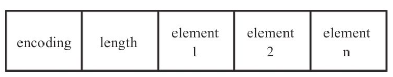
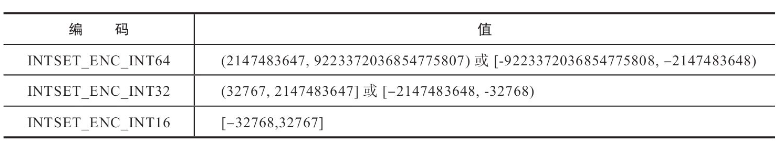
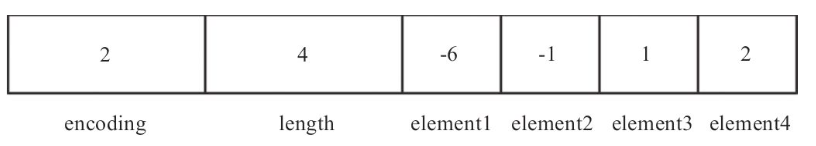
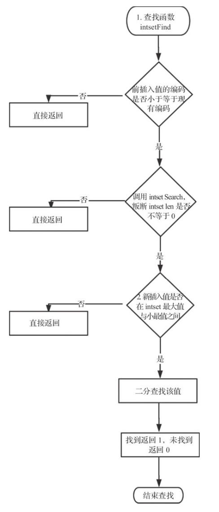
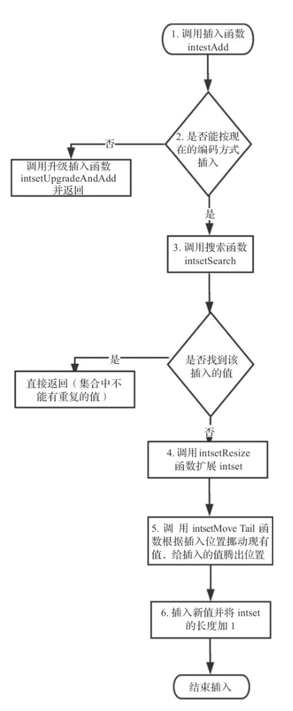
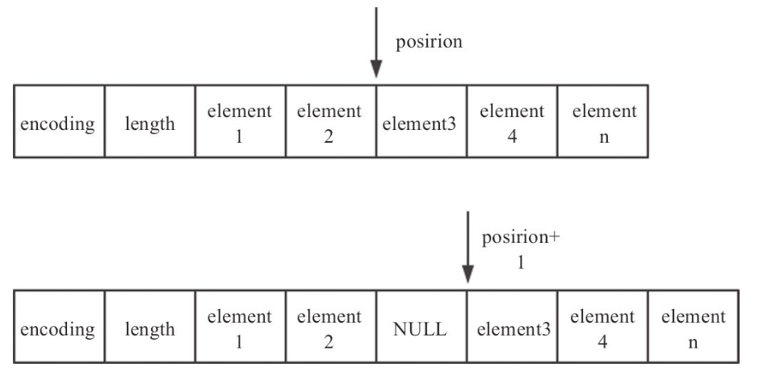
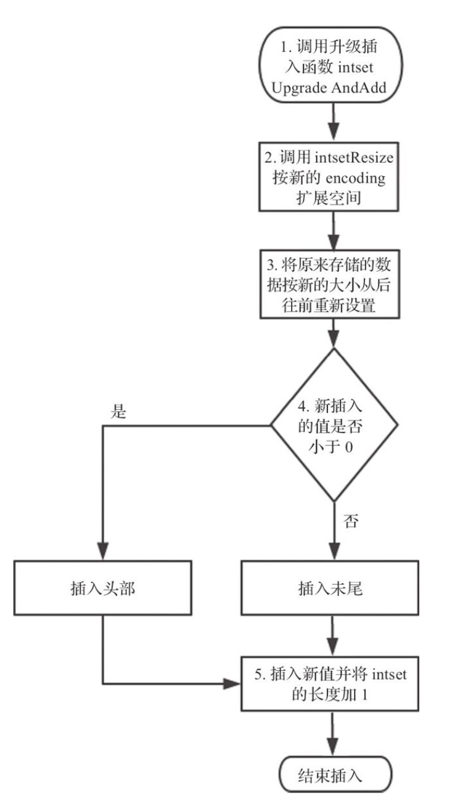
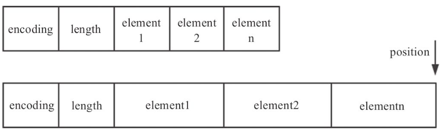
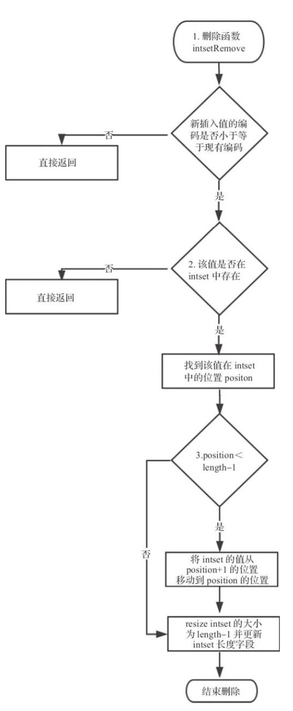
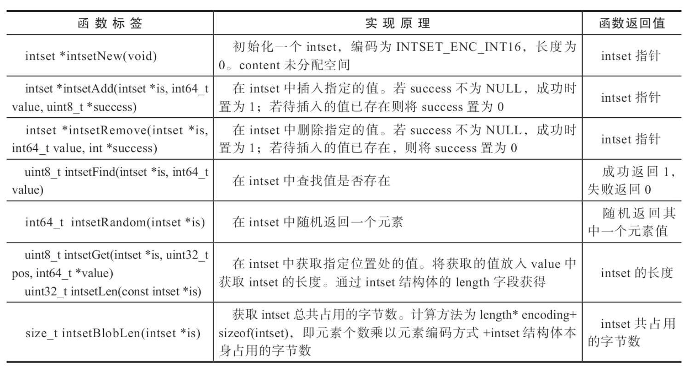

## 整数集合

整数集合 (intset) 是一个有序的、存储整型数据的结构。Redis 是一个内存数据库，所以必须考虑如何能够高效地利用内存。当 Redis 集合类型的元素都是整数并且都处在 64 位有符号整数范围之内时，使用该结构体存储。

在客户端输入如下命令并查看其编码。

```shell
127.0.0.1:6379> sadd testSet 1 2 -1 -6
(integer) 4
127.0.0.1:6379> object encoding testSet
"intset"
```

在两种情况下，底层编码会发生转换。一种情况为当元素个数超过一定数量之后 (默认值为 512)，即使元素类型仍然是整型，也会将编码转换为 hashtable，该值由如下配置项决定:

```xml
set-max-intset-entries 512
```

另一种情况为当增加非整型变量时，例如在集合中增加元素 ‘a' 后，testSet 的底层编码从 intset 转换为 hashtable

```shell
127.0.0.1:6379> sadd testSet 'a'
(integer) 1
127.0.0.1:6379> object encoding testSet
"hashtable"
```

### 1. 数据存储

整数集合在 Redis 中可以保存 int16_t、int32_t、int64_t 类型的整型数据，并且可以保证集合中不会出现重复数据。每个整数集合使用一个 intset 类型的数据结构表示。

```c
typedef struct intset {
    uint32_t encoding;		// 编码类型
    uint32_t length;		// 元素个数
    int8_t contents[];		// 柔性数组,根据 encoding 字段决定几个字节表示一个元素
} intset;
```



encoding：编码类型，决定每个元素占用几个字节。有如下3种类型。

1.  INTSET_ENC_INT16：当元素值都位于 INT16_MIN 和 INT16_MAX 之间时使用。该编码方式为每个元素占用 2 个字节。
2.  INTSET_ENC_INT32：当元素值位于 INT16_MAX 到 INT32_MAX 或者 INT32_MIN 到 INT16_MIN 之间时使用。该编码方式为每个元素占用 4 个字节。
3.  INTSET_ENC_INT64：当元素值位于 INT32_MAX 到 INT64_MAX 或者 INT64_MIN 到 INT32_MIN 之间时使用。该编码方式为每个元素占用 8 个字节。

判断一个值需要什么类型的编码格式，只需要查看该值所处的范围即可。



intset 结构体会根据待插入的值决定是否需要进行扩容操作。扩容会修改 encoding 字段，而 encoding 字段决定了一个元素在 contents 柔性数组中占用几个字节。所以当修改 encoding 字段之后，intset 中原来的元素也需要在 contents 中进行相应的扩展。得到一个简单的结论，只要待插入的值导致了扩容，则该值在待插入的 intset 中**不是最大值就是最小值**。这个结论在下文插入元素时会用到。

encoding 字段在 Redis 中使用宏来表示，其定义如下：

```c
/* Note that these encodings are ordered, so:
 * INTSET_ENC_INT16 < INTSET_ENC_INT32 < INTSET_ENC_INT64. */
#define INTSET_ENC_INT16 (sizeof(int16_t))		// 2
#define INTSET_ENC_INT32 (sizeof(int32_t))		// 4
#define INTSET_ENC_INT64 (sizeof(int64_t))		// 8
```

因为 encoding 字段实际取值为 2、4、8，所以 encoding 字段可以直接比较大小。当待插入值的 encoding 字段大于待插入 intset 的 encoding 时，说明需要进行扩容操作，并且也能表明该待插入值在该 intset 中肯定不存在。

-   length：元素个数。即一个 intset 中包括多少个元素。
-   contents：存储具体元素。根据 encoding 字段决定多少个字节表示一个元素。

按此存储结构，之前示例中生成的 testSet 存储内容如下图所示。



encoding 字段为 2，代表 INTSET_ENC_INT16。length 字段为 4，代表该 intset 中有 4 个元素。根据 encoding 字段，每个元素分别占用两个字节，并且按从小到大的顺序排列，依次为 -6、-1、1 和 2。

### 2. 基本操作

#### 2.1 查询元素

查询元素的入口函数是 intsetFind，该函数首先进行一些防御性判断，如果没有通过判断则直接返回。intset 是按从小到大有序排列的，所以通过防御性判断之后使用二分法进行元素的查找。以下是 Redis 中intset 查询代码的实现:

```c
/* Determine whether a value belongs to this set */
uint8_t intsetFind(intset *is, int64_t value) {
    uint8_t valenc = _intsetValueEncoding(value);
    return valenc <= intrev32ifbe(is->encoding) && intsetSearch(is,value,NULL);
}

/* Search for the position of "value". Return 1 when the value was found and
 * sets "pos" to the position of the value within the intset. Return 0 when
 * the value is not present in the intset and sets "pos" to the position
 * where "value" can be inserted. */
static uint8_t intsetSearch(intset *is, int64_t value, uint32_t *pos) {
    int min = 0, max = intrev32ifbe(is->length)-1, mid = -1;
    int64_t cur = -1;

    /* The value can never be found when the set is empty */
    if (intrev32ifbe(is->length) == 0) {
        if (pos) *pos = 0;
        return 0;
    } else {
        /* Check for the case where we know we cannot find the value,
         * but do know the insert position. */
        if (value > _intsetGet(is,max)) {
            if (pos) *pos = intrev32ifbe(is->length);
            return 0;
        } else if (value < _intsetGet(is,0)) {
            if (pos) *pos = 0;
            return 0;
        }
    }
    while(max >= min) {
        mid = ((unsigned int)min + (unsigned int)max) >> 1;
        cur = _intsetGet(is,mid);
        if (value > cur) {
            min = mid+1;
        } else if (value < cur) {
            max = mid-1;
        } else {
            break;
        }
    }

    if (value == cur) {
        if (pos) *pos = mid;
        return 1;
    } else {
        if (pos) *pos = min;
        return 0;
    }
}
```

intset 查询的具体流程如下图所示。



1.  函数标签 uint8_t intsetFind(intset \*is, int64_t value)。第 1 个参数为待查询的 Intset，第 2 个参数为待查找的值。首先判断待查找的值需要的编码格式，如果编码大于该 intset 的编码，则肯定不存在该值，直接返回，否则调用 intsetSearch 函数。
2.  intsetSearch 函数中首先判断该 intset 中是否有值，无值直接返回0。如果有值再判断待插入的值是否介于此intset 的最大值与最小值之间，如果不在此范围内也返回 0。
3.  因为 intset 是个有序数组，用二分查找法寻找该值，找到返回 1，未找到返回 0。

#### 2.2 添加元素

添加元素的入口函数是 intsetAdd，该函数根据插入值的编码类型和当前 intset 的编码类型决定是直接插入还是先进行 intset 升级再执行插入 (升级插入的函数为 intsetUpgradeAndAdd)。如下是Redis中intset添加元素的代码实现:

```c
/* Insert an integer in the intset */
intset *intsetAdd(intset *is, int64_t value, uint8_t *success) {
    uint8_t valenc = _intsetValueEncoding(value);
    uint32_t pos;
    if (success) *success = 1;

    /* Upgrade encoding if necessary. If we need to upgrade, we know that
     * this value should be either appended (if > 0) or prepended (if < 0),
     * because it lies outside the range of existing values. */
    if (valenc > intrev32ifbe(is->encoding)) {
        /* This always succeeds, so we don't need to curry *success. */
        return intsetUpgradeAndAdd(is,value);
    } else {
        /* Abort if the value is already present in the set.
         * This call will populate "pos" with the right position to insert
         * the value when it cannot be found. */
        if (intsetSearch(is,value,&pos)) {
            if (success) *success = 0;
            return is;
        }

        is = intsetResize(is,intrev32ifbe(is->length)+1);
        if (pos < intrev32ifbe(is->length)) intsetMoveTail(is,pos,pos+1);
    }

    _intsetSet(is,pos,value);
    is->length = intrev32ifbe(intrev32ifbe(is->length)+1);
    return is;
}
```

添加元素的流程如下图所示。



1.  函数标签为 intset \*intsetAdd( intset \*is, int64_t value, uint8_t \*success);，其第 1 个参数为待添加元素的 Intset，第 2 个参数为待插入的值，第 3 个参数选传，如果传递了第 3 个参数，则插入成功时将第 3 个参数 success 的值置为 1，如果该元素已经在集合中存在，则将 success 置为 0。

2.  判断要插入的值需要什么编码格式。如果当前 intset 的编码格式小于待插入值需要的编码格式，则调用  intsetUpgradeAndAdd 函数并返回。

3.  调用 intsetSearch 函数进行查重，即插入的值是否在当前集合中，如果找到了就不能再次插入，直接返回。如果没找到，在 intsetSearch 中会将待插入值需要插入的位置赋值给 position 字段。 position 的计算逻辑也比较简单，

    -   首先如果 intset 为空，则需要将待插入值置于该 intset 的第一个位置，即 position 为 0；
    -   如果待插入值小于 intset 最小值，position 也为 0；
    -   如果待插入值大于 intset 最大值，待插入值需要放到 intset 的最后一个位置，即 position 为 intset 的长度;；
    -   如果上述几种情况都不满足，position 为该 intset 中待插入值小于的第一个数之前的位置。

4.  调用 intsetResize 扩充当前的 intset，即给新插入的值申请好存储空间。假设原来的元素个数为 length，编码方式为 encoding (encoding 决定每个元素占用的空间大小)，则 intsetResize 会重新分配 (realloc) 一块内存，大小为 encoding * (length+1) 个元素的空间。

5.  如果要插入的位置位于原来元素之间，则调用 intsetMoveTail 将 position 开始的数据移动到 position+1 的位置，如下图所示。intsetMoveTail 函数中使用的是 memmove 函数，而非 memcpy 函数。memcpy 函数的目的地址和源地址不能有重叠，否则会发生数据覆盖。而 memmove 地址之间可以有重叠，其实现原理为先将源地址数据拷贝到一个临时的缓冲区中，然后再从缓冲区中逐字节拷贝到 目的地址。

    

```c
static void intsetMoveTail(intset *is, uint32_t from, uint32_t to) {
    void *src, *dst;
    uint32_t bytes = intrev32ifbe(is->length)-from;
    uint32_t encoding = intrev32ifbe(is->encoding);

    if (encoding == INTSET_ENC_INT64) {
        src = (int64_t*)is->contents+from;
        dst = (int64_t*)is->contents+to;
        bytes *= sizeof(int64_t);
    } else if (encoding == INTSET_ENC_INT32) {
        src = (int32_t*)is->contents+from;
        dst = (int32_t*)is->contents+to;
        bytes *= sizeof(int32_t);
    } else {
        src = (int16_t*)is->contents+from;
        dst = (int16_t*)is->contents+to;
        bytes *= sizeof(int16_t);
    }
    memmove(dst,src,bytes);
}
```

6.  插入新值并将 intse t的长度字段 length 加 1。

     

以上是不升级插入元素的过程。当 intsetAdd 函数判断当前编码类型不能存放需要添加的元素时，会调用 intsetUpgradeAndAdd 函数以先升级当前的编码类型。并且按新编码类型重新存储现有数据，然后将新的元素添加进去。代码流程如下：

```c
/* Upgrades the intset to a larger encoding and inserts the given integer. */
static intset *intsetUpgradeAndAdd(intset *is, int64_t value) {
    uint8_t curenc = intrev32ifbe(is->encoding);
    uint8_t newenc = _intsetValueEncoding(value);
    int length = intrev32ifbe(is->length);
    int prepend = value < 0 ? 1 : 0;

    /* First set new encoding and resize */
    is->encoding = intrev32ifbe(newenc);
    is = intsetResize(is,intrev32ifbe(is->length)+1);

    /* Upgrade back-to-front so we don't overwrite values.
     * Note that the "prepend" variable is used to make sure we have an empty
     * space at either the beginning or the end of the intset. */
    // 从最后一个元素逐个往前扩容。注意必须从最后一个元素开始，否则有可能会导致元素覆盖
    while(length--)
        _intsetSet(is,length+prepend,_intsetGetEncoded(is,length,curenc));

    /* Set the value at the beginning or the end. */
    if (prepend)
        _intsetSet(is,0,value);
    else
        _intsetSet(is,intrev32ifbe(is->length),value);
    is->length = intrev32ifbe(intrev32ifbe(is->length)+1);
    return is;
}
```

intset 升级后添加元素的流程如下图所示。



Redis 中 intset 升级并添加元素的代码流程如下。

1.  函数标签为 static intset \*intsetUpgradeAndAdd( intset *is, int64_t value)。

2.  根据新的编码方式调用 intsetResize 重新申请空间。假设新编码方式为 encoding1，现有元素个数为 length，则需要的空间为 encoding1*(length+1)。

3.  移动并扩容原来的元素。注意扩容原来的元素时，**按照从后往前的顺序依次扩容**，这样可以避免数据被覆盖。如果待插入值是正数，则该值是最大值，在最后一位。如果待插入值是负数，则该值为最小值，在第一位。

4.  根据新插入值是正数还是负数，将值插入相应的位置。

    插入值是正数时添加元素的位置：负值与之相似。

    

5.  插入新值并将intset的长度字段 length 加 1。 

至此，intset 升级然后插入元素的过程已经描述完毕。

#### 2.3 删除元素

intset 删除元素的入口函数是 intsetRemove，该函数查找需要删除的元素然后通过内存地址的移动直接将该元素覆盖掉。删除元素的代码流程如下：

```c
/* Delete integer from intset */
intset *intsetRemove(intset *is, int64_t value, int *success) {
    uint8_t valenc = _intsetValueEncoding(value);
    uint32_t pos;
    if (success) *success = 0;

    if (valenc <= intrev32ifbe(is->encoding) && intsetSearch(is,value,&pos)) {
        uint32_t len = intrev32ifbe(is->length);

        /* We know we can delete */
        if (success) *success = 1;

        /* Overwrite value with tail and update length */
        // 如果待删除元素位于中间位置,则调用intsetMoveTail直接覆盖掉该元素 
        // 如果待删除元素位于intset末尾,则intset收缩内存后直接将其丢弃
        if (pos < (len-1)) intsetMoveTail(is,pos+1,pos);
        is = intsetResize(is,len-1);
        is->length = intrev32ifbe(len-1);
    }
    return is;
}
```

intset 删除元素的具体流程如下图所示。



1.  函数标签为 intset \*intsetRemove(intset \*is, int64_t value, int \*success)，首先判断编码是否小于等于当前编码，若不是，直接返回。
2.  调用 intsetSearch 查找该值是否存在，不存在则直接返回；存在则获取该值所在位置 position。
3.  如果要删除的数据不是该 intset 的最后一个值，则通过将 position+1和之后位置的数据移动到 position 来覆盖掉 position位置的值。如果要删除的数据是该 intset 的最后一个值，假设该 intset 长度为 length，则调用 intsetResize 分配 length-1长度的空间之后会自动丢弃掉 position 位置的值。最后更新 intset 的 length 为 length-1。

至此，intset 的删除操作就完成了。

#### 2.4 常用 API

intset 常用 API 实现的简单归纳。



intset 常用 API 操作复杂度。


