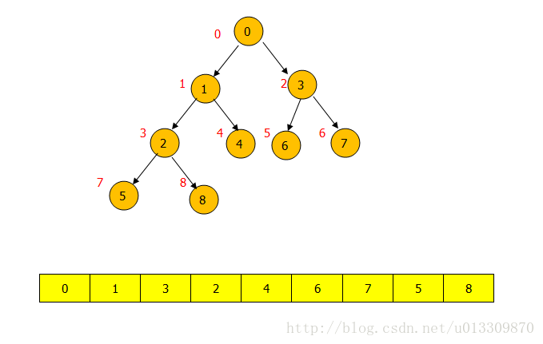
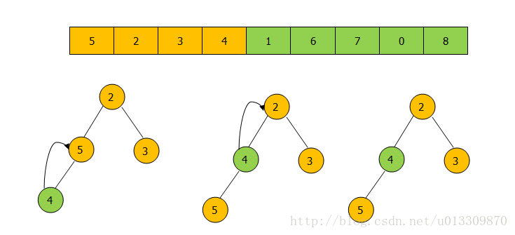
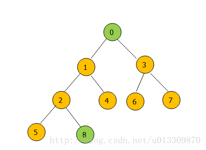
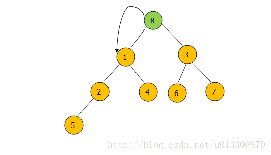
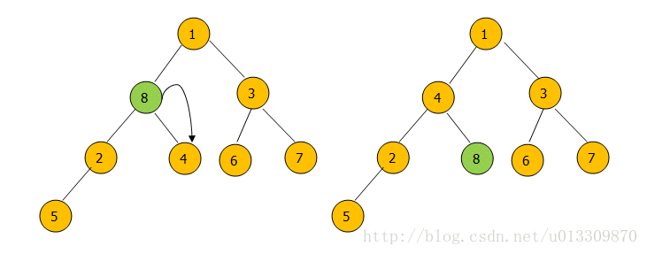
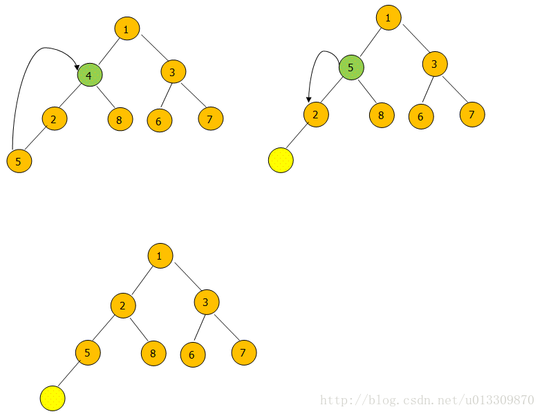

# Java堆结构PriorityQueue完全解析

在堆排序这篇文章中千辛万苦的实现了堆的结构和排序，其实在Java 1.5版本后就提供了一个具备了小根堆性质的数据结构也就是优先队列PriorityQueue。下面详细了解一下PriorityQueue到底是如何实现小顶堆的，然后利用PriorityQueue实现大顶堆。

## PriorityQueue的数据结构

PriorityQueue的逻辑结构是一棵完全二叉树，存储结构其实是一个数组。逻辑结构层次遍历的结果刚好是一个数组。



## PriorityQueue的操作

**①add(E e) 和 offer(E e) 方法**

add(E e) 和 offer(E e) 方法都是向PriorityQueue中加入一个元素，其中add（）其实调用了offer（）方法如下：

```java
public boolean add(E e) {
        return offer(e);
    }
```

下面主要看看offer（）方法的作用：



如上图调用 offer（4）方法后，往堆中压入4然后从下往上调整堆为小顶堆。offer（）的代码实现：

```java
public boolean offer(E e) {
        if (e == null)
            throw new NullPointerException();
  			//如果压入的元素为null 抛出异常      
        int i = size;
        if (i >= queue.length)
            grow(i + 1);
  			//如果数组的大小不够扩充
        size = i + 1;
        if (i == 0)
            queue[0] = e;
  			//如果只有一个元素之间放在堆顶
        else
            siftUp(i, e);
  			//否则调用siftUp函数从下往上调整堆。
        return true;
    }
```

对上面代码做几点说明：

1.  优先队列中不能存放空元素。
2.  压入元素后如果数组的大小不够会进行扩充，上面的queue其实就是一个默认初始值为11的数组（也可以赋初始值）。
3.  offer元素的主要调整逻辑在 siftUp ( i, e )函数中。下面看看 siftUp(i, e) 函数到底是怎样实现的。

```java
private void siftUpComparable(int k, E x) {
        Comparable<? super E> key = (Comparable<? super E>) x;
        while (k > 0) {
            int parent = (k - 1) >>> 1;
            Object e = queue[parent];
            if (key.compareTo((E) e) >= 0)
                break;
            queue[k] = e;
            k = parent;
        }
        queue[k] = key;
    }
```

上面的代码还是比较简明的，就是当前元素与父节点不断比较如果比父节点小就交换然后继续向上比较，否则停止比较的过程。

**② poll() 和 remove() 方法**
poll 方法每次从 PriorityQueue 的头部删除一个节点，也就是从小顶堆的堆顶删除一个节点，而remove（）不仅可以删除头节点而且还可以用 remove(Object o) 来删除堆中的与给定对象相同的最先出现的对象。先看看poll（）方法。下面是poll（）之后堆的操作

删除元素后要对堆进行调整：



堆中每次删除只能删除头节点。也就是数组中的第一个节点。



将最后一个节点替代头节点然后进行调整。



如果左右节点中的最小节点比当前节点小就与左右节点的最小节点交换。直到当前节点无子节点，或者当前节点比左右节点小时停止交换。(这里应该是和2交换，图)

poll（）方法的源码

```java
public E poll() {
        if (size == 0)
            return null;
  		//如果堆大小为0则返回null      
        int s = --size;
        modCount++;
        E result = (E) queue[0];
        E x = (E) queue[s];
        queue[s] = null;
			//如果堆中只有一个元素直接删除        
        if (s != 0)
            siftDown(0, x);
			//否则删除元素后对堆进行调整            
        return result;
    }
```

看看 siftDown(0, x) 方法的源码：

```java
private void siftDownComparable(int k, E x) {
        Comparable<? super E> key = (Comparable<? super E>)x;
        int half = size >>> 1;        // loop while a non-leaf
        while (k < half) {
            int child = (k << 1) + 1; // assume left child is least
            Object c = queue[child];
            int right = child + 1;
            if (right < size &&
                ((Comparable<? super E>) c).compareTo((E) queue[right]) > 0)
                c = queue[child = right];
            if (key.compareTo((E) c) <= 0)
                break;
            queue[k] = c;
            k = child;
        }
        queue[k] = key;
    }
```

siftDown（）方法就是从堆的第一个元素往下比较，如果比左右孩子节点的最小值小则与最小值交换，交换后继续向下比较，否则停止比较。
**remove（4）的过程图**：



先用堆的最后一个元素 5 代替4然后从5开始向下调整堆。这个过程和poll（）函数一样，只不过poll（）函数每次都是从堆顶开始。
**remove(Object o)的代码**：

```java
 public boolean remove(Object o) {
        int i = indexOf(o);
        //先在堆中找到o的位置
        if (i == -1)
            return false;
        //如果不存在则返回false。    
        else {
            removeAt(i);
            //否则删除数组中第i个位置的值，调整堆。
            return true;
        }
    }
```

**removeAt(int i)的代码**

```java
private E removeAt(int i) {
        assert i >= 0 && i < size;
        modCount++;
        int s = --size;
        if (s == i) // removed last element
            queue[i] = null;
        else {
            E moved = (E) queue[s];
            queue[s] = null;
            siftDown(i, moved);
            if (queue[i] == moved) {
                siftUp(i, moved);
                if (queue[i] != moved)
                    return moved;
            }
        }
        return null;
    }
```

## 使用PriorityQueue实现大顶堆

PriorityQueue默认是一个小顶堆，然而可以通过传入自定义的Comparator函数来实现大顶堆。如下代码：

```java
private static final int DEFAULT_INITIAL_CAPACITY = 11;
PriorityQueue<Integer> maxHeap=new PriorityQueue<Integer>(DEFAULT_INITIAL_CAPACITY, new Comparator<Integer>() {
        @Override
        public int compare(Integer o1, Integer o2) {                
            return o2-o1;
        }
    });
```

实现了一个初始大小为11的大顶堆。这里只是简单的传入一个自定义的Comparator函数，就可以实现大顶堆了。