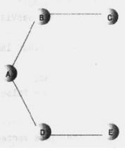
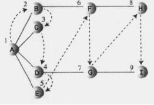

# 图的深度优先搜索（DFS）和广度优先搜索（BFS）

## 一、背景知识：

（1）图的表示方法：邻接矩阵（二维数组）、邻接表（链表数组【链表的链表】）。

（2）图的搜索方法：深度优先搜索（DFS）和广度优先搜索（BFS）。

## 二、图的搜索：

###  1、深度优先搜索（DFS）：

1.  用栈记录下一步的走向。访问一个顶点的过程中要做三件事：
    a. 访问顶点

    b. 顶点入栈，以便记住它

    c. 标记顶点，以便不会再访问它

2.  访问规则：

    a. 如果可能，访问一个邻接的未访问顶点，标记它，并入栈。

    b. 当不能执行a时（没有邻接的未访问顶点），如果栈不为空，就从栈中弹出一个顶点。

    c. 如果不能执行规则a和b，就完成了整个搜索过程。

3.  实现：基于以上规则，循环执行，直到栈为空。每次循环各种，它做四件事：

    ①用peek()方法检查栈顶的顶点。

    ②试图找到这个顶点还未访问的邻接点。

    ③如果没有找到，出栈。

    ④如果找到这样的顶点，访问并入栈。

    

    比如，采用dfs遍历上图，从A点出发，遍历结果（入栈顺序）为：ABCDE。

###   2、广度优先搜索（BFS）：

1.  用队列记录下一步的走向。深度优先搜素表现的好像是尽快远离起点似的，相反，广度优先搜索中，算法好像要尽可能靠近起始点。

2.  访问规则：

    a.访问下一个未访问的邻接点（如果存在），这个顶点必须是当前顶点的邻接点，标记它，并入队列。

    b.如果因为已经没有未访问顶点而不能执行规则a，那么从队列头取一个顶点（如果存在），并使其成为当前顶点。

    c.如果因为队列为空而不能执行规则b，则完成了整个搜索过程。

3.  基于以上规则，对下图做bfs遍历，其队列的变化如下表所示：

    

    从而，遍历的结果（入队顺序）为ABCDEFGHI。如果采用bfs遍历3中的图，结果为：ABDCE。

4.  特性：广度优先搜索首先找到与起始点相距一条边的所有顶点，然后是与起始点相距两条边的顶点，以此类推。如果要寻找起始顶点到指定顶点的最短距离，那么这个属性非常有用。首先执行BFS，当找到指定顶点时，就可以说这条路径是到这个顶点的最短路径。如果有更短的路径，BFS算法就应该已经找到它了。

## 三、Java实现

DFS、BFS的代码实现如下：

```java
public class Graph {
	private final int MAX_VERTS = 20;
	private Vertex vertexList[];// 顶点数组
	private int adjMat[][];// 邻接矩阵
	private int nVerts;// 当前顶点总数
	private StackX theStack;
	private Queue theQueue;
 
	public static void main(String[] args) {
		Graph theGraph = new Graph();
		theGraph.addVertex('A');
		theGraph.addVertex('B');
		theGraph.addVertex('C');
		theGraph.addVertex('D');
		theGraph.addVertex('E');
 
		theGraph.addEdge(0, 1);
		theGraph.addEdge(1, 2);
		theGraph.addEdge(0, 3);
		theGraph.addEdge(3, 4);
 
		System.out.print("visits:");
		// theGraph.dfs();
		theGraph.bfs();
		System.out.println();
	}
 
	public Graph() {// 构造图
		vertexList = new Vertex[MAX_VERTS];
 
		adjMat = new int[MAX_VERTS][MAX_VERTS];
		nVerts = 0;
		for (int i = 0; i < MAX_VERTS; i++) {
			for (int j = 0; j < MAX_VERTS; j++) {
				adjMat[i][j] = 0;
			}
		}
		theStack = new StackX();
		theQueue = new Queue();
	}
 
	public void addVertex(char lab) {// 添加顶点
		vertexList[nVerts++] = new Vertex(lab);
	}
 
	public void addEdge(int start, int end) {// 添加边
		adjMat[start][end] = 1;
		adjMat[end][start] = 1;
	}
 
	public void displayVertex(int v) {// 打印数组中v位置下的顶点名
		System.out.print(vertexList[v].lable);
	}
 
	public int getAdjUnvisitedVertex(int v) {// 获取和v邻接的未访问的顶点
		for (int i = 0; i < nVerts; i++) {
			if (adjMat[v][i] == 1 && vertexList[i].wasVisited == false) {
				return i;
			}
		}
		return -1;
	}
 
	public void dfs() {// 深度优先搜索
		vertexList[0].wasVisited = true;
		displayVertex(0);
		theStack.push(0);
 
		while (!theStack.isEmpty()) {
			int v = getAdjUnvisitedVertex(theStack.peek());
			if (v == -1) {
				theStack.pop();
			} else {
				vertexList[v].wasVisited = true;
				displayVertex(v);
				theStack.push(v);
			}
		}
 
		for (int i = 0; i < nVerts; i++) {
			vertexList[i].wasVisited = false;// 重置，防止后边再次使用dfs
		}
	}
 
	public void bfs() {// 广度优先搜索
		vertexList[0].wasVisited = true;
		displayVertex(0);
		theQueue.insert(0);
		int v2;
 
		while (!theQueue.isEmpty()) {
			int v1 = theQueue.remove();
 
			while ((v2 = getAdjUnvisitedVertex(v1)) != -1) {
				vertexList[v2].wasVisited = true;
				displayVertex(v2);
				theQueue.insert(v2);
			}
		}
 
		for (int j = 0; j < nVerts; j++) {
			vertexList[j].wasVisited = false;
		}
	}
}
 
class StackX {// 自定义栈
	private final int SIZE = 20;
	private int[] st;
	private int top;
 
	public StackX() {
		st = new int[SIZE];
		top = -1;
	}
 
	public void push(int j) {
		st[++top] = j;
	}
 
	public int pop() {
		if (top == 0) {
			return -1;
		}
		return st[--top];
	}
 
	public int peek() {
		return st[top];
	}
 
	public boolean isEmpty() {
		return (top == -1);
	}
}
 
class Queue {
	private final int SIZE = 20;
	private int[] queArray;
	private int front;
	private int rear;
 
	public Queue() {
		queArray = new int[SIZE];
		front = 0;
		rear = -1;
	}
 
	public void insert(int j) {// 入队
		if (rear == SIZE - 1) {
			rear = -1;
		}
		queArray[++rear] = j;
	}
 
	public int remove() {// 出队
		if (!isEmpty()) {
			return queArray[front++];
		} else {
			return -1;
		}
	}
 
	public boolean isEmpty() {
		return (rear + 1 == front);
	}
}
 
class Vertex {
	public char lable;// 名字
	public boolean wasVisited;
 
	public Vertex(char lab) {
		lable = lab;
		wasVisited = false;
	}
}
```

输出：

>   visits:ABDCE