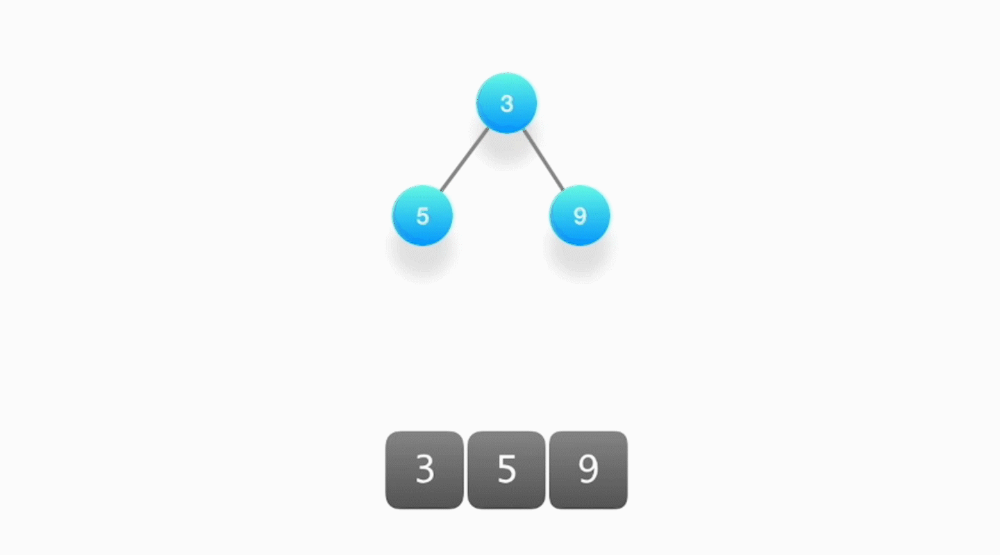
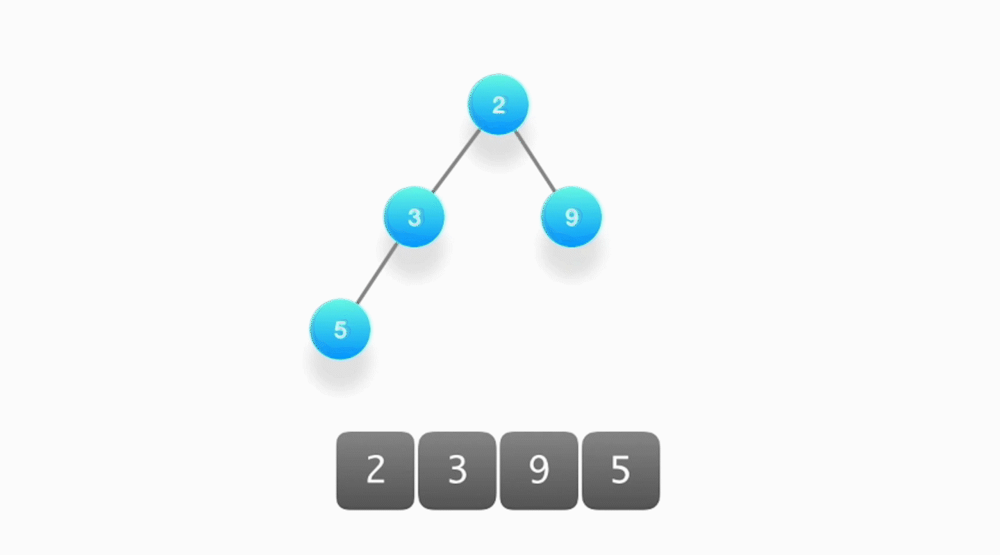
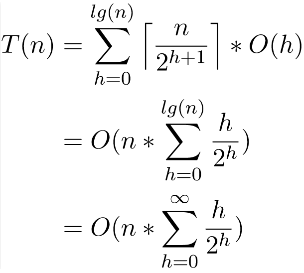
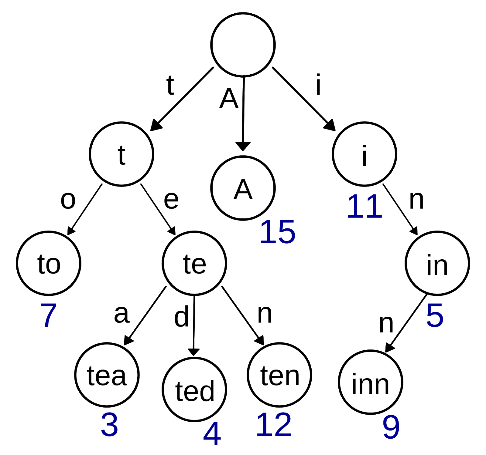
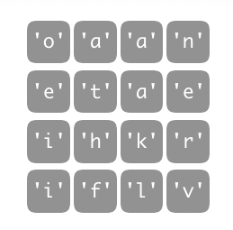
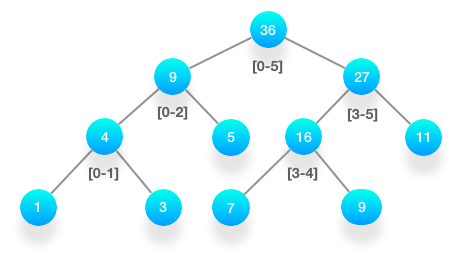

# 数据结构基础学习(二)

## 2 高级数据结构

-   优先队列
-   图
-   前缀树
-   线段树
-   树状数组

### **优先队列（Priority Queue）**

#### 特点

能保证每次取出的元素都是队列中优先级别最高的。优先级别可以是自定义的，例如，数据的数值越大，优先级越高；或者数据的数值越小，优先级越高。优先级别甚至可以通过各种复杂的计算得到。

#### 应用场景

从一堆杂乱无章的数据当中按照一定的顺序（或者优先级）逐步地筛选出部分乃至全部的数据。

>   **举例**：任意一个数组，找出前 k 大的数。
>
>   **解法 1**：先对这个数组进行排序，然后依次输出前 k 大的数，复杂度将会是 O(nlogn)，其中，n 是数组的元素个数。这是一种直接的办法。
>
>   **解法 2**：使用优先队列，复杂度优化成 O(k + nlogk)。
>
>   当数据量很大（即 n 很大），而 k 相对较小的时候，显然，利用优先队列能有效地降低算法复杂度。因为要找出前 k 大的数，并不需要对所有的数进行排序。

#### 实现

优先队列的本质是一个二叉堆结构。堆在英文里叫 Binary Heap，它是利用一个数组结构来实现的完全二叉树。换句话说，优先队列的本质是一个数组，数组里的每个元素既有可能是其他元素的父节点，也有可能是其他元素的子节点，而且，每个父节点只能有两个子节点，很像一棵二叉树的结构。


**牢记下面优先队列有三个重要的性质**。

>   1.  数组里的第一个元素 array[0] 拥有最高的优先级别。
>
>   2.  给定一个下标 i，那么对于元素 array[i] 而言：
>
>   -   它的父节点所对应的元素下标是 (i-1)/2
>
>   -   它的左孩子所对应的元素下标是 2×i + 1
>   -   它的右孩子所对应的元素下标是 2×i + 2
>
>   3.  数组里每个元素的优先级别都要高于它两个孩子的优先级别。


优先队列最基本的操作有两个。

**1. 向上筛选（sift up / bubble up）**

-   当有新的数据加入到优先队列中，新的数据首先被放置在二叉堆的底部。

-   不断进行向上筛选的操作，即如果发现该数据的优先级别比父节点的优先级别还要高，那么就和父节点的元素相互交换，再接着往上进行比较，直到无法再继续交换为止。

    

​        

时间复杂度：由于二叉堆是一棵完全二叉树，并假设堆的大小为 k，因此整个过程其实就是沿着树的高度往上爬，所以只需要 O(logk) 的时间。


**2. 向下筛选（sift down / bubble down）**

-   当堆顶的元素被取出时，要更新堆顶的元素来作为下一次按照优先级顺序被取出的对象，需要将堆底部的元素放置到堆顶，然后不断地对它执行向下筛选的操作。

-   将该元素和它的两个孩子节点对比优先级，如果优先级最高的是其中一个孩子，就将该元素和那个孩子进行交换，然后反复进行下去，直到无法继续交换为止。

    

​        

时间复杂度：整个过程就是沿着树的高度往下爬，所以时间复杂度也是 O(logk)。

因此，无论是添加新的数据还是取出堆顶的元素，都需要 O(logk) 的时间。

#### 初始化

优先队列的初始化是一个最重要的时间复杂度，是分析运用优先队列性能时必不可少的，也是经常容易弄错的地方。

**举例**：有 n 个数据，需要创建一个大小为 n 的堆。

**误区**：每当把一个数据加入到堆里，都要对其执行向上筛选的操作，这样一来就是 O(nlogn)。

**解法**：在创建这个堆的过程中，二叉树的大小是从 1 逐渐增长到 n 的，所以整个算法的复杂度经过推导，最终的结果是 O(n)。

   

 

**注意**：算法面试中是不要求推导的，你只需要记住，初始化一个大小为 n 的堆，所需要的时间是 O(n) 即可。

#### 例题分析

LeetCode 第 347 题：给定一个非空的整数数组，返回其中出现频率前 k 高的元素。

说明：

-   你可以假设给定的 k 总是合理的，且 1 ≤ k ≤ 数组中不相同的元素的个数。
-   你的算法的时间复杂度必须优于 O(nlogn) ，n 是数组的大小

>   **示例 1:**
>
>   ```
>   输入: nums = [1,1,1,2,2,3], k = 2
>   输出: [1,2]
>   ```
>
>   **示例 2:**
>
>   ```
>   输入: nums = [1], k = 1
>   输出: [1]
>   ```

#### 解题思路

这道题的输入是一个字符串数组，数组里的元素可能会重复一次甚至多次，要求按顺序输出前 k 个出现次数最多的字符串。

解这类求"前 k 个"的题目，关键是看如何定义优先级以及优先队列中元素的数据结构。

-   题目中有”前 k 个“这样的字眼，应该很自然地联想到优先队列。
-   优先级别可以由字符串出现的次数来决定，出现的次数越多，优先级别越高，反之越低。
-   统计词频的最佳数据结构就是哈希表（Hash Map），利用一个哈希表，就能快速地知道每个单词出现的次数。
-   将单词和其出现的次数作为一个新的对象来构建一个优先队列，那么这个问题就很轻而易举地解决了。

**建议**：这道题是利用优先队列处理问题的典型，建议好好练习。

​               **Desk (3)**

​                  **/   \\**

​          **car(2)  book(1)**      

```java
class Solution {
    public List<Integer> topKFrequent(int[] nums, int k) {
        Map<Integer, Integer> map = new HashMap<>();
        //先使用HashMap统计数字频率
        for (int num : nums) {
            map.put(num, map.getOrDefault(num, 0) + 1);
        }
      	//在使用优先队列，制定排序规则为map中的数字出现次数，只保留需要保留的出现频次最高的k个
        PriorityQueue<Integer> priorityQueue = new PriorityQueue<>(Comparator.comparingInt(map::get));
        for (int key : map.keySet()) {
            if (priorityQueue.size() < k)
                priorityQueue.add(key);
            else if (map.get(key) > map.get(priorityQueue.peek())) {
                priorityQueue.poll();
                priorityQueue.add(key);
            }
        }
        //转存数据到List中返回
        List<Integer> res = new ArrayList<>(k);
        while (!priorityQueue.isEmpty()) {
            res.add(priorityQueue.remove());
        }
        return res;
    }

    public static void main(String[] args) {
        Solution solution = new Solution();

        //示例输入[1,1,1,2,2,3] , 2
        int[] nums = {1, 1, 1, 2, 2, 3};
        List<Integer> integers = solution.topKFrequent(nums, 2);
        //预期输出 [2,1]
        for (Integer integer : integers) {
            System.out.println(integer);
        }
    }
}
```

### 图（Graph）

#### 基本知识点

图可以说是所有数据结构里面知识点最丰富的一个，最基本的知识点如下。

-   阶（Order）、度：出度（Out-Degree）、入度（In-Degree）
-   树（Tree）、森林（Forest）、环（Loop）
-   有向图（Directed Graph）、无向图（Undirected Graph）、完全有向图、完全无向图
-   连通图（Connected Graph）、连通分量（Connected Component）
-   存储和表达方式：邻接矩阵（Adjacency Matrix）、邻接链表（Adjacency List）


围绕图的算法也是五花八门。

-   图的遍历：深度优先、广度优先
-   环的检测：有向图、无向图
-   拓扑排序
-   最短路径算法：Dijkstra、Bellman-Ford、Floyd Warshall
-   连通性相关算法：Kosaraju、Tarjan、求解孤岛的数量、判断是否为树
-   图的着色、旅行商问题等


以上的知识点只是图论里的冰山一角，对于算法面试而言，完全不需要对每个知识点都一一掌握，而应该有的放矢地进行准备。

#### 必会知识点

根据长期的经验总结，以下的知识点是必须充分掌握并反复练习的。

-   图的存储和表达方式：邻接矩阵（Adjacency Matrix）、邻接链表（Adjacency List）
-   图的遍历：深度优先、广度优先
-   二部图的检测（Bipartite）、树的检测、环的检测：有向图、无向图
-   拓扑排序
-   联合-查找算法（Union-Find）
-   最短路径：Dijkstra、Bellman-Ford

其中，环的检测、二部图的检测、树的检测以及拓扑排序都是基于图的遍历，尤其是深度优先方式的遍历。而遍历可以在邻接矩阵或者邻接链表上进行，所以掌握好图的遍历是重中之重！因为它是所有其他图论算法的基础。

至于最短路径算法，能区分它们的不同特点，知道在什么情况下用哪种算法就很好了。对于有充足时间准备的面试者，能熟练掌握它们的写法当然是最好的。

**建议**：LeetCode 里边有许多关于图论的算法题，而且都是非常经典的题目，可以通过练习解题来熟练掌握必备知识。

#### 例题分析

LeetCode 第 785 题：给定一个无向图 graph，当这个图为二部图时返回 true。

如果我们能将一个图的节点集合分割成两个独立的子集A和B，并使图中的每一条边的两个节点一个来自A集合，一个来自B集合，我们就将这个图称为二分图。

graph将会以邻接表方式给出，graph[i]表示图中与节点i相连的所有节点。每个节点都是一个在0到graph.length-1之间的整数。这图中没有自环和平行边： graph[i] 中不存在i，并且graph[i]中没有重复的值。

>   **示例 1:**
>   **输入:** [[1,3], [0,2], [1,3], [0,2]]
>   **输出:** true
>   **解释:** 
>   无向图如下:
>   0----1
>   |    |
>   |    |
>   3----2
>   我们可以将节点分成两组: {0, 2} 和 {1, 3}。
>
>   **示例 2:**
>   **输入:** [[1,2,3], [0,2], [0,1,3], [0,2]]
>   **输出:** false
>   **解释:** 
>   无向图如下:
>   0----1
>   | \  |
>   |  \ |
>   3----2
>
>   我们不能将节点分割成两个独立的子集。

**注意:**

-   graph 的长度范围为 [1, 100]。
-   graph[i] 中的元素的范围为 [0, graph.length - 1]。
-   graph[i] 不会包含 i 或者有重复的值。
-   图是无向的: 如果j 在 graph[i]里边, 那么 i 也会在 graph[j]里边。


#### 解题思路

判断一个给定的任意图是否为二部图，就必须要对该图进行一次遍历：

-   深度优先
-   广度优先

二部图，图的所有顶点可以分成两个子集 U 和 V，子集里的顶点互不直接相连，图里面所有的边，一头连着子集 U 里的顶点，一头连着子集 V 里的顶点。


1.  给图里的顶点涂上颜色，子集 U 里的顶点都涂上红色，子集 V 里的顶点都涂上蓝色。
2.  开始遍历这个图的所有顶点，想象一下手里握有红色和蓝色的画笔，每次交替地给遍历当中遇到的顶点涂上颜色。
3.  如果这个顶点还没有颜色，那就给它涂上颜色，然后换成另外一支画笔。
4.  下一个顶点，如果发现这个顶点已经涂上了颜色，而且颜色跟我手里画笔的颜色不同，那么表示这个顶点它既能在子集 U 里，也能在子集 V 里。
5.  所以，它不是一个二部图。

**思路整体分类：**

1、BFS：逐个检查每个节点是否已经被染色，如果没有被染色，则首先将其染为颜色0，然后采用BFS依次对和它相连的节点进行检查和染色。如果相连的节点没有被染色，则将其染为另外一种颜色；否则就检查染色是否和原来兼容，如果不兼容则立即返回false。注意当从一个结点开始的的BFS搜索全部结束时，和该结点有直接或者间接连接关系的所有结点都会已经被染色了，所以当开始对下一个节点染色的时候，我们就可以大胆将其染为颜色0。这样当整个染色完成的时候，如果没有发现染色冲突，则说明原来的图就是二分图。

2、DFS：思路其实和BFS非常一致，只不过采用了DFS的搜索策略：首先检查该结点是否已经被染色，如果是，则返回其是否兼容的信息；否则就给结点染色，并且采用DFS的策略对和其直接或者间接相连的所有结点染色。整个过程中如果发现冲突就提前返回false；否则在最后返回true。

```java
class Solution {
    private boolean[] visited;
    private int[] colors;
    private int[][] graph;

    public boolean isBipartite(int[][] graph) {

        this.visited = new boolean[graph.length];
        this.graph = graph;

        colors = new int[graph.length];

        for (int v = 0; v < graph.length; v++) {
            if (!visited[v]) {
                if (!dfs(v, 0)) {
                    return false;
                }
            }
        }

//        for (int v = 0; v < graph.length; v++) {
//            if (!visited[v]) {
//                if (!bfs(v)) {
//                    return false;
//                }
//            }
//        }
        return true;
    }

    public boolean dfs(int v, int color) {
        visited[v] = true;
        colors[v] = color;
        for (int w : graph[v]) {
            if (!visited[w]) {
                if (!dfs(w, 1 - color)) {
                    return false;
                }
            } else if (colors[v] == colors[w]) {
                return false;
            }
        }
        return true;
    }


    public boolean bfs(int v) {
        visited[v] = true;
        colors[v] = 0;
        Queue<Integer> queue = new LinkedList<>();
        queue.offer(v);

        while (!queue.isEmpty()) {
            v = queue.poll();
            for (int w : graph[v]) {
                if (!visited[w]) {
                    queue.offer(w);
                    visited[w] = true;
                    colors[w] = 1 - colors[v];
                } else if (colors[v] == colors[w]) {
                    return false;
                }
            }
        }
        return true;
    }

}
```

### 前缀树（Trie）

#### 应用场景

前缀树被广泛地运用在字典查找当中，也被成为字典树。

**举例：**给定一系列字符串，这些字符串构成了一种字典，要求你在这个字典当中找出所有以“ABC”开头的字符串。

**解法1：**暴力搜索

直接遍历一遍字典，然后逐个判断每个字符串是否由“ABC”开头。假设字典很大，有 N 个单词，要对比的不是“ABC”，而是任意的，那不妨假设所要对比的开头平均长度为 M，那么时间复杂度是 O(M×N)。

**解法2：**前缀树

如果用前缀树头帮助对字典的存储进行优化，那么可以把搜索的时间复杂度下降为O(M)，其中M表示字典里最长的那个单词的字符个数，在很多情况下，字典里的单词个数N是远远大于M的。因此，前缀树在这种场合中是非常高效的。

**经典应用**

1.  网站上的搜索框会罗列出以搜索文字作为开头的相关搜索信息，这里运用了前缀树进行后端的快速检索。
2.  汉字拼音输入法的联想输出功能也运用了前缀树。

**举例：**假如有一个字典，字典里面有如下词："A"，"to"，"tea"，"ted"，"ten"，"i"，"in"，"inn"，每个单词还能有自己的一些权重值，那么用前缀树来构建这个字典将会是如下的样子：



**性质**

1.  每个节点至少包含两个基本属性：

    -   children：数组或者集合，罗列出每个分支当中包含的所有字符
    -   isEnd：布尔值，表示该节点是否为某字符串的结尾

2.  前缀树的根节点是空的

    所谓空，即只利用到这个节点的children属性，即只关心在这个字典里，有哪些打头的字符。

3.  除了根节点，其他所有节点都是有可能是单词的结尾，叶子节点一定都是单词的结尾。

**实现**

前缀树最基本的操作就是两个：创建和搜索。

**1. 创建**

-   遍历一遍输入的字符串，对每个字符串进行遍历
-   从前缀树的根节点开始，将每个字符串加入到节点的children字符集当中。
-    如果字符集已经包含了这个字符，则跳过。
-   如果当前字符是字符串的最后一个，则把当前节点的isEnd标记为真。

由上，创建的方法很直观。

前缀树真正强大的地方在于，每个节点还能用来保存额外的信息，比如可以用来记录拥有相同前缀的所有字符串。因此，当前用户输入某个前缀时，就能在`O(1)`的时间内给出对应的推荐字符串。

**2. 搜索**

与创建方法类似，从前缀树的根节点出发，逐个匹配输入的前缀字符，如果遇到了就继续往下一层搜索，如果没遇到，就立即返回。

#### 例题分析

LeetCode 第 212 题：给定一个二维网格 board 和一个字典中的单词列表 words，找出所有同时在二维网格和字典中出现的单词。



单词必须按照字母顺序，通过相邻的单元格内的字母构成，其中“相邻”单元格是那些水平相邻或垂直相邻的单元格。同一个单元格内的字母在一个单词中不允许被重复使用。

**说明:**你可以假设所有输入都由小写字母 `a-z` 组成。

>   输入: 
>   words = ["oath","pea","eat","rain"] and board =
>   [
>     ['o','a','a','n'],
>     ['e','t','a','e'],
>     ['i','h','k','r'],
>     ['i','f','l','v']
>   ]
>
>   输出: ["eat","oath"]

#### 解题思路

这是一道出现较为频繁的难题，题目给出了一个二维的字符矩阵，然后还给出了一个字典，现在要求在这个字符矩阵中找到出现在字典里的单词。

由于字符矩阵的每个点都能作为一个字符串的开头，所以必须得尝试从矩阵中的所有字符出发，上下左右一步步地走，然后去和字典进行匹配，如果发现那些经过的字符能组成字典里的单词，就把它记录下来。

可以借用深度优先的算法来实现（关于深度优先算法，将在第 06 节课深入探讨），如果你对它不熟悉，可以把它想象成走迷宫。


字典匹配的解法 1：每次都循环遍历字典，看看是否存在字典里面，如果把输入的字典变为哈希集合的话，似乎只需要 O(1) 的时间就能完成匹配。

但是，这样并不能进行前缀的对比，即，必须每次都要进行一次全面的深度优先搜索，或者搜索的长度为字典里最长的字符串长度，这样还是不够高效。

字典匹配的解法2：对比字符串的前缀，借助前缀树来重新构建字典。

假如在矩阵里遇到了一个字符”V”，而字典里根本就没有以“V”开头的字符串，则不需要将深度优先搜索进行下去，可以大大地提高搜索效率。

构建好了前缀树之后，每次从矩阵里的某个字符出发进行搜索的时候，同步地对前缀树进行对比，如果发现字符一直能被找到，就继续进行下去，一步一步地匹配，直到在前缀树里发现一个完整的字符串，把它输出即可。

```java
class Solution {
    public List<String> findWords(char[][] board, String[] words) {
        //构建字典树
        WordTrie myTrie = new WordTrie();
        TrieNode root = myTrie.root;
        //插入数据
        for (String word : words){
            myTrie.insert(word);
        }

        //构建结果集容器
        List<String> result = new LinkedList<>();
        //矩阵行数
        int m = board.length;
        //矩阵列数
        int n = board[0].length;
        //存储该节点是否访问
        boolean[][] visited = new boolean[n][m];
        //遍历整个二维数组
        for (int i = 0; i < m; i++) {
            for (int j = 0; j < n; j++) {
                find(board, visited, i, j, m, n, result, root);
            }
        }
        return result;
    }

    private void find(char[][] board, boolean[][] visited, int i, int j, int m, int n, List<String> result, TrieNode cur) {
        //边界判断以及是否已经访问判断
        if (i < 0 || i >= m || j < 0 || j >= n || visited[j][i])
            return;
        //获取子节点状态，判断其是否有子节点
        cur = cur.child[board[i][j] - 'a'];
        if (cur == null) {
            return;
        }
        //修改节点状态，防止重复访问
        visited[j][i] = true;
        //找到单词加入
        if (cur.isEnd) {
            result.add(cur.val);
            //找到单词后，修改字典树内叶子节点状态为false，防止出现重复单词
            cur.isEnd = false;
        }
        find(board, visited, i + 1, j, m, n, result, cur);
        find(board, visited, i - 1, j, m, n, result, cur);
        find(board, visited, i, j + 1, m, n, result, cur);
        find(board, visited, i, j - 1, m, n, result, cur);
        //最后修改节点状态为未访问状态
        visited[j][i] = false;
    }


    /**
     * 字典树
     */
    class WordTrie {
        //创建根节点
        TrieNode root = new TrieNode();

        void insert(String s) {
            TrieNode cur = root;
            for (char c : s.toCharArray()) {
                //判断是否存在该字符的节点，不存在则创建
                if (cur.child[c - 'a'] == null) {
                    cur.child[c - 'a'] = new TrieNode();
                    cur = cur.child[c - 'a'];
                } else
                    cur = cur.child[c - 'a'];
            }
            //遍历结束后，修改叶子节点的状态，并存储字符串
            cur.isEnd = true;
            cur.val = s;
        }
    }

    /**
     * 字典树节点
     */
    class TrieNode {
        /**
         * 存储最后节点的字符串
         */
        String val;
        /**
         * 根据字符排序，[a,b,c,……,z]
         */
        TrieNode[] child = new TrieNode[26];
        /**
         * 是否是最后叶子节点
         */
        boolean isEnd = false;
    }
  
  public static void main(String[] args) {
        Solution solution = new Solution();
        char[][] chars = {{'o','a','a','n'}, {'e','t','a','e'}, {'i','h','k','r'}, {'i','f','l','v'}};

        String[] words = {"oath","pea","eat","rain"};
        List<String> words1 = solution.findWords(chars, words);

        System.out.println(words1);
    }
}
```

### 线段树（Segment Tree）

**举例：**假设有一个数组array[0 … n-1]，里面有n个元素，现在要经常对这个数组做两件事。

	1. 更新数组元素的数值
 	2. 求数组任意一段区间内里元素的总和（或者平均值）

**解法1：**遍历一遍数组。

-   时间复杂度O(N)

**解法2：**线段树

-   线段树，就是一种按照二叉树的形式存储数据的结构，每个节点保存的都是数组里某一段的总和。
-   适用于数据很多，而且需要频繁更新并求和的操作。
-   时间复杂度O(logn)

**实现**

**举例：**数组是[1,3,5,7,9,11]，那么它的线段树如下。



根节点保存的是从下标 0 到下标 5 的所有元素的总和，即 36。左右两个子节点分别保存左右两半元素的总和。按照这样的逻辑不断地切分下去，最终的叶子节点保存的就是每个元素的数值。

**解法：**

1.  更新数组里某个元素的数值

    从线段树的根节点触发，更新节点的数值，它保存的是数组元素的总和。修改的元素有可能会落在线段树里一些区间里，至少叶子节点是肯定需要更新的，所以，要做的就是从根节点往下，判断元素的下标是否在左边还是右边，然后更新分支里的节点大小。因此，复杂度就是遍历树的高度，即O(logn)

2.  对数组某个区间段里的元素进行求和

    方法和跟新操作类似，首先从根节点触发，判断所求的区间是否落在节点所代表的区间中。如果所要求的区间完全包含了节点所代表的区间，那么就得加上该节点的数值，意味着该节点所记录的区间总和只是所要求解总和的一部分。接下来，不断地往下寻找其他子区间，最终得出所要求的总和。

**建议：**线段树的实现书写起来有些繁琐，需要不断地练习。

#### 例题分析

LeetCode第315题：给定一个整数数组nums，按要求返回一个新数组counts，使得数组counts有该性质——counts[i]的值是nums[i]右侧小于nums[i] 的元素的数量。

>   **示例**
>
>   输入：[5, 2, 6, 1]
>
>   输出：[2, 1, 1, 0] 
>
>   **解释**
>
>   5 的右侧有 2 个更小的元素（2 和 1）
>
>   2 的右侧仅有 1 个更小的元素（1）
>
>   6 的右侧有 1 个更小的元素（1）
>
>   1 的右侧有 0 个更小的元素

#### 解题思路

给定一个数组nums，里面都是一些整数，现在要求打印输出一个新的数组counts，counts数组的每个元素counts[i]表示nums中第i个元素右边有多少个数小于nums[i]。

例如，输入数组[5,2,6,1]，应该输出的结果是[2,1,1,0]。

因为，对于5，右边有两个数比它小，分别是2和1，所以输出的结果中，第一个元素是2；对于2，右边只有1比它小，所以第二个元素是1，类推。

如果使用线段树解法，需要理清线段树的每个节点应该需要包含什么样的信息。

线段树每个节点记录的区间是数组下标所形成的区间，然而对于这道题，因为要统计的是比，某个数还要小的数的总和，如果把分段的区间设计成按照数值的大小来划分，并记录在这个区间中的数的总和，就能快速地知道比当前数还要小的数有多少个。


>   1.  首先，让从线段树的根节点开始，根节点记录的是数组里最小值到最大值之间的所有元素的总和，然后分割根节点成左区间和右区间，不断地分割下去。
>   2.  初始化，每个节点记录的在此区间内的元素数量是0，接下来从数组的最后一位开始往前遍历，每次遍历，判断这个数落在哪个区间，那么那个区间的数量加一。
>   3.  遇到1，把它加入到线段树里，此时线段树里各个节点所统计的数量会发生变化。
>   4.  当前所遇到的最小值就是1。
>   5.  把6加入到线段树里。
>   6.  求比6小的数有多少个，即查询线段树，从1到5之间有多少个数。
>   7.  从根节点开始查询。由于所要查询的区间是1到5，把该节点所统计好的数返回。
>   8.  左边，区间1到3被完全包含在1到5之间，把该节点所统计好的数返回。
>   9.  右边，区间1到5跟区间4到6有交叉，继续往下看，区间4到5完全被包含在1到5之间，所以可以马上返回，并把统计的数量相加。
>   10.  最后得出，在当前位置，在6的右边比6小的数只有一个。

通过这样的方法，每次把当前的数用线段树进行个数统计，然后在计算出比它小的数即可。算法复杂度是O(nlogm)。

**线段树解法：**

```java
class Solution {
    public List<Integer> countSmaller(int[] nums) {
        Integer[] ans = new Integer[nums.length];
        Node root = null;
        for (int i = nums.length - 1; i >= 0; i--) {
            root = insert(nums[i], root, ans, i, 0);
        }
        return Arrays.asList(ans);
    }

    private Node insert(int num, Node node, Integer[] ans, int i, int preSum) {
        if (node == null) {
            //第一次插入节点值，构造节点
            node = new Node(num, 0);
            ans[i] = preSum;
        } else if (node.val == num) {
            //插入值，与该节点值相等，则将该节点重复值+1
            node.dup++;
            //返回该节点下，所有小于该值的节点数
            ans[i] = preSum + node.sum;
        } else if (node.val > num) {
            //插入值，比当前节点值小，将该节点sum+1，并进入左子树
            node.sum++;
            node.left = insert(num, node.left, ans, i, preSum);
        } else {
            //插入值，比当前节点值大，进入右子树，并对之前大于数总和累加
            node.right = insert(num, node.right, ans, i, preSum + node.dup + node.sum);
        }
        return node;
    }

    /**
     * 线段树节点
     */
    class Node {
        //左右子树
        Node left, right;
        //val -> 节点存储的数值
        //sum -> 该节点下子节点数值和
        //dup -> 该节点的重复值个数
        int val, sum, dup = 1;

        Node(int v, int s) {
            val = v;
            sum = s;
        }
    }

    public static void main(String[] args) {
        Solution solution = new Solution();

        int[] nums = {5, 2, 6, 1};

        List<Integer> integers = solution.countSmaller(nums);
        System.out.println(integers);

    }
}
```

**树状数组解法**

```java
class Solution {
    public static List<Integer> countSmaller(int[] nums) {
        if (nums.length == 0) {
            return new ArrayList<>();
        }
        // 获取最小值
        int min = Integer.MAX_VALUE;
        for (int value : nums) {
            if (value < min) {
                min = value;
            }
        }
        //将数组整体进行调整，最小值为1
        for (int i = 0; i < nums.length; i++) {
            nums[i] = nums[i] - min + 1;
        }

        //获取调整后的最大值
        int max = Integer.MIN_VALUE;
        for (int value : nums) {
            if (value > max) {
                max = value;
            }
        }

        //根据最大值，构建树状数组
        int[] BITree = new int[max + 1];
        //头结点为空
        BITree[0] = 0;
        //构造结果集
        int[] countArr = new int[nums.length];
        //倒序遍历数组nums
        for (int i = nums.length - 1; i >= 0; i--) {
            int count = getSum(nums[i] - 1, BITree);
            update(nums[i], BITree);
            countArr[i] = count;
        }
        List<Integer> result = new ArrayList<>();
        for (int value : countArr) {
            result.add(value);
        }
        return result;
    }

    public static int getSum(int value, int[] BITree) { // 获得a[i]从1，value的和
        int sum = 0;
        while (value > 0) {
            sum += BITree[value];
            value -= (value & -value);
        }
        return sum;
    }

    public static void update(int value, int[] BITree) {
        while (value <= BITree.length - 1) {
            BITree[value] += 1;
            value += (value & -value);
        }
    }

    public static void main(String[] args) {
        Solution solution = new Solution();

        int[] nums = {5, 2, 6, 1};

        List<Integer> integers = solution.countSmaller(nums);
        System.out.println(integers);

    }
}
```


### 树状数组（Fenwick Tree / Binary Indexed Tree）

**实现**

**举例：**假设有一个数组array[0 …… n-1]，里面有n个元素，现在要经常对这个数组做两件事。

1.  更新数组元素的数值
2.  求数组前k个元素的总和（或者平均值）

**解法1：**线段树

-   线段树能在O(logn)的时间里更新和求解前k个元素的总和

**解法2：**树状数组

-   该问题只要求求解前k个元素的总和，并不要求任意一个区间。
-   树状数组可以在O(logn)的时间里完成上述的操作。
-   相对于线段树的实现，树状数组显得更简单。

**特点**

树状数组的数据结构有以下几个重要的基本特征。

1.  它是利用数组来表示多叉树的结构，在这一点上和优先队列有些类似，只不过，优先队列是用数组来表示完全二叉树，而树状数组是多叉树。
2.  树状数组的第一个节点是空节点。
3.  如果节点tree[y]是tree[x]的父节点，那么需要满足条件：y = x - (x & (-x))

#### 例题分析

LeetCode 第 308 题，求一个动态变化的二维矩阵里，任意子矩阵里的数的总和。

给定一个2D矩阵，发现通过其左上角（定义的矩形内的元素的总和的row1， col1）和右下角（row2， col2）


上面的矩形（带有红色边框）由(row1，col1)= (2，1) 和(row2，col2)= ( 4，3)定义 ，其中sum = 8。

>   **示例**
>
>   给定矩阵= [
>     [3, 0, 1, 4, 2],
>     [5, 6, 3, 2, 1],
>     [1, 2, 0, 1, 5],
>     [4, 1, 0, 1, 7],
>     [1, 0, 3, 0, 5]
>   ]
>
>   sumRegion（2，1，4，3）-> 8
>   update（3，2，2）
>   sumRegion（2，1，4，3）-> 10

**注意：**

1.  该矩阵只能通过更新 功能进行修改 。
2.  您可以假设对update的调用次数 和 sumRegion 函数的分配是均匀的。
3.  你可以假设 row1≤ row2和 col1≤ col2。

```java
class NumMatrix {
    private int[][] sums;
    private int[][] matrix;

    public NumMatrix(int[][] matrix) {
        if (matrix == null || matrix.length == 0 || matrix[0].length == 0)
            return;
        //构建树状数组 BiTree
        this.sums = new int[matrix.length + 1][matrix[0].length + 1];
        //初始化内部矩阵
        this.matrix = new int[matrix.length][matrix[0].length];
        for (int i = 0; i < matrix.length; i++) {
            for (int j = 0; j < matrix[i].length; j++) {
                //构建BiTree和内部矩阵
                update(i, j, matrix[i][j]);
            }
        }
    }

    public void update(int row, int col, int val) {
        if (matrix == null)
            return;
        //计算新值与原值的差值
        int adjust = val - matrix[row][col];
        //更新矩阵内值
        matrix[row][col] = val;
        row++;
        col++;
        int i = row;
        while (i < sums.length) {
            int j = col;
            while (j < sums[i].length) {
                //调整BiTree节点和
                sums[i][j] += adjust;
                //下一位
                j += (j & -j);
            }
            i += (i & -i);
        }
    }

    private int sum(int row, int col) {
        row++;
        col++;
        int sum = 0;
        int i = row;
        while (i > 0) {
            int j = col;
            while (j > 0) {
                sum += sums[i][j];
                j -= (j & -j);
            }
            i -= (i & -i);
        }
        return sum;
    }

    public int sumRegion(int row1, int col1, int row2, int col2) {
        if (matrix == null) return 0;
        return sum(row2, col2) - sum(row2, col1 - 1) - sum(row1 - 1, col2) + sum(row1 - 1, col1 - 1);
    }


// Your NumMatrix object will be instantiated and called as such:
// NumMatrix numMatrix = new NumMatrix(matrix);
// numMatrix.sumRegion(0, 1, 2, 3);
// numMatrix.update(1, 1, 10);
// numMatrix.sumRegion(1, 2, 3, 4);

    public static void main(String[] args) {
//        Solution solution = new Solution();

        int[][] g = {{3, 0, 1, 4, 2},
                {5, 6, 3, 2, 1},
                {1, 2, 0, 1, 5},
                {4, 1, 0, 1, 7},
                {1, 0, 3, 0, 5}};

        NumMatrix numMatrix = new NumMatrix(g);
        int i = numMatrix.sumRegion(2, 1, 4, 3);
        System.out.println(i);
    }
}


```


## 总结

1. 优先队列

    经常出现在考题里的，它的实现过程比较繁琐，但是很多编程语言里都有它的实现，所以在解决面试中的问题时，实行“拿来主义”即可。

2.  图

    被广泛运用的数据结构，很多涉及大数据的问题都得运用到图论的知识。比如在社交网络里，每个人可以用图的顶点表示，人与人直接的关系可以用图的边表示；再比如，在地图上，要求解从起始点到目的地，如何行驶会更快捷，需要运用图论里的最短路径算法。

3.  前缀树

    出现在许多面试的难题当中。

    因为很多时候你得自己实现一棵前缀树，所以你要能熟练地书写它的实现以及运用它。

4.  线段树和树状数组

    应用场合比较明确。

    例如，问题变为在一幅图片当中修改像素的颜色，然后求解任意矩形区间的灰度平均值，那么可以考虑采用二维的线段树了。

    