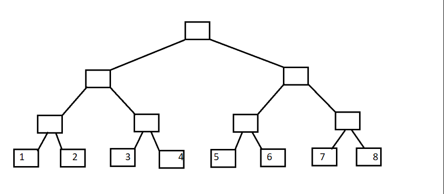
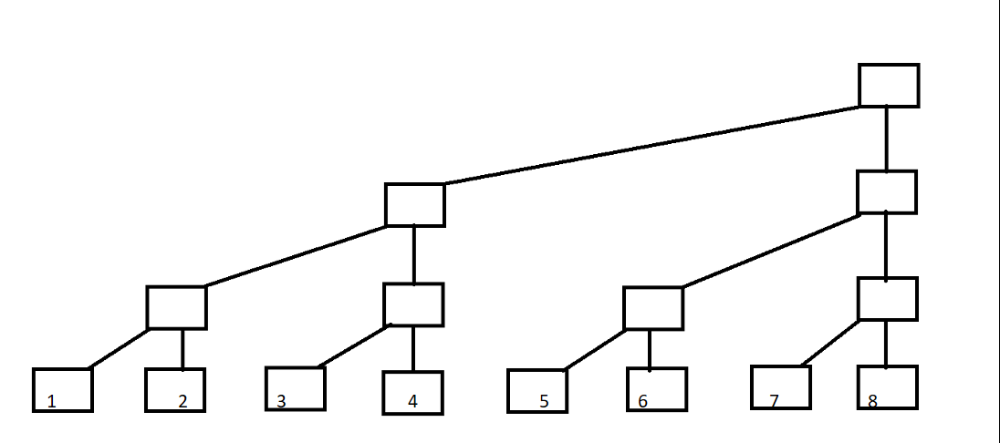
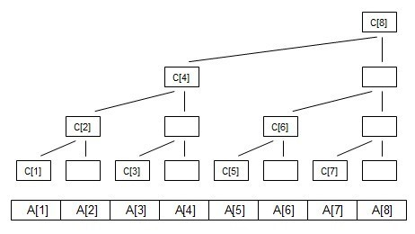
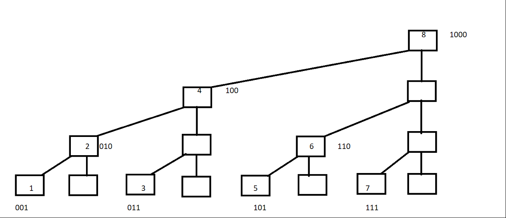

# 树状数组详解

树状数组  重点是在**树状**的数组

大家都知道二叉树吧

叶子结点代表A数组A[1]~A[8]



 

 .......

现在变形一下



 现在定义每一列的顶端结点C[]数组 

 如下图

 

 

C[i]代表 子树的叶子结点的权值之和

### **求和举例**

如图可以知道

**C[1]=A[1];**

**C[2]=A[1]+A[2];**

**C[3]=A[3];**

**C[4]=A[1]+A[2]+A[3]+A[4];**

**C[5]=A[5];**

**C[6]=A[5]+A[6];**

**C[7]=A[7];**

**C[8]=A[1]+A[2]+A[3]+A[4]+A[5]+A[6]+A[7]+A[8];**

下面观察如下图



将C[]数组的结点序号转化为**二进制**

1=(001)    C[1]=A[1];

2=(010)    C[2]=A[1]+A[2];

3=(011)    C[3]=A[3];

4=(100)    C[4]=A[1]+A[2]+A[3]+A[4];

5=(101)    C[5]=A[5];

6=(110)    C[6]=A[5]+A[6];

7=(111)    C[7]=A[7];

8=(1000)   C[8]=A[1]+A[2]+A[3]+A[4]+A[5]+A[6]+A[7]+A[8];

对照式子可以发现  **C[i]=A[i-2\^k+1]+A[i-2^k+2]+......A[i]; （k为i的二进制中从最低位到高位连续零的长度）例如i=8时，k=3;**

可以自行带入验证;

现在引入**lowbit(x)** 

lowbit(x) 其实就是取出x的最低位1  换言之 **lowbit(x)=2^k  k的含义与上面相同 理解一下**

下面说代码

```java
int lowbit(int t){
  return t&(-t);
}
//-t 代表t的负数 计算机中负数使用对应的正数的补码来表示`
//例如 :
// t=6（0110） 此时 k=1
//-t=-6=(1001+1)=(1010)
// t&(-t)=(0010)=2=2^1
```

**C[i]=A[i-2\^k+1]+A[i-2^k+2]+......A[i];**

**C[i]=A[i-lowbit(i)+1]+A[i-lowbit(i)+2]+......A[i];**

-----


### **区间查询**

ok 下面利用C[i]数组，求A数组中前i项的和 

举个例子 i=7;

sum[7]=A[1]+A[2]+A[3]+A[4]+A[5]+A[6]+A[7] ;  前i项和

C[4]=A[1]+A[2]+A[3]+A[4];  C[6]=A[5]+A[6];  C[7]=A[7];

可以推出:  sum[7]=C[4]+C[6]+C[7];

序号写为二进制: sum[(111)]=C[(100)]+C[(110)]+C[(111)];

 

再举个例子 i=5

sum[5]=A[1]+A[2]+A[3]+A[4]+A[5] ;  前i项和

C[4]=A[1]+A[2]+A[3]+A[4];  C[5]=A[5];

可以推出:  sum[5]=C[4]+C[5];

序号写为二进制: sum[(101)]=C[(100)]+C[(101)];

 

**细细观察二进制 树状数组追其根本就是二进制的应用**

结合代码

```java
int getsum(int x){
	int ans=0;
	for(int i=x;i>0;i-=lowbit(i))
		ans+=C[i];
  return ans；
}
```


对于i=7 进行演示 

​               				     7(111)      		**ans+=C[7]**

lowbit(7)=001  7-lowbit(7)=6(110)   **ans+=C[6]**

lowbit(6)=010  6-lowbit(6)=4(100)   **ans+=C[4]**

lowbit(4)=100  4-lowbit(4)=0(000)   

对于i=5 进行演示 

 							        5(101)   	      **ans+=C[5]**

lowbit(5)=001  5-lowbit(5)=4(100)   **ans+=C[4]**

lowbit(4)=100  4-lowbit(4)=0(000)  

----


### **单点更新**

 

当我们修改A[]数组中的某一个值时  应当如何更新C[]数组呢？

回想一下 区间查询的过程，再看一下上文中列出的图

 

结合代码分析

```java
void add(int x,int y){
	for(int i=x;i<=n;i+=lowbit(i))
		tree[i]+=y;
}
//可以发现 更新过程是查询过程的逆过程`
//由叶子结点向上更新C[]数组`
```


如图： 

当更新A[1]时  需要向上更新C[1] ,C[2],C[4],C[8]

​           C[1],  C[2],   C[4],   C[8]

写为二进制 C[(001)],C[(010)],C[(100)],C[(1000)]

​                                  1(001)                **C[1]+=A[1]**

lowbit(1)=001 1+lowbit(1)=2(010)   **C[2]+=A[1]**

lowbit(2)=010 2+lowbit(2)=4(100)   **C[4]+=A[1]**

lowbit(4)=100 4+lowbit(4)=8(1000)  **C[8]+=A[1]**

 